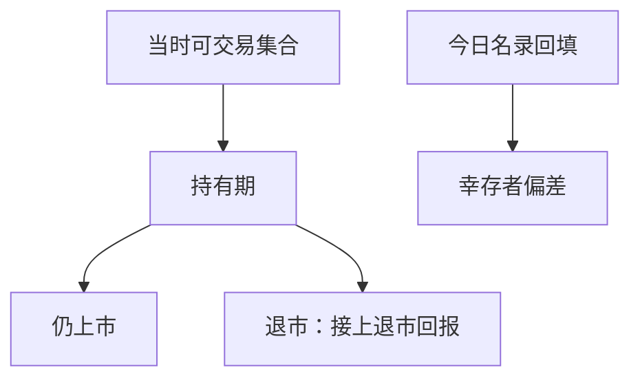

# 幸存者与退市

今天仍在指数或数据库里的公司，不是当年可交易集合；退市回报若用零或用最后收盘价冻结，价值与小市值回测会系统性偏高。

<footer>—— 据 Shumway, Journal of Finance, 1997；Beaver, McNichols and Price, Journal of Accounting and Economics, 2007 整理</footer>

上一课[财报滞后与可用日期](/quant/filing-lag-available-date)解决了「数字何时能读」。仍缺「公司是否还在可交易集合里」。用当前截面往回填历史基本面，等于只保留活下来的公司。本课补幸存者与退市回报。后面质量课默认样本已经含退市，不再把「现在还在库里」当成当年宇宙。

## 问题

基本面库很容易做成「最新一份公司名录 × 历史报表」。名录是今天的幸存者：破产、并购、私有化、强制退市的公司已经消失，它们的应计、账面、亏损路径不再进入排序。价值、规模、盈利因子的平均收益会被抬高，因为差的路径被删掉了。缺口不是再清洗一个字段，而是恢复**当时可投资集合**，并为离开样本的股票接上退市回报。

Shumway 指出 CRSP 对绩效退市的回报经常缺失或偏乐观；Beaver 等补充了退市日附近的价格与交易所代码规则。没有这块，PIT 再干净也只是在一个偏的宇宙里做 as-of。

### 退市不是停牌

停牌是交易中断，证券往往还在；退市是离开交易所列表，后续回报要按退市原因接。并购退市常有要约价格；破产退市常接近零或残值。把退市当成「没有价格就跳过」或「用最后收盘价一直持有到样本结束」，会把破产当成平稳退出。后课涨跌停与停牌是另一套可交易约束，不要在此混用。

CRSP 的退市代码把并购、清算、强制退市分开。基本面因子至少要对绩效退市使用惩罚性回报，而不是丢行。

## 方法

在每个形成日 $t$，宇宙 = 当时上市、当时有可用基本面、当时满足价格与市值门槛的证券。公司在 $t$ 之后退市，仍必须保留 $t$ 的截面点，并在持有期结束时写入退市回报。年频 Fama–French 构造用 CRSP 与 Compustat 合并、含退市证券，正是为了避免「今天的 Compustat 名录」。

最低实现：合并历史列表（不是当前列表）；持有期内遇到退市，按交易所文件或研究惯例写入回报（绩效退市常用大幅负回报，并购用成交价）。不要在回测结束后才 dropna 掉「没有完整历史」的公司——那是幸存者过滤器。

绩效退市与并购退市必须分代码处理：前者惩罚性回报，后者对价。用一个「最后价持有」规则覆盖两类，价值空头的左尾会被砍掉。当前可下载代码表不得当形成日宇宙。

## 机制

偏差方向通常是：小市值、高账面、亏损、高应计——这些特征与退市相关更高。删掉它们，恰好删掉因子空头该承担的损失，多头看起来更稳。PIT 解决「读到未来的数字」；幸存者解决「看不到失败的公司」。两者叠加时，一张 restated 宽表 + 当前名录是最糟的组合。

后课质量与盈利因子特别敏感：亏损公司退市率高，若样本只留赢者，盈利溢价会被做大。

最低实现：形成日用历史证券主表（CRSP stocknames / 交易所当时列表），不要用「当前仍可下载到价的代码」。持有期内退市，把 Shumway 一类绩效退市惩罚或 Beaver 等补充的退市回报接上，再结束该条持仓。财务库与价量库的合并要以当时 PERMNO/证券代码为准，后上市的 share class 不得写回上市前。负账面、亏损、摘牌预警恰恰是质量空头的来源，删掉它们等于删掉空头该付的学费。

## 边界

不写各国退市规则汇编，不估计破产结构模型。并购退市的套利价差交给[并购套利](/quant/merger-arb-event)。停牌、涨跌停对回测的可成交性交给制度课的[停牌与涨跌停对回测](/quant/halt-limit-backtest)。后课默认：形成日宇宙是当时列表；退市有回报，不是静默消失。

后课质量、价值、事件全部在含退市的宇宙上跑。指数成分可以作为可投资子集，但调出不等于退市：调出后仍可能在全市场宇宙里交易，直到真正离开交易所。并购退市用对价，绩效退市用惩罚性回报，两类不得共用一个「最后收盘价持有到样本结束」。

## 小结

- 可用日期解决何时能读；本课解决当时有谁可读。
- 今日名录回填历史 = 幸存者样本。
- 退市要接回报，不能 dropna 或冻结最后价。
- 价值、规模、盈利的空头侧对退市最敏感。
- 停牌不是退市；后者才离开列表。
- 出处：Shumway (1997)；Beaver, McNichols and Price (2007)；Fama–French 与 CRSP 合并惯例。
