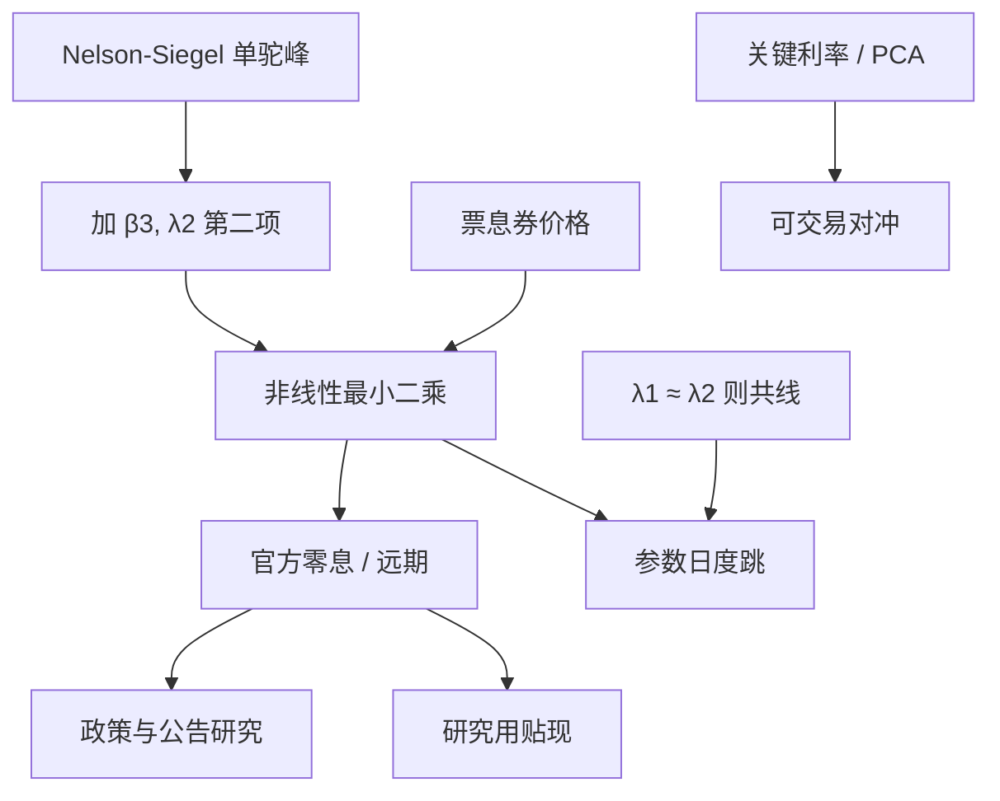

# Svensson 扩展

    
在 Nelson–Siegel 的单驼峰上再加一个衰减速度不同的第二项，远期曲线可以出现两个隆起或一个不对称的肩；这是许多央行拟合官方零息曲线时实际使用的函数，而不是教科书里的三因子 NS。

    <footer>—— Svensson, Estimating and Interpreting Forward Interest Rates: Sweden 1992–1994, IMF / NBER, 1994–1995；美债实现见 Gürkaynak, Sack and Wright, Journal of Monetary Economics, 2007</footer>

[Nelson–Siegel](/quant/nelson-siegel) 的瞬时远期是 $\beta_0+\beta_1 e^{-\lambda\tau}+\beta_2\lambda\tau e^{-\lambda\tau}$，只有一个驼峰位置。Lars E.O. Svensson 在 1990 年代为瑞典国债曲线做估计时发现：政策路径与中段供需常常需要**第二个驼峰**，否则残差在某一期限系统同号。扩展（常称 NSS，Nelson–Siegel–Svensson）写成

$$
f(\tau)=\beta_0+\beta_1 e^{-\lambda_1\tau}+\beta_2\lambda_1\tau e^{-\lambda_1\tau}+\beta_3\lambda_2\tau e^{-\lambda_2\tau},
$$

即期 $y(\tau)$ 仍是 $f$ 的积分平均，多出一组与 $\beta_3,\lambda_2$ 对应的载荷。BIS 的零息曲线文档与美联储 Gürkaynak–Sack–Wright（GSW）的日度美债曲线，都采用这一族或极近的变体。本篇写第二项改变了什么、识别如何变坏、以及官方曲线与交易台 PCA 对冲如何分工。不重复 NS 三因子的逐步解释，也不把 [曲线 PCA](/quant/curve-pca) 的特征向量再估一遍。

## 问题

单 $\lambda$ 把曲率钉在 $\tau\sim 1/\lambda$ 附近。真实曲线可以同时有：短端政策台阶留下的肩、以及 10–20 年养老金需求留下的第二弯曲。NS 会把两个弯曲平均成一个错位的 $\beta_2$，远期在两处都残。Svensson 增加 $\beta_3$ 与 $\lambda_2$，使两个衰减尺度共存。代价是参数从四个变成六个：两个指数衰减速度一旦接近，$\beta_2$ 与 $\beta_3$ 几乎共线，最优化在岭上滑动，日度参数跳而曲线几乎不动。

央行要的是一张可发布、可跨年比较、长端行为受控的贴现函数，而不是最小均方的过拟合。因此 NSS 常伴随约束：$\lambda_1,\lambda_2$ 分处不同区间，$\beta_0$ 为正，远期不要在网格外爆炸。交易台若把 GSW 参数直接当风险因子去对冲，会发现 $\beta_3$ 的日度噪声远大于它解释的 PnL——这是官方曲线与风险模型的错位，不是 Svensson 公式错了。

### 即期载荷的第二曲率

即期里第二项的载荷形如

$$
L_3(\tau)=\frac{1-e^{-\lambda_2\tau}}{\lambda_2\tau}-e^{-\lambda_2\tau},
$$

与 NS 的 $L_2$ 同型、尺度不同。$\lambda_2\neq\lambda_1$ 时两个驼峰错开；$\lambda_2\to\lambda_1$ 时 $L_3\to L_2$，设计矩阵病态。GSW 在实现上对 $\lambda$ 做非线性最小二乘，并用较长的样本与平滑来压噪声；他们要的是「当日无套利贴现」（相对票息剥离的光滑版），以便研究远期利率与宏观公告，而不是给交易员一个稳定的 $\beta_3$ 时间序列。把 GSW 的 $\beta_{3t}$ 拿去做因子回测，必须先处理识别跳跃与参数换号。

文献里「Svensson」有时被写成四个 $\beta$ 加两个 $\lambda$，有时被写成只多一个 $\beta_3$、$\lambda_2$ 固定。引用官方曲线时应对照该央行技术附录的精确式，不要假设与 1994 年工作论文逐项相同。

## 方法

**估计。** 对票息债券价格做非线性最小二乘，贴现函数由 NSS 即期积分得到，权重按久期或按券种。$\lambda_1,\lambda_2$ 或自由、或限制 $\lambda_2\gt \lambda_1+\delta$。多起点必不可少：同一日可以收敛到「曲率全在 $\beta_2$」或「全在 $\beta_3$」两个几乎等残差的点。比较时应看价格残差与远期曲线，而不是看 $\beta$ 是否像昨天。

**与 NS 的嵌套检验。** $\beta_3=0$ 退回 NS。可用样本外价格误差或远期平滑度决定是否启用第二项：平静、单驼峰足够时，强上 NSS 只会加噪声。危机或 QE 扭曲长端时，第二项才支付它的参数成本。不要因为「央行用 NSS」就在每个交易日六参数全开。

**发布与插值。** 官方曲线是拟合后的函数值表，不是可交易报价。用 GSW 贴现去给场外结构化产品定价，还要叠加互换基差、信用与凸性，NSS 只替换国债腿。交易对冲仍应对可交易基准券或关键利率，把 NSS 情景当作宏观形状（「第二驼峰上移」）而不是对冲工具的清单。

### 中央银行实践与 GSW

Svensson（1994/95）的瑞典样本展示如何从远期曲线读政策预期：短端 $\beta_1$ 与 $\lambda_1$ 描述政策路径的衰减，中段驼峰描述预期的非单调。Gürkaynak、Sack 与 Wright（2007）把类似函数扩到 1961 年以来的美债，处理离岸券、税与基准券变更，得到研究用的日度零息与远期。BIS（2005）汇编各国央行的技术选择：有的用 NS，有的用 NSS，有的用样条。共同目标是**光滑的官方曲线**，约束强于做市。做市商若把官方曲线当中间价，可能与可交易券的仓库价差冲突——应以可成交报价为准，官方曲线做比较与风险情景。

## 机制

第二指数项增加一个时间尺度。经济上可以对应：快尺度跟踪政策利率预期的修订，慢尺度跟踪期限溢价或长端供需（央行买债、养老金负债匹配）。这是事后叙事；NSS 并不识别「谁是溢价、谁是预期」——那需要无套利分解或调查数据（Kim–Wright 一类）。函数能做的只是让远期出现两个极值，从而减少系统性残差。

病态来自线性代数：两个 $\tau e^{-\lambda\tau}$ 在 $\lambda$ 接近时张成几乎同一方向。优化器沿该方向走得很远，$\beta_2-\beta_3$ 大起大落，和 $\beta_2+\beta_3$ 却稳。报告应给出驼峰的位置 $1/\lambda_i$ 与合成曲率，而不是孤立的 $\beta_3$。这与 SVI 里 $(a,m)$ 和翼参数的峡谷是同一类识别问题：形状稳、坐标不稳。

### 负远期、超长端与约束

NSS 仍可在网格外给出负的瞬时远期或不合理的超长端水平。央行通常限制 $\tau$ 的估计区间，超长端用 $\beta_0$ 外推并接受偏差。名义零利率下限时期，短端被钉住，两个 $\lambda$ 更容易抢短端台阶，第二驼峰被浪费在拟合隔夜到两年的折缝上——此时应把最短端交给货币市场，NSS 从中段开始，或改回 NS 加短端样条。通胀保值债券曲线另套一套 NSS，盈亏平衡是两套之差，误差相关，不能把名义 $\beta_3$ 解释成通胀预期的第三因子。

GSW 曲线是研究产品：券的筛选、离岸与 on-the-run 处理写在附录里。用它做交易 alpha 的「公允价值」，等于用央行光滑器去打可交易折缝，赚到的可能是流动性与基准券溢价，不是 NSS 误定价。

## 边界与工程取舍

六个参数对日度交易曲线过灵活，对十年宏观样本则刚好。信用曲线的第二驼峰可能来自特定期限的发行堆，经济含义与国债不同，套用同一 $\lambda$ 区间会误导。无套利仍不成立：NSS 是描述族。债券期权、凸性调整要另建利率模型，以 NSS 曲线为今日初始远期。

Svensson 的原文是 IMF 工作论文与 NBER 技术报告，随后被各国央行采用；GSW 2007 年发表于 *Journal of Monetary Economics*，是美债数据的标准引用。Nelson–Siegel 1987 年是嵌套的子模型。不要把「美联储曲线」写成 Litterman–Scheinkman：后者是 PCA 风险，前者是参数贴现。也不要把第二驼峰叫做「第四主成分」——PCA 的第四因子是样本正交剩余，NSS 的第四形状是第二个 $\tau e^{-\lambda\tau}$，一般不与第四特征向量重合。

估计若在价格空间与即期空间之间切换，$\beta_3$ 不可比。GSW 对价格拟合；Diebold–Li 对 NS 即期 OLS。混用时间序列会制造假的体制切换。

$\lambda_1,\lambda_2$ 的标签（谁快谁慢）在优化中会交换。比较历史参数前，应按 $\lambda$ 大小排序或按达峰期限排序，否则「第二因子」的符号无意义。

## 小结

- Svensson 在 NS 上增加第二驼峰 $(\beta_3,\lambda_2)$，使远期可出现双隆起或不对称肩，是多国央行官方曲线的常用族。
- $\lambda_1\approx\lambda_2$ 时参数共线，日度 $\beta$ 跳；应约束衰减分离，并报告形状而非孤立系数。
- 嵌套 NS：第二项只在残差确有第二弯曲时启用，避免为对齐央行而每日六参数。
- 官方 NSS 曲线服务光滑贴现与宏观研究；可交易对冲仍用基准券、关键利率或 PCA。
- 仍一般无套利，不能单独给凸性产品定价。
- 出处：Svensson, IMF/NBER, 1994–1995；Gürkaynak, Sack and Wright, *JME*, 2007；嵌套见 Nelson and Siegel, 1987；各国方法见 BIS 零息曲线文档。
