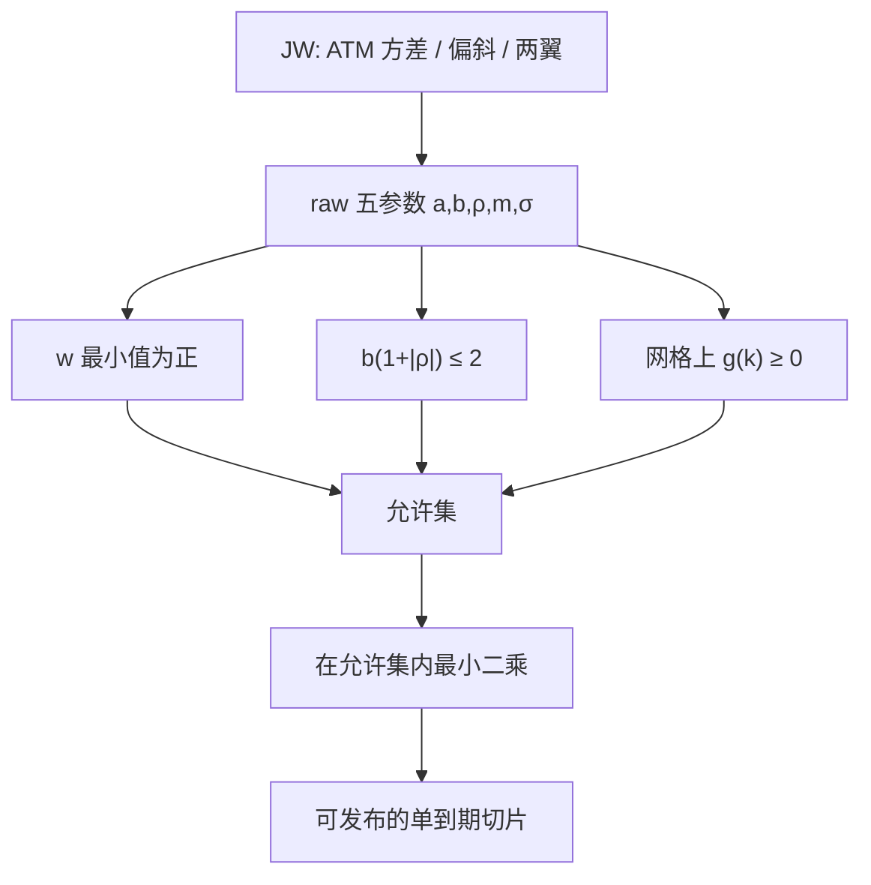

# SVI 无套利参数化

    
五个参数写出的总方差切片可以拟合微笑，却不会自动落在密度为正、翼斜率合法的集合里；无套利参数化的意思是把 Gatheral 的 $g(k)\ge 0$ 与 Lee 矩翻译成对 $(a,b,\rho,m,\sigma)$ 的约束，而不是拟合后再祈祷。

    <footer>—— Gatheral, The Volatility Surface, Wiley, 2006；Gatheral and Jacquier, Arbitrage-free SVI volatility surfaces, Quantitative Finance, 2014</footer>

[SVI / SSVI](/quant/svi-ssvi) 写的是切片几何与动态模型的分工。[Gatheral 无套利曲面](/quant/gatheral-arb-free) 写的是总方差 $w(k,T)$ 上的微分不等式。本篇把二者接到**参数层**：原始 SVI 何时给出合法切片，Jump-Wings 坐标如何把约束写成交易员能盯的量，以及校准器应把哪些不等式当成可行域而不是当成事后扫描。Jim Gatheral 的 raw SVI 是

$$
w(k)=a+b\bigl(\rho(k-m)+\sqrt{(k-m)^2+\sigma^2}\bigr),
$$

$b\ge 0$，$|\rho|<1$，$\sigma>0$。这五个数任意取值时，$w$ 可以变负，也可以让密度核 $g(k)$ 变负。无套利参数化不是再发明一套字母，而是给同一公式加上允许集，使发布出去的切片在 Black 坐标内部不能被蝶式静态套利。跨到期的日历留给 [SSVI 期限一致性](/quant/ssvi-term-consistency)；这里只处理固定 $T$ 的一片。

## 问题

欧式看涨对执行价必须凸，对折现后的远期价格必须落在无套利界内。Gatheral 把凸性写成 $g(k)\ge 0$，其中

$$
g(k)=\Biggl(1-\frac{k\,w'}{2w}\Biggr)^2-\frac{(w')^2}{4}\Biggl(\frac{1}{w}+\frac{1}{4}\Biggr)+\frac{w''}{2}.
$$

SVI 的 $w$ 有闭式一阶、二阶导，因此 $g$ 可以在网格上精确扫描，也可以对参数求解析约束的充分条件。问题是：最小二乘拟合不管 $g$，最优残差常常出现在允许集外——尤其是为了贴短端极陡的翼而把 $b$ 抬大。Lee（2004）又要求

$$
\limsup_{k\to+\infty}\frac{w(k)}{k}\le 2
$$

（左翼对称）。raw SVI 的右翼渐近斜率是 $b(1+\rho)$，左翼是 $b(1-\rho)$，于是

$$
b(1+|\rho|)\le 2
$$

是矩公式给出的硬上限（再紧一点的充分条件用于保证整条实轴上 $g\ge 0$，而不是只保证矩存在）。无套利参数化要同时满足：$w>0$、$g\ge 0$、翼斜率合法。缺任何一条，切片可以很好看却不可交易。

### 正性：$a+b\sigma\sqrt{1-\rho^2}\ge 0$

$w$ 的最小值发生在微笑的底部附近。Gatheral 给出的常用充分条件是 $a+b\sigma\sqrt{1-\rho^2}\ge 0$，保证 $w$ 不穿过零。$a$ 可以为负，只要被双曲线的最小高度托住。校准若允许 $a$ 自由而没有这条，开方 $\sigma_{\mathrm{imp}}=\sqrt{w/T}$ 会在某些 $k$ 失败。失败时取绝对值继续，等于改模型。允许集应在优化器的约束里，而不是在事后 `if w<0: w=eps`。

raw 参数的 $(a,m)$ 与 $(b,\rho,\sigma)$ 在有限 $k$ 窗口上可部分互换，残差呈峡谷。无套利约束会切掉峡谷的一部分，反而改善识别：非法的陡翼不再是「另一个同样好的拟合」。约束既是套利需要，也是正则。

## 方法

可行域。优化变量仍是五个 raw 数，或等价的 JW 参数。约束至少包括：$b\ge 0$，$|\rho|\le\rho_{\max}<1$，$\sigma\ge\sigma_{\min}>0$，$w$ 的最小正性，$b(1+|\rho|)\le 2$（或略紧的缓冲），以及在密网格上 $g(k_i)\ge 0$。$g$ 的约束可以是罚函数或硬约束；硬约束在短端极陡时可能使可行集变空，这时应承认市场离散蝶式已接近非法，回到报价清洗，而不是放松 $g$。Gatheral–Jacquier 讨论了 SVI 族上无蝶式的充分条件；充分不是必要，市场可以无套利却不在该充分域内。工程选择是：用充分域换速度，或每次用网格扫描 $g$ 换贴合。

JW 坐标。Jump-Wings 把同一切片写成 ATM 方差、ATM 偏斜、最小方差、左右翼斜率，更接近经纪商语言。翼斜率在 JW 里是直接的交易参数，Lee 上界变成对这两个斜率的盒约束，比在 raw 空间里盯 $b(1+|\rho|)$ 更直观。校准常在 JW 里做先验（翼不能日度翻倍），再映射回 raw 去定价。映射是代数等价，约束应在 JW 里写，以免映射后再被 raw 的峡谷推出去。

### 密度扫描不能只看 ATM 弯曲

$g(k)$ 在 ATM 附近主要由 $w''$ 控制，SVI 的 $\sigma$（ATM 圆润参数）把它压在正区很容易。变负通常发生在翼上：线性渐近尚未完全主导、而 $w'$ 已经很大的过渡带。扫描必须覆盖到远于任何将要定价的执行价，并对 $k\to\pm\infty$ 检查渐近斜率。只在 10-delta 到 90-delta 上抽查 $g$，会把非法性藏在数字期权与方差互换仍在积分的区域。这与 [SABR 翼部外推](/quant/sabr-wing-extrap) 的教训相同：中段合法不等于翼部合法，SVI 的优点只是翼的渐近形式已知，检查更便宜，不是可以不检查。

## 机制

双曲线给出线性翼，线性翼与随机波动的大货币性行为定性一致，这是「inspired」的含义。无套利参数化进一步要求这线性不能太陡：太陡则右翼隐含的正矩爆炸、或 $g$ 在过渡带变负。$\rho$ 旋转微笑，使一侧先撞上 Lee 上界；约束往往在陡的那一侧先激活，表现为「拟合想再陡一点，允许集不允许」。这正是短端跳主导时 SVI 的系统残差来源——参数化能表达的最陡合法翼，仍可能比市场报价更平。残差应留在价差内或改用带跳的动态，而不是把 $b$ 推过 2。

$a$ 平移、$m$ 平移中心、$\sigma$ 管 ATM 圆润，三者在允许集内仍可部分替代。无套利约束主要绑住 $(b,\rho)$ 与正性。因此日度参数时间序列里，$b$ 与 $\rho$ 的跳更值得当成「翼是否在撞墙」来监控；$a$ 与 $m$ 的跳更可能是识别切换。JW 的翼斜率时间序列若平稳而 raw 的 $b,\rho$ 对跳，说明只是坐标噪声。发布与风控应以 JW 或直接以 $w(k)$ 网格为准。

### 与蝶式扫描、样条的分工

离散报价上的蝶式扫描是模型无关的，见 [蝶式与日历](/quant/butterfly-calendar-arb)。SVI 允许集是连续切片上的约束。二者都要：离散已负则允许集应视为空；离散非负则 SVI 仍可能在报价之间的空隙里把 $g$ 拉负，这正是参数化相对点态样条要负责的事。反过来，满足 $g\ge 0$ 的 SVI 在报价点上可以有残差——无套利参数化优先保证空隙里合法，而不是优先过每一个脏点。Andreasen–Huge 或凸样条是另一条构造允许集的路；SVI 的特点是五个数可对话、翼渐近清楚。不要把「已经拟合 SVI」写成「已经无套利」，除非约束在优化里生效。

把 SVI 残差再加一层局部波动去贴点，若残差层不在凸锥内，静态套利从残差回来。残差必须作为对允许集的扰动来构造，或接受系统残差。这与 [Dupire 校准](/quant/dupire-calib) 的顺序一致：先合法 $w$，再谈局部方差。

## 边界与工程取舍

单切片无套利不包含日历，也不包含动态。明日微笑如何搬，SVI 不回答。美式溢价、离散股息、错误的远期，都会变成假 $w$，允许集无法修正脏输入。充分条件可能过紧：短端合法的市场形状被投影后留下残差，应记模型风险。Gatheral（2006）给出实践框架；2014 年与 Jacquier 的论文把无套利写成可引用的充分条件，并以 SSVI 处理跨期。实施时以 2014 年的约束陈述为准，不要把 2006 年书中的示例参数当成今日允许集。

数值上，$g(k)$ 含 $w$ 在分母，ATM 附近 $k\approx 0$ 要稳定实现，远翼要用解析渐近而不是极大 $k$ 的差分。$\sigma\to 0$ 时微笑变尖，导数变陡，网格要加密。这些是允许集扫描的工程，不是新的经济学。

Lee 上界是 $w(k)/|k|$ 的 limsup，不是每个有限 $k$ 上的点态上限。有限网格上 $b(1+|\rho|)$ 略小于 2 仍可能在过渡带 $g<0$。因此翼斜率盒约束是必要而非充分，$g$ 扫描不能省。

## 小结

- raw SVI 的无套利参数化 = 正性 + Lee 翼斜率 + $g(k)\ge 0$，约束应进入优化可行域。
- 右翼渐近斜率 $b(1+\rho)$、左翼 $b(1-\rho)$，矩公式要求 $b(1+|\rho|)\le 2$；更紧的充分条件保证整轴密度。
- JW 坐标把翼斜率变成直接盒约束，有利于识别与日度监控。
- 允许集管的是一片到期的静态蝶式，不管日历；跨期见 SSVI。
- 出处：Gatheral, *The Volatility Surface*, 2006；Gatheral and Jacquier, *Quantitative Finance*, 2014；Lee, *Mathematical Finance*, 2004。
