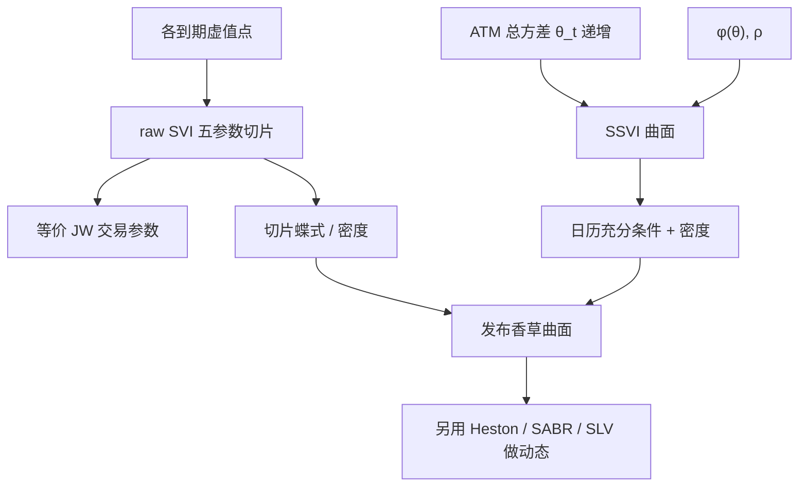

# 隐波曲面 SVI / SSVI

    
用五个参数写出总隐含方差作为对数货币性的函数，使每个到期的切片既够灵活以拟合微笑，又在参数约束下避免翼部破坏矩条件；SSVI 再把切片嵌进随期限递增的总方差骨架，给出跨到期无套利的充分条件。

    <footer>—— Gatheral, The Volatility Surface, Wiley, 2006；Gatheral and Jacquier, Arbitrage-free SVI volatility surfaces, Quantitative Finance, 2014</footer>

[上一课](/quant/overnight-gap-hedge)把隔夜写成强制离散步，日内加密对冲不能消灭跳空 Gamma；收盘政策应限制 $|\Gamma|$ 并处理 Vanna。那是时间上的对冲节奏，不是切片几何。[隐含波动率曲面](/quant/vol-surface) 需要一种比逐点样条更省参数、比完整随机波动更贴近报价的语言。缺口是 SVI：把总方差 $w(k)$ 写成双曲线型，两端渐近线性；SSVI 用 ATM 总方差做期限骨架，使日历套利可被充分条件排除。SVI 是静态参数化，不是 [Heston](/quant/heston) 的五个动力学参数。本课写公式、约束与插值层的分工。

## 问题

每个到期需要一条对 $k=\ln(K/F)$ 的微笑：水平、偏斜、弯曲、左右翼斜率。样条能过所有点，却容易负密度，参数天天跳。[无套利插值](/quant/arb-free-iv) 要求构造上尽量保凸；交易员还要能用少数数字与经纪商对话。SABR 提供交易语言，但跨到期不是一张扩散，Hagan 展开在翼上可破无套利。Heston 有动态，却常常拟合不了短端陡峭，且校准的是过程而非切片几何。SVI 要填的缝是：切片几何 + 可控翼部 + 可检查的无套利约束。

原始（raw）SVI 对固定 $T$ 写

$$
w(k)=a+b\bigl(\rho(k-m)+\sqrt{(k-m)^2+\sigma^2}\bigr),
$$

$b\ge 0$，$|\rho|<1$，$\sigma>0$，且 $a+b\sigma\sqrt{1-\rho^2}\ge 0$ 以保证 $w>0$。$a$ 平移水平，$b$ 张翼角，$\rho$ 旋转，$m$ 平移微笑中心，$\sigma$ 控制 ATM 附近的圆润（此 $\sigma$ 不是 Black 波动，也不是 Heston 的 vol-of-vol）。问题收成：何时这五个参数给出凸价格，何时一串切片拼起来不产生日历套利。

### 为何对总方差而不是对 $\sigma_{\mathrm{imp}}$ 参数化

日历约束接近 $w(k,T)$ 对 $T$ 递增。SVI 直接画 $w$，期限拼接自然。翼部 Lee 矩公式也说的是 $w(k)/|k|$ 的极限，不是 $\sigma_{\mathrm{imp}}$ 的极限。对 $\sigma_{\mathrm{imp}}$ 做双曲线再乘 $T$，约束会缠在一起。Jump-Wings（JW）参数化把 raw SVI 换成更接近交易员的 ATM 方差、偏斜、最小方差、左右翼斜率，二者等价，校准时常在 JW 空间设先验。

SVI 的 $\sigma$ 与 SABR 的 $\alpha$、Heston 的 $\sqrt{v_0}$ 量纲不同。把「五个参数」在三个模型之间横比，是把切片几何、单到期摄动与二维扩散当成同一物件。能比的是它们产生的 $\sigma_{\mathrm{imp}}(k)$ 形状，不是参数字母。

## 方法

**单切片校准。** 对每个上市 $T$，用虚值欧式中间价反解 $w(k)$，最小二乘拟合五个 raw 参数，或先拟合 JW 再映射。权重应对 ATM 与 25-delta 更重，远翼降权，以免一个脏点拉坏 $b$。拟合后必须做 [蝶式](/quant/butterfly-calendar-arb) 检查：SVI 并非自动无套利，需要约束 $b(1+|\rho|)$ 不超过 Lee 上界一类条件（常数 4 来自矩公式的领头限制，实施细节见 Gatheral–Jacquier 的讨论），并检查密度非负。

**SSVI 曲面。** 设 ATM 总方差 $\theta_t=w(0,t)$ 随 $t$ 递增。SSVI 的一种形式把微笑写成

$$
w(k,\theta_t)=\frac{\theta_t}{2}\left(1+\rho\varphi(\theta_t)k+\sqrt{\bigl(\varphi(\theta_t)k+\rho\bigr)^2+1-\rho^2}\right),
$$

$\varphi$ 控制微笑随期限变陡的速度。Gatheral–Jacquier 给出 $\varphi$ 与 $\rho$ 上的充分条件，保证无日历套利（在该参数族内），并讨论无蝶式套利的补充条件。实务是：先估 $\theta_t$ 期限结构（可对 $t$ 单调样条），再估 $\rho$ 与 $\varphi$ 的参数（常取 $\varphi(\theta)=\eta/\theta^\gamma$ 一类），最后对各 $t$ 检查切片密度。

**与 SABR、Heston 并用。** 做市切片用 SVI/SSVI 或凸样条发布；风险管理用 Heston 或局部随机波动解释动态与香草以外的产品。SABR 仍适合利率 / 外汇单到期标记。不要用 SSVI 的 $\varphi$ 去冒充 Heston 的 $\kappa$：一个是静态期限骨架，一个是方差均值回复速度。

### 校准不稳与等价表示

raw SVI 的 $(a,m)$ 与 $(b,\rho,\sigma)$ 在有限 $k$ 区间上可部分互换，出现峡谷状残差。多起点、对 JW 参数加正则、或冻结 $m=0$ 再放偏斜，是常规。参数日度跳不等于市场变了：可能是识别切换。报告应同时给出拟合残差与蝶式扫描，而不是只给五参数时间序列。SSVI 用更少的跨期自由度换稳定性，残差通常大于逐到期独立 SVI——这是无套利与贴合的权衡，与插值文同一逻辑。

## 机制

双曲线 $\sqrt{(k-m)^2+\sigma^2}$ 给出线性渐近翼，这与许多随机波动模型在 $T\to\infty$ 或 $|k|$ 大时的行为定性一致，故名 inspired。$\rho$ 旋转使一侧翼更陡，对应负（或正）偏斜。ATM 弯曲由 $\sigma$ 与 $b$ 共同决定：$\sigma$ 小则微笑尖，像短到期；$\sigma$ 大则圆，像长到期。SSVI 强迫所有切片共享 $\rho$ 一类偏斜参数、只让水平走 $\theta_t$，于是期限之间不能各画各的翼——这正是消灭日历套利的来源，也是拟合变差的来源。

SVI 不描述 $S$ 移动后微笑如何搬。Sticky 规则、Heston 的杠杆、SABR 的动态，都要另选。用今日 SVI 切片当局部波动的输入是可以的（先变成 $C(K,T)$），但局部波动的未来微笑由 Dupire 锁死，与 SVI 明日再校准没有一致性。因此 SVI 是香草坐标，不是过程。

### 翼部线性与有限矩

Lee 公式要求 $w(k)/|k|$ 的极限不能超过 2 的量级（精确常数依左翼右翼与矩阶而定）。SVI 的线性翼若 $b(1+|\rho|)$ 过大，蕴涵矩爆炸或负密度。切断或改用带饱和的翼（后续变体）是工程。这与 SABR 原始展开在远翼变负是同类问题：参数化的定义域不等于无套利域。发布前扫描不能省。

把 SVI 拟合残差再加一层局部波动去「完美贴点」，若残差层不保凸，静态套利会从残差里回来。残差必须落在凸锥内，或接受 SSVI 的系统性残差。

## 边界与工程取舍

SVI 假设欧式、单一标的、Black 坐标。美式溢价、离散股息、外汇 Delta 转换错误，都会变成假偏斜。短到期若由跳跃主导，双曲线可能仍拟合，但参数失去「随机波动启发」的解释，只是形状。SSVI 的充分条件不是必要条件：市场可以无日历套利却落在 SSVI 族外；强行投影会留下残差。

Gatheral（2006）是系统阐述与实践整理；无套利 SSVI 的定理性结果以 2014 年论文为准。不要把 2006 年书中的示例参数当成今日市场的校准。Heston（1993）与 Hagan 等（2002）解决的是动态与单到期标记，SVI 解决的是曲面几何；三篇文献互补，不是三代替代。

代码里若对 $w(k)$ 开方得到 $\sigma_{\mathrm{imp}}$ 时遇到 $w<0$，说明参数已出允许集，应投影回去，而不是取绝对值继续定价——负总方差没有 Black 反解。

## 小结

- SVI 用五个参数描述单到期总方差切片，翼部渐近线性，形状启发自随机波动但本身不是过程。
- 无套利需要额外约束；SSVI 用递增的 $\theta_t$ 与受限的 $\varphi$ 给出跨期充分条件。
- 校准宜在 JW 或带正则的 raw 空间进行，并强制蝶式扫描。
- 发布曲面用 SVI/SSVI；动态对冲仍要 Heston、SABR 或局部波动，不要把 $\varphi$ 当成 $\kappa$。
- 与逐点样条相比，牺牲部分贴合，换可检约束与较稳的希腊字母。
- 出处：Gatheral, *The Volatility Surface*, 2006；Gatheral and Jacquier, *Quantitative Finance*, 2014；对照 Heston，1993；SABR 见 Hagan et al.，2002；矩约束见 Lee，2004。
