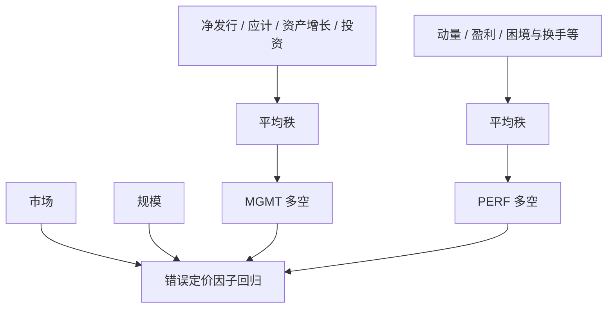

# Stambaugh-Yuan 错误定价

把若干已知异常的排序合成两条错误定价腿——管理相关与绩效相关——可以在因子模型里同时吸收一大类特征溢价，而不必让每一个异常各自占用一个因子。

<footer>—— Stambaugh & Yuan, Mispricing Factors, Review of Financial Studies, 2017</footer>

异常很多，因子不能同样多。[正交化](/quant/factor-orthogonal) 说相关特征是同一风险被命名两次；另一条路是承认它们是**共同错误定价**的不同面具，用平均排序做成少数几条可交易腿。Stambaugh 与 Yuan 2017 年把一篮子异常收成 **MGMT**（管理 / 投资与融资相关）与 **PERF**（绩效 / 动量与盈利相关），再加市场与规模，构成错误定价因子模型。动机来自更早的情绪与异常工作：高情绪期异常更强，像错误定价被资金推开。本篇写合成规则、两条腿与 q 因子、五因子的对应，以及「错误定价」作为模型名称时仍要面对的风险解释。不把情绪指数的构造再写一遍。

## 问题

逐个异常做多空，再把十几条腿放进回归，右侧共线、样本内 GRS 变好、样本外换手爆炸。Fama–French 的回答是挑几个有股利贴现动机的特征做成因子。[q 因子](/quant/q-factor-hxz) 的回答是投资与 ROE 作为贴现率的代理。Stambaugh–Yuan 的回答是：先承认文献里已经显著的异常，再按经济主题聚类，用平均分位减少单一度量的噪声与数据窥探。问题是聚类规则必须预先承诺——哪些异常进 MGMT、哪些进 PERF——否则合成因子只是事后挑选赢家异常。

第二个问题是定价语言。若 MGMT 与 PERF 被叫做错误定价因子，左侧资产的 α 被吸收意味着「错误定价的共同成分被对冲」，并不意味着市场有效，也不意味着这条腿没有风险。高情绪期异常收益更高，可以是错误定价放大，也可以是风险价格随情绪状态变化。模型能做的是提供两条可复制的共同收益，供其他异常来回归；不能靠名字完成识别。

### 为何是两条而不是一条「综合异常」

投资、净发行、应计、资产增长彼此相关，像公司在扩张与融资上的同一姿态；动量、毛利率、失败概率的反面、换手等更像价格与绩效路径。合成一条「所有异常的平均」会把扩张年与动量年焊在一起，换手与行业暴露变得不可解释。分成 MGMT 与 PERF，是让两类共同变动分开进入 β。这与 q 因子的 I/A 对 ROE、五因子的 CMA 对 RMW 同构，只是输入从单一会计比率换成**多异常的平均秩**。

平均秩会降低单一异常的特异噪声，也会把已经死亡的异常继续留在篮子里稀释信号。篮子必须版本化：2017 年论文的十一类异常是一份清单，事后再往篮子里加新发现的异常，样本内 α 没有解释力。

## 方法

对清单中的每个异常，按该异常的标准排序给每只股票一个分位分数（高分表示「被该异常判定为低估、应做多」或按原文符号对齐）。MGMT 对管理类异常的分数取平均，PERF 对绩效类取平均。再按平均分排序，与规模交叉，价值加权多空：MGMT 做多「管理质量高 / 少扩张少稀释」一侧，做空对立面；PERF 做多近期绩效与盈利强的一侧。规模因子与市场仍在模型里，以免合成腿变成第二个 SMB。

$$
R_{it}-R_{ft}=\alpha_i+\beta_{iM}(R_{Mt}-R_{ft})+\beta_{iS}\mathrm{SMB}_t+\beta_{iG}\mathrm{MGMT}_t+\beta_{iP}\mathrm{PERF}_t+\varepsilon_{it}.
$$

异常清单典型包括净发行、应计、资产增长、投资、净营业资产一类进入 MGMT，动量、毛利率、失败概率、换手、特 idiosyncratic 波动等进入 PERF——具体以论文表为准，复制必须对齐定义、滞后与 NYSE 断点。合成在**特征层**平均，不是先做十一条多空再对收益等权；后者会对高波动异常赋予过大的隐性权重。特征层平均后再价值加权组合，小盘噪声被压低。

### 与 q 因子、五因子的映射

MGMT 与 I/A、CMA、净发行高度相关：都在惩罚扩张与稀释。PERF 与 ROE、RMW、动量相关，但因为篮子含动量，PERF 对 WML 组合的吸收通常强于年度 RMW，也强于不含动量的 q 因子四因子。这是设计：Stambaugh–Yuan 明确把绩效路径放进因子，Fama–French 2015 年没有，2018 年才讨论加动量。赛马时应看：对投资类检验组合，q 因子是否更省；对动量与综合异常，SY 是否更省。嵌套回归里 MGMT 对 I/A 的增量、PERF 对 ROE+WML 的增量，比「哪个 GRS 略小」更有内容。

情绪交互是原文献的另一张表：把异常收益对情绪状态分组，高情绪组更强。因子模型本身仍是无条件 β。若你要交易情绪择时，那是另一套规则，不要写进 MGMT/PERF 的定义里冒充 2017 年因子。

## 机制

错误定价机制：投资者对净发行、应计、资产增长反应不足或外推过度，这些错误在截面上相关（同一批资金、同一套会计幻觉），于是一条 MGMT 腿能抓住共同误价。PERF 则抓住对近期赢家、高盈利的不足反应或风险补偿不足。情绪高时噪声交易者更活跃，误价的共同成分变大，异常收益更高。风险机制：MGMT 空头是正在扩张、需要外部融资的公司，在融资紧缩状态一起跌；PERF 空头是困境与输家，在衰退一起跌。两条腿于是也可以是状态变量的可交易投影。2017 年模型不检验哪一种为真，只提供共同收益。

与「每一个异常一个因子」相比，合成承认测量误差：单一应计定义会被会计变更打穿，平均秩更稳。代价是经济故事变糊：MGMT 涨了，你不知道是应计还是净发行在贡献。归因时仍应对篮子成员做单独[排序](/quant/long-short-sort)，防止篮子被某一个已经容量耗尽的成员主导。

### 合成不是正交化

对异常分数做平均，得到的 MGMT 与 PERF 仍然可以相关，也仍然可以与 SMB、HML 相关。它不是 Gram–Schmidt。若还要对五因子正交再交易残差，那是纯化，会改变持仓。SY 因子的原始定义是平均秩排序组合，评价其他异常时把它们放在右侧。不要把「对 MGMT/PERF 回归后 α=0」写成「该异常已被正交掉」——α=0 是被共同收益解释，持仓仍可与 MGMT 高度重叠。

Stambaugh、Yu、Yuan 更早的情绪论文解释的是异常收益的时变，不是 2017 年这两条腿的定义。引用时不要把 2012 年左右的情绪交互表当成 MGMT 的构造说明。

## 边界与工程取舍

篮子一旦锁定，就不要在回测里按 t 统计量剔除成员。财务滞后、跳月（动量）、价格过滤必须按各异常的惯例分别处理，再平均分数——对未对齐的分数取平均会引入前视或把反转混进动量。A 股异常清单与美股不同，直接移植十一类会把不可做空、涨跌停造成的假异常平均进去。

不要声称错误定价因子让市场有效：α 被吸收只说明共同成分被两腿抓住。也不要在已有 WML 与 RMW 的六因子上再加 PERF 并解释为巨大增量——共线会让系数不稳定。流动性与微观结构异常不一定进篮子，[LIQ](/quant/pastor-stambaugh) 仍可能留下 α。可投资性上，平均秩的空头常含微型、低价、高换手名字，价值加权与价格过滤会显著削溢价。

真实出处：Stambaugh & Yuan, *Mispricing Factors*, Review of Financial Studies, 2017。情绪与异常的交互见 Stambaugh, Yu & Yuan 更早工作。Hou–Xue–Zhang 2015 与 Fama–French 2015/2018 是赛马对象，不是同一构造。

## 小结

- Stambaugh–Yuan 用管理类与绩效类异常的平均秩做成 MGMT 与 PERF，再加市场与规模。
- 合成在特征层平均，清单必须预先锁定；加进新异常没有样本外解释力。
- MGMT 靠近投资与融资，PERF 靠近盈利与动量；与 q 因子、五六因子赛马应看增量而非名字。
- 「错误定价」是共同成分的标签，不排除风险解释，也不等于市场有效。
- 出处：Stambaugh & Yuan, Review of Financial Studies, 2017。
