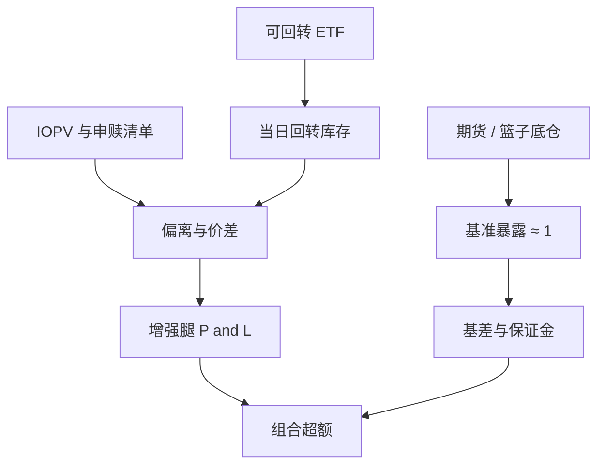

# T0 底仓增强

投资者买入的证券，在交收前不得卖出，但实行回转交易的除外。

<footer>—— 《上海证券交易所交易规则（2026 年修订）》第 3.1.4 条；深交所交易规则有对应表述</footer>

普通 A 股股票当日买入不能当日卖出；交易所列出的若干 ETF 等品种实行当日回转。于是一种常见的产品结构是：用股指期货或一揽子底仓去复制基准暴露，再在可回转的 ETF 上做日内买卖，把价差、短周期均值回复或申赎偏离收成「增强」。名称里的 T0 指的是回转制度，不是把股票 T+1 解开。本篇写这种结构在会计上拆成哪两条腿、超额从哪一类摩擦来、以及容量与逆向选择如何把纸面增益收走。执行细节与下单手法不属于讨论范围；制度正文见[T+1 与回转](/quant/cn-tplus1)，管道见[ETF 申赎与 IOPV](/quant/cn-etf-creation)与[指数套利](/quant/index-arb)。

## 问题

底仓腿的目标是 beta：期货、ETF 或股票篮子使组合对基准的暴露接近 1。增强腿的目标是在可回转品种上捕捉**不能被底仓解释**的日内 P&amp;L。两腿会计必须分开：底仓的基差、展期与保证金是期现问题；增强腿的 P&amp;L 来自买卖价差、短窗反转与一级市场偏离。把它们加总成一条「T0 收益」会在期货升贴水剧烈的日子把增强说成神技，或把增强的亏损赖给基差。

回转名单是制度给定的。股票策略不能因为「有 T0 团队」就假设当日开平。增强腿若用可回转 ETF 去表达对不可回转成分股的观点，跟踪误差与涨跌停缺腿仍然存在。问题是识别增强的经济来源：做市式价差、相对 IOPV 的偏离、还是把期货与 ETF 之间的短暂错价当成统计套利。三者的容量、毒性和在压力周的行为不同。

### 回转权是状态，不是 alpha 的证明

能够当日卖出当日所买，只说明动作合法，不说明期望为正。ETF 的买卖价差在平静期可以薄到让高频参与看起来无害；一旦信息到达或微盘成分流动性枯竭，同一套回转会变成把毒性成交留下、把价差让给知情的一方。O'Hara 的逆向选择与存货范式在这里直接适用：回转频率高，并不区分你在提供流动性还是在为冲击付款。评价必须按来源拆：[价差成本](/quant/spread-cost)是否为负（提供流动性）、基差是否在无套利带内、以及冲击后的价格是否回转。

「底仓增强」在销售语言里有时被说成低风险的绝对收益。会计上它至少暴露：期货基差与展期、ETF 二级折溢价、成分股涨跌停导致的复制误差、以及增强腿的库存。没有这四项的风险预算，夏普是费前故事。

## 方法

组合状态应至少包括：期货合约与数量、ETF 持仓（区分可卖与当日回转形成的库存）、现金与保证金、以及增强腿未完成的目标。信号若在股票宇宙上产生，映射到 ETF 回转时要声明：跟踪的是哪一只 ETF、现金替代与 IOPV 如何进入可交易边界。禁止在回测里用成分股的收盘价模拟「当日买回当日卖出」——那是规则禁止的路径。

评价分腿。底仓：基差相对持有成本带的位置，方法同指数套利与[ETF 创建赎回](/quant/etf-create-redeem)；报告展期日与保证金占用。增强：按小时或按事件（开盘、收盘集合竞价、IOPV 偏离分位）的 P&amp;L，扣掉[Maker-taker](/quant/maker-taker)与冲击。容量：参与率相对该 ETF 的 ADV 与一档深度，见[参与率封顶](/quant/participation-cap)。压力周——例如公开的小微盘流动性事件——应单独列出增强腿是否仍为正：若超额完全来自平静期的价差收获，产品在需要流动性时会变成流动性需求方。

### 基差、IOPV 与增强不是三个独立的水龙头

期货升水扩大时，底仓 P&amp;L 与「买 ETF 做增强」的库存决策耦合：增强腿若在升水时被动囤积 ETF，等于在期现上加了一笔方向。IOPV 偏离大时，一级申赎与二级回转抢同一条管道，见申赎篇；增强策略若假设自己能无限在二级收口偏离，会与 AP 资本约束相撞。正确的做法是预先指定主路径：或以期现带内交易为主、回转只做价差；或以 IOPV 偏离为主、期货只做 beta 对冲。不要让同一笔成交在归因里同时算作「T0 增强」和「期现套利」。

## 机制

T+1 切断了股票上的日内均值回复交易，于是可回转 ETF 承担了「把短周期信号落到可执行动作」的功能。纸面日频反转在股票上往往不可执行，见 T+1 篇；映射到 ETF 之后，可执行的是 ETF 自身的微观结构，而不是成分股的截面 IC。若成分股的信号在 ETF 价格里已经被套利者写完，增强腿只剩下价差；若 ETF 相对篮子滞后，增强腿分享的是指数套利的残渣，容量由 AP 与期货深度决定，不是由股票因子的历史 IC 决定。

逆向选择在回转品种上被压缩到更短的时钟。知情交易者同样可以使用当日回转；提供流动性的底仓账户在开盘信息释放与收盘拍卖附近最容易被选中。Madhavan 一类的日内信息路径表明，开盘后与收盘前的价差含有更多信息成分。把全天平均价差当期望收益，会高估可收获的那一半。压力期微盘成分使部分宽基或小盘 ETF 的复制误差上升，二级价格与 IOPV 暂时脱钩；此时回转的「增强」可能只是在为脱钩付款。

融券与做空约束改变空头回转。只能在可回转 ETF 上做多头日内、不能对称做空时，增强腿有方向偏置，会在趋势日亏掉多日价差。报告应分趋势日与震荡日，而不是只报全样本均值。

### 与指增、DMA 的边界

指增把超额放在隔夜截面持仓上，见[指增衰减](/quant/index-enhancement-decay)；T0 底仓把超额放在日内可回转腿上。两者可以装在同一只产品里，但风险单位不同：前者是因子拥挤与 TE 限额，后者是库存、价差与基差。用 DMA 杠杆去放大 T0 腿，把微观结构期望乘上保证金乘数，会在深度下降时同时触发通道与 ETF 流动性问题，见 [DMA 与微盘](/quant/dma-microcap-crisis)。风险上应禁止用通道杠杆去补「增强夏普不够」——那是把统计对象当成 Kelly 的 $\mu$。

## 边界与工程取舍

不要在研究里用股票 T+1 宇宙的日内反转 IC 直接当作 ETF T0 的期望。不要把期货基差的趋势段算进增强团队的业绩。不要假设回转名单不会调整：规则与产品清单会变，策略的可执行集合是状态变量。可做的是：分腿记账、压力周单独报告、参与率硬顶、以及把 IOPV 与期货带写成增强的准入条件而非事后解释。

出处：上交所、深交所交易规则第 3.1.4–3.1.5 条及 ETF 业务实施细则；MacKinlay and Ramaswamy, *RFS*, 1988（指数期现）；Petajisto 对 ETF 定价效率的讨论；Amihud and Mendelson、Ho and Stoll 的存货与价差。本篇不提供回转交易的下单或通道配置说明。

## 小结

- T0 底仓增强合法地利用 ETF 等品种的当日回转，不能类推到普通股票；底仓 beta 与增强腿必须分账。
- 超额来源应预先指定为价差、IOPV 偏离或期现残渣之一，避免同一笔成交多重归因。
- 回转权不保证正期望；逆向选择与压力周复制误差会把平静期价差收走。
- 容量由 ETF 深度与一级管道约束，不由股票因子的历史 IC 约束。
- 出处：沪深交易规则与 ETF 细则；MacKinlay–Ramaswamy, *RFS*, 1988；Petajisto；存货价差文献。
