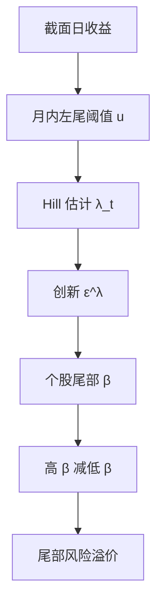

# 尾部风险因子

    
把每月截面上跌破阈值的日收益当成一次尾部抽样，用 Hill 估计共同的幂律指数，得到一条随时间变化的尾部风险；对这条风险敏感的股票要求更高的预期收益。

    <footer>—— Kelly and Jiang, Tail Risk and Asset Prices, Review of Financial Studies, 2014</footer>

[上一课](/quant/skew-risk-premium)把偏度风险溢价写成风险中性三阶矩与物理预期已实现偏度之差，度量左尾保险的价格；与 VRP 相关但不相同——方差对正负对称，偏度针对崩盘。缺口是共同崩盘厚度是否被定价。极值理论把单只损失的尾巴写成广义帕累托，用来外推 VaR；资产定价要问的是市场整体左尾变厚时，哪些股票一起跌。本课写 Kelly–Jiang 的截面 Hill 因子。不重做 BKM / KNS 复制。后课资金流动性默认已经读完：测的是崩盘形状，不是市场收益的水平。

## 问题

日收益的无条件分布左尾厚，危机月更厚。若只把市场因子、规模、价值放进回归，崩盘状态上的协方差会被平均掉：多数日子尾巴看不见，几个月决定风险溢价。需要一条能在月频上更新、又不必等十年一遇样本自己出现的尾部度量。Kelly–Jiang 的观察是：每个交易日都有一批股票跌得很深，把这些截面极值当成对同一条共同尾的重复抽样，则一个月内的 $K$ 个超阈值点足够估一个 Hill 指数。时间序列 $\{\lambda_t\}$ 刻画「这个月共同左尾有多厚」，创新 $\Delta\lambda_t$ 才是定价用的冲击。

第二个问题是 $\beta$ 而不是水平。高 $\lambda$ 的月份市场往往已经跌过，持有「尾部厚」本身不是可交易策略；要问的是：哪些股票在 $\lambda$ 意外上升时跌得更狠。若投资者厌恶共同崩盘，高尾部 $\beta$ 应有正的风险溢价。这与 Ang、Chen、Xing 的下行 $\beta$ 同族，但下行 $\beta$ 用的是市场收益为负的日子，Kelly–Jiang 用的是截面极值估出来的共同尾指数。

### 截面 Hill 不是单资产 EVT

经典 [EVT](/quant/evt) 对一只序列取高阈值，样本外推分位数。Kelly–Jiang 把阈值设在当日截面收益的低分位（原文用 5%），把**所有股票、该月所有交易日**里跌破阈值的观测放进同一个 Hill：

$$
\lambda_t=\frac{1}{K_t}\sum_{k=1}^{K_t}\ln\frac{R_{k,t}}{u_t},
$$

其中 $u_t$ 为该月阈值，$R_{k,t}\lt u_t$ 为左尾观测，$K_t$ 为超阈个数。$\lambda$ 大表示幂律更厚（尾指数更小）。识别假设是：个股左尾共享一个时变的共同形状， idiosyncratic 极值在截面平均下被冲掉。没有这条共同性，Hill 只是「这个月有多少股票各自倒霉」，不是因子。

Hill 的 $K$ 是带宽。截面池让 $K$ 远大于单只股票的月内极值个数，这是方法能在月频更新的原因。阈值太低，中心收益污染指数；太高，共同性被几只微型股的错误报价绑架。应报告 $u$ 在 4%–6% 一带是否稳定，而不是只报一个 $\lambda$ 序列。

## 方法

每月估 $\lambda_t$ 后，取 AR(1) 残差或差分作为创新 $\varepsilon_t^\lambda$。个股尾部 $\beta$ 用过去一段时间（如五年滚动）的月超额收益对 $\varepsilon^\lambda$ 与市场因子回归。按 $\hat\beta^\lambda$ 排序，价值加权多空，即尾部风险因子。高 $\beta$ 腿在 $\lambda$ 上升时更负，均衡里应补偿更高的平均收益。

控制要明确。规模小、流动性差的股票更容易出现极端负收益，Hill 的输入已经被微型股加粗；$\beta$ 排序若等权，因子会与 [非流动性](/quant/liquidity-factor)、[规模](/quant/ff3) 纠缠。价值加权、价格过滤、NYSE 断点是默认。与下行 $\beta$、负偏度、最大日损失（Bali–Cakici–Whitelaw 的 MAX）做双重排序，看溢价是否只是「过去跌过的还会再跌」的反转或彩票需求。Kelly–Jiang 的主张是：在这些控制之后，对共同尾创新的协方差仍然被定价。

### 与期权隐含尾、偏度溢价的分工

期权隐含的风险中性尾（虚值看跌的价格、无模型偏度）含风险溢价，比历史 Hill 更「前瞻」，但只覆盖有期权的标的，通常是大盘。Kelly–Jiang 用全市场股票日收益，样本长、覆盖广，测的是物理测度下的共同尾，再问这笔风险在截面上贵不贵。二者可以一起用：隐含尾的创新做状态变量，历史 $\lambda$ 做 $\beta$ 估计的右侧。不要把 VIX 当 $\lambda$ 的替代——VIX 是方差互换的近似，对尾形状的识别弱于幂律指数，尽管危机里它们会一起跳。

## 机制

幂律尾的共同性来自：杠杆约束同时收紧、强平与止损在同一阈值附近触发、因子模型里共同残差的厚尾。$\lambda_t$ 上升，表示「跌破 5% 分位之后还要再跌多少」的期望变大。对 $\lambda$ 高敏感的股票，往往是高杠杆、高融资依赖、或本身就是尾事件的载体（金融、高 beta 成长）。投资者若无法分散这笔共同崩盘，就会要求溢价。这与「个股自己的历史偏度」不同：一只股票可以很偏、却与共同尾无关。

Hill 把形状收成一个标量，丢掉了阈值以下的高阶结构，也丢掉了哪些行业在贡献极值。机制上这是优点：共同因子必须是低维的。代价是：若某月极值完全来自单一行业崩盘，而不是市场级尾变厚，$\lambda$ 仍会跳，因子变成行业赌注。实证上应看 $\lambda$ 创新对市场、金融行业、信用利差的回归残差是否仍定价。

$\lambda$ 是形状不是水平。市场可以大跌但尾仍接近指数（$\lambda$ 不大），也可以小跌但超阈之后极厚。把 $\lambda$ 当成「这个月跌了多少」会与市场因子共线，溢价被 $MKT$ 吃掉。定价用的是创新，且应在控制市场收益之后谈 $\beta$。

### 时变、危机与样本外

$\lambda_t$ 在 1987、1998、2008 会显著升高，这是方法在工作，不是过拟合的证据。样本外要问的是：用 $t-1$ 的 $\beta$ 在 $t$ 持有，危机里高 $\beta$ 腿是否真的亏得更多、之后是否赚回来。若溢价全部来自几个危机月的反转，策略在「尾部风险」名义下做的是危机后的价值反弹。滚动 $\beta$ 在平静期噪声大，高 $\beta$ 组会漂移；实践上对 $\beta$ 向截面均值收缩，并要求足够的月频历史。

## 边界与工程取舍

涨跌停、停牌、错误报价会制造假极值，A 股与新兴市场尤其严重。应剔除涨跌停日或对截断收益做调整，否则 Hill 被规则而不是分布驱动。美元与人民币单位、隔夜跳空、开盘集合竞价的错价，都应在洗价规则里写明，见 [剔异常成交](/quant/outlier-trades)。

不要用组合的历史 VaR 当 $\lambda$。VaR 是分位数水平，Hill 是分位数**之外**的形状；二者可以反向变动。也不要把 Kelly–Jiang 因子当成期权账簿的尾对冲工具：它是月频、股票截面的定价因子，对冲比与执行价、期限无关。单只股票的 EVT 分位数仍应走 [EVT](/quant/evt) 管线，不要用共同 $\lambda$ 去外推个股 99.9% 损失。

出处是 Kelly and Jiang, *Review of Financial Studies*, 2014。Hill 估计本身来自极值统计；他们的贡献是截面池化与资产定价检验，不是发明了 Hill。引用时不要写成「Kelly–Jiang 提出了广义帕累托」。

## 小结

- Kelly–Jiang（2014）用月内截面左尾的 Hill 估计共同尾厚度 $\lambda_t$，再按对 $\lambda$ 创新的 $\beta$ 构造因子。
- 识别依赖共同幂律；测的是崩盘形状，不是市场收益的水平。
- 与 EVT 分位数、下行 $\beta$、隐含偏度近亲但对象不同：全市场物理测度尾 vs 单序列外推 vs 期权风险中性尾。
- 微型股、涨跌停与错误报价会污染 Hill；价值加权与洗价是前提。
- 溢价应在控制市场、规模、流动性与下行 $\beta$ 之后报告，并检查是否只由少数危机月贡献。
- 出处：Kelly and Jiang, *Review of Financial Studies*, 2014；Hill 估计见极值统计文献；风险管线对照 Embrechts 等与 [EVT](/quant/evt)。
