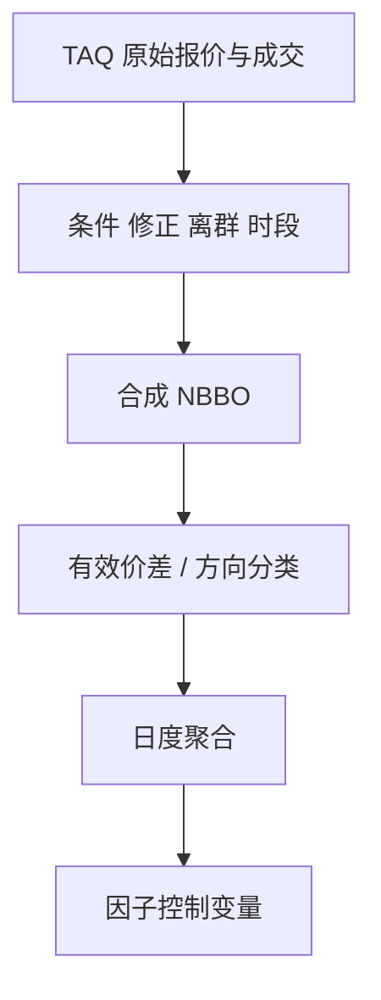

# TAQ 数据处理

TAQ 是 SIP 磁带上的报价与成交，不是撮合核的 L3。清洗规则决定你看见的价差与不平衡；Holden 与 Jacobsen 把这些规则写成可重复的研究步骤。

<footer>—— Holden and Jacobsen, Liquidity Measurement Problems in Fast, Competitive Markets: Expensive and Cheap Solutions, JFQA, 2014；Hasbrouck 对 TAQ 与微观结构度量的讨论</footer>

[上一课](/quant/crsp-compustat)把日频身份对齐。[L2/L3](/quant/l2-l3-data)与[SIP](/quant/sip-vs-direct)已说明 TAQ 通常是汇总统带。本课的缺口是**日度微观结构度量如何从脏磁带算出来**：时间戳、撤消、锁定交叉、盘前盘后、与 NBBO 构造。Holden 与 Jacobsen（2014）表明：在高速竞争市场上，廉价的日度近似与昂贵的逐笔清洗会得到不同的流动性结论。后课基本面重述换对象；本课不重建 ITCH 式队列——那是[订单簿重建](/quant/orderbook-reconstruction)的直连问题。

## 问题

原始 TAQ（或日度 TAQ）含：条件成交、修正、异常报价、毫秒碰撞、跨所不同步。直接用「每笔成交对当时报价」算有效价差，会把锁定/交叉、过时报价、非正规成交算进去，价差被系统性扭曲。问题是声明清洗清单，并承认清单是识别假设：滤掉的是噪声还是真实压力，会改变危机日的结论。

NBBO 必须从各所报价合成，且受保护报价规则约束。用单一交易所报价当全国最优，有效价差没有制度含义。用已清洗的 NBBO 去标记直连成交，又会混源，见 SIP 课。研究全国执行质量，TAQ/SIP 是对的对象；研究本所队列，TAQ 不够。

### 时间戳粒度改变 Lee–Ready

成交方向分类依赖成交相对报价的位置。毫秒级碰撞、报价与成交不同步，使「上一笔报价」定义含糊。Holden–Jacobsen 讨论插值与昂贵的逐笔对钟。日度汇总（如 WRDS 的衍生指标）把选择藏进黑箱：便宣、不可审计。论文必须写清：用官方衍生还是自建清洗，规则版本号是什么。

A 股没有 TAQ。对应的是交易所逐笔与行情快照。清洗对象换成：集合竞价、涨跌停锁定、无效申报、盘后定价。原则同构——声明过滤器，不要把原始打印当有效价差。

## 方法

最低清洗：剔除更正与取消、非标准成交条件、明显的价格离群（相对前成交或报价）、锁定交叉报价或不单独处理它们、盘前盘后分段。有效价差、实现价差、报价斜率按 Hasbrouck / Holden–Jacobsen 的定义实现，并报告对过滤阈值的敏感度。按日聚合时声明：等权成交、金额加权、还是仅正规时段。

与 CRSP 对齐用 PERMNO–CUSIP–日期，注意股票代码复用。停牌日、停牌时段应从流动性样本删除或单列。分钟或更粗的 bar 若从 TAQ 合成，必须定义：最后成交、最后报价、还是微观价格；合成 bar 不能再解释为 L3 事件。

### 便宜方案与昂贵方案要并列

Holden–Jacobsen 的标题即结论：有便宜的日度代理，也有贵的逐笔方案，二者在高速市场上差得可见。复制研究应同时报告：若只为截面因子控制「非流动性」，日度代理可能够；若为执行算法校准冲击，必须昂贵方案或直连。把 CRSP 日度买卖价差代理直接当 TAQ 有效价差，是第三种更粗的东西，不能混名。

## 机制

SIP 汇总延迟使 TAQ 的「当时 NBBO」慢于直连。用它估的价差偏大或方向分类偏误，在 HFT 活跃的名字上更严重。清洗若把锁定交叉全删，等于在压力状态上做选择：2010-05-06 一类日子会被洗成「较干净」的市场。过滤器因此不是中性预处理，是对「什么算市场」的定义。

日频因子研究用 TAQ 往往只为了构造 Amihud 或价差控制。那是合法降维，但须停止使用微观结构语言（队列、毒性）去描述降维后的对象。

## 边界

TAQ 许可限制分发。本课不提供整库转载。欧洲、亚洲的官方磁带有各自字段，不能把 Holden–Jacobsen 的美股阈值原样贴上。加密成交回放不是 TAQ。

## 小结

- TAQ 是 SIP 投影；清洗规则是识别假设，须版本化并做敏感度。
- 全国执行质量用 NBBO；本所队列用直连重建，不要混用语言。
- 便宜日度代理与昂贵逐笔方案回答不同问题。
- 出处：Holden and Jacobsen, *JFQA*, 2014；Hasbrouck。
