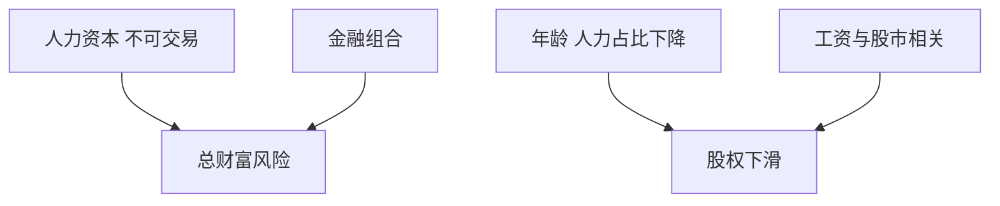

# 目标日期与下滑路径

下滑路径把股权权重写成距退休时间的函数；劳动收入像一只不可交易的债券，年轻时才该更像 Merton 的高股权。

<footer>—— 对照 Bodie, Merton and Samuelson, Labor Supply Flexibility and Portfolio Choice, JEDC, 1992；目标日期基金实务</footer>

[上一课](/quant/multi-period-risk-budget)管机构主动预算。目标日期（TDF）的缺口是**生命周期**：人力资本不可交易，金融财富随年龄从「人力资本占优」变成「组合占优」。本课写下滑路径的经济学与实现，不把「100 减年龄」当定理。后课杠杆拖累解释为什么路径上加杠杆 ETF 会偏离设计。

## 问题

Merton 常投资比例在 $\mu,\sigma,\gamma$ 不变时是常数。生命周期里：年轻时人力资本（未来工资）像债券，金融组合应更偏股以平衡总财富；临退休人力资本耗尽，金融组合应降股。Bodie–Merton–Samuelson 把劳动供给弹性也写进去。问题是 TDF 的下滑是**产品规则**，对所有同龄人同一条路径，忽略职业风险（金融从业者的工资与股市正相关，更应少股）与积存水平。

实现：目标日期是组合保险还是战略配置？很多 TDF 只是日历再平衡的股债混，没有 [CPPI](/quant/cppi-tipp) 的垫。名称里的年份是营销锚，实际股权终点（to vs through retirement）差别很大。

### 下滑不是「风险厌恶随年龄上升」一句

$\gamma$ 可以不变，最优股权比例仍随人力/金融财富比下降。把下滑解释成老人更怕风险，会在退休后仍有大量人力资本替代（年金、社保）时降股过猛，或在年轻高薪高相关职业降股不够。

目标日期基金的滑路径常在内部模型里优化，对外只披露滑点表。评估要用表后的实际持仓与费用，见后课费用复合。

## 方法

总财富 $=$ 金融 + 人力资本现值（用工资、失业率、与股市相关贴现）。对金融子组合做 Merton/BL，使总暴露接近目标。TDF 产品：用年龄当状态的一维近似，分职业风险模板。再平衡：现金流（供款）优先，减少税与费用。对照：常数混合 60/40 vs 下滑，用生命周期效用而不是单一夏普。

## 机制

不可交易的债券型人力财富，要求可交易组合去做「补风险」。随时间人力债券到期（工资兑现成现金），需要卖掉一些股票以保持总风险。这就是下滑。股市与工资的正相关削弱「人力是债券」的假设，下滑应更平或更低。

## 边界

长寿、医疗、通胀使退休后需求不是常数 $\gamma$。TDF 的「through」路径在退休后仍持有股权，需要明确。目标日期不是保证；2008 年临退休队列的损失是路径风险，不是下滑公式算错一年。不要用 TDF 去替代个人的税与位置优化。

## 小结

- 下滑的经济学是人力资本像债券，不是年龄本身改变 $\gamma$。
- 职业相关与积存水平使统一路径只是产品近似。
- 评估用生命周期效用与真实费用，不用单期夏普。
- 出处：Bodie, Merton and Samuelson, *JEDC*, 1992。
