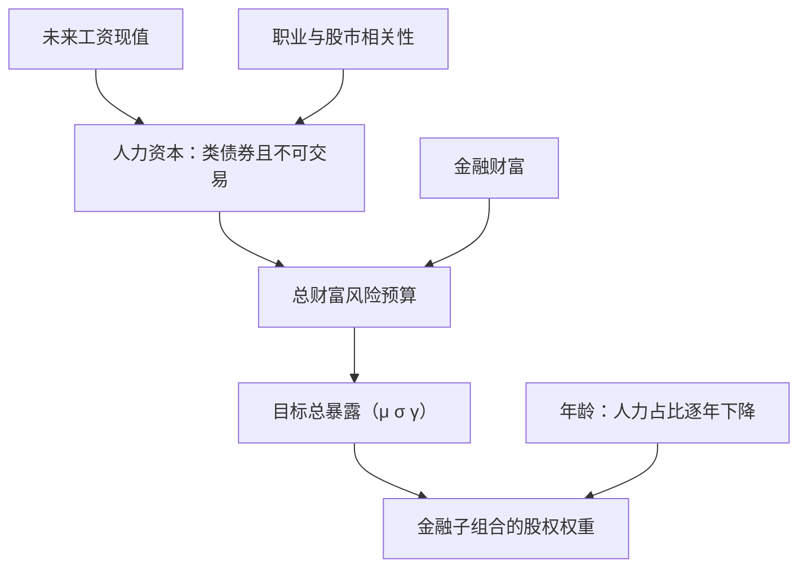
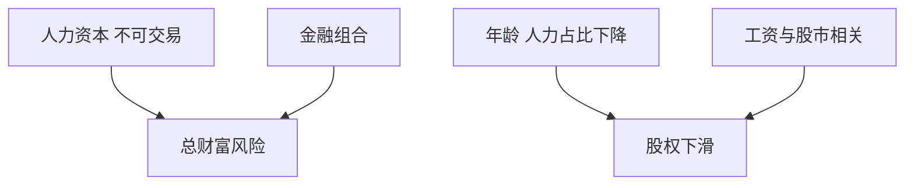

# 目标日期与下滑路径

下滑路径把股权权重写成距退休时间的函数；劳动收入像一只不可交易的债券，年轻时才该更像 Merton 的高股权。

<footer>—— 对照 Bodie, Merton and Samuelson, Labor Supply Flexibility and Portfolio Choice, JEDC, 1992；目标日期基金实务</footer>

[上一课](/quant/multi-period-risk-budget)管机构主动预算。目标日期（TDF）的缺口是**生命周期**：人力资本不可交易，金融财富随年龄从「人力资本占优」变成「组合占优」。本课写下滑路径的经济学与实现，不把「100 减年龄」当定理。后课杠杆拖累解释为什么路径上加杠杆 ETF 会偏离设计。

## 问题

Merton 常投资比例在 $\mu,\sigma,\gamma$ 不变时是常数。生命周期里：年轻时人力资本（未来工资）像债券，金融组合应更偏股以平衡总财富；临退休人力资本耗尽，金融组合应降股。Bodie–Merton–Samuelson 把劳动供给弹性也写进去。问题是 TDF 的下滑是**产品规则**，对所有同龄人同一条路径，忽略职业风险（金融从业者的工资与股市正相关，更应少股）与积存水平。

术语翻译：人力资本就是你未来全部工资的贴现值——一个刚工作的年轻人可能有几百万元的人力资本，只是不能拿出来卖。总财富 $=$ 金融财富 $+$ 人力资本；年轻人的大头是那只「看不见的债券」，所以金融账户要多配股票来平衡整个财富组合的风险。

实现：目标日期是组合保险还是战略配置？很多 TDF 只是日历再平衡的股债混，没有 [CPPI](/quant/cppi-tipp) 的垫。名称里的年份是营销锚，实际股权终点（to vs through retirement）差别很大。

### 下滑不是「风险厌恶随年龄上升」一句

$\gamma$ 可以不变，最优股权比例仍随人力/金融财富比下降。把下滑解释成老人更怕风险，会在退休后仍有大量人力资本替代（年金、社保）时降股过猛，或在年轻高薪高相关职业降股不够。

目标日期基金的滑路径常在内部模型里优化，对外只披露滑点表。评估要用表后的实际持仓与费用，见后课费用复合。

## 方法

总财富 $=$ 金融 + 人力资本现值（用工资、失业率、与股市相关贴现）。对金融子组合做 Merton/BL，使总暴露接近目标。TDF 产品：用年龄当状态的一维近似，分职业风险模板。再平衡：现金流（供款）优先，减少税与费用。对照：常数混合 60/40 vs 下滑，用生命周期效用而不是单一夏普。

数字实例：25 岁新人，金融财富 50 万元、人力资本现值约 500 万元（近似一只超长久期债券）。若目标让总财富 70% 承担股权风险，金融账户需要 $0.7\times 550/50=770\%$ 的股票权重——现实中被杠杆与产品规则截断，于是只能力所能及地高配，并随人力资本「到期」逐年降下来。

「总财富视角如何换算成金融账户的股债比」是一条两级链：

```mermaid
flowchart TD
  WAGE["未来工资现值"] --> HUM["人力资本：类债券且不可交易"]
  OCC["职业与股市相关性"] --> HUM
  HUM --> TOT["总财富风险预算"]
  FIN["金融财富"] --> TOT
  TOT --> TARGET["目标总暴露（μ σ γ）"]
  TARGET --> SUB["金融子组合的股权权重"]
  AGE["年龄：人力占比逐年下降"] --> SUB
```

## 机制

不可交易的债券型人力财富，要求可交易组合去做「补风险」。随时间人力债券到期（工资兑现成现金），需要卖掉一些股票以保持总风险。这就是下滑。股市与工资的正相关削弱「人力是债券」的假设，下滑应更平或更低。

```mermaid
flowchart TD
  Hum["人力资本 不可交易"] --> Mix["总财富风险"]
  Fin["金融组合"] --> Mix
  Age["年龄 人力占比下降"] --> Slide["股权下滑"]
  Corr["工资与股市相关"] --> Slide
```

## 边界

长寿、医疗、通胀使退休后需求不是常数 $\gamma$。TDF 的「through」路径在退休后仍持有股权，需要明确。目标日期不是保证；2008 年临退休队列的损失是路径风险，不是下滑公式算错一年。不要用 TDF 去替代个人的税与位置优化。

常见误区：把「100 减年龄」当成定理。它只是统一滑道的历史习惯式；同一出生年份的人，职业风险与积存水平天差地别。2008 年临退休的 401(k) 队列亏掉三成，说明「到点就安全」是营销话术——路径风险不会因为基金名字里写了年份就消失。

## 小结

- 下滑的经济学是人力资本像债券，不是年龄本身改变 $\gamma$。
- 职业相关与积存水平使统一路径只是产品近似。
- 评估用生命周期效用与真实费用，不用单期夏普。
- 出处：Bodie, Merton and Samuelson, *JEDC*, 1992。
