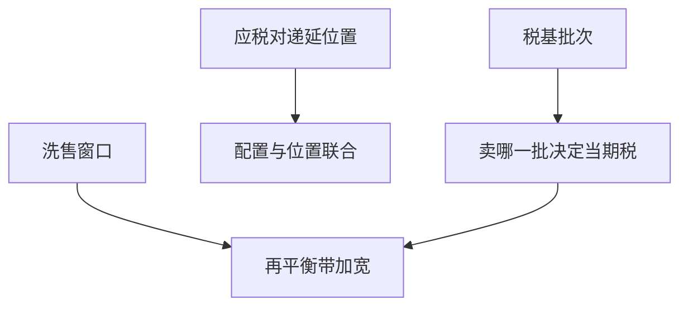

# 税务感知组合

实现损失、推迟收益、避免洗售，使最优交易依赖于税基批次；不计税的 DP 会在应税账户里系统性过交易。

<footer>—— Dammon, Spatt and Zhang, Optimal Asset Location and Allocation with Taxable and Tax-Deferred Saving, Journal of Finance, 2004</footer>

[上一课](/quant/robust-portfolio-opt)把稳健组合写成 maximin：半径是偏好，机制是最坏而不是后验平均，不能替代宏观压力情景。缺口是应税账户：DP 与 GP 默认税后等于税前，同一只股票不同买入价，卖哪一批改变当期税，批次成为状态。本课钉税务感知组合：资产位置、损失收割与再平衡的冲突。不重讲椭圆不确定集。不写避税操作清单；后课多期风险预算默认 lot 与洗售窗口已经进状态，而不是事后扣税。

## 问题

稳健优化收缩的是最坏 $\mu$，应税账户的状态却是批次。再平衡要卖赢的、买输的，正好实现资本利得。最优往往是：尽量用新现金流与应税损失来调暴露，而不是卖长期高税基仓。问题是状态爆炸：每只证券多个 lot、长期/短期税率、洗售窗口。完全 DP 不可行，实务用启发式：先收割损失、用期货/ETF 维持暴露、避免 30 天内买回同一证券（美国洗售；其他法域规则不同）。

资产位置：高期望税负的资产放在递延账户，市政债等放在应税账户。Dammon–Spatt–Zhang 指出位置与配置互相依赖，不能先 Markowitz 再随便塞账户。

### 税 alpha 不是市场 alpha

损失收割的价值来自期权式的凸性（损失立即用、收益推迟），依赖税率、波动与现金流。把它当成股票 alpha 会在回测里制造无容量的「税务因子」，并在税率改革时消失。应单独记账。

不同法域：美国 wash sale、欧洲某些国家的持股期、中国个人股息税与资本利得的现行规则不同。引擎要参数化，不要写死 IRS 条款当全球真理。

## 方法

账户分层：应税、递延、免税。优化：在暴露约束下最小化当期税 + 未来税的近似（对未实现收益打折）。Lot 选择：HIFO 或优化选择以实现损失。再平衡带加宽，与费用课的无交易带叠加。对照：不计税再平衡 vs 税务感知的税后终值，用同一税则模拟。

GP 的 $\Lambda$ 在应税账户应加上边际税率带来的有效冲击。

## 机制

税使卖出有不对称成本：实现收益付税，实现损失获抵扣（有限制）。于是无交易带在盈利仓更宽、在亏损仓更窄（甚至主动卖）。位置则是边际税率不同的「不同费用」账户之间的配置。与 Merton 的 $\gamma$ 相比，税是另一个状态依赖的费用函数。

## 边界

税法变更是模型风险。递延账户的提前支取罚金、最低分配，使「递延永远更好」不成立。用衍生品维持暴露可能被重定性。本课不提供规避申报或隐瞒税基的方法。

## 小结

- 应税账户的状态含 lot；不计税的最优再平衡会过交易。
- 配置与位置应联合；税 alpha 单独记账。
- 有效冲击含税，无交易带不对称。
- 出处：Dammon, Spatt and Zhang, *Journal of Finance*, 2004。
