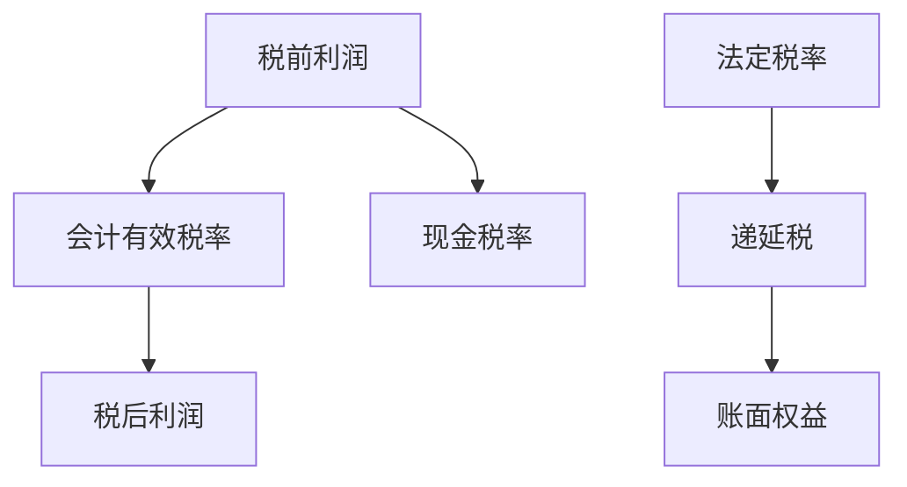

# 税率与递延税

利润表上的税率是会计有效税率，不是法定税率，也不是现金税率；递延税把差异推到未来期间，账面与盈利会同时被它推动。

<footer>—— 据 Penman 对所得税会计的处理；Beaver 与后续盈余–回报研究对「税后盈余」口径的讨论整理</footer>

上一课[商誉与减值](/quant/goodwill-impairment)会制造巨大的税前利润跳动，税后利润还要再过所得税会计。价值因子的账面里常含递延税资产/负债；盈利因子用的是税后利润。本课补税率口径与递延税，避免把税务估计当成经营质量。不重写减值，不进入税务筹划百科。

## 问题

法定税率是法规数字；有效税率 = 所得税费用 / 税前利润，含递延；现金税率用实缴税。三者经常分叉：亏损、税收优惠、减值、境外利润、估值准备都会让有效税率失真甚至变负。Fama–French 与盈利类因子若直接用税后利润排序，等于把税务估计和经营利润捆在一起。缺口是声明：因子用的是税前、税后还是现金税，以及递延税是否进账面权益调整。

Fama–French 构造账面时，有时把递延税负债加回权益——这是一个明确的会计调整，不是「税务 alpha」。回测必须写进构造说明，不能有的年份加回、有的年份不加。

### 有效税率不是边际投资税率

资本预算里的边际税率问的是下一单位利润缴多少税。截面因子里的有效税率是过去期间费用与利润的比，充满一次性项目。用有效税率当「税务优势因子」而不剔除亏损与减值年，排序会变成亏损识别。本课把税率当口径，不当宏观税改故事。

递延税资产依赖「未来有足够应税利润」的判断，估值准备（valuation allowance）一提，利润与资产一起下降，与减值类似，必须按公告时点进入 PIT。

## 方法

盈利排序优先用税前经营利润或明确的税后经常性利润，并在亏损、税率异常值上截尾或单独分组。账面若跟随 Fama–French，按锁定规则处理递延税，且用当时报表数字，不用后来税率改革回溯调整的 restated 权益。现金税率用实缴税对税前利润，窗口至少数年，否则一次性退税会造成极端信号。

可用日期：税率改革立法日可能改变未来法定税率，但不自动改写历史递延税余额；余额变化以公司报表确认日为准。

有效税率异常值（负、超 100%）单独分组，避免税率信号变成亏损识别。递延税是否加回账面，全样本一种规则。现金税率用多年窗口， squashing 一次性退税。

## 机制

递延税把会计利润与应税利润的时间差记到资产负债表。加速折旧通常产生递延税负债，使权益偏低；亏损结转产生递延税资产，使权益偏高，但资产能否实现取决于估值准备。质量课里「一次性」常含税率异常。税务并不是噪声：现金税率持续低于有效税率，可能意味着递延负债在累积，未来利润或现金流更紧。因子要的是把这条路径显式化，而不是把有效税率当经营能力。

跨国有效税率被境外利润配比推动。行业分类下一课之后才细讲；本课至少不要把「低有效税率」直接当成高质量。

亏损年、有效税率超出合理区间（例如负或高于 100%）的观测应单独分组或截尾，不要让税率因子变成亏损识别。Fama–French 账面是否加回递延税负债，整段样本只选一种。税率改革立法日可以当作宏观事件，但公司递延税余额仍以报表确认日更新。现金税率用多年窗口，避免把一次性退税当成持续税务优势。

## 边界

不汇编各国税法，不讲转移定价。租赁资本化也会制造递延税，交给[租赁与表外](/quant/lease-off-balance)。后课分析师预期常用税后 EPS，口径要与本课声明一致。后课默认：盈利与账面的税务口径已写死；递延税调整按 PIT 报表，不按后来税改回溯。

后课分析师 EPS 多为税后摊薄。本课的税务口径必须与那条 EPS 对得上，否则惊喜里全是税率一次性。亏损结转形成的递延税资产，其估值准备按报表日走 PIT，与商誉减值同一逻辑。不要把宏观法定税率序列直接当成个股有效税率因子。

后课默认盈利与账面的税务口径已写死，递延税调整按 PIT 报表，不按后来税改回溯重述。

境外利润配比会把合并有效税率拉离法定税率，这不是经营质量。行业中性可以吸收一部分，但不能把「低有效税率」直接当成 alpha 信号。亏损结转资产的估值准备，按报表日与减值同一套 PIT。

## 小结

- 法定、有效、现金税率是三个量。
- 税后利润把税务估计捆进盈利因子。
- 递延税进入账面，Fama–French 是否加回必须固定。
- 估值准备与减值一样按公告时点走 PIT。
- 低有效税率不是自动的质量或 alpha。
- 出处：Penman 所得税会计；Fama–French 账面构造；Beaver 以降的税后盈余口径讨论。
