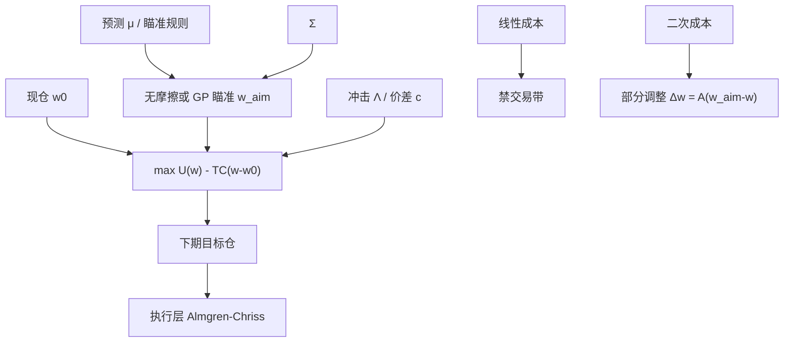

# 交易成本感知优化

    
可预测收益给出一个瞄准组合，二次交易成本给出向它靠近的速度；最优交易是部分调整，而不是每期把持仓甩到无摩擦的 Markowitz 点上。

    <footer>—— Gârleanu and Pedersen, Dynamic Trading with Predictable Returns and Transaction Costs, Review of Financial Studies, 2013</footer>

无摩擦 [Markowitz](/quant/markowitz) 每期输出一个点 $w^\star(\mu,\Sigma)$。实盘从 $w_0$ 走到 $w^\star$ 要付价差与冲击，走完全程的净效用可以低于走一半。交易成本感知优化把 $\mathrm{TC}(w-w_0)$ 写进目标，使「交易多少」与「持有什么」同时决定。Gârleanu 与 Pedersen（2013）在二次成本和线性可预测收益下给出瞄准组合与部分调整的闭式结构；Lobo、Boyd 一类把线性、固定成本写成凸问题。本篇写目标里的成本、与 [Almgren–Chriss](/quant/almgren-chriss) 执行层的分工、以及为什么它不是把滑点从回测里扣掉那么简单。[费用敏感性](/quant/cost-sensitivity) 评价策略对 $c$ 的弹性；这里 $c$ 进入**选择**。

## 问题

记无成本最优为 $w^\star$。若 $\mathrm{TC}$ 对交易量凸，从 $w_0$ 一步跨到 $w^\star$ 的边际成本可以高于再持有一期错误暴露的边际损失。理性的下一步是一个内点 $w$，满足风险–收益的梯度与成本的次梯度平衡。忽略成本的优化器表现出过高换手、在噪声 $\mu$ 上反复横跳，样本外净夏普崩溃——这常被误诊为「均值方差有害」，其实是目标函数少了一项。

成本结构决定问题的形状。线性成本 $c^\top|w-w_0|$（价差、费率）产生禁交易带：小信号不交易。二次成本 $(w-w_0)^\top\Lambda(w-w_0)$（临时冲击的线性价格影响）产生向瞄准组合的比例调整，没有硬带宽，但步长随 $\Lambda$ 变小。固定成本使问题组合化，小名字被整段排除。真实市场是三者之和，还随 ADV、波动、拥挤变。问题是选一个能进求解器、参数能从执行数据校准的 $\mathrm{TC}$，而不是在回测里写死 10 个基点。

### 执行问题不是配置问题

Almgren–Chriss 回答：给定一块要在 $T$ 内完成的母单，速率如何在冲击与价格风险间权衡。配置问题回答：母单该有多大、甚至该不该下。把 AC 的最优轨迹接到无成本 $w^\star$ 上，只优化了「怎么走」，没优化「走不走、走多远」。成本感知优化输出的是下期目标仓，再交给执行引擎去切单；两层的冲击模型应同源（同一 $\Lambda$），否则配置以为冲击很贵、执行以为很便宜，或反过来。信号衰减快时，$T$ 不能任意长，配置层必须用更高的有效 $\Lambda$ 或更短的地平，把来不及执行的 alpha 当成不可得。

Gârleanu–Pedersen 的瞄准组合不是无成本 Markowitz。二次成本下，瞄准已经把 $\Lambda$ 与风险厌恶、预测的持续速度折进「理想持仓」，比无摩擦切点更保守、更慢。把 GP 理解成「先算 Markowitz 再打七折」，会漏掉瞄准点本身的位移。

## 方法

单期实用形式：

$$
\max_w\ w^\top\mu-\frac{\lambda}{2}w^\top\Sigma w-\mathrm{TC}(w-w_0).
$$

线性 $\mathrm{TC}=c^\top|w-w_0|$ 可用辅助变量变成 QP/LP。二次 $\mathrm{TC}=\tfrac12\Delta w^\top\Lambda\Delta w$，$\Lambda$ 对角或按因子结构（共同冲击）。Gârleanu–Pedersen 的多期、二次成本、AR(1) 预测下，最优交易

$$
\Delta w_t=A\big(w_t^{\mathrm{aim}}-w_{t-1}\big),
$$

$A$ 由成本与风险的连续时间或离散 Riccati 决定，$w^{\mathrm{aim}}$ 是把未来预期收益的现值用有效风险（$\lambda\Sigma$ 加成本调整）除出来的点。预测越持久、成本越低，$A$ 越接近 1；日频噪声 alpha 配上大 $\Lambda$，$A$ 接近 0，等于不交易。这把 [因子衰减与换手](/quant/factor-decay-turnover) 收进最优控制：半衰期短的信号自动降低有效换手，不是事后再砍频率。

$\Lambda$ 的校准：对角元用 $\eta_i/\mathrm{ADV}_i$ 一类平方根或线性冲击系数，从经纪商 TCA 或 Inf-VWAP 回归得到，并按波动分位分层。用全市场同一个 $c$ 是 [费用敏感性](/quant/cost-sensitivity) 文里批评的点估计；优化里至少按流动性分三档。卖空加借券进线性项。固定成本用 $\ell_0$ 或分段，对小盘是否允许开仓起决定作用。

### 与换手惩罚、约束的关系

[换手惩罚](/quant/turnover-penalty) 是 $\gamma\|w-w_0\|_1$ 或 $\gamma\|\Delta w\|_2^2$ 且 $\gamma$ 不声称等于真实 $c$。成本感知优化要求 $\mathrm{TC}$ 可审计地来自市场；惩罚把 $\gamma$ 当正则超参。两者可以同时存在：$\mathrm{TC}$ 管可交易性，$\gamma$ 再压估计噪声引起的超额交易。硬换手约束 $\mathbf{1}^\top|w-w_0|\le T$ 是不可微的预算，角点解多，不如把同一预算改成线性成本再调 $c$ 直到平均换手达标——影子价格比硬上限更稳。

动态：单期重复求解（每次 $w_0$ 为现仓）是模型误设下的工程近似，会比 GP 的承诺计划更短视，但对 $\mu_t$ 的误设更宽容。信号若确实是 AR(1) 且持续，应用多期瞄准；若 IC 期限结构在一周后变号，单期加成本往往更安全。

## 机制

机制是**边际 alpha 必须超过边际冲击**。无成本时任何非零 $\mu_i$ 都值得调仓直到风险一阶条件满足；有线性成本时，$|\partial U/\partial w_i|$ 小于 $c_i$ 则该坐标停在 $w_{0,i}$，形成禁交易带。二次成本下没有带宽，但步长被 $\Lambda$ 缩小，持仓永远滞后于无摩擦点，滞后本身是最优的。这解释了为何「回测里每天再平衡到最优」在扣费后死亡：那些交易大量落在真实世界的禁交易带或极小步长区。

共同冲击（$\Lambda$ 非对角）让同时买卖相关名字更贵，优化器倾向用更少的交易、更久的持有去实现因子暴露，而不是在簇内换座位。这与 [HRP](/quant/hrp) / [ERC](/quant/erc) 减少簇内重复的方向一致，但动机是价格影响而不是风险会计。拥挤时 $\Lambda$ 应升高：同一信号上的多头一起交易，冲击内生。固定 $\Lambda$ 会在拥挤月过度交易。

把成本写成与 $w$ 无关的常数（「年费 20bp」）完全不改变最优 $w$，只改变报出来的净收益。感知优化要求成本依赖 $\Delta w$。若回测引擎只能扣常数费，它无法实现本篇的对象，只能做敏感性表。

### 瞄准组合与 BL、风险平价的衔接

$w^{\mathrm{aim}}$ 可以用任何无成本规则替换：收缩最小方差、[ERC](/quant/erc)、[Black-Litterman](/quant/black-litterman) 后验切点。GP 的结构仍然适用：成本决定你以多快速度追这个瞄准。BL 观点突然插入时，$w^{\mathrm{aim}}$ 跳一下，二次成本会把冲击摊到多期，避免一天实现全部观点。观点的 $\Omega$ 若已经很小（很确信），仍应让 $\Lambda$ 限制实现速度——确信的是超额收益，不是冲击为零。风险平价产品的再平衡同理：$\Sigma_t$ 日度动，瞄准日度动，没有 $\mathrm{TC}$ 就会在波动上反复买卖。

## 边界与工程取舍

不要用样本内搜出来的 $\Lambda$ 去最大化净夏普：那会把冲击参数变成另一个过拟合旋钮。$\Lambda$ 应来自执行数据或文献校准，策略选择在冻结的 $\Lambda$ 上进行。不要把 AC 路径的期望冲击与配置层的 $\mathrm{TC}$ 加两次。不要对涨跌停、T+1、停牌市场用连续可交易的二次成本——不可交易是硬约束，应把那些名字的 $\Delta w_i$ 钉零，见 A 股制度约束。非线性平方根冲击使问题对 $\Delta w$ 非凸（或需锥规划近似），大单时线性 / 二次会低估成本，优化器过于激进。

容量：同一套 $\mathrm{TC}$ 在规模 $AUM$ 放大时 $\Delta w$ 的美元量上升，$\Lambda$ 应随规模更新，否则「成本感知」只在回测的纸面规模上成立。多账户、多策略共用冲击账户时，应在公司层解一个带交叉 $\Lambda$ 的问题，而不是每个组合各自以为自己面对整块 ADV。

Gârleanu–Pedersen 的优美闭式依赖二次成本与线性动态。真实价差是线性加固定，冲击是凹的平方根。闭式用来给部分调整一个定性速度，求解器里应换更贴近 TCA 的 $\mathrm{TC}$，不要为了闭式牺牲成本形状。

## 小结

- 交易成本感知优化把 $\mathrm{TC}(\Delta w)$ 放进目标，同时决定持仓与交易量；无摩擦 Markowitz 点通常不应一步实现。
- 线性成本给出禁交易带，二次成本给出向瞄准组合的部分调整（Gârleanu–Pedersen, 2013）。
- 配置层的 $\mathrm{TC}$ 与执行层的 Almgren–Chriss 应共用冲击假设，但问题不同：一个决定母单大小，一个决定轨迹。
- $\Lambda,c$ 从 TCA 校准并按流动性分层，不要用样本内净夏普反推冲击。
- 瞄准可以是 BL、ERC 或最小方差；成本结构负责实现速度，不负责观点。
- 出处：Gârleanu & Pedersen, *Review of Financial Studies*, 2013；凸组合与线性/固定成本见 Lobo, Fazel, Boyd 等；执行层对照 Almgren & Chriss, 2000/2001。
