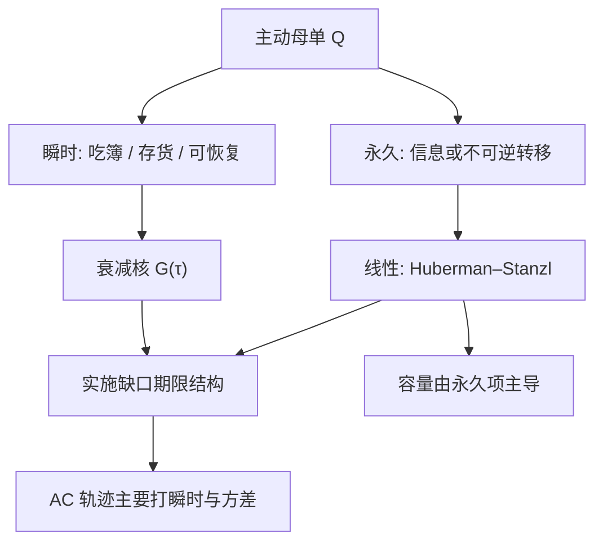

# 瞬时冲击与永久冲击

若永久价格影响对数量非线性，交易者就可以用一来一回的循环操纵价格并抽取准套利；无操纵要求永久冲击是线性的，暂时冲击则必须衰减。

<footer>—— Huberman and Stanzl, Price Manipulation and Quasi-Arbitrage, Econometrica, 2004</footer>

一次主动买会把成交价推到中点之上，随后中点可能部分回落、部分留在新的水平。回落的那一截叫做瞬时（或暂时、临时）冲击，留下的那一截叫做永久冲击。[价差分解](/quant/spread-decomposition) 在微观结构会计里用有效价差减实现价差去逼近「成交后中点走了多少」；[Almgren–Chriss](/quant/almgren-chriss) 把同一对概念写成执行模型里的两项函数。两者窗口不同：前者常是五分钟或随后 $k$ 笔，后者是母单从开始到结束后的更长地平。Gatheral（2010）从无动态套利要求传播核的形状；Obizhaeva 与 Wang 把暂时项写成限价簿的消耗与恢复。本篇写切分的对象、理论约束与工程误用——尤其是不要把经验平方根整段叫做永久冲击。

## 问题

记到达中点为 $M_0$，成交过程中的价格为 $P_t$，母单结束后足够长的中点为 $M_\infty$。一个可用的切分是：瞬时冲击描述 $P_t-M_t$ 或完成后迅速恢复的部分；永久冲击描述 $M_\infty-M_0$ 中与本母单方向有关的部分。问题是识别：没有对照事实，任何窗口里的中点变动都混有无关信息。窗口太短，永久被算成瞬时；窗口太长，宏观噪声进入永久。执行台关心的是「我能否靠把速率放慢来省钱」（主要打瞬时），投资台关心的是「我的交易是否把公允价对自己不利地写死了」（永久，决定容量）。

Kyle 的 $\lambda$ 更接近永久：流量里的信息被写入价格，不预期回跳。Roll 的弹跳更接近瞬时：买卖报价之间的来回。真实母单介于两者之间。把所有短fall 当瞬时，会高估「拆单能省下的钱」；把所有短fall 当永久，会高估「再慢也省不了」——两种偏都会让 [AC](/quant/almgren-chriss) 的 $\lambda$ 与 $T$ 选错。

### 瞬时不是价差的别名

半价差是立刻执行的标价，即使数量为一手。瞬时冲击还包括走阔、吃多层簿、以及流动性恢复前的中点偏移。小单可以几乎只有半价差；大单的瞬时项远大于 $s/2$。Huang–Stoll 的实现价差是做市商事后收入，主动方的瞬时成本与之相关但符号视角相反。事前预算应用到达价短fall 的可恢复部分，而不是把报价宽度乘一个常数叫做瞬时冲击。

「临时 / 永久」在文献里至少有三套用法：微观结构的有效–实现分解；AC 执行模型的两项线性函数；传播模型里冲击核随时间衰减的可积部分与不可积部分。报告必须声明窗口与模型，不能只丢两个中文词。

## 方法

**事件研究切分。** 对标记好的母单，记录到达中点、成交量加权成交价、结束后 $\tau$ 的中点。瞬时 $\approx$ 成交相对到达（或相对同期中点）的偏离减去在 $\tau$ 仍留下的部分；永久 $\approx$ 方向调整后的 $M_\tau-M_0$。$\tau$ 用若干个 ADV 时间或若干笔，而不是固定五分钟——流动性不同的股票时钟不同。应设对照组：同期未交易的相似股票，以减去市场因子。否则牛市里的买入母单会把 beta 算进永久冲击。

**参数模型。** AC 线性：永久 $\gamma Q$，临时 $\eta v$。Obizhaeva–Wang：簿有密度，消耗后以某速率恢复，暂时影响随恢复衰减，永久可以来自不恢复的部分或来自信息。Gatheral 的传播：过往交易以核 $G(t-s)$ 影响当前价格，无动态套利对 $G$ 施加凸性 / 正定类约束，排除某些「先打后撤就能锁利润」的核。校准应在母单层面做，并用买卖对称性检查：若买入永久远大于卖出，可能是样本期的漂移，而不是冲击不对称定律。

**与平方根的衔接。** 母单总短fall 对 $Q$ 呈平方根，并不告诉你衰减核。可以把瞬时写成对速率的根号、永久写成对总量的线性，再看能否拟合短fall 的期限结构。若把 $\sqrt{Q}$ 整段放进永久，Huberman–Stanzl 的循环交易会在模型里出现利润：买 $Q$、价格按 $\sqrt{Q}$ 上移、再分多笔卖出，非线性留下套利。数据若偏好根号永久，应先怀疑瞬时尚未衰减完，而不是放弃线性永久。

### 衰减核比两个数字更重要

只报告「瞬时 40bp、永久 20bp」丢失形状。核若在十分钟内掉完，执行上慢于十分钟几乎只付永久；核若按幂律慢衰减（Bouchaud 等），「结束」很难定义，$M_\infty$ 依赖你愿意等多久。方法上应画 $G(\tau)$ 或事后中点相对到达的曲线，至少给出 1 分钟、30 分钟、一日三个点。指数再平衡、宏观发布附近，核的水平与衰减都变，平静期校准不能沿用。

Gatheral（2010）的无动态套利不是说市场没有人亏钱，而是说冲击模型若允许无风险的来回交易利润，则模型不能作为所有人同时使用的价格影响。交易台可以在错误的模型上觉得自己在「最优执行」。约束的是模型，不是市场保证无套利。

## 机制

瞬时机制：可见深度被消耗，做市商存货暂时偏离目标，报价中点与价差调整以吸引反向流；当存货回防、潜在流动性补簿，价格部分恢复。Harris 所讲的深度与价格压力，首先是这一层。永久机制有两条并不互斥的叙事：信息（你的买让别人提高对价值的信念，Kyle）；以及不可逆的风险转移（有人必须永久持有你不想持有的库存，要求更高的期望收益）。识别上，信息叙事预测冲击与后续公开信息同向相关；存货叙事预测冲击随后有反向流、且与做市商头寸相关。母单研究往往两者都在。

无操纵约束的机制是会计：若追加一单位永久冲击随已执行量递减（凹的永久），则先大后小的拆法与先小后大的拆法能锁定价差；凸则相反。线性是使循环交易期望利润为零（在无其他摩擦时）的边界。暂时项必须衰减，否则「瞬时」并不瞬时，也可以被用来操纵。模型若违反这些，优化器会建议自交易或洗盘式路径——那是目标函数的漏洞，应视为模型错误。

### 与价差、Kyle、AC 的对照表

| 对象 | 更接近瞬时 | 更接近永久 |
|---|---|---|
| 报价半价差 | 是（小单主导） | 否 |
| Huang–Stoll 冲击（有效−实现） | 部分（窗口短则偏瞬时） | 窗口拉长则偏永久 |
| Kyle $\lambda$ | 否 | 是（信息写入） |
| AC 临时 $\eta v$ | 是 | 否 |
| AC 永久 $\gamma Q$ | 否 | 是（且应为线性） |
| 经验母单 $\sqrt{Q}$ | 常混两者 | 不宜整段当作永久 |

工程上按这一表选择公式，而不是按软件对话框里的名称。

## 边界与工程取舍

对照与窗口永远有设定误差。暗池成交没有同时刻公开中点，瞬时项会偏。涨跌停上瞬时变成「无穷」、永久变成「次日开盘跳空」，连续核不适用。多标的执行的交叉永久冲击（卖指数期货对一篮子的beta）会使单票 $M_\infty$ 不可单独解释。

不要用五分钟实现价差去校准 AC 的 $\gamma$：对象不是同一地平。不要在宣传容量时只报瞬时（看起来能靠算法省掉），把永久藏起来——AUM 增大时永久项决定 $\mu_{\mathrm{net}}$ 是否过零。不要把 Gatheral 约束当成「我们的执行没有冲击」。A 股开盘后的瞬时核通常更肥，用美股股票的 $G(\tau)$ 会低估前半小时的成本。

瞬时与永久的切分不产生可交易 alpha。观测到「瞬时会恢复」不等于应该先打后反向：恢复的期望可能已被价差与逆向选择吃掉，这正是做市商的利润来源。执行模型的目标是降低自己母单的缺口，不是去当反向交易者——那是另一个策略，有另一套风险。

母单标记错误是切分失败的首因：把无关的同向子单拼成一条母单，永久项会被拉长；把一条决策拆成许多「已结束」的小单，瞬时项会被重复计数。标记规则应先于回归，并在样本外冻结。

## 小结

- 瞬时冲击可随流动性恢复而衰减；永久冲击留在中点里，决定容量与公允价移动。
- Huberman–Stanzl（2004）要求永久项对数量线性，否则模型允许准套利；经验平方根不宜整段当作永久。
- Gatheral（2010）对传播核施加无动态套利约束；Obizhaeva–Wang 用簿的消耗与恢复描述暂时项。
- 微观结构的有效–实现分解、AC 两项、传播核是三套相关但窗口不同的语言，必须声明。
- 放慢交易主要省瞬时；永久项对给定总量往往省不掉。把两者弄反会选错 $T$ 与风险厌恶。
- 出处：Huberman and Stanzl, *Price Manipulation and Quasi-Arbitrage*, Econometrica, 2004；Almgren and Chriss, *Journal of Risk*, 2000/2001；Gatheral, *No-Dynamic-Arbitrage and Market Impact*, Quantitative Finance, 2010；Obizhaeva and Wang, *Optimal Trading Strategy and Supply/Demand Dynamics*, Journal of Financial Markets, 2013。
