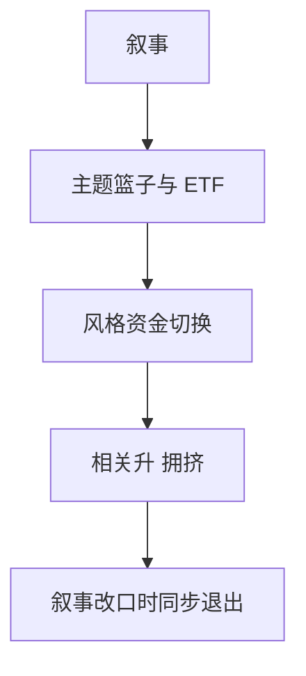

# 主题与叙事

主题篮子没有稳定的基本面定义，只有一段时间内被同一故事绑在一起的交易需求；风格投资可以自我强化，也可以在叙事改口时一起崩。

<footer>—— Barberis and Shleifer, Style Investing, Journal of Financial Economics, 2003；叙事作为信念载体见 Shiller</footer>

[上一课](/quant/esg-factor-debate)至少还有供应商分数。主题与叙事的缺口是**更软的分类**：人工智能、减肥药、国潮、元宇宙——名单随新闻改。量化栏不把叙事当宏观基本面课重讲，只问它如何进入持仓、拥挤与因子。Barberis–Shleifer 的风格投资给出机制：资金在风格之间切换，制造截面上的联动与均值回复。

## 问题

主题 ETF 与篮子把异质股票焊成单一交易工具。流入时相关升、估值一起贵；叙事破裂时一起成为流动供给。问题是识别：主题收益有多少是市场与行业 beta，有多少是可重复的「主题动量」，有多少是一次性的发行与媒体脉冲。Lou 等对资金流与持仓联动的工作说明：可观测的篮子流本身会预测随后拥挤。不要把主题超额再对 [CAPM](/quant/capm) 回归成新因子；先剥市场、行业、动量。

与 ESG：ESG 有委托章程，主题往往只有营销故事。与因子择时：买主题是对叙事体制下注，$B\approx 1$。

### 名单不可事后拟合

回测用今天的主题成分往回铺，是纯前视。合法做法是冻结当时可投资的 ETF 持仓或当时的卖方名单，接受早期名单很脏。否则「主题动量」只是动量本身。

叙事可以改变基本面（反身性），但交易账户不能把事后实现的基本面改善当成当时可交易的信号。研究日志只允许当时可获得的文本与持仓。

## 方法

对象：主题 ETF、卖方篮子、文本聚类（需预注册）。风险：对市场、行业、动量、拥挤代理回归。交易：把主题当约束或卫星，而不是核心 ARP。容量：ETF 规模与期权挂靠会放大。退出规则必须事先写：叙事没有基本面锚，止损是风控不是择时 alpha。

## 机制

共同故事协调需求，短期像风格动量，长期像估值修复或归零。拥挤度量（共动量、ETF 流入）比「故事好不好」更可操作。主题与 [因子拥挤](/quant/factor-crowding) 同构，只是分类更任意。

## 边界

本课不写如何传播或操纵叙事。文本模型若用，须防数据修订与语料泄漏。宏观相机可以吸收叙事，但应归入宏观桶分报。

## 小结

- 主题是风格资金的软分类，不是稳定因子。
- 回测必须用当时名单，禁止后视成分。
- 拥挤与 ETF 流是可操作对象，故事质量不是。
- 出处：Barberis and Shleifer, *JFE*, 2003；Shiller 对叙事经济学的讨论；流与持仓见 Lou 等。
