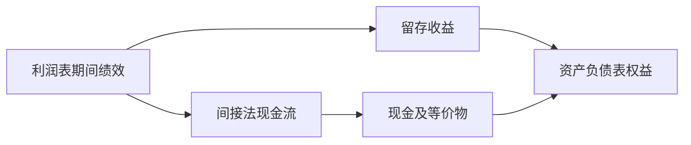

# 三张表怎么连

利润表上的净利润，经留存收益滚进资产负债表；现金流量表则从净利润出发，用非现金项目与营运资本变动把它翻译成现金。

<footer>—— 据 Penman, Financial Statement Analysis and Security Valuation, 第 3–5 章整理</footer>

上一课[方差缩减](/quant/variance-reduction)把随机分析课程收到「同一期望、更少路径」。定价数学至此可算。缺口换成另一类对象：可交易的不是一条模拟路径，而是一张**当时可观测的公司状态表**。本课是「财务数据与基本面」第一课；后课默认三张表各自记什么、怎样勾稽，不再从复式记账入门。本课只钉身份与期间/时点，不钉可用日期——那是后两课。

## 问题

[方差缩减](/quant/variance-reduction)处理的是风险中性期望的估计噪声。进入基本面后，噪声来源换成会计身份是否闭合、字段是否对上同一家公司的同一报告期。利润表给期间绩效，资产负债表给时点存量，现金流量表解释现金从哪来、到哪去。三张表若各存各的，后面应计拆分、账面市值、Fama–French 的账面权益都会张冠李戴。

缺口不是「会计是什么」，而是机器可读的勾稽：同一期的净利润必须能滚进权益，间接法经营现金流必须能与现金科目变动对上。对不上，因子分子分母就不是同一个经济量。

### 期间流量不是时点存量

净利润、收入、经营现金流是**期间**量；总资产、账面权益、现金余额是**时点**量。数据库字段混用「最新年报总资产」与「上季净利润」是低级错误，不是风格问题。后课缩放应计、算账面市值，都先要求你分清这两类。

Compustat 的 AT、CEQ 是时点；NI、OANCF 是期间。Wind、CSMAR 同理。本课不讲 vendor 字段表，只钉身份。

## 方法

Penman 把勾稽写成两条主链，后课所有比率都从这里取数。

链一：利润表 → 权益变动 → 资产负债表。净利润减股利（及少数股东份额等）进入留存收益；期初股东权益加上本期综合收益与资本交易，得到期末权益。账面市值的「账面」取的是这条链上的权益，不是利润表上的某个流量。

链二：利润表 → 间接法现金流量表 → 现金。从净利润出发，加回折旧摊销减值等非现金费用，调整应收应付存货等营运资本变动，得到经营现金流；再加投资与筹资活动，三活动合计等于现金及等价物的净变动，从而闭合到资产负债表的现金科目。

身份一旦闭合，后课才能合法写 $Accruals \approx NI - OCF$，才能把账面权益放进价值因子的分母。Fama–French 构造 HML 时用的 Compustat 账面权益，正是这条链上的存量，不是「最新利润的某种折现」。

## 机制

实务库把科目投影成标准化字段。回测取的是两个时间戳：报告期结束日，以及市场第一次能读到该期数字的公告日。本课只要求你承认两者不同；[Point-in-time 基本面](/quant/pit-fundamentals)才把「当时能看到的版本」写成约束。勾稽检查是因子管道的单元测试：同一公司同一期，净利润应与权益变动表里的净利润行一致；间接法经营现金流与现金变动在调整后应闭合。闭合失败通常是合并范围、一次性项目或字段映射错误，不是「市场无效」。

后课质量因子、价值因子都默认你会先跑这条勾稽。身份错了，排序再精致也是在排错的数。

勾稽失败时不要用「以利润表为准」或「以现金流为准」悄悄改一个字段去闭合。先停下来查合并范围、货币单位、是否把母公司单体与合并表接在同一期。Fama–French 复制里账面权益对不上，多半是优先股、NCI 或负账面处理不一致，而不是市场把会计恒等式打破了。本课交给后课的，是一张能通过身份测试的宽表雏形，不是已经可交易的因子。

## 边界

不重讲分录，不对照 GAAP 与 IFRS 逐条差异。商誉、租赁资本化、合并少数股东、递延税是后面质量与分类课的缺口。本课也不构造 CAPM 或风险溢价；Fama–French 因子只在此借用「账面权益从哪张表来」这一句，构造细节交给[基本面因子从哪张表来](/quant/fundamental-factor-source)。定价数学不再展开：风险中性测度已在随机分析课结束。

后课默认：三张表结构与两条主勾稽已读完；讨论任何基本面字段时，先问它是期间还是时点、来自哪张表。本课不引入可用日期，是故意把身份与时钟分开：身份错了，时钟再准也在对错误的数。随机分析课的测度与模拟到此不再展开。

## 小结

- 定价课收到可算期望；本课换成可勾稽的公司状态表。
- 利润表绩效经留存收益进入资产负债表权益。
- 间接法现金流从净利润翻译现金，三活动合计等于现金变动。
- 期间量与时点量不能混缩放；可用日期尚未引入。
- 后课默认勾稽已闭合，再谈应计、PIT 与幸存者。
- 出处：Penman, *Financial Statement Analysis and Security Valuation* 第 3–5 章。
