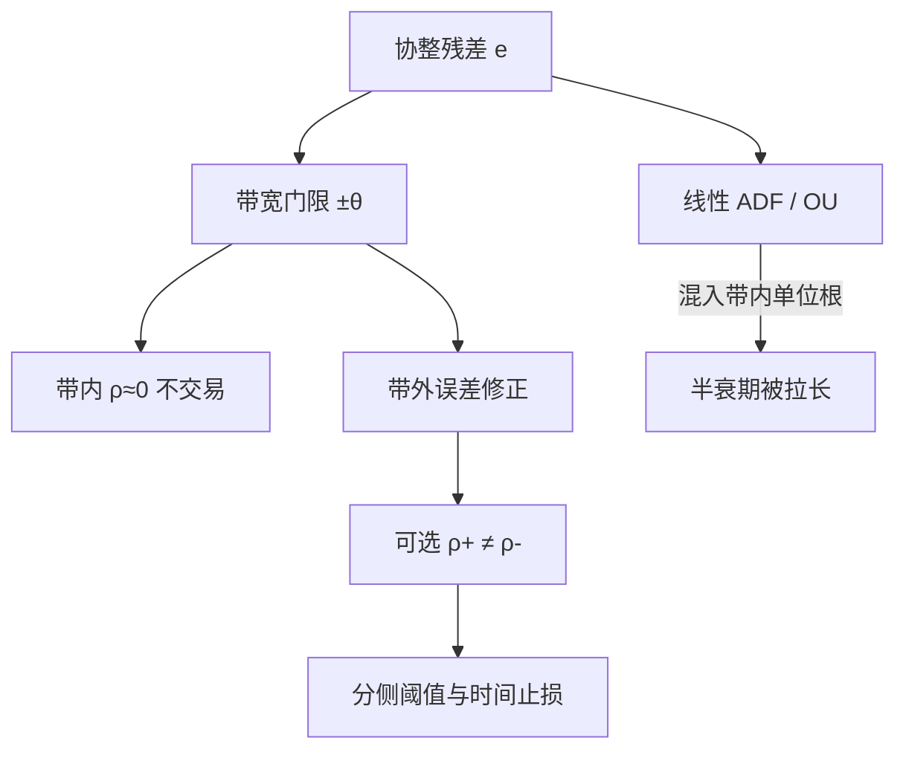

# 门限协整

长期均衡可以存在，但误差修正只在偏离大到跨过某条门限之后才启动；门限以内，交易成本或制度摩擦让残差像单位根，门限以外才表现出均值回复。

<footer>—— Balke and Fomby, Threshold Cointegration, International Economic Review, 1997</footer>

线性协整假定误差修正项 $\lambda z_{t-1}$ 在 $z=0$ 附近也起作用：[OU](/quant/ou-spread) 的拉力与偏离成正比，再小的偏离也有 drift。现实里买卖价差、冲击与持有成本构成一条**无套利带**：带内调整的期望利润盖不住往返成本，理性交易者不交易，残差在带内接近局部鞅。Balke 与 Fomby（1997）把这种「带外才协整」写成门限协整；Enders 与 Siklos（2001）进一步允许正向与负向偏离的调整速度不同。本篇写 TAR / MTAR / 带宽门限，以及它如何改写线性半衰期与 [2σ 阈值](/quant/half-life-bands)——启发式开仓倍数有时只是在估计那条带，而不是在估计 OU 的平稳标准差。

## 问题

Engle–Granger 的第二步是残差 ADF：$\Delta\hat e_t=\rho\hat e_{t-1}+\cdots$。$\rho<0$ 表示线性调整。若真实过程是

$$
\Delta e_t=\rho_1 e_{t-1}1_{\{e_{t-1}>\theta\}}+\rho_2 e_{t-1}1_{\{e_{t-1}\le\theta\}}+\cdots,
$$

或更常见的三体制带宽：$\lvert e\rvert<\theta$ 时 $\rho=0$，$\lvert e\rvert>\theta$ 时 $\rho<0$，则标准 ADF 把带内的单位根行为与带外的回复混成一个 $\hat\rho$，势下降，半衰期被拉长，看起来「协整很弱」。你可能丢掉一对其实在大偏离时回得很快的名字，或反过来用全样本 $\hat\rho$ 在带内频繁交易、专门支付成本。

非对称同样常见：低估的腿因做空约束调得慢，高估的腿调得快；或库存后的商品价差在正负两侧回复不同。线性 OU 无法表达这种 $\kappa^+\neq\kappa^-$。问题是把门限写成可估计的参数，并区分「统计上显著的门限」与「门限是否等于你的往返成本」。

### TAR、MTAR 与带宽

TAR（门限自回归）用 $e_{t-1}$ 的水平穿越 $\theta$。MTAR（动量门限）用 $\Delta e_{t-1}$ 的符号：对「正在走扩」与「正在收敛」给不同 $\rho$，Enders–Siklos 用它捕捉非对称调整。带宽（band-TAR）设两个门限 $\pm\theta$，中间 $\rho=0$，两端 $\rho<0$，最接近交易成本叙事。Balke–Fomby 的两步直觉与 EG 平行：先估协整向量（可用线性 EG，在门限下仍一致但有效性差），再对残差做门限单位根检验。系统 VECM 也可以让 $\alpha$ 依赖门限，但识别更重。

门限变量必须可观测且预先指定，通常就是价差自己或其滞后。若用「未来才知道的体制标签」当门限，检验作废。这与 HMM 相反：HMM 的状态不可观测，门限模型的状态由 $e_{t-1}$ 直接读出。

## 方法

**估计。** 在候选 $\theta$ 的网格上最小化 SSR 或最大化似然（Chan 的超一致门限估计）。修剪两端，避免门限把样本切成 5 个点。带宽模型的 $\theta$ 可从成本日历来：令 $\theta$ 至少等于往返有效价差加冲击的价差单位，再在其附近搜；完全自由搜 $\theta$ 往往会贴到样本内最大的一次偏离，过拟合。

**检验。** Enders–Siklos 提供阈值协整的临界值：联合 $\rho_1=\rho_2=0$ 对「至少一侧调整」，以及 $\rho_1=\rho_2$ 的对称性检验。Balke–Fomby 讨论标准 EG 在门限下的势。实务应报告：线性 ADF、对称门限、非对称门限，并预先指定用哪一个做形成期筛选。不要三类都跑再挑能让配对进交易期的那个。

**与 OU 的局部接口。** 带外仍可用线性 OU 近似，但平稳分布不再是单一高斯：质量在带内堆积，带外指数衰减。用全样本 $\sigma/\sqrt{2\kappa}$ 当 1 倍标准差会低估带内停留时间、高估「几倍 $\sigma$ 才极端」。开仓阈值应明确写成「在门限 $\theta$ 之外再加缓冲」，而不是「$k$ 倍线性 OU 的 $s$」。半衰期只在带外有定义；报一个全样本 $\ln 2/\hat\kappa$ 会把带内死区算进平均等待。

### 做空约束与单边调整

A 股与若干市场的做空摩擦，使「高估股票、做空它」的调整慢于「低估股票、做多它」。MTAR 或 $\rho^+\neq\rho^-$ 的 TAR 是为这种制度写的。检验若拒绝对称，交易规则应对两侧使用不同 $k$ 与不同时间止损：慢的一侧更依赖时间止损与更宽的止损，因为 OU 拉力在那一侧不可靠。这不是「发现了 alpha 不对称」，而是承认制度。把非对称当成可以无限制做多慢侧、做空快侧的许可，会在借券失败时把纸面 $\rho$ 变成不可执行的 $\rho$。

## 机制

机制是固定成本或制度带。无摩擦时，任何偏离的瞬时夏普随 $\lvert z-\mu\rvert$ 上升，最优是连续交易（见 [OU 最优停时](/quant/ou-optimal-stopping) 在 $c\to 0$ 的极限）。有往返成本 $c$ 时，带 $(-c',c')$ 内的期望收敛不够付摩擦，均衡可以允许残差在带内扩散。门限协整把这条带写进 DGP，而不是只写进交易规则：即使你不交易，价格本身也可能在带内不调整——因为边际套利者面对同样的 $c$。于是「市场价差」与「你的执行价差」可能不同：你的冲击更大，你的无套利带更宽，用市场残差估出的 $\theta$ 会对你过窄。

非对称调整的机制包括：存货约束、做空供给、指数套利只能在成份股可借时工作、商品的库存非负。线性误差修正把这些平均掉，看起来像较小的 $\lvert\lambda\rvert$。

门限估计超一致，不代表你能在日频 250 点上精确知道 $\theta$。短样本里 $\hat\theta$ 会跟着两三次大偏离走。形成期应把 $\theta$ 的网格钉在成本的函数上，让数据只在窄范围内微调。

### 与结构断裂、HMM 不要抢同一段路径

价差若在某年之后再也不回带内，那是协整破裂或 $\beta$ 换了，不是 $\theta$ 变大。门限模型没有「永久换原点」的参数，会把破裂拟合成极大的 $\theta$ 或接近零的 $\rho$，样本内 SSR 好看，样本外爆炸。应先用 GH / CUSUM 排除台阶，再在稳定段估门限。HMM 可以让 $\kappa$ 随隐状态变，不要求门限可观测；若你相信调整由价差水平触发，门限更透明，也更难把未来信息漏进状态。

## 边界与工程取舍

多门限、多滞后的 SETAR 很容易把噪声拟合成「深层体制」。$K>3$ 的门限对日频配对通常过度。协整向量若时变，残差的门限是对错误 $z$ 估的；应让 $\beta$ 走慢变 Kalman，门限只作用在预测残差上。

不要把 $\hat\theta$ 当天穿越当成比 2σ 更「科学」的开仓：若 $\theta$ 来自同一形成期的 SSR 最小，它已经用了将用于交易的那条路径的极端值。不要在 tick 上估门限：微观结构弹跳会在买卖价差尺度上制造假门限，那正是 Roll 噪声，不是经济无套利带。

Balke–Fomby 的贡献是把「可能存在的长期关系」与「调整是否线性」分开。拒绝线性 ADF 不等于无协整；接受线性 ADF 也不等于带内可交易。两句话都要写进策略文档。

## 小结

- 门限协整允许长期关系存在，但误差修正只在跨过门限（常因交易成本形成带宽）后启动；带内残差可像局部单位根。
- Balke–Fomby（1997）给出框架；Enders–Siklos（2001）的 TAR/MTAR 检验非对称调整。
- 线性 OU 的半衰期与平稳标准差在门限下误设；开仓应在经济带宽之外再加缓冲。
- 做空约束表现为单边慢调整，规则应对两侧使用不同阈值，且受可借券约束。
- 先排除 Gregory–Hansen 型台阶，再估门限；不要把破裂拟合成巨大 $\theta$。
- 出处：Balke and Fomby, *International Economic Review*, 1997；Enders and Siklos, *Journal of Business & Economic Statistics*, 2001；Tong 的 TAR 装置。
