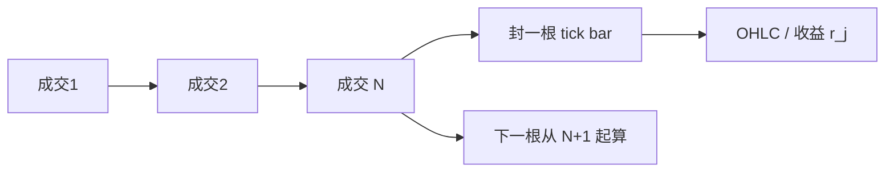

# Tick bars

让每一根 bar 含有相同笔数的成交，而不是相同的墙钟长度。活跃时 bar 变密，清淡时 bar 变稀，采样跟着交易过程走，而不是跟着墙上的分钟走。

<footer>—— López de Prado, Advances in Financial Machine Learning 对信息驱动采样与 tick bars 的论述</footer>

日历一分钟线在开盘可以含几百笔成交，在午后可以含两笔。把这样的序列送进同一套自回归或同一套波动估计，是在假设「一步」的信息含量近似不变。[事件时间](/quant/event-time) 把下标换成成交计数；**tick bars** 是它的等长版本：每 $N$ 笔成交封一根 OHLC（或收益）。López de Prado 把 tick、volume、dollar 以及不平衡 bar 放在同一套「把采样从时钟改到市场活动」的菜单里。本篇只写等笔数这一档：它解决什么、不解决什么，以及 $N$ 如何选。

## 问题

微观结构噪声、已实现波动、方向分类，都对「一步里发生了多少交易」敏感。时钟网格在稀疏时段制造空步，在爆发时段把路径压成一根 K 线，见[不等间隔采样](/quant/irregular-sampling)。tick bars 的目标是：每根 bar 的实验次数（成交笔数）相同，使后续的相关、波动、分类误差在横轴上更可比。它不声称每根 bar 的经济规模相同——一笔 100 股与一笔 10 万股仍各算一 tick。

第二个问题是定义「一笔」。同一毫秒的打印是一笔还是多笔？数据商合并规则不同，$N=1000$ 的墙钟长度可以差一倍。打包成交、冰山露出的一串同价、拍卖里的批量，都会让「笔」不再对应一次独立的主动决策。tick bars 继承了成交带的全部定义问题，只是不再额外叠一层等间隔时钟。

### 每 N 笔封口

按交易所时间排序成交，累计笔数，每满 $N$ 输出一根 bar：开盘为该段第一笔价，收盘为第 $N$ 笔价，高低为段内极值，成交量为段内股数之和。跨 bar 不切开单笔——tick 的单位就是笔，一笔不会跨两根。$N$ 可以按品种固定，也可以按过去一日成交笔数的分数选取，使全日 bar 数大致稳定。后者让热门股与冷门股的日频 bar 数相近，但单根 bar 的墙钟长度仍随日内活跃度变。

tick 在这里指成交笔，不是最小报价单位。最小报价单位是价格网格；tick bar 是采样网格。两个词在交易台口语里经常混用，写配置时必须分开。

## 方法

先[清洗](/quant/tick-cleaning) 成交带，再计数。开盘集合竞价是一笔还是拆成多笔，须预先锁定；通常整场拍卖算一根或排除在连续盘 tick bars 之外。输出序列的下标是 $j=1,2,\ldots$，同时保留每根 bar 的起止时间戳，以便对齐公告与隔夜。收益 $r_j=\log(P_j^{\mathrm{c}}/P_j^{\mathrm{o}})$ 在活跃时段对应很短的墙钟，在清淡时段对应很长；若还要做日历 GARCH，应回到时钟，而不是在 tick 下标上解释「每日」。

与时钟分钟线对照：同一天的 tick bars 数目随活跃度变，收益的异方差通常弱于分钟线——这正是时间变形的目的。检验采样是否「更齐次」：看 $|r_j|$ 的自相关、看 bar 内成交量的变异系数。若成交量变异系数仍然很大，说明等笔数没有等经济活跃，应改 [volume bars](/quant/volume-bars) 或 [dollar bars](/quant/dollar-bars)。

### N 太小则噪声，太大则路径丢失

$N=1$ 就是原始成交，噪声项按笔数堆积。$N$ 等于全日成交笔数，就退化成日线。中间值把微观结构弹跳部分平均掉，也把 bar 内的方向反转抹掉。对限价单执行而言，bar 内路径决定有没有被扫；对波动估计而言，抹掉路径是减少噪声。$N$ 是对象选择，不是有唯一最优的超参数。按品种用过去成交笔数分位数设 $N$，比全局共用 $N=1000$ 更不容易让冷门合约一天只有两根 bar。

## 机制

价格形成按成交次序更新信念，不按墙上的秒。等笔数采样让每一步对应同样多次可能携带方向信息的动作，与序贯交易模型的「一轮」更接近。时钟采样则假设每一分钟发生了结构相同的一轮，这与数据生成过程不一致。López de Prado 强调的统计后果是：活动同步的采样让收益更接近正态、更少异方差，有利于后续的特征与标签在时间上可加。

机制上的代价也清楚。笔数相等不等于信息相等：算法把大单拆成许多小笔，知情者可以在 tick 时钟上制造很多步而不增加真实需求。此时 tick bars 被拆单频率驱动，而不是被信息驱动。这正是体积与金额时钟要补的洞。tick bars 适合「过程按消息计数」的问题（久期、逐笔分类误差），不适合「过程按风险转移规模计数」的问题（冲击、毒性）。

### 多资产无法共用一根 tick 轴

股票 A 每秒 50 笔、股票 B 每秒 2 笔，各自的 tick bars 不在同一墙钟上，协方差要对齐仍需 refresh time 或 Hayashi–Yoshida。tick bars 不自动解决 Epps 效应。强行用 A 的封口时刻去抽 B 的 last 价格，等于把 B 拉回 previous-tick，稀疏一方仍然陈旧。多资产已实现协方差不应只因为单资产改用了 tick bars 就声称同步问题消失。

同一毫秒多笔打印：若计数器把它们当成 $N$ 笔，高频品种的 bar 会在爆发里瞬间封完；若先按时间戳合并再计数，又回到「何为一笔」的契约。合并规则必须写进采样文档，否则 $N$ 不可复现。

## 边界与工程取舍

隔夜、停牌、集合竞价应切断计数，不要把收盘最后一笔与开盘第一笔连进同一根 bar。多市场合并成交带再数 tick，会把延迟当成额外的笔。期货换月时笔数在新旧合约间跳跃，$N$ 应按合约分别校准。不要把 tick bars 的夏普直接和分钟线策略比：下标不同，持有「一根 bar」的墙钟随机，成本与隔夜风险都变了。

不要声称 tick bars 消除了微观结构噪声——它只改变噪声的抽样方式。不要用 OHLC 分钟线反推 tick bars。执行算法若按 tick bars 下单，必须同时监视墙钟，以免清淡时段一根 bar 跨过风险事件。下一步若关心成交量齐次，转向 volume bars；若关心名义风险齐次，转向 dollar bars；若关心订单流不平衡触发采样，转向 [tick imbalance bars](/quant/tick-imbalance-bars)。

出处：López de Prado, *Advances in Financial Machine Learning*，信息驱动 bars 一章。成交量时钟的思想更早出现在 Easley, López de Prado & O'Hara 的 VPIN 文献。事件时间的一般讨论见 O'Hara 与 Harris。

## 小结

- Tick bars 每 $N$ 笔成交封一根，采样密度随活跃度变化。
- 等笔数不等于等成交量或等名义金额；大单拆细会扭曲 tick 时钟。
- $N$ 决定噪声与路径保留的权衡，应按品种与对象选，而不是全局常数。
- 多资产不共享 tick 轴，协方差仍要对齐。
- 何为一笔、是否合并同毫秒打印，属于采样契约。
- 隔夜与拍卖须切断；不要与时钟策略直接比夏普。
- 出处：López de Prado, *Advances in Financial Machine Learning*。
