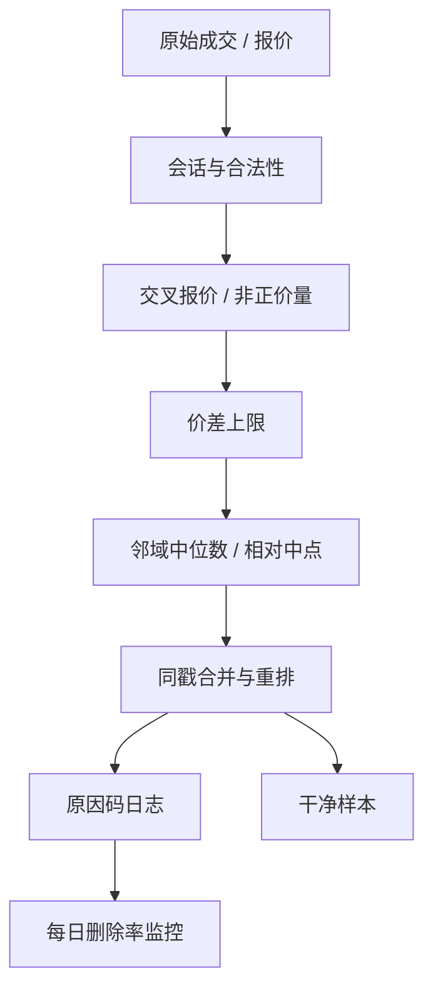

# Tick 数据清洗

    
已实现核要在噪声与信号之间做权衡，但若原始成交里还留着盘外时间、非正价格和离谱跳点，再精致的核也只是在放大录入错误。

    <footer>—— Barndorff-Nielsen, Hansen, Lunde, Shephard, Realised Kernels in Practice: Trades and Quotes, Econometrics Journal 2009</footer>

[上一课](/quant/freq-hft-mid-slow)把体制写成 $(H,$ 容量瓶颈，延迟预算），禁止跨体制挪用实现价差、ILLIQ、撤单率。高频估计却把逐笔成交与报价当成观测；原始 tick 是交易所、数据商、对时与事后撤销叠在一起的日志。缺口是规则化的清洗管道：时间窗、合法性、价差、相对中点偏离、时间戳合并。本课先把数据变成可以进模型的样本，不重讲体制分层。错价、错单、交易所撤销这些带业务含义的异常，放在 [异常成交与错价](/quant/outlier-trades)。

## 问题

一条成交记录至少有时间戳、价格、数量、买卖标志、交易所代码。其中任何一维都可以坏：时间戳落在闭市、价格为零、数量是合约乘数搞错后的天文数字、标志与报价矛盾、同一毫秒重复推送。报价侧还有买大于卖、一档数量为负、价差占价格的 40%。这些点若进入收益平方和，单笔就能主导全日 [已实现波动](/quant/rv-noise)。

清洗的目标不是「让序列看起来平滑」，而是删掉**不可能是真实可成交状态**的记录，同时尽量不删真实的大跳——财报、熔断、跳空开盘。规则必须可审计：同一原始文件、同一规则，应得到同一张干净表。不可审计的「分析师手删」不能进生产。

### 交易与报价要成对处理

许多过滤器要用当时的买卖报价：成交是否在价差外过远、报价价差是否离谱。只清成交、不清报价，中点是脏的；只清报价、成交仍含盘前打印，有效价差会爆炸。时间戳对齐规则（成交对上一笔有效报价，还是对同时刻）属于清洗合同的一部分，应写进配置，而不是写进某个函数的默认参数。

数据商的「已筛选」字段不能替代自己的规则。不同终端对盘前、盘后、拍卖、交叉盘、报表更正的口径不同。复现一篇论文的 RV，应复现它引用的 BHLS 或 Brownlees–Gallo 规则，而不是复现你订阅源里一个名叫 `is_valid` 的布尔列。

## 方法

一套被广泛引用的实务清单（BHLS 对交易与报价的 P/Q 规则，叙述如下，细节以原文表格为准）按层执行，先硬约束后统计约束。

**合法性与会话。** 丢掉时间戳在连续竞价（或研究设定的会话）之外的记录；丢掉价格、买价、卖价非正或数量非正；丢掉买价高于卖价的锁定/交叉报价——除非该市场允许且你明确要研究交叉。拆股、分红日应用复权因子，或在原始价格上估计、事后只对日度加总复权，不要混用。

**价差与偏离。** 丢掉报价价差超过价格一个固定比例（例如 10%，小价股另设）的记录。成交价相对当时中点的偏离超过若干倍「正常价差」或滚动中位数绝对偏差的，标为可疑。BHLS 对成交还有相对邻近成交中位数的过滤器：在一个短窗里，价格远离邻域中位数则删。这一层已经接近异常值规则，阈值应分品种、分时段校准，开盘前几分钟单独放宽或单独处理。

**时间戳与重复。** 同一时间戳多笔成交：或合并量、或保留全部但标记为同一事件。对时到交易所时钟，处理夏令时与时区。乱序到达应按交易所序列号重排，而不是按本地接收时间。

$$
\text{保留}_t
=\mathbf{1}_{\{t\in\mathcal{T}\}}
\mathbf{1}_{\{P_t\gt 0,Q_t\gt 0\}}
\mathbf{1}_{\{s_t \lt  \bar s\}}
\mathbf{1}_{\{|P_t-m_t|\lt \kappa_t\}}.
$$

上式只是层的示意：$\mathcal{T}$ 是会话，$s_t$ 是价差，$m_t$ 是邻域中位数或中点，$\kappa_t$ 是阈值。实现上每层单独留删除日志，以便事后知道 RV 的变化来自哪一条规则。

### 过滤器顺序与日志

先删不可能（非正、闭市），再删报价交叉，再删宽价差，最后才用相对中位数——否则中位数本身被坏点污染，阈值失效。每条被删记录保留原因码。汇总每日删除比例：若某日删掉 30% 成交，应停机检查是否规则过严或数据源中断，而不是继续估 PIN。清洗是数据契约，不是让波动变小的旋钮。

## 机制

硬规则的机制是剔除**支撑集之外**的点：负价格在连续价格模型里概率为零。相对中位数规则的机制是：在短窗内，有效价格的变动受波动约束，录入错误通常是孤立的水平跳、随即回来。真实信息跳往往会在随后的成交里被确认——邻域中位数会跟着走，过滤器不应反复触发。若一条规则在宏观发布的十秒内大量触发，它在删信号。

合并同一时间戳，是把「交易所批量打印」还原成一次撮合事件，避免把同一时刻的多笔当成独立收益、夸大 RV。这与 [不等间隔采样](/quant/irregular-sampling) 里「事件时间」的定义直接相关：清洗后的事件，才是点过程的点。

零收益成交（价格与上一笔相同）一般应保留。它们是真实的时间消耗，对持续时间模型、成交量时钟都有用。把零收益全删，等于按价格变化抽样，会改变 [微观结构噪声](/quant/microstructure-noise) 的表观结构。

### 清洗与噪声模型的边界

清洗删的是错误记录；微观结构噪声模型描述的是真实成交相对有效价格的偏差（价差弹跳、离散报价）。先清洗再估噪声，否则噪声方差被错价主导。反过来，不要指望用已实现核的带宽去「洗掉」未过滤的错价——核是平滑，不是合法性检查。两篇文章必须分开：管道保证样本，模型解释样本。

## 边界与工程取舍

没有对所有市场通用的阈值。美股小数报价之后与之前不同；A 股最小报价单位按价格分档，价差比例规则要跟着变。期货的夜盘、ETF 的申赎窗口、停牌复牌的第一笔，都应有例外表。实时清洗不能用「全日中位数」，只能用因果滚动窗，回测若用全日信息就会前视。

不要把清洗做成让回测更好看的调参：收紧阈值会降低 RV、减少价差均值，策略夏普会假升。规则应在研究计划里预先登记，或至少对阈值做敏感性。不要在清洗阶段做方向分类；分类是下游。不要删除交易所事后确认有效、只是「看起来大」的成交——那是 [异常成交与错价](/quant/outlier-trades) 要单独标记、而不是在合法性层抹掉的对象。

复现时最常见的分歧不是公式，是：是否纳入拍卖、是否纳入奇数股、是否纳入暗池打印、时间戳取撮合时还是报告时。这些选择对有效价差的影响可以大于 Huang–Stoll 两种市场之间的差异。方法部分应写成配置，而不是散文。

## 小结

- Tick 清洗是可审计的分层过滤：会话、合法性、价差、相对偏离、时间戳，而不是把序列画平滑。
- BHLS 的交易/报价规则是已实现核实务的常用合同；顺序是先硬约束，后统计约束，并留删除日志。
- 零收益应保留；同戳合并影响事件时间定义；实时规则必须因果。
- 清洗处理错误记录，不替代噪声模型，也不应删掉真实大跳。
- 阈值与拍卖/暗池口径必须写入配置；它们对下游 RV 与价差的影响经常大于模型选择。
- 出处：Barndorff-Nielsen, Hansen, Lunde, Shephard, *Realised Kernels in Practice: Trades and Quotes*, Econometrics Journal 2009；亦见 Brownlees and Gallo 的高频清洗讨论。
