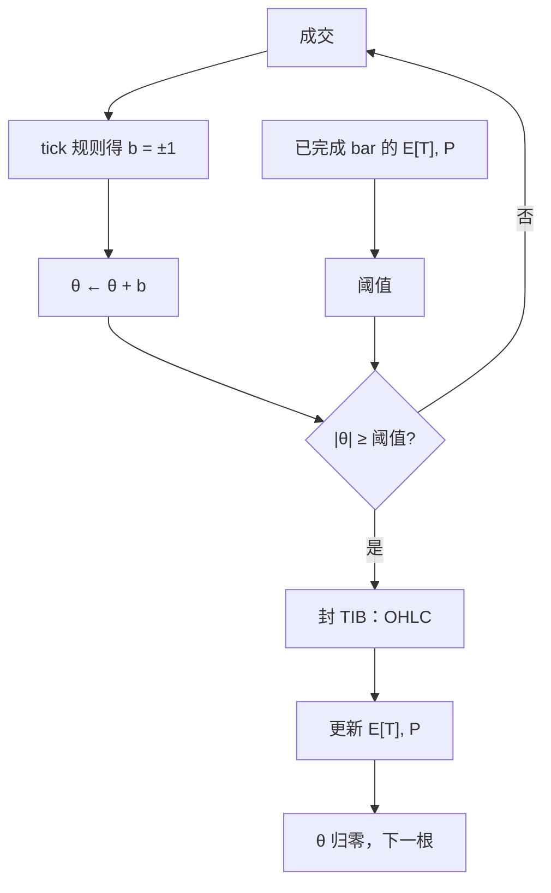

# Tick Imbalance Bars

若买卖方向像抛硬币，累积不平衡按随机游走扩散；一旦同向成交超过按历史期望算出的阈值，就封一根 bar。采样在订单流失衡时自动加密。

<footer>—— López de Prado, Advances in Financial Machine Learning 对 tick imbalance bars 的定义</footer>

前面三档 bars 的边界由**活动规模**触发：笔数、体积、金额。它们在买卖完全对冲时仍按同样节奏封口——市场很忙但没有净方向，你还是会得到一根根 OHLC。**Tick Imbalance Bars (TIB)** 把触发器换成**方向累积**：用 [tick 规则](/quant/tick-quote-rule) 给每笔一个 $b_t=\pm 1$，累加 $\theta_t=\sum b_i$，当 $|\theta|$ 超过「若方向独立所应有的」阈值就封口。López de Prado 把这类叫做信息驱动 bars：信息到来时不平衡变大，bar 变密。本篇写阈值公式、期望笔数的更新，以及它与 [BVC](/quant/bulk-volume-classification) 桶不平衡的差别。

## 问题

等活动采样假设「同样多的笔或量携带可比的信息」。知情交易的微观结构模型不支持这一点：有信息时方向持续，无信息时买卖对冲。固定 $N$ 的 tick bars 会在无信息的高频做市来回里制造大量几乎零收益的 bar，也会在知情单到达时把持续同向拆成许多根，把不平衡稀释到每根 bar 内部。需要一种采样：方向随机时 bar 拉长，方向持续时提前封口，使每根 bar 结束在「不平衡已变得不像抛硬币」的时刻。

TIB 用 tick 规则而不是报价规则，是为了在没有 BBO 的成交带上也能跑。代价是 tick 规则的全部错误：同价切片制造虚假持续，价格回跳制造虚假反转。阈值若用被这些错误污染的历史去估，采样网格会跟着分类噪声走。

### 累积不平衡对上期望阈值

对第 $t$ 笔，tick 规则给出 $b_t\in\{+1,-1\}$（零 tick 回溯，见 tick 规则）。当前 bar 内

$$
\theta_t=\sum_{i=1}^{t} b_i=2\sum_{i=1}^{t}\mathbf{1}_{\{b_i=+1\}}-t.
$$

设该 bar 的期望长度 $E[T]$ 与买方向无条件概率 $P[b=1]$ 来自**上一根已完成 bars** 的指数加权。期望不平衡幅度为 $E[T]\cdot|2P[b=1]-1|$。封口条件：

$$
\lvert\theta_t\rvert \ge E[T]\,\lvert 2P[b=1]-1\rvert.
$$

若历史买卖完全对称，$P=1/2$，右侧为零，第一笔就会封口——实践中要对 $|2P-1|$ 设下限，或把阈值写成 $\max(\bar\theta,\,c\sqrt{E[T]})$，使对称随机游走也要走大约 $\sqrt{T}$ 才触发。书中基准用期望不平衡；实现必须声明对称情形如何避免退化。

$E[T]$ 与 $P[b=1]$ 只能用已封口的 bar 更新，封口之后、下一根开始之前。用正在形成的 bar 去更新期望，阈值会追逐当前不平衡，封口变得路径依赖且难以复现。

## 方法

初始化：用一段 tick bars 或日历样本估初始 $E[T]$、$P$。之后每笔更新 $\theta$，检查阈值，封口则输出 OHLC（开为 bar 首笔价，收为触发那一笔价），并用该 bar 的实际长度 $T$ 与买比例去更新指数加权期望。输出序列的墙钟长度与笔数都随机：有信息时短，无信息时长。必须同时保存 $T_j$、$\theta_{T_j}$、阈值，否则别人无法审计为何在那一笔切开。

对照实验：同一成交带上并排 tick bars（固定 $N=E[T]$）与 TIB。检验 TIB 是否在后续收益绝对值更大、或在公告附近更密。若 TIB 只是在波动高时更密，它可能是已实现波动的代理，而不是独立的「信息时钟」。与 volume imbalance、dollar imbalance 的关系：后两者用 $b_t q_t$ 或 $b_t p_t q_t$ 累积，对大单更敏感；TIB 对拆单更敏感。选哪一个取决于你认为信息写在笔数里还是数量里。

### 对称随机游走必须打补丁

严格按 $E[T]|2P-1|$，当 $P\to 1/2$ 时阈值塌缩。高频做市的无信息时段恰恰接近对称。若不打补丁，TIB 退化成接近逐笔 bars，菜单里就没有「失衡才采样」这一档了。补丁有两种老实写法：给 $|2P-1|$ 设下限 $\pi_{\min}$；或把阈值换成与布朗运动首达时对应的 $c\sqrt{E[T]}$，再单独用 $P$ 做偏斜调整。写进配置的必须是显式公式，不能靠「实践中 $P$ 不会是 1/2」蒙混。

## 机制

知情到达使 $b_t$ 同号持续，$\theta$ 线性增长，很快碰到阈值，bar 封在信息尚未被时钟稀释之前。无信息时 $b_t$ 正负相抵，$\theta$ 像随机游走，需要更长的 $T$ 才碰到与 $\sqrt{T}$ 同阶的边界（在打过补丁的实现里）。于是 TIB 的密度是订单流持续性的函数，这与 PIN 类「有事件日买卖不平衡」同族，但对象是采样网格，不是概率估计。

与 BVC 的差别：BVC 在固定体积桶内用 $\Delta P$ 估计买卖**份额**，桶边界仍由 $V$ 决定；TIB 的边界由不平衡决定，OHLC 是副产品。可以把 BVC 做在 TIB 上，但那是两层规则嵌套，不要叫做「标准 TIB」。与 OFI 的差别：OFI 用簿事件净额预测中点，TIB 只用成交 tick 符号。没有限价簿时 TIB 仍可算；有簿时 OFI 通常更接近价格变化的驱动项。

### 分类错误会改网格本身

普通 tick bars 的边界与方向无关，Lee–Ready 错误只污染 bar 内特征。TIB 的边界就是累积方向，tick 规则的一串同价假持续会提前封口，假回跳会推迟封口。网格成为分类器的函数。因此 TIB 对成交合并规则极度敏感：同毫秒多笔若各算一个 $b_t$ 且价格相同，回溯 tick 会给出长串同号。应先定义何为一笔，再跑不平衡。有官方主动标志时，可用官方 $b_t$ 做「trade imbalance bars」，那已经不是书中的 tick 版，须改名。

指数加权的半衰期决定体制切换有多快。太短，阈值跟着噪声跳，bar 长度剧烈抖动；太长，开盘后仍用昨日午后的 $P$，阈值与当日方向体制错配。半衰期应在若干交易日量级上交叉验证，不要用含测试日的密度去选。

## 边界与工程取舍

开盘拍卖没有逐笔 tick 路径，TIB 应从连续盘第一笔重新初始化 $\theta$。涨跌停的同价长串会让 $|\theta|$ 线性上涨，TIB 在停板上疯狂封口，收益全是零——必须冻结。多市场合并成交带会把跨场所的价格跳当成 tick，虚假不平衡。不要把 TIB 的 bar 计数直接当 VPIN：VPIN 有固定 $V$ 与滚动绝对不平衡；TIB 没有固定体积。

不要声称 TIB 采样了「信息事件」却拿同一根 bar 的 $\Delta P$ 去验证——边界由方向累积触发，方向与价格变化本就相关，验证是循环的。合法的检验是：TIB 封口之后**后续**一段时间的波动、价差、深度是否恶化，且对照固定 $N$ 的 tick bars 在相同墙钟上没有同样信号。执行上 TIB 的墙钟随机，风控必须另有日历超时。

出处：López de Prado, *Advances in Financial Machine Learning*，imbalance bars 一节。Tick 规则见 Lee & Ready, 1991。成交量时钟与批量分类见 Easley, López de Prado & O'Hara。TIB 是采样装置，不是毒性指标的成品。

## 小结

- TIB 在 tick 方向累积不平衡超过历史期望阈值时封 bar，失衡时加密、对冲时拉长。
- $E[T]$ 与 $P[b=1]$ 只用已完成 bar 更新；对称情形必须给阈值打补丁以免退化成逐笔。
- 边界依赖分类器，tick 规则错误会移动网格本身。
- 与固定 $N$ 的 tick bars、与 BVC 体积桶、与 OFI 不是同一对象。
- 停板、拍卖、跨市场合并会制造虚假持续，应切断或冻结。
- 用 bar 内价格变化去「验证信息」是循环；应看封口后的后续市场质量。
- 出处：López de Prado, *Advances in Financial Machine Learning*。
