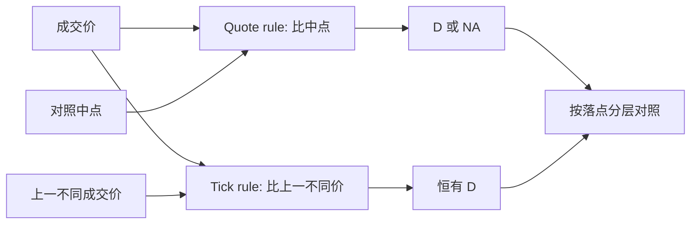

# Tick Rule 与 Quote Rule

报价规则问成交打在中点的哪一侧；tick 规则问价格相对上一笔不同成交是涨还是跌。它们可以单独使用，也可以像 Lee–Ready 那样串联，但单独使用时的错误结构并不相同。

<footer>—— 报价与 tick 检验的经典表述见 Lee & Ready, Journal of Finance, 1991；单独规则的精度对照见 Ellis, Michaely & O'Hara, Journal of Financial and Quantitative Analysis, 2000</footer>

[Lee–Ready](/quant/lee-ready) 是组合：能用中点就用中点，否则退回 tick。许多研究与交易系统并不走组合，只跑其中一条。Quote rule（报价规则）只用 $P$ 与 $M$ 的不等式，平价标未知或丢掉。Tick rule（tick 规则）完全不看报价，只看成交价序列的涨跌。Ellis、Michaely、O'Hara 表明：打在买一卖一上时报价规则更准，中点附近 tick 规则有时反而更稳。本篇把两条规则写成可替换的分类器，说明何时不该把组合算法的正确率安到单条规则头上。

## 问题

方向分类的输入可以是报价、可以是成交价序列、也可以是两者。有报价却不用，是在丢信息；没有报价硬去对中点，是在编数据。问题是：在你实际拥有的字段上，哪一条规则的偏差更适合下游任务。估[有效价差](/quant/effective-realized-spread) 必须用中点，报价规则与有效价差共享 $M$，分类错误与被估参数纠缠；估成交量不平衡、做 tick 时钟上的买卖计数，tick 规则可以在没有 BBO 的历史成交带上运行。

第二条冲突是平价。报价规则在 $P=M$ 时没有判决；若把平价全标成买或沿用上笔，会制造偏差。tick 规则没有平价问题，但有零 tick：价格不变时要回溯，回溯过长会把一串冰山切片标成同一个远古方向。规则选择就是在「中点无判决」与「旧价格污染」之间选偏差。

### 两条规则的操作性定义

报价规则：

$$
D_t^{\mathrm{Q}}=
\begin{cases}
+1, & P_t>M_{t-}\\
-1, & P_t<M_{t-}\\
\text{NA}, & P_t=M_{t-}
\end{cases}
$$

tick 规则：设 $P_{t-k}$ 为最近一个 $P\neq P_t$ 的成交价，

$$
D_t^{\mathrm{T}}=\mathrm{sign}(P_t-P_{t-k}),
$$

零差异继续回溯。有人在 $P_t=P_{t-1}$ 时直接复制 $D_{t-1}$，这与「回溯到不同价再判」在冰山串上等价，在中间插入了其他价格后又分叉。写代码时必须锁一种。对照中点 $M_{t-}$ 的时钟约定与 Lee–Ready 相同：因果或历史滞后，不可混用。

tick 规则不需要报价，因此能在早期只有成交打印的磁带上运行。这不是优点本身：没有报价意味着你也无法算有效价差，只能算带符号成交量。字段少，可回答的问题也少。

## 方法

先在有主动标志的子样本上分别跑三条：仅报价、仅 tick、Lee–Ready 组合。按成交落点分层：卖价附近、买价附近、中点、价差外。Ellis 等人的分层结论应作为预期，而不是当作你样本里的数字：报价规则在外侧准，tick 规则在中点不那么糟，组合整体最好但不是每层都最好。没有主动标志时，只能做一致性：两条规则的分歧率、分歧时后续中点移动的符号——这是间接证据，不能当正确率。

下游要预先声明。PIN 的 $(B,S)$ 对 tick 规则可行，但分类噪声抹平不平衡。冲击回归若 $y=D\cdot v$，tick 规则在没有 BBO 的期货打印上常用；一旦有 BBO，应改报价或官方标志。[批量分类](/quant/bulk-volume-classification) 不是第三条逐笔规则，它在桶上工作，不要与 tick 规则逐笔比正确率。

### 零 tick 与报价修订

连续同价成交时，tick 规则输出一长串相同 $D$。若这些成交真是同一主动方拆单，符号是对的；若是双向在同一价格上的交叉，符号是错的。报价规则不受这条序列依赖，但受报价修订依赖：成交前一毫秒的 BBO 若已被知情撤单改写，中点已经含信息，$P$ 相对 $M$ 的位置会把主动方标反。高频里两条规则的错误来源是错开的：一条怕成交串，一条怕报价抢跑。

## 机制

报价规则嵌入做市机制：BBO 是针对主动流的条款，价格相对中点的位置是流动性消耗的几何。tick 规则嵌入的是随机游走加买卖弹跳：上涨成交更像主动买把价格推到新的成交价。Roll 模型里成交价在买卖之间跳，tick 规则会把回跳读成方向反转，这在没有信息时是对的——主动方确实在两边轮换。有信息时价格持续同向，tick 规则给出持续同号，也合理。它失效的区间是「报价已经走了、成交价还没走」或「成交价走了、报价因存货而走」。

组合算法默认报价优先，是因为外侧成交的几何更硬。把优先顺序反过来（先 tick 后报价）会得到另一个分类器，文献里不叫 Lee–Ready。不要把任意串联都贴 1991 的标签。官方主动标志则根本不是规则，是撮合记录；它仍可能因隐藏单、跨境、报告延迟而与「经济主动方」不一致，但那是数据契约问题，不是 tick/quote 的公式问题。

### 没有中点时不要假装有报价规则

期货、某些外汇打印、早期磁带只有成交。此时唯一诚实的逐笔规则是 tick。用结算价或日中点去给日内每一笔做报价规则，中点几乎不变，$D$ 变成「高于还是低于一个全日常数」，那是另一个对象。成交量时钟上的 BVC 用桶收益，也不要改名为 tick 规则。

最小报价单位很大时，成交很少落在中点，报价规则覆盖率高；tick 很小或允许中点匹配时，NA 比例上升。报告正确率必须同时报告覆盖率，否则「报价规则 95% 正确」可能只是因为丢掉了所有难判的中点单。

## 边界与工程取舍

不要用日历一分钟 OHLC 的涨跌当 tick 规则——那已经聚合，丢失了分钟内的方向序列。不要把 tick 规则的 $D$ 乘进有效价差公式却用另一套延迟的中点。多交易所合并成交带再跑 tick 规则，会把不同场所的价格序列接成虚假涨跌；应分场所判方向再汇总。A 股涨跌停时价格可以一连串贴在同一限价上，tick 规则给出极长的同号，经济含义是停板一侧的排队，不是持续的主动消耗。

与 Lee–Ready 的关系：组合是工程默认，不是理论最优。你的样本若中点成交极少，报价规则几乎等于组合；若没有报价，tick 规则是唯一选择。写方法时用规则的名字，不要一律写「用 Lee–Ready 分类」却在代码里只比较了相邻成交价。

出处：Lee & Ready, 1991，给出报价检验与 tick 检验的组合用法；Ellis, Michaely & O'Hara, JFQA 2000，给出分层精度。Hasbrouck 的经验市场微观结构讲义把两条规则当作方向分类的标准零件。

## 小结

- 报价规则用成交价相对中点，平价无判决；tick 规则只用成交价序列的涨跌。
- 外侧成交报价规则更准；中点与无报价样本依赖 tick 规则。
- 覆盖率与正确率必须一起报；丢掉平价会让报价规则看起来更准。
- 错误来源错开：tick 怕同价切片，报价怕 BBO 在成交前被改写。
- 没有 BBO 时不要伪造全日中点来跑报价规则。
- 组合算法叫 Lee–Ready；单条规则应叫自己的名字。
- 出处：Lee & Ready, Journal of Finance, 1991；Ellis–Michaely–O'Hara, 2000。
