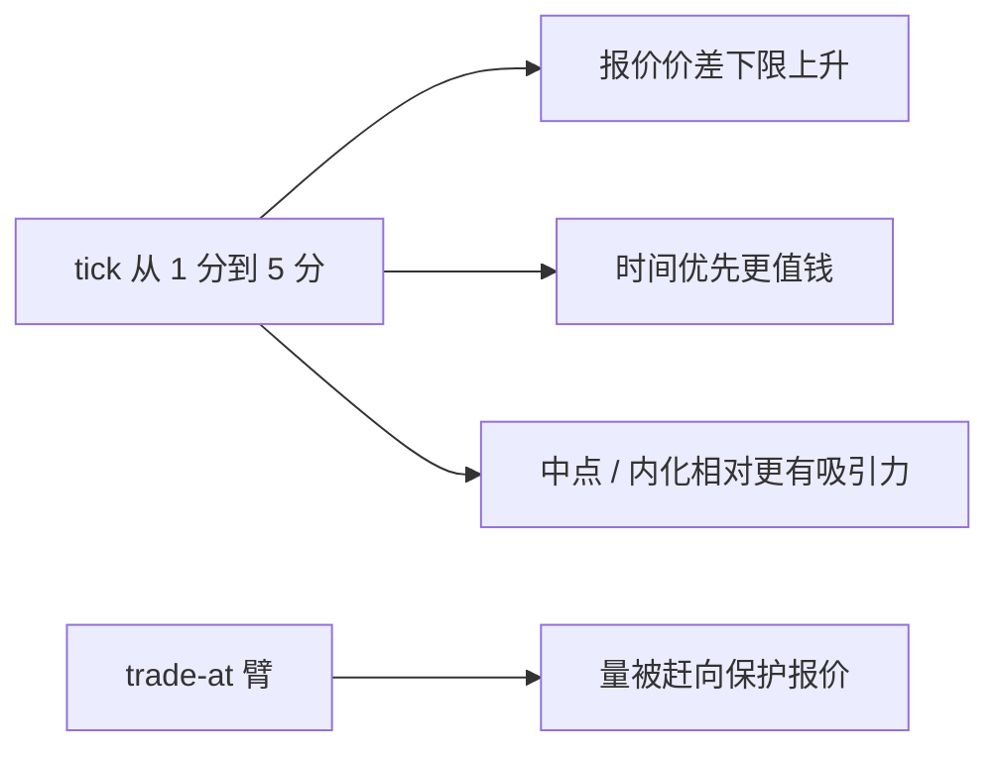

# tick size pilot 实证

把小盘股的最小报价单位从一分钱抬到五分钱，是一次罕见的栅格实验：报价价差几乎必定变宽，真正要测量的是展示深度、有效成本与发现，有没有换来可成交的厚度。

<footer>—— SEC Tick Size Pilot Program（2016–2018）；Albuquerque, Song and Yao, Journal of Financial Economics, 2020；对照 Harris, Review of Financial Studies, 1991</footer>

[订单保护](/quant/reg-nms-order-protection)里的 Rule 612 已经禁止一美元以上股票的亚分*报价*。缺口是反方向的政策实验：对一批小盘股，强制把报价 tick 从 $\$0.01$ 放到 $\$0.05$。[最小变动价位](/quant/tick-size-regime) 写过相对 tick 的机制；本课只写 Pilot 的识别与读数，不把 Harris 的聚类论文再讲一遍，也不外推成「所有股票都应加粗」。

## 问题

小数化之后，许多小盘股长期钉在一个 tick，队列价值高，公开做市的名义价差收入却薄。Pilot 的政策叙事是：更粗的栅格让做市商愿意展示更多深度，便于机构积累小盘仓位。理论预测并不单向。Harris 早已说明粗栅格抬高价差下限、加剧时间优先竞赛；细栅格摊薄每档深度、鼓励一 tick 插队。有效价差还受中点成交、暗池与[批发商内化](/quant/retail-wholesaler) 影响——公开 $n=1$ 被钉住时，经济步长可以仍在包络内。问题是：报价价差上升多少、有效价差是否同幅上升、深度增加是否可重复成交，以及「trade-at」一类附加规则有没有把量从暗处赶回明簿。

### 分组不是单一处理

Pilot 把合格小盘股随机（近似）分到对照与处理组。处理组里还拆过：仅加宽 tick、加宽加 trade-at（限制以劣于保护报价的价格在场外成交）等。把所有处理组捏成一个虚拟变量，会把「栅格」与「强制明簿优先」混成一剂。读任何一张表，先问它估计的是哪一个处理臂。

Pilot 同时发生在 maker-taker、碎片化与 HFT 做市的均衡里。识别靠组间差，不靠与 1990 年代小数化前后的长差对比。

## 方法

事件研究的最小集合：报价价差、有效价差、实现价差、近端深度（股数与金额）、成交量、明暗份额、以及短窗价格冲击。必须分约束状态：处理前已经 $n=1$ 的名字，加宽几乎是把下限从 1 分抬到 5 分；处理前价差常大于 5 分的名字，栅格可能仍不绑紧。Albuquerque、Song 与 Yao（2020）把流动性冲击的价格效应从单纯「价差变宽」里拆出来：若深度真正改善，资产价格应反映更低的预期交易成本；若只是制度租金，价格应下跌。Griffith 与 Roseman 等报告市场质量指标对处理臂的异质性。不要只用报价价差当成功标准。

跨所：相对 tick 变粗后，中点与亚 tick 通道更有吸引力，暗份额与零售改善可能上升，公开深度的「看起来变厚」要扣掉不可成交的堆量。这与 [pro-rata 假厚](/quant/price-time-pro-rata) 同一读法。

## 机制

加粗 tick 是把 Stoll 处理成分的下限抬高：即使逆向选择很小，买卖也不能报到 1 分。展示深度可以增加，因为同一价位上的协调焦点更粗，排队租金上升，做市商更愿意占位。有效成本是否下降，取决于这笔深度在信息到达时撤不撤、以及有多少成交改走中点。trade-at 试图切断「公开报价、暗处成交」的搭便车，把保护规则从「不能更差」推进到「不能绕开展示」。它改变的是暗池与批发商的相对吸引力，不只是格子宽度。

对放置：Roşu 式近端挂单在 5 分格子上选择更少，队头竞赛更像期货粗 tick。把股票 FIFO 切片算法原样搬到 Pilot 期小盘股，会低估占位价值、高估一 tick 改善的机会。

## 边界

样本是当时规则下的美国小盘股，2016–2018 年，不能外推到大盘、不能外推到加密细 tick、也不能当成 A 股分档 tick 的估计。Pilot 结束后栅格回到 1 分，长期均衡未必等于试点窗。SEC 工作人员分析与学术论文的处理定义、股票筛选并不完全相同，复制必须对齐名单。下一课换一把制度刀：熔断停止连续协议本身，而不是改格子。

回测若在 Pilot 名单上用统一 1 分假设生成报价，会凭空制造当时不合法的价差。

栅格约束的是连续交易里的合法价格。下一课的熔断约束的是连续交易能否发生：阈值、暂停时长与重开协议，比 tick 更硬地切开螺旋中的订单流。

Harris 的比较静态在试点里被估计，不因某一个处理臂的符号而作废；失败的是把「加粗」当成单一质量开关。

## 小结

- Pilot 是栅格实验，不是「流动性好坏」的单一开关；先分处理臂，再分是否 tick 约束。
- 报价价差上升是设计直接量；有效价差、可成交深度与资产价格效应才是质量。
- trade-at 改变明暗分流，与单纯加宽 tick 不是同一处理。
- 出处：SEC Tick Size Pilot 计划与工作人员分析；Albuquerque, Song and Yao, *JFE*, 2020；Griffith and Roseman, *Journal of Corporate Finance*, 2019；机制见 Harris, *RFS*, 1991。
