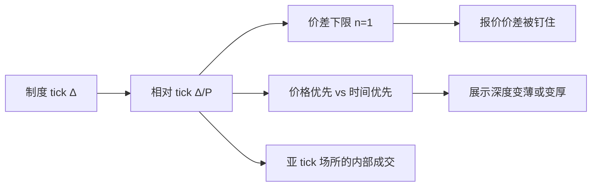

# 最小变动价位 tick

最小报价单位把价格变成栅格上的点。栅格太粗，价差被制度卡住；栅格太细，时间优先被一连串一 tick 的插队削弱。

<footer>—— Harris, Stock Price Clustering and Discreteness, Review of Financial Studies, 1991；对照 SEC Tick Size Pilot Program 的公开设计</footer>

[Maker-taker 费用](/quant/maker-taker)说明名义价差可以被回扣压到一个 tick。本课的缺口是：这一个 tick 本身是制度选的，不是自然常数。Harris 把价格离散与聚类写成微观结构对象；Angel 讨论最小报价单位如何改变深度与报价竞争。美股小数化、Tick Size Pilot、A 股按价格分档的 tick、日本与港股的阶梯 tick，都是同一旋钮的不同刻度。后课的手数与价格栅格会把数量维补上；本课只处理价格维的最小步长。

## 问题

连续协议里，买卖价差的下限是一个 tick $\Delta$。相对 tick $\Delta/P$ 才是经济量：同样 0.01，对 5 元股票是 20 个基点，对 500 元股票是 0.2 个基点。先修课的价差分解假定 $s$ 可以随处理成本与信息连续变窄；一旦 $s$ 被钉在 $\Delta$，分解里的处理项会被制度项替代。做市商不能再靠「再窄半个 tick」去抢队列，只能靠时间优先、隐藏单、或换到允许更细报价的场所。

另一方向：$\Delta$ 太小，报价可以以一 tick 的改善插到队头，时间优先被价格优先频繁改写，深度在每个价位变薄，消息流变吵。Tick Size Pilot 把一批小盘股强制放大 tick，问的就是：更粗的栅格是否换来更深的展示深度，以及这笔深度是不是可成交的。问题不是「tick 应该是多少」，而是相对 tick 如何改写价差下限、队列价值和多场所报价竞争。

### 名义 tick、相对 tick 与约束价差

记报价价差 $s=n\Delta$，$n=1,2,\ldots$。$n=1$ 的股票是 tick-constrained：观察到的价差不能再窄，有效价差的改善只能来自中点成交、暗池或零售内化，而不是来自更窄的 BBO。$n$ 经常大于 1 的股票，tick 不是紧约束，价差主要由信息和存货决定。横截面比较必须用 $s/P$ 或 $n$，不能用「都是两分钱」。A 股高价股与低价股落在不同 tick 档，同一日历日里相对 tick 可以差一个数量级。

费用按股或按金额计，tick 按价格计。Maker-taker 回扣以分/股计时，一个 tick 的价差收入与回扣的相对权重随股价变化。高价股更容易被压到 $n=1$，因为同样的回扣占价差比例更大。

## 方法

描述一只股票的 tick 制度：当前 $\Delta(P)$、是否阶梯函数、哪些场所允许中点或亚 tick 改善。计算约束频率：BBO 等于一 tick 的时间占比、成交发生在 BBO 上的占比。深度报「一 tick 档的股数」和「若干基点内的金额」两套，前者对做市商的队列有意义，后者对机构冲击有意义。Pilot 或制度变更用事件研究：变更前后的报价价差、有效价差、深度、换手、以及小单大单的份额。不要只用报价价差：约束变紧时报价价差可能上升（被钉在新的 $\Delta$），有效价差因中点成交增加而不一定同幅上升。

跨市场上市时，tick 可以不一致。同一公司在两处的相对 tick 不同，价格发现会偏向栅格更细或费用更便宜的场所，这与后课[市场分割](/quant/market-fragmentation)衔接。方法是把相对 tick 当成场所特征，而不是证券特征。

### 聚类不是噪声

Harris（1991）记录价格在整数、半数、整 tick 上的聚类。离散栅格加上人类与算法的协调，使某些价位更厚。聚类随 $\Delta$ 变：小数化之后整分上的聚类减弱，但未消失。把聚类当数据错误洗掉，会删掉真实的深度堆积。把聚类当「非理性」，又忽略了协调均衡：在粗栅格上，整 tick 就是唯一合法点。清洗应删错价，不删合法栅格上的堆量。

## 机制

tick 通过三条通道进入价格形成。第一，价差下限：约束股票的买卖价差不能低于 $\Delta$，逆向选择很小的名字也被制度加了一层租金。第二，队列抢占：更细的栅格让价格优先更频繁地压过时间优先，挂单的期权价值下降，展示意愿可能下降。第三，多场所竞争：允许亚 tick 的暗池或零售批发商，可以把成交放到公开 BBO 内部，公开簿的 $n=1$ 不再代表真实可成交价差。Angel、Harris 与 Spatt 把小数化后的深度变薄与报价竞争写进市场结构事实，而不是写成「流动性变好了」的单一叙事。

做市收入在约束股票上更像赚一个 tick 加回扣，而不是赚信息租金。信息事件到来时，他们用撤单和拉宽 $n$ 来保护自己，而不是把 $\Delta$ 本身变大——$\Delta$ 是规则。因此 tick 制度改变的是平静期的价差底，不一定改变公告窗口的价差峰。

不要把 [Roll](/quant/roll-model) 估出的有效价差与 $\Delta$ 直接相减当「非制度成分」。Roll 在 $n=1$ 且中点成交很多时，协方差结构已经不是连续买卖回跳。先看约束频率，再决定 Roll 是否适用。

### 相对 tick 随股价与拆股跳档

固定名义 $\Delta$ 下，股价翻倍则相对 tick 减半，约束频率下降；拆股则反向。制度没变，栅格的经济紧度变了。事件研究若跨过拆股而不分段，会把公司行为当成 tick 政策的效果。

## 边界

Tick Size Pilot 的结论绑定小盘股、绑定试点期的路由与费用，不能外推成「所有股票都应放大 tick」。加密市场的 tick 往往极细，约束来自 lot 与手续费而非 $\Delta$。外汇有报价小数位惯例，与股票 tick 法律含义不同。本课不讨论如何用一 tick 插队去抢做市商队列的交易手法；那是规则允许的价格优先，研究只计量它如何改变深度分布。

下一课补数量维：即使价格可按 $\Delta$ 走，订单还要满足手数。两维一起才构成可提交的栅格。

A 股 tick 随价格分档，回测里的「涨 1%」在不同价格区对应不同 tick 数。信号若用 tick 计数而不是收益率，必须随股价切换档位。

## 小结

- 经济对象是相对 tick $\Delta/P$，不是名义分毫。
- $n=1$ 时价差下限是制度，价差分解的处理项被钉住。
- 栅格变细削弱时间优先、摊薄每档深度；变粗可能加展示深度，但不保证有效价差同向变化。
- 费用、暗池与中点成交会让公开 tick 不再等于经济价差步长。
- 价格聚类是离散栅格上的协调，不是默认脏数据。
- 出处：Harris, *RFS*, 1991；Angel 对最小报价单位的讨论；SEC Tick Size Pilot 公开文件；Angel, Harris and Spatt 对小数化后市场结构的综述。
