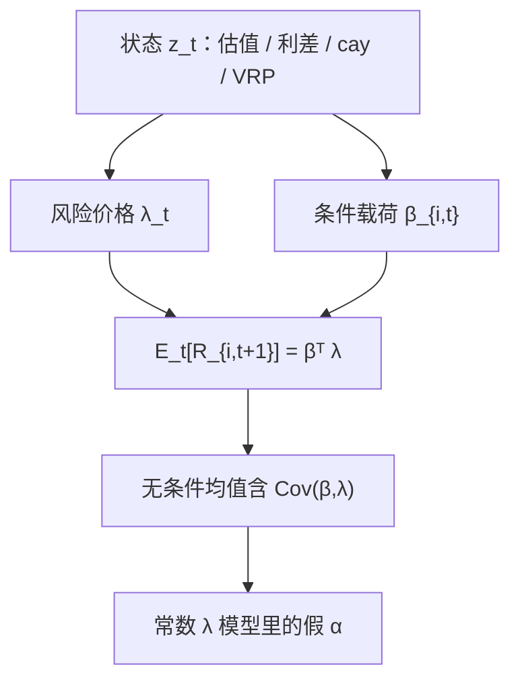

# 风险溢价时变

    
价格的波动若大量来自贴现率新闻而不是现金流新闻，则预期收益本身必须随时间变；用一个常数市场溢价去乘全样本 β，会把这块变动误读成定价误差。

    <footer>—— Campbell–Shiller 的收益分解；Fama & French 对期限利差与违约利差预测收益的证据</footer>

无条件因子模型把 $\lambda$ 写成常数：市场每月六个点、价值每年四个点，像一条物理定律。股票溢价、期限溢价、信用溢价在十年尺度上会走完一轮，危机里的预期收益可以在几个月内翻倍。时变风险溢价（time-varying risk premia）说的不是 β 在变——那是[条件 CAPM](/quant/conditional-capm) 的载荷侧——而是风险**价格** $\lambda_t$ 在变。本篇写如何从可预测性与估值比率里读出 $E_t[R_{t+1}]$，它与时变 β 如何一起进入无条件均值，以及因子择时为什么不是把 FM 斜率对宏观变量再回归一次那么简单。

## 问题

若预期收益恒定，价格变动应主要来自现金流新闻；股利价格比应几乎不预测收益，只预测股利增长。经验相反：美股的 $d/p$、期限利差、违约利差、cay 对未来超额收益有样本内预测力（样本外弱得多，见 Goyal–Welch）。Campbell–Shiller 把收益线性化为现金流新闻与贴现率新闻：贴现率新闻大，就意味着 $E_t[R_{t+1}]$ 在动。资产定价若坚持常数 λ，就必须把所有可预测性推进 α 或推进「泡沫」，无法与 ICAPM、习惯形成、时变风险厌恶共存。

另一侧是截面。Jagannathan–Wang 指出，即使每一期都按条件模型定价，只要 β 与 λ 同向变动，无条件回归也会留下截距。价值股在坏状态 β 升高、同时坏状态的风险价格也升高，无条件价值溢价可以完全是时变价格与时变载荷的协方差。问题因此有两层：时间序列上如何估 $\lambda_t$；截面上如何避免把 $\mathrm{Cov}(\beta_t,\lambda_t)$ 叫成异象。

### 可预测性不等于可交易的择时夏普

预测回归 $r_{t+1}=a+bz_t+e_{t+1}$ 里 $b\gt 0$ 只说明条件均值随 $z$ 变。$z$ 高度持续（估值比率接近单位根）时，Stambaugh 偏误让 $b$ 在有限样本里偏大，$t$ 统计量不可用朴素值。样本外 $R^2$ 接近零并不立刻杀死时变溢价：风险价格可以变，但变的部分难以用线性、用单个 $z$、用实时可得的 vintage 抓住。把样本内 $b$ 乘杠杆做成「择时策略」，会把偏误、数据修订与体制转换一起变现。

$$
E_t[r_{t+1}]=a+bz_t, \qquad \lambda_t=\lambda_0+\lambda_1 z_t.
$$

后者是把同一句话写进因子模型：市场溢价、或某个潜因子溢价，是状态的仿射函数。$z_t$ 必须属于 $\mathcal{F}_t$，不能用 $t+1$ 的衰退标签或修订后的 GDP。

时变溢价与波动率预测不是自动同一件事。Merton 的 ICAPM 允许溢价随状态变，状态可以是财富、投资机会，不一定是 $\sigma_t^2$。用 $E[r]=\psi\sigma^2$ 去拟合，再发现 $\psi$ 不稳，并不能否证所有形式的时变 λ。

## 方法

时间序列。用预指定的状态变量估条件均值：期限利差、违约利差、股息价格比、$cay$、逆回购利率、[方差风险溢价](/quant/variance-risk-premium)。工具宜少、宜有宏观或无套利含义，避免在几百个宏观序列里挑 $t$ 最大的。长样本、偏误修正（Stambaugh、模拟）、样本外评价应同时报告。对债券，预期超额收益随远期利差变（Cochrane–Piazzesi 的 tent 因子是一种压缩）；对信用，利差里有一部分是预期损失、一部分是风险价格，拆不开就不能把利差水平直接当 $\lambda_t$。

截面。把条件模型写成无条件多因子：市场、$z_t r_{m,t+1}$、必要时 $z_t$ 本身，再做 [Fama–MacBeth](/quant/fama-macbeth) 或 GMM。这是 Jagannathan–Wang、Lettau–Ludvigson 的缩放因子路径。[IPCA](/quant/ipca) 从另一头进入：β 已经是特征的函数，再让因子均值随宏观 $z$ 变，两套时变可以 nested。Giglio–Xiu 的潜空间也可以每期估 λ，但短窗口截面会把噪声当成时变，需要收缩或对 $\lambda_t$ 施加状态结构。

### 分解：载荷变，还是价格变

同一组资产的条件期望 $E_t[R_{i,t+1}]=\beta_{i,t}^\top\lambda_t$。无条件均值

$$
E[R_i]=E[\beta_{i,t}]^\top E[\lambda_t]+\mathrm{tr}\bigl(\mathrm{Cov}(\beta_{i,t},\lambda_t)\bigr).
$$

只估平均 β、再乘平均 λ，会丢掉协方差项。实证上要分别报告：滚动或状态依赖的 $\beta_{i,t}$ 路径，以及 $\lambda_t$ 路径。Lewellen–Nagel 警告：解释价值溢价所需的 β 波动往往大于短窗口估计所能支持的幅度，于是「全靠时变 β」的条件 CAPM 吃紧，时变 λ 必须分担一部分。工程上与其争论哪一项是唯一真理，不如把两项都做成可开关的风险预算：坏状态降杠杆（价格通道），并降低对高条件 β 资产的主动暴露（载荷通道）。

## 机制

消费与习惯：盈余下降时风险厌恶上升，同一单位消费风险要求更高补偿——λ 升。中介机构：经销商、对冲基金的资本紧缩时，有效风险承受下降，所有需要资本的溢价一起涨（信用、波动、流动性）。ICAPM：投资机会变差时，对冲需求改变当期要求回报。这三条都能生成「坏状态高溢价」，在股票上表现为估值压缩、预期收益升高；在债券上表现为期限溢价与信用风险价格升高。它们对工具的含义不同：习惯路径更贴近消费与cay，中介路径更贴近杠杆与 TED、经纪商资产负债表，ICAPM 更贴近能预报机会集的金融变量。

行为通道也可以产生时变预期收益：外推预期在高价时把贴现率压得过低，随后回报低。此时 $\lambda_t$ 不像「风险价格」，更像错误信念的代理。区分靠的是：溢价升高时，事后风险（波动、协方差）是否也升高。风险价格通道预期二者同向；纯情绪通道可以出现「预期收益高但实现风险不高」的区间——尽管事后很难拒绝。

### 因子择时与多重检验

对每个风格因子估一条 $E_t[f_{t+1}]=a+bz_t$，再按信号加杠杆，是把时间序列可预测性直接当交易规则。Harvey–Liu–Zhu 的多重检验在这里同样适用：十个因子乘十个 $z$，总有一对样本内显著。预指定、样本外、以及对相关因子联合检验是最低要求。时变溢价作为**定价模型**的组成部分，和作为**组合叠加**的 alpha 引擎，标准不同：前者允许弱预测、强调截面一致性；后者必须付换手、容量与拥挤。不要用定价论文里的 $b$ 直接下单。

把「价值在衰退后表现好」写成时变 λ 的证据，需要衰退在 $t$ 时可知。用 NBER 事后日期做条件，是前视。实时可用的是利差、就业的当时发布、市场波动，而不是修订后的季度 GDP。

## 边界与工程取舍

宏观状态低频、修订多，组合风控却是日频。常见折中：日频风险用金融状态（VIX、利差），月频再平衡才更新宏观 $\lambda_t$ 的预算，避免对 vintage 序列做高频交易。持久预测变量使「当前溢价很高」可以维持数年，杠杆规则必须有上限，否则把估值当弹簧会在更便宜时爆仓。

不要把无条件五因子的成功理解成溢价恒定：它只说平均 λ 能给平均收益一个截面拟合。也不要把所有择时失败理解成溢价恒定：可能是 $z$ 选错、或溢价变的方式不是线性。A 股的政策市会让 $z$ 与收益的相关在子样本翻转，时变模型更需要体制检验，而不是更长的全样本 $t$ 统计量。

真实出处：Fama & MacBeth 的检验框架是 1973；收益可预测性与估值见 Fama & French, *Business Conditions and Expected Returns*, Journal of Financial Economics, 1989；Campbell & Shiller；条件截面见 Jagannathan & Wang，Lettau & Ludvigson。不要把常数 λ 的 FM 回归标成已经估计了时变溢价。

## 小结

- 风险溢价时变指 λ_t 随状态变，与时变 β 是定价方程里的两个不同对象。
- 无条件均值含 Cov(β_t, λ_t)；常数 λ 模型会把这块协方差剩成 α。
- 预测回归、缩放因子、IPCA 与潜因子短窗口是四条估 λ_t 的路，都受持续性与数据挖掘约束。
- 定价用途与可交易择时用途的证据标准不同，样本内 $b$ 不能直接当杠杆信号。
- 出处：Fama & French, Journal of Financial Economics, 1989；Jagannathan & Wang；Campbell–Shiller。
