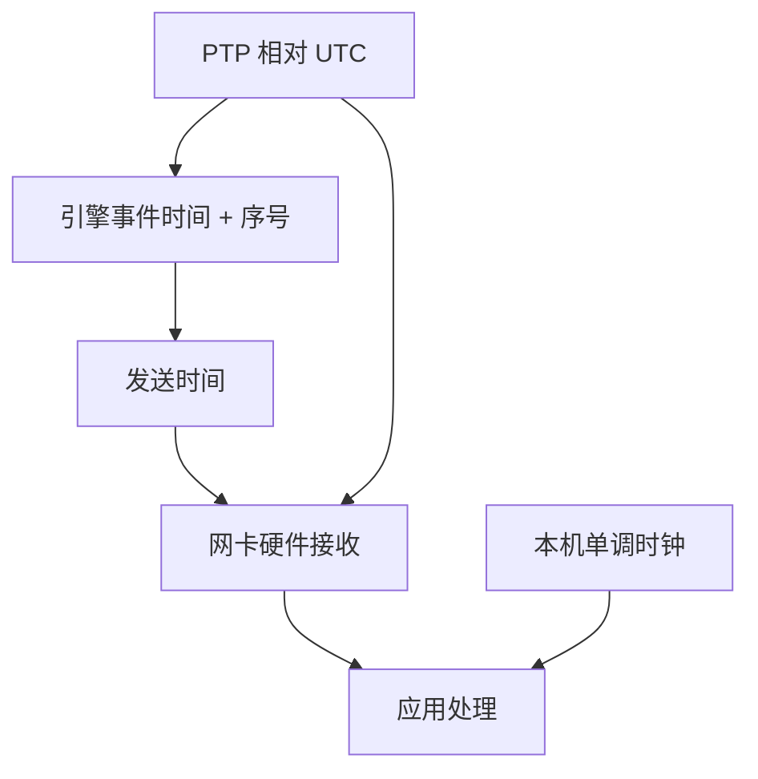

# 时间戳精度与单调时钟

微秒级馈送若用未校准的墙钟对齐，会把时钟误差写成价格发现；监管要的是可追溯的同步，工程要的是单调、不回跳的计数器。

<footer>—— IEEE 1588 Precision Time Protocol；MiFID II RTS 25 对时钟同步的要求；Hasbrouck 对交易数据时间戳来源与精度的讨论</footer>

[上一课](/quant/low-latency-engineering)把抖动停在主机关键路径。[迟到数据](/quant/late-data-recon)已区分事件时间与到达时间。本课的缺口是**时间戳本身的计量**：精度、同步、单调性。没有它，重建簿的序号仍在，但跨所、跨通道、跨主机的对齐会伪造领先滞后。后课故障与清算仍依赖这些戳做事故回放。

## 问题

一条行情至少可能带四种时间：引擎事件时间、交易所发送时间、网卡硬件接收时间、应用处理时间。Hasbrouck 要求声明来源。精度（最小分辨）与准确度（相对 UTC 的偏差）不是一回事：纳秒分辨的戳可以整体偏 3 毫秒。问题是跨源对齐时用哪一个做主键。同一所内，引擎序号已经全序，墙钟只是注释；跨所没有共享序号，只能靠同步过的 UTC，误差必须小于你想识别的领先。

墙钟会跳：NTP 步进、闰秒、虚拟机迁移、手动改时间。`gettimeofday` 在跳变附近可以回退，导致因果倒置：先写的日志时间更早。单调时钟（如 `CLOCK_MONOTONIC`）只保证本机间隔，不保证跨机。生产日志需要两者：单调间隔用于延迟直方图，同步 UTC 用于跨系统对账。只存一种，事故后必缺一条腿。

### 监管同步是准确度上限，不是研究已达标

MiFID II RTS 25 按业务类型规定网关到 UTC 的最大偏差（高频门控可到 100 微秒量级，具体以条文与 ESMA 问答为准）。美国交易所与 FINRA 对审计追踪也有时间戳粒度要求。这些是合规上限。研究若声称「期货领先 ETF 80 微秒」，必须证明两所戳相对同一 UTC 的偏差远小于 80 微秒，否则数字无意义。A 股研究同样要声明：用的是交易所揭示时间还是本地收包时间；二者差可以吞掉任何「逐笔领先」。

PTP（IEEE 1588）用硬件时间戳与边界时钟把局域网同步到亚微秒。NTP 通常只到毫秒。托管机房常见 PTP；云虚拟机常见的是被宿主机打扰的 NTP。回测重放若在笔记本上用 NTP 墙钟去排微秒事件，对齐方法已经错了。

## 方法

数据契约：每条记录必有 `seq`（若有）、`engine_ts`、`recv_ts_hw`、`recv_ts_mono`。分析跨所时，先估计各源相对 UTC 的偏差过程（用 PTP 日志、或用同一物理事件的双重打印作锚），再比较事件。不要直接减两个未校准的交易所字段。本机延迟用单调时钟相减；跨日对账用 UTC。闰秒与夏令时只存在于民用日历，引擎时间应是线性时间轴，或明确的交易所日历时钟——A 股没有夏令时，但跨境样本有。

回放时按 `seq` 而不是按 `engine_ts` 排序；时间戳碰撞（同一微秒多事件）必须用序号打破。若馈送只有毫秒戳且无序号，该样本不能支撑微秒级微观结构结论。Holden–Jacobsen 处理 TAQ 时强调时间与报价条件；本课把同一精神收到工程字段。

### 单调时钟不能替代序号

进程重启后单调时钟从零计，跨重启不可比。持久化必须同时写 UTC 与 `seq`。FPGA 与 CPU 的时钟域不同，跨域传递事件要带硬件戳，并在会合点做一次校准。测量旁路收益时，若用软件戳，测到的可能是「更快地读了时钟」而不是「更快地到了网卡」。

## 机制

时间优先的经济定义在核入口；研究能做的是逼近该全序。戳的误差把逼近变成噪声：系统性地让某一通道「更早」，就会制造虚假的价格发现与虚假的套利。同步把噪声的均值压下去；单调时钟把本机间隔从墙钟跳跃里救出来；序号把碰撞与回跳变成可解。三者缺一，微秒叙事不成立。

发布延迟使 `engine_ts` 与 `recv_ts` 的差本身是随机过程，压力日变厚。该过程是市场设计与工程的对象，不是 alpha。把它当信号，等于交易交易所的发布队列。

## 边界

不提供攻击或欺骗交易所时间戳、利用对时差进行抢跑的方法。合规对时以交易所与监管现行技术指引为准。区块链出块时间、交易所「撮合时间」字段缺失的 OTC 成交，不适用本课精度主张。

## 小结

- 精度不是准确度；跨所领先必须先校准到同一 UTC，误差小于效应本身。
- 墙钟可回跳，延迟用单调时钟，对账用 UTC，全序用引擎序号。
- 监管同步上限≠研究已经达到该准确度。
- 出处：IEEE 1588；MiFID II RTS 25；Hasbrouck 对时间戳的讨论。
