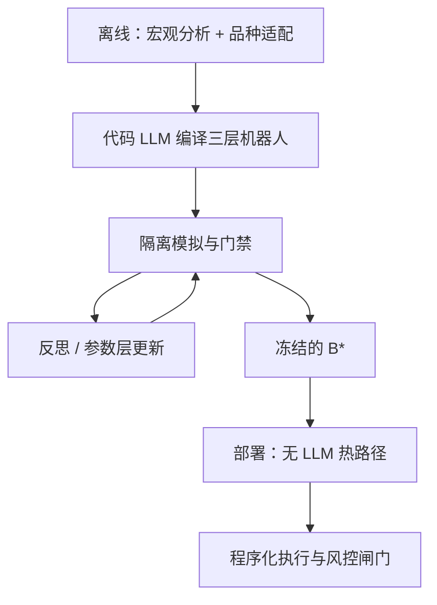

# TiMi：离线研发 + 分钟级执行

    
把策略研发与分钟级部署在架构上拆开：重推理留在离线，线上只跑已编译、已调参的程序化机器人。

    <footer>—— Song, Song, Hu, Qi, Gao, Wang, Li and Zhao, Trade in Minutes!, arXiv:2510.04787</footer>

同济大学与微软亚洲研究院的宋子凡、宋楷韬、赵才荣等提出 TiMi（Trade in Minutes）：一套强调「机械理性」的多智能体量化架构。针对的病是：拟人化交易智能体把情绪与外围文本带进决策，并且在部署期持续做多轮 LLM 推理，延迟与费用在波动市里变成滑点。TiMi 的处方是三段链——策略（policy）、优化（optimization）、部署（deployment）——前两段离线，用语义分析、代码生成与数学推理三类专长智能体把策略编译成分层交易机器人；部署段只执行该机器人，论文称平均动作延迟约 137 ms，相对持续推理的智能体快两个数量级以上。本篇写**这种解耦作为软件架构**是否成立、离线优化如何避免把测试段搜穿、以及为何论文中的实盘数字不能当成可复制的容量承诺。不讨论任何下单接口、绕过风控或利用微观结构的做法。

## 问题

交易智能体文献里，角色扮演（新闻分析师、多空辩手、激进/保守风控）对文本推理友好，却引入两个与量化执行不相容的性质。其一，拟人偏好与外围信息（社交、研报摘要）时滞大、噪声大，零售可获得的公开叙事往往已在价格里。其二，多轮辩论的墙钟以秒到分钟计，分钟级甚至更快的信号在推理结束前已经过期。执行算法关心的是可重复的状态机：信号、仓位、约束、撤单，见[订单状态](/quant/order-state-machine)。把 LLM 放进热路径，等于把温度采样放进仓位。

TiMi 把问题改写成：能否让 LLM 只出现在研发期，产出与传统量化相同类型的对象——带参数的程序——再在冷路径上跑。这与「让模型每分钟投票买还是卖」是不同的系统。后者永远付 $c_{\mathrm{agent}}$；前者在动作次数 $n$ 增大时，平均成本趋向 $c_{\mathrm{bot}}$。架构命题可以成立，即使策略本身没有 alpha。

### 离线并不自动等于无泄漏

解耦只隔离了推理延迟，不隔离信息集。若优化段在「历史或实盘反馈」上调参，而反馈窗口与评估窗口重叠，仍是过拟合。若代码生成智能体看见未来行情注释，生成的函数会内嵌前视。离线研发必须遵守与人类量化相同的协议：时间切分、冻结、[研究/模拟/实盘隔离](/quant/research-sim-prod)。论文用 macro→micro 两层分析与分层编程（策略 / 函数 / 参数）来限制改动面，这是有益的归纳偏置，不是统计保证。

137 ms 是执行路径上的延迟描述，不是收益来源。低延迟可以降低过期，也可以更快地实现一个过拟合规则。架构评测应把延迟与样本外 IR 分开报。

## 方法

**四个智能体。** 宏观分析 $\mathcal{A}_{\mathrm{ma}}$：在时间窗与技术指标上归纳市场级模式，得到通用策略集。策略适配 $\mathcal{A}_{\mathrm{sa}}$：按品种特性定制规则与初始参数。机器人演化 $\mathcal{A}_{\mathrm{be}}$：把规则编译成程序，并按反馈在三层上改代码。反馈反思 $\mathcal{A}_{\mathrm{fr}}$：把成交与风险案例写成数学问题（如线性规划）以更新参数。符号上，市场 $\mathcal{M}$、窗口 $\mathcal{W}$、策略空间 $\mathcal{S}$、反馈 $\mathcal{F}$、评价 $\mathcal{J}$，系统追求提高 $\mathcal{J}(\pi_\Theta)$。这些映射是论文的架构语言，不是可部署的交易说明书。

**三层机器人。** 策略层：信号、进出、仓位规则。函数层：可复用的指标与数据处理。参数层：可调数字。分层的目的是让优化先动参数、再动函数、最后才改策略，避免每次反思都重写整份脚本。这与软件工程的稳定接口一致，也便于审计 diff。

**三段时间。** 策略段离线生成原型机器人；优化段在模拟（论文表述含历史或实时市场的离线仿真）上收集反馈并迭代；部署段只跑通过仿真门禁的 $\mathcal{B}^*$。热路径无 LLM。评测声称覆盖 200+ 股票指数与加密品种，报告年化、夏普、回撤，并与规则、机器学习/强化学习、其他 LLM 智能体对照。读者应把这些数字当作**作者实验环境中的描述**，在未独立复现、未披露成本与容量前，不写入投资结论。

### 与传统量化流水线对齐

宏观指标 + 品种适配 + 参数优化，本就是 CTA / 统计套利的标准循环。TiMi 替换的是「谁写代码、谁提参」：用代码 LLM 与推理 LLM 代替研究员的部分键盘时间。验收标准因此应与人类策略相同：walk-forward、扣费、容量、[过拟合概率](/quant/pbo)，而不是「智能体辩论是否精彩」。生成代码必须静态检查：禁止未来函数、禁止未定义的全局状态、禁止在热路径读可变网页，见[无未来函数](/quant/no-future-function)。

把反思写成线性规划，看起来客观，目标函数仍是人选的。若 $\mathcal{J}$ 是样本内夏普，LP 只是更快地过拟合。$\mathcal{J}$ 应在隔离的验证窗上定义，并计入成本情景。

## 机制

解耦降低延迟的机制是物理的：部署进程是普通程序，CPU 上跑指标与条件单，不排队等 GPU。策略质量的机制仍是旧的：技术指标在短窗上捕捉的统计规律是否稳定、是否被成本吃掉。LLM 在离线段的贡献是搜索效率——提议新的函数分解、把失败案例翻译成约束——不是发现新的经济学。若搜索空间因 LLM 而扩大，Harvey–Liu–Zhu 的 $M$ 上升，门槛应更严，而不是更松。

两层分析的机制是正则：先市场级模式，再品种参数，减少「每个币一个完全不同的故事」。风险是宏观层用了不可交易的未来体制标签。分层编程的机制是限制爆炸：只改参数时，策略语义不变，便于归因。反馈闭环的机制与强化学习相同，差别在更新发生在离线编译期，而不是逐步策略梯度；因此更像自动研究，而不是在线 RL 交易。

与[TradingAgents](/quant/tradingagents-multiagent) 的对照：后者把辩论放进决策路径，解释性强、延迟高；TiMi 把辩论（若存在）留在编译期，执行路径像传统机器人。两者都是架构论文。任何一侧的夏普都不构成对另一侧的否证，除非在同一信息集、同一成本、同一试验次数下比较。

### 分钟级与市场结构

「分钟级」是决策频率的上限描述，不是微观结构策略。分钟 K 线仍受噪声、跳空与交易时段影响；加密 24/7 与股票开盘集合竞价不是同一 MDP，见[交易 MDP](/quant/trading-mdp-pitfalls)。架构可以共用，评价不能共用一个夏普。A 股还要叠 T+1 与涨跌停：离线生成的「当日反手」规则可能不可行。闸门应在部署进程里，不在 LLM 里。

## 边界与工程取舍

不要在热路径保留「偶尔再问一次大模型」。不要把优化段接到实盘账户。不要用同一段行情既生成代码又报告夏普。代码生成必须过沙箱与静态分析，禁止网络与未声明数据源。论文中的多市场结果若含实时交易，外部无法审计执行质量、拒单与滑点；引用时应标明「作者自报」。

可取的工程是把 TiMi 当**研究编译器**：人指定合法算子与数据 API，模型只在此闭包内写策略层，优化只动参数层，部署产物与人类策略走同一模拟器。这样解耦才与隔离协议相容。容量、冲击、换手惩罚仍按标准[成本敏感性](/quant/cost-sensitivity) 做，不因「是智能体写的」而豁免。

「我们不让任何人预测市场——我们让模型说话」这句 Simons 语录在文中是修辞。量化里「模型」指统计模型与约束；LLM 写的脚本仍是模型，只是参数搜索更不透明。不透明搜索需要更大的样本外折扣。

## 小结

- TiMi（Song et al., arXiv:2510.04787）主张离线多智能体研发、线上只跑编译后的机器人，以去掉热路径上的 LLM 延迟。
- 宏观到微观、策略/函数/参数分层，是为了限制生成代码的改动面；不替代时间切分与成本。
- 延迟数字与自报收益应分开评价；外部未复现前不当作可交易证据。
- 生成代码须进沙箱与无未来函数检查，部署须与研究隔离。
- 出处：Zifan Song, Kaitao Song, Guosheng Hu, Ding Qi, Junyao Gao, Xiaohua Wang, Dongsheng Li, Cairong Zhao, *Trade in Minutes! Rationality-Driven Agentic System for Quantitative Financial Trading*，arXiv:2510.04787。
