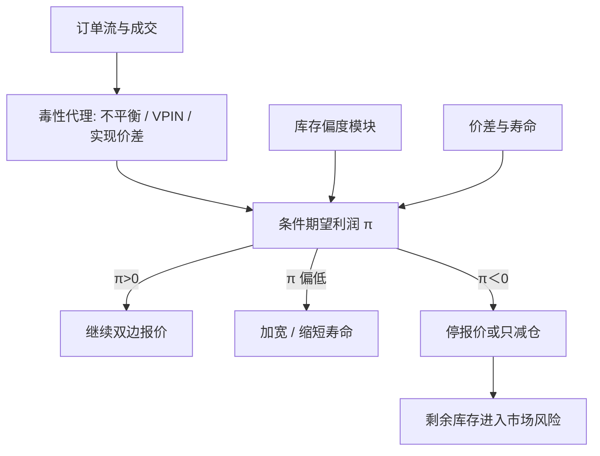

# 毒性流与停报价

当对手方知情的概率升高，做市商事后期望利润变负：正确的反应是加宽价差、缩短挂单寿命，直到撤出市场，而不是在同一价格上继续为知情流提供免费期权。

<footer>—— 据 Glosten and Milgrom, Journal of Financial Economics, 1985；Easley, López de Prado and O'Hara, Flow Toxicity and Liquidity in a High-Frequency World, Review of Financial Studies, 2012</footer>

[上一课](/quant/fill-probability)把成交概率写成队列位置、市价消耗、取消与价格离去的竞争风险；高填成与高逆向选择在队头绑定，填成还不是事后收入。做市的毛收入是价差，成本是被更好信息选中时的库存亏损。缺口是流的毒性：当前这一段订单流有多毒，同样的挂单会变成负 EV 的期权。毒性越过阈值时，两侧或单侧的最优距离是「不挂」——停报价是最优控制里的角点解。本课写从加宽、改价连续过渡到停报价，不写如何识别零售。

## 问题

无毒性时，[Avellaneda-Stoikov](/quant/avellaneda-stoikov) 的价差补偿库存扩散与等待；有毒性时，成交的条件期望里多了一项 $E[\Delta S\mid\text{被击中}]$，符号对做市商不利。若价差小于这一条件移动，每一笔成交的事后收入为负，库存还被推到错误方向。[库存偏度](/quant/inventory-skew) 只能管理 $q$，不能把已经写进价格的信息赚回来。问题是：哪些可观测变量预示 $E[\Delta S\mid\text{fill}]$ 正在上升，以及控制变量应如何从「加宽、加快改价」连续过渡到「停报价」。

O'Hara 强调信息不对称是价差的一等来源；Harris 从交易实践说，流动性提供者必须保护自己免于总是输给知情流。停报价是保护的极限：市场仍然可以有交易，但由愿意承担信息风险的人在更宽的价差或更慢的时钟上提供。闪崩一类事件里，毒性度量升高与深度突然消失同时出现，VPIN 论文把它当作案例；后续争论的是 VPIN 测的是信息还是成交量加速本身。对架构而言，争论不影响这句话：当模型给出的条件期望利润为负，继续挂在旧距离上不是做市，是赠送期权。

### 毒性是流量性质，不是品种标签

PIN 高的股票平均信息不对称更严重，但仍可能在某个小时里流是平衡的；PIN 低的股票在公告前后可以极毒。毒性应在执行时钟上更新：成交量时钟、事件时钟，而不是等一个交易日结束。度量可以是买卖不平衡、VPIN、成交后短期实现价差转负、逐笔有效价差与实现价差之差，见 [价差分解](/quant/spread-decomposition)。它们都是代理，不是知情者身份。架构上应把代理映射到一个「逆向选择溢价」状态变量 $\alpha_t$，再进入报价规则，而不是把某一个指标的阈值写成市场的物理定律。

实现价差转负意味着流动性提供者事后把钱给了流动性索取者。这可能是信息，也可能是存货导致的中点回转不足、或自己的偏度与市场运动同向。单一指标不能判决毒性；要看是否伴随不可逆的价格移动，以及是否在自身库存解释之外仍有残差。

## 方法

把一笔卖出成交（别人的市价买）的事后损益写成

$$
\pi = \tfrac{s}{2} - \psi\text{项} - E[\Delta m_{\mathrm{info}}\mid\text{buy fill}].
$$

第一项是半价差，第二项是存货会计，第三项是逆向选择。停报价的规则是：若对当前最优可挂距离仍有 $\pi\lt 0$，则该侧不挂；若两侧都负，则完全撤出，只保留库存清理所必需的减仓单。连续版本是把 $\lambda(\delta)$ 改成依赖毒性的强度，或把公允中点改成已经包含短期 alpha 的中点，使「被击中」发生在对做市商中性的价格上——能做到这一点时不必停，做不到时才停。Cartea–Jaimungal 的框架是后一种：预测订单流，把 alpha 写进报价，存货模块仍由 $q$ 负责。

VPIN 一类度量给出 $\widehat{\mathrm{PIN}}_t$ 或不平衡。经验规则可以是：度量进入高分位则提高 $s$、缩短挂单最长寿命、降低库存限额；再高则禁止加库存方向的报价。这是控制层的分段线性，对应 HJB 在约束 $q\in[q_{\min},q_{\max}]$ 下的边界。阈值应样本外校准到「停之后的实现价差不再系统性为负」，而不是校准到「尽量少停」——少停只是把亏损留给库存。

### 加宽、缩短寿命、停：三个档位

毒性升高的第一反应通常不是立刻离场。加宽 $s$ 提高半价差，覆盖更大的 $E[\Delta m\mid\text{fill}]$，代价是成交变少、库存调节变慢。缩短挂单寿命（更频繁地取消并按新信息重挂）减少期权被行使的时间窗口，代价是丧失 [队列位置](/quant/cancel-queue-position)，成交概率下降。停报价把期权供应量降到零。三者的顺序来自成本：先用价格（宽价差）买保护，再用时间（短寿命）买保护，最后用数量（零挂单）买保护。闪崩式的流动性蒸发，可以理解为许多做市商同时走到第三档。Brunnermeier–Pedersen 的保证金螺旋会把第三档锁定得更久：资本被占用后，即使毒性回落也无力恢复挂单。

## 机制

Glosten–Milgrom 的机制是贝叶斯：一笔买把价值的后验推高，ask 必须预先等于该条件期望。毒性升高等于知情到达率相对非知情到达率上升，同一笔买的似然比更极端，价差必须更宽。若制度或竞争不允许价差宽到零利润点（tick 约束、最大价差、做市义务与现实冲突），均衡不再是「薄利润做市」，而是「拒绝交易」。停报价因此不是市场故障的外生名称，它可以是零利润约束下的均衡行为。

存货与毒性同向时最危险：知情买把价格推高，同时把做市商打成空头，偏度规则会把卖价再压低（鼓励补回），这恰好继续向知情者供货。正确的叠加是：毒性模块应能**覆盖**存货模块，禁止「为了回归 $q^\star$ 而以过时价格加库存」。架构上毒性优先于存货，因为信息亏损是永久的，存货方差还可以靠时间与对冲下降。Easley 等人强调毒性是做市商是否愿意继续提供流动性的状态变量；提供一旦停止，价格发现改由穿越更深、更稀的剩余深度来完成，波动跳升。

做市义务（某些交易所要求最大价差、最小挂单时间）与毒性停报价在压力期冲突。义务把角点解从「允许离场」改成「必须在负 EV 上挂着」。设计市场时这是制度选择，不是微观结构公式能单独给出的最优。

### 与 VPIN、PIN 的分工

PIN 回答「这个标的这个月信息不对称有多严重」，用于截面定价与长期价差解释。VPIN 回答「成交量时钟上最近若干桶的不平衡有多极端」，用于日内流动性状态。两者都不是指令级的知情者标签，都不能告诉你对面那一笔的身份。停报价规则若直接把 VPIN 当开关，会继承 VPIN 的争议：Andersen、Bondarenko 等认为它在测波动与成交加速。更稳健的做法是把多种代理——不平衡、实现价差、波动跳升、拍卖或新闻日历——合成 $\alpha_t$，并在样本外用做市账户的事后损益验证。理论需要的是 $\alpha_t$ 进入报价的通道，不是某一个商标指标。

## 边界与工程取舍

所有毒性代理都有滞后：用已经发生的成交去估现在的流，停报价发生在伤害之后。公开信息（新闻时钟）可以部分领先，但仍有未公告的知情交易。阈值过敏感会在无毒波动里反复离场，价差收入消失；过迟则在有毒时段把限额打满。多场所时，一处停报价，流量转移到别处，毒性可能被「导出」而不是消失。本篇不处理如何在他人撤单的消息上抢先，那已经不是做市的库存与信息架构。

Jorion 与风险管理部门关心的另一面是：停报价之后，账户仍持有库存，市场风险变成无法用做市收入对冲的方向性暴露，应进入 [VaR](/quant/var-methods) 与强平规则。流动性提供者集体停报价，是市场流动性与融资流动性相互作用的触发器之一。把「始终挂单」写成文化，与指数效用下的最优控制不一致：效用在负 EV 的重复博弈里会拒绝参与。

毒性模块的输出是自己的报价状态（宽、短、停），不是对其他参与者的预测名单。把订单流分类用于内部风险控制，与把分类用于抢跑，在目的上完全不同；后者不属于做市理论，本篇不提供任何操作路径。

## 小结

- 毒性流使 $E[\Delta S\mid\text{fill}]$ 超过价差所能覆盖的部分，做市的条件期望利润转负。
- 保护分三档：加宽价差、缩短挂单寿命、停报价；停是零利润约束下的角点解，可以是均衡而非故障。
- 毒性是流量状态，应用成交量或事件时钟更新；PIN 是低频截面，VPIN 是日内代理之一，都不是身份识别。
- 毒性应覆盖存货偏度，避免为回归库存而向知情流继续供货。
- 集体停报价使深度消失、价格发现改走剩余簿，并与融资约束互相放大。
- 指标须用账户事后损益样本外验证；单一 VPIN 阈值不是理论结果。
- 出处：Glosten and Milgrom, *JFE*, 1985；Easley, López de Prado and O'Hara, *RFS*, 2012；Easley, Kiefer, O'Hara and Paperman, *Journal of Finance*, 1996；Cartea, Jaimungal and Penalva, *Algorithmic and High-Frequency Trading*；范式见 O'Hara, *Market Microstructure Theory*。
