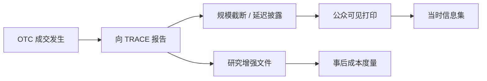

# TRACE 公司债成交报告

TRACE 是成交报告系统，不是限价簿馈送。字段告诉你谁在何时报告了什么价格与规模，以及监管允许隐瞒多久、截断多少；它不告诉你当时能否再成交。

<footer>—— 据 FINRA 对 TRACE 报告义务与披露规则的公开说明；经验含义见 Edwards, Harris and Piwowar, Journal of Finance, 2007</footer>

[NBBO 构造](/quant/nbbo-construction)把股票保护报价拼成包络。[债券流动性与 TRACE](/quant/bond-liquidity-trace)已经用打印估成本。[公司债 OTC](/quant/corporate-bond-otc)写了 RFQ。本课作为数据源对照的收束：把 TRACE 当成**报告契约**——谁必须报、报哪些字段、大额如何截断与延迟、修订如何发生、研究文件与实时馈送有何差别。不重复流动性度量公式，不重复询价博弈。附录馈送课序到此结束。

## 问题

股票磁带尽量接近撮合事件。TRACE 是经销商与报告方在规则时限内提交的成交报告，时间戳是报告时钟，不是股票引擎匹配时钟。大额曾被 cap、曾延迟对公众披露，研究数据集后来才提供更完整的字段。把 TRACE 当 ITCH 用——按报告顺序重建「簿」——对象不存在。缺口是读手册：强制报告的范围（哪些债券、哪些交易）、买卖标识是否存在、客户/经销商、主/次、取消与更正消息。没有这些，规模加权成本、方向、甚至成交笔数都会错。

实时公众馈送与学术用增强文件不是同一产品。用公众延迟馈送做「当时可交易信息集」，用增强文件做事后度量，必须拆开，否则回填式前视：你在 $t$ 日用了当时公众还看不到的未截断面值。

### 报告时间 ≠ 成交时间 ≠ 公众可见时间

契约里至少三个时刻。成交发生、向 TRACE 报告、对公众披露。延迟披露规则使大额的公众可见时间晚于报告。研究若用披露时间当事件时间，冲击被平滑；若用成交时间但该字段填的是报告时间，事件研究的零点错了。必须按文件字典对齐。这与股票 SIP 的「匹配 vs 汇总」类似，但延迟是监管设计，不是物理一跳。

时钟精度远低于股票 PTP。债券领先滞后做到秒级已经勉强，不要用 TRACE 去和股票匹配时间做微秒价格发现。

## 方法

数据字典页：债券标识（CUSIP）、价格、数量（是否 cap）、买卖侧、交易类型、报告方角色、成交时间字段、报告时间字段、取消/更正标志。清洗：更正应撤销旧报告再应用新报告，不能并列加总。取消未处理会重复计算量。分层：被 cap 的打印单独，因为真量未知，只能当「至少为上限」。

点-in-time：实时策略只能用当时规则下公众可见的字段。事后流动性论文应用增强文件，并声明。把增强文件当实时，是债券版的宏观终值前视。与公司行动：债券赎回、要约会使 CUSIP 生命周期结束，映射要进公司行动引擎，否则幽灵成交。

### 与股票馈送对照表

股票：增量簿、序号、匹配时间、保护报价、NBBO。TRACE：离散打印、报告序号（若有）、报告时钟、无公开 BBO、无 NBBO。方向：股票可用 EMO；TRACE 或有侧字段，或仍要推断。有效价差：股票有中点；TRACE 要用配对或基准。把两套字段 join 到同一研究里（资本结构套利）时，对齐的是发行人与日历日，不是微秒事件。

## 机制

报告义务改变透明度，从而改变 OTC 议价，这是 Edwards–Harris–Piwowar 的对象。作为馈送，TRACE 的机制是监管收集再分发，延迟与截断是对大额披露的权衡：即时透明伤害存货，完全不透明伤害客户。字段缺失（无深度、无订单）不是数据质量差，是市场结构。把缺失当脏数据填上「中点」，会把债券研究变成错误的股票研究。

修订：报告方事后更正价格或量，历史文件会变。vintage 原则同样适用：存当时收到的报告，不要只留终版。这与另类数据回填是同一纪律，源是监管磁带。

不要对 TRACE 跑 [Huang-Stoll](/quant/huang-stoll-spread) 三路除非你真有连续报价。大多数公司债没有。度量回到配对加价与变现时间。

### 取消与更正是事件不是脏行

并列加总未撤销的旧报告，会重复计算量与成本。清洗应按报告序号应用更正语义。终版文件若覆盖旧报告，仍应保留 vintage，以免事后度量改写当时信息集。

## 边界

非美元债、贷款、CDS 不在 TRACE。中国银行间有自己的报告与披露，不能把 TRACE 字段当模板硬套。可转债可能同时出现在股票磁带与 TRACE，去重要按产品规则，不能简单按 CUSIP 丢弃一侧。本附录对照课序结束。

公众延迟披露的大额，当时不可见。用增强未截断文件去做实时信号，是债券版的宏观终值前视。

## 小结

- TRACE 是报告契约：字段、截断、延迟、更正，不是 LOB。
- 成交、报告、公众可见三个时钟必须分开。
- 实时策略用当时公众可见字段；事后研究用增强文件并声明。
- 取消与更正要当事件处理；cap 量只能当下限。
- 与股票 SIP/直连/NBBO 不可类比到同一事件循环。
- 出处：FINRA TRACE 公开报告与披露规则；Edwards, Harris and Piwowar, *Journal of Finance*, 2007；Bessembinder 等对 TRACE 透明度的研究。
