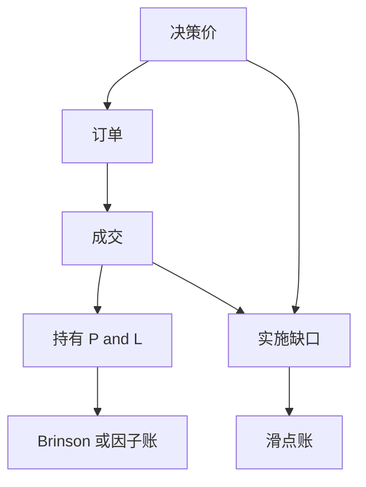

# 交易层级归因

基金级超额是许多笔成交、许多个持有日的和；不拆到交易与实施缺口，配置、选择与冲击会继续混在同一个 alpha 里。

<footer>—— 持仓会计见 Brinson, Hood and Beebower；实施缺口见 Perold, The Implementation Shortfall, 1988</footer>

[上一课](/quant/twr-vs-mwr)把过程收益与口袋收益分开。交易层级的缺口是**再往下拆**：决策价 → 下单 → 成交 → 持有 → 卖出。主干 [Brinson 归因](/quant/brinson)、[因子归因](/quant/factor-attribution)、[滑点归因](/quant/slippage-attribution) 已写三套账。本课给业绩单元的接口：何时用哪一套，以及为什么「IR 很好」仍可能是没算冲击。

## 问题

Brinson 回答配置 vs 选择（格子会计）。因子归因回答风格 vs 残差（风险模型）。两者都用持仓或收益，不自动含「若用决策价成交会怎样」。Perold 的实施缺口把纸面组合与真实组合的差写成冲击与时机。问题是对齐：决策时点必须预注册，否则滑点变成事后选价。多空与 RV 的融资、借券应进交易成本腿，不要留在「选择 alpha」。

与被动流、回购流：机械成交的冲击应标成流的成本或收益，而不是选股。与短波动：Theta 与缺口要按合约记账，不能进股票 Brinson 格子。

### 交易加总必须还原 TWR

子账之和不等于报告净值，归因就只是故事。公司行动、期货展期、费用计提、估值定价源都要有格子。日终中价回测与成交回报之间的差，应进滑点，而不是进信号 IC。

Litterman 热点指出主动方差来自哪些名字；交易归因指出这些名字上的 P&amp;L 来自持有还是来自冲击。两者一起才能决定是减限额还是改执行。

## 方法

三层并行：Brinson（或因子）月频持仓；实施缺口按订单；融资/借券/费用单独。交易级：每笔的决策价、基准价（到达价、VWAP、拍卖）、成交、标记。汇总：按策略桶（地图上的多空、RV、ARP…）出净 IR，避免一只基金一个数。抽查：大额日、调仓日、公告日是否异常。

## 机制

纸面 alpha 在下单时变成对流动性的需求。做市商与拍卖规则决定缺口。归因把「想法」与「成交」切开，才能反馈到信号衰减还是执行衰减——生命周期课的退役否则会裁错对象。

## 边界

本课不写如何把亏损归到「异常波动」以回避审计。场外协商成交的基准价必须事先定义。下一课：即便账算清了，夏普和 IR 仍有抽样误差。下一课程将从撮合引擎解释成交从何而来。

## 小结

- 交易归因把决策、冲击与持有切开，且必须还原 TWR。
- Brinson / 因子 / 滑点三套账对象不同，不要互相替代。
- 流与融资要进成本腿，不要留在选择 alpha。
- 出处：Brinson, Hood and Beebower, *FAJ*, 1986；Perold, 1988；滑点见本栏滑点归因课。
