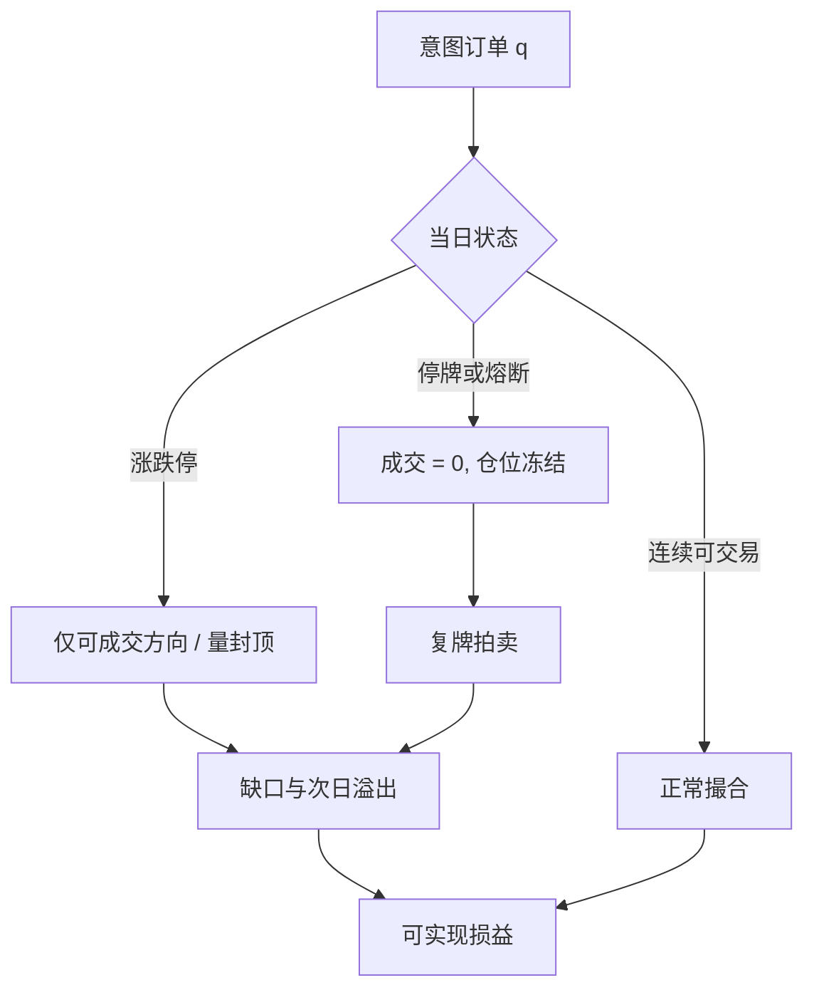

# 停牌、涨跌停与不可交易

交易暂停之后，重新开盘的成交量与波动往往更大，而不是更小；停牌推迟的是发现过程，不一定冷却价格。

<footer>—— 对照 Lee, Ready and Seguin, Volume, Volatility, and New York Stock Exchange Trading Halts, Journal of Finance, 1994</footer>

回测里的价格序列默认每天可按收盘价买卖。交易所微观结构不提供这个默认。个股停牌、市场熔断、涨跌停把可成交集合变成时变的：有价格不等于有成交，有成交不等于你能在该价上完成目标数量。Lee、Ready 与 Seguin（1994）发现 NYSE 停牌后的成交与波动上升，与「冷却」叙事相反；Kim 与 Rhee（1997）在东京涨跌停上看到延迟发现与波动溢出到次日。美国有个股 Limit Up–Limit Down（LULD）与标普 500 的市场熔断档位；中国 A 股有幅度限制与重大事项停牌。对量化，这是容量与风险，不是运营花絮：不可交易会把对冲比、因子收益和止损全部变成纸面数字。

## 问题

记计划交易为 $q_t$。若 $t$ 日全天停牌，$q_t$ 的可实现量为 0，未完成量结转到复牌，复牌价可以跳空。若触及涨跌停，买方或卖方一侧的队列可能无法出清，收盘价是限制价，不是市场出清价。把限制价写进收益，等于假设你在涨停板上仍能买到、在跌停板上仍能卖出——方向往往与拥挤的那一侧相反，偏差是不利的。指数收益在成份停牌时仍可能用前收盘计算，复制组合却无法跟上，跟踪误差在最需要复制的日子里爆炸。

美国市场层面：NYSE/Nasdaq 的市场熔断（现行与 S&P 500 挂钩）在一级、二级跌幅触发后暂停，三级更长。个股 LULD 在价格离开参考价的百分带时暂停并重新开盘。中国主板长期为 ±10% 涨跌停（创业板与科创板改革后为 ±20%，ST 更窄），另有盘中临停与重大资产重组等停牌。2016 年初 A 股市场熔断（5%/7%）在四天内反复触发后被叫停，是「规则改变价格路径」的近样本：回测若忽略该周的不可交易，VaR 与因子收益都是假的。

### 停牌不是缺失，填补等于前视加幻觉成交

研究代码常对停牌日做前向填充或线性插值，以便矩阵对齐。前向填充把收益记为零，低估波动、假装可以平仓。插值用复牌信息反推停牌日价格，是前视。正确处理是：持仓冻结、标记不可交易、复牌首日用可成交的开盘或集合竞价规则成交，并计入跳空。Lee–Ready–Seguin 的对象正是停牌作为信息事件：开盘拍卖聚集了暂停期间的订单，波动在恢复后释放，而不是在暂停期间消失。

A 股「无成交涨跌停」时，收盘价在板上，但队列可能完全没成交。用收盘价当 VWAP，对涨停追买的回测会系统性高估可实现收益。

## 方法

**状态字段进回测。** 每个名字每日需要：是否停牌、涨跌停触及、开盘是否延迟、熔断级别、可成交量（若有交易所披露）。成交引擎在不可交易时返回 0，并把意图留给下一可交易拍卖。涨跌停日只允许与可成交方向一致的部分成交，或按当日真实成交量封顶。

**事件研究而不是删除样本。** 把停牌与板日从样本里丢掉，会使波动与缺口偏差变小，策略显得更稳，但这是另一类幸存者：最不可交易的日子被开除。应保留这些日子，令策略收益等于可实现成交的损益加未成交持仓的盯市（盯市价用限制价要谨慎，可用买卖队列或复牌价事后结算，但下单不能用事后价）。

**对冲与指数。** 期货可能仍在交易而现货一篮子大量停牌（或反过来），期现套利的错误定价里有一块是不可复制。指数编制规则若用前收盘代替停牌成份，ETF 净值与二级价格会分叉。回测套利必须模拟篮子里不可交易的腿，而不是假设 ETF 与篮子总是可同时成交。

### 涨跌停的延迟发现

Kim–Rhee 对东京的经典结论：触及限制后，后续日继续同向运动的概率高，波动溢出，成交在限制日被截断。涨跌停于是不像熔断那样「暂停所有方向」，而像单侧封顶：信息继续到达，价格被卡住，次日跳开。对中国与若干新兴市场的后续研究大体支持「延迟而非冷却」。交易含义：动量在板上会看起来极强（收盘锁在限制价），实盘买不进；反转策略在跌停日看似捡到便宜，实盘卖不掉或买不到足够数量。统计套利的残差在单腿板上会变成单向漂移，直到复牌。

把涨跌停当成「波动上限所以风险更小」是错的。限制压缩的是观测到的日收益标准差，膨胀的是缺口风险与不可平仓风险。应用跳空与持有期延长来计量，而不是用板上日收益的标准差。

## 机制

微观结构机制是订单簿被规则切断。集合竞价在停牌结束时一次性出清，价格对累积信息跳跃，Kyle 意义上的 $\lambda$ 在拍卖里由累积知情单决定，而不是由连续交易的深度决定。Corwin 与 Lipson（2000）观察 NYSE 停牌附近的订单流与流动性；Christie、Corwin 与 Harris（2002）比较 Nasdaq 停牌机制。共同教训是：机制细节（是否允许开盘前显示不平衡、是否强制冷却时间）改变复牌冲击，不能把「halt」当成各国同质事件。

宏观机制是同步不可交易。市场熔断让所有人同时无法调仓，期权对冲、杠杆平仓挤到重开后的同一分钟，相关与冲击一起升。2016 年 A 股熔断的反馈是：跌向阈值时，提前减仓把阈值变成磁铁。规则成为价格的状态变量，体制在几天内就被交易行为改写——这是[体制切换失效](/quant/regime-break-risk) 的制度版本。

### 与流动性期限的关系

停牌把有效变现时间 $H$ 从「若干个 ADV 日」变成「未知日历日」。重大事项停牌在 A 股历史上可以拉到数月（近年已收紧），期间融资与对冲只能靠期货或关联股票，基差风险替代了个股风险。风险系统若按 10 天流动性期限给所有股票同一 $H$，等于假设交易所不会把你锁进仓位。应对停牌概率高的名字单独加长 $H$，或限制净暴露。

## 边界与工程取舍

停牌原因异质：待公告、异常波动、监管调查、技术故障，复牌跳空分布不同。用一个平均跳空去填所有停牌会错。LULD 与涨跌停都随证券类别与价格水平分档，回测必须用当时规则（A 股 20% 改革前后不可混用）。美股盘前盘后可交易，停牌状态与连续交易时段的定义更细，用日频收盘会漏掉盘前复牌。

不要在不可交易日强行用模型价成交「以便矩阵完整」。那是把研究便利写成 PnL。也不要把熔断日从风险模型样本中删除后，再声称 99% VaR 已含尾部——你删的正是尾部。

实盘撮合日志里应标记 reject reason：涨跌停、停牌、熔断、无对手。把这些原因汇总进容量报告，比再估一个更细的冲击模型更先要做。

## 小结

- 停牌与涨跌停使价格路径与可成交集合分离；用限制价或填充价当成交，是不可实现的回测。
- Lee–Ready–Seguin 显示停牌后量价更剧烈；Kim–Rhee 显示涨跌停延迟发现、波动溢出。
- 市场熔断与 LULD、A 股幅度限制是公开微观结构规则，必须按当时规则模拟，并保留这些日子而不是删除。
- 不可交易延长变现时间、破坏指数复制与对冲比；压缩的日波动不是更低的风险。
- 出处：Lee, Ready and Seguin, *Volume, Volatility, and New York Stock Exchange Trading Halts*, Journal of Finance, 1994；Kim and Rhee, *Price Limit Performance: Evidence from the Tokyo Stock Exchange*, Journal of Finance, 1997；Corwin and Lipson, *Order Flow and Liquidity around NYSE Trading Halts*, Journal of Finance, 2000；Christie, Corwin and Harris, *Nasdaq Trading Halts*, Journal of Finance, 2002；SEC/FINRA LULD 与交易所市场熔断规则，以及沪深交易所涨跌幅与停牌规则。
