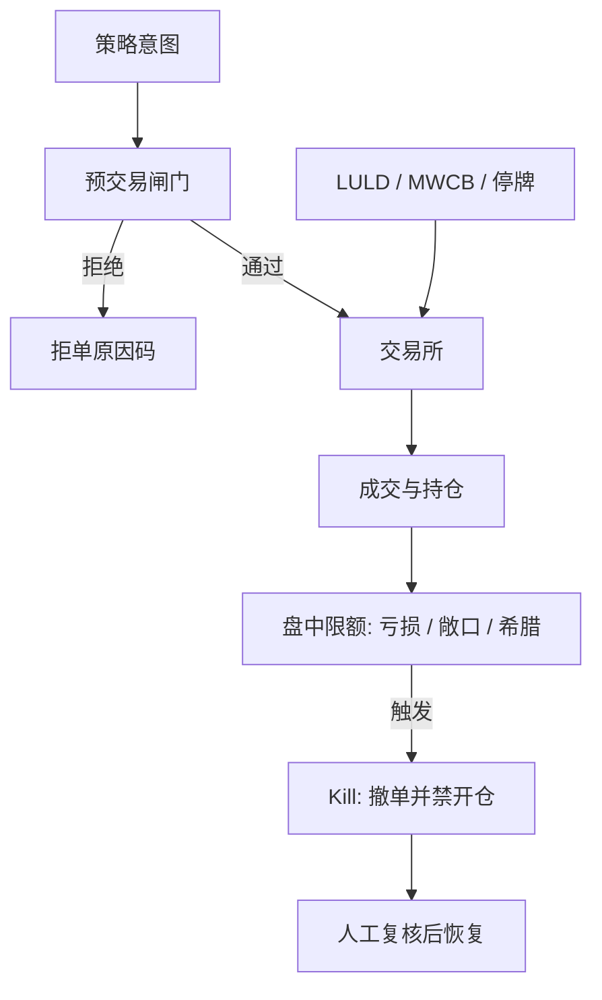

# 风控闸门与熔断

熔断打断的是交易的连续性，不是损失本身；它把一段时间的价格发现推迟到规则允许重新开市之后，并改变参与者在暂停前后愿意提供的流动性。

<footer>—— Greenwald and Stein, Transactional Risk, Market Crashes, and the Role of Circuit Breakers, Quarterly Journal of Economics, 1991</footer>

交易系统里的「闸门」不是策略参数，而是一条与策略解耦的硬约束：订单在离开本机之前可以被拒绝，仓位在穿过限额之后可以被强制平仓或禁止新开。交易所一侧另有一套公开规则——美国股票的 Limit Up–Limit Down（LULD）、市场范围熔断（market-wide circuit breaker, MWCB）、1987 年股灾之后的 NYSE Rule 80B 传统——它们暂停的是整个品种或整个市场，而不是某一家基金的算法。Greenwald 与 Stein（1991）从交易风险出发解释熔断为何可能改善崩溃中的流动性供给；Subrahmanyam（1994）则给出理论：暂停改变知情与非知情交易者的到达，波动既可能被压制也可能在重开时被推迟释放。本篇把**公司内部的 kill switch**与**市场公开熔断**分开写：前者是操作风险与限额的执行器，后者是交易所的价格发现中断；两者都会进入实盘 P&amp;L，但对象、权限与失败模式完全不同。

## 问题

自动化交易把「下错一笔单」的成本从人工反应时间压缩到毫秒。2012 年 Knight Capital 因部署错误把旧代码与新代码同时接到市场，约四十五分钟内实现数亿美元亏损，随后被 SEC 以市场准入规则（Rule 15c3-5）项下的风控失效处罚。2010 年 5 月 6 日的闪崩里，E-mini S&amp;P 与个股出现流动性瞬时蒸发，CFTC–SEC 联合报告与 Kirilenko、Kyle、Samadi、Tuzun（2017）表明：高频做市在压力下撤出，卖单砸进已空的簿，价格发现在一两分钟内失真。问题因此有两层。第一层是**本账户**：如何保证任何策略、任何热路径都不能越过预先写死的名义、亏损、频率与价格带。第二层是**市场规则**：当交易所自己停住，你的撤单、排队与对冲假设全部作废，[止损](/quant/statarb-stops)价变成不可成交的缺口。

闸门若与策略写在同一个进程、同一套配置里，策略「优化」会把闸门一起优化掉。这不是修辞：回测里把日亏损上限当成可调超参，等于在样本内截断左尾，和 Kaminski–Lo 讨论的止损滤波器是同一类偏差，只是截断发生在组合层。Kill switch 的定义必须独立于信号，并由无权改策略的人变更。

### 内部闸门与交易所熔断不是同一把锁

内部闸门作用在**你的订单流**：预交易检查（pre-trade）拒绝越权委托，盘中检查在成交后更新限额，紧急开关撤销未成交并禁止新开。交易所熔断作用在**所有人的订单流**：LULD 把个股成交限制在参考价附近的带内，MWCB 在宽基指数跌幅达到 7%、13%、20% 时分级暂停。Greenwald–Stein 关心的是市场崩溃时做市商的交易风险；内部闸门关心的是单一主体的操作与杠杆。把 MWCB 当成「我的策略会自动停」是范畴错误：熔断重开后，你的仓位可能已经隔夜、已经穿了保证金，而交易所并不替你平仓。

Rule 15c3-5 要求经纪商对市场准入做财务与监管风控，包括错单、重复单与信用限额。买席位直连的机构不能把这项义务「外包给策略」。闸门是准入条件，不是 alpha 的一部分。

## 方法

把控制点按时间与权限分层，而不是设一个巨大的 if。

**预交易（同步、可拒绝）。** 每笔拟发订单对照：账户与策略的最大名义、单名集中度、价格相对中间价或涨跌停的偏离、下单速率、重复单指纹、以及该品种是否处于停牌或 LULD 暂停。拒绝必须留下原因码，供[监控](/quant/trading-telemetry)统计，否则「闸门很严」无法与「行情源坏了导致误拒」区分。价格带要用独立于信号的参考价（例如交易所官方或另一家托管的 BBO），避免策略自己的微观价格把带算歪。

**盘中（异步、可触发平仓或只禁开仓）。** 标记到市场的亏损、毛/净敞口、希腊字母桶、与风险模型预测跟踪误差。触发后的动作必须预先枚举：只撤未成交、禁止新开但允许减仓、对冲到基准、或向经纪商发 flatten。Khandani 与 Lo 描述的 2007 年 8 月量化去杠杆说明：许多账本同时执行「减风险」时，[拥挤](/quant/factor-crowding)把闸门变成冲击源。因此组合级闸门应先降杠杆、再按流动性顺序减仓，而不是让每一条策略的止损同时抢薄簿。

**人工与法定。** 总开关应能在交易与风控两处独立按下，并在按下后锁配置，直到双人复核恢复。与[分数 Kelly](/quant/kelly-sizing)的关系是：Kelly 给的是增长最优仓位，闸门给的是破产约束；满 Kelly 在参数高估时会先撞上闸门而不是先实现对数增长。

### 阈值标定不能用全样本左尾

日亏损限额若按全样本 99% 分位来设，等于把最坏路径写进规则后再声称「从未击穿」。正确做法是：限额来自授权与资本，而不是来自回测分位；再用样本外路径做压力，看触发频率是否高到让策略无法工作、或低到形同虚设。极值应用 [EVT](/quant/evt) 讨论尾巴形状，但 EVT 分位数是风险报告，不是自动平仓线——自动平仓要考虑流动性和能否成交，这超出了广义帕累托的对象。

交易所熔断的「方法」对交易者是适应而不是设计：文档必须写明，暂停期间如何处理子单、如何取消队列、重开集合竞价用什么价格更新风控参考。Lauterbach 与 Ben-Zion（1993）对以色列市场熔断的经验表明，暂停后的价格发现与成交量路径并不自动回到暂停前；把熔断当成免费的波动压缩，会在重开缺口上重复支付。

## 机制

预交易闸门改变的是到达交易所的订单强度。过紧的价格带把紧急对冲也拒掉，账本在跳跃后以错误 Delta 过夜；过松则只在事后写日志。机制上这是 Type I / Type II：误拒伤害对冲，漏放伤害资本。频率限制针对的是失控循环（撤单重发、错单重试），不是针对知情交易的到达率；把它设成「每秒最多 N 笔」而不区分新单、改单与撤单，会在波动升高、本应加密报价时把做市策略卡死。

市场熔断的机制是切断连续竞价。Subrahmanyam 指出，若知情交易者预期暂停，他们可能把交易提前，使暂停前波动上升——熔断被部分内生化。闪崩后引入的 LULD 用更窄的个股带来替代全面停市，意图是限制明显错价而不冻结指数。对套利账本，带内限制等于暂时关闭一腿：ETF 与成分股、期货与现货若不同步触及，中性变成方向，这与涨跌停下的[指数套利](/quant/index-arb)是同一类单腿风险。

Kill switch 触发后的路径依赖往往比触发条件更重要。若动作是「市价打平」，你在最差流动性上实现损失，闸门变成强制止损，Kaminski–Lo 对趋势资产「止损有时有用」、对回归资产「止损有害」的分野在组合层再现。更可审计的动作是：撤开仓、只允许减仓限价、并把剩余风险交给预先指定的人工台。闸门买的是时间，不是最优执行。

### 闸门失效通常是配置与权限，不是公式

Knight 类事故很少是因为少写了一个不等式，而是因为：热备与主进程各发一遍、配置回滚把限额改回无限、测试品种映射到生产代码、或风控进程依赖与策略同一份行情而一起冻结。独立行情、独立时钟、独立的「心跳死亡则自动禁发」比把限额从 10% 调到 8% 更接近真正的冗余。15c3-5 与 MiFID II 对算法交易的组织要求，核心是责任人与可杀进程，而不是某一个希腊字母阈值。

把熔断当成 alpha：在 MWCB 前减仓、暂停期间做跨市场，假设你能预知触发且对腿仍可交易。这把公共规则变成拥挤的择时信号，容量极差，也不应写进内部闸门的恢复条件。

## 边界与工程取舍

不要用回测器里的「若亏损超过 x 则仓位归零」去替代生产闸门：回测没有拒单、没有部分成交、没有交易所拒绝、也没有人工恢复流程。不要把策略的时间止损与公司 kill switch 共用一个开关，否则研究同学会为了提高样本内夏普去关风控。A 股涨跌停、临停、指数熔断（2016 年的短暂实践）使「价格带」必须用本地规则，不能把 LULD 参数平移。衍生品的闸门要按保证金与场景亏损，而不是只按标的名义；期权组合的 Delta 中性在底层熔断时立即失效，见 [希腊字母对冲](/quant/greeks-hedge)。

报告应区分：预交易拒绝率、盘中触发次数、触发后的实现亏损、以及误触发（行情错价、合约乘数配错）。后一项是闸门的成本；前几项是它买到的保险是否太贵。没有误触发统计的「零事故」可能只是闸门从未武装。

恢复生产必须比按下更慢：对账持仓、核对未成交、确认交易所会话，再按白名单品种逐步放开。快速恢复是第二次事故的常见前奏。

## 小结

- 内部 kill switch 是与策略解耦的硬限额与紧急动作；交易所熔断是公共的价格发现中断。两者都会造成缺口与单腿风险，但权限与失败模式不同。
- Greenwald–Stein（1991）与 Subrahmanyam（1994）讨论的是市场暂停如何改变流动性与知情交易时机；不能把这些定理当成公司日亏损限额的公式。
- 预交易拒绝、盘中禁开仓、市价打平是三种强度；在拥挤里同步打平会把风控变成冲击，见 2007 年量化去杠杆与闪崩中的流动性蒸发。
- 限额来自资本与授权，不是来自全样本分位；阈值若被策略搜索过，闸门就变成了另一个止损超参。
- 出处：Greenwald and Stein, *QJE*, 1991；Subrahmanyam, *Journal of Finance*, 1994；Lauterbach and Ben-Zion, *Journal of Finance*, 1993；Kirilenko, Kyle, Samadi and Tuzun, *Journal of Finance*, 2017；CFTC–SEC, *Findings Regarding the Market Events of May 6, 2010*；SEC Rule 15c3-5；Khandani and Lo, 2007/2011。
