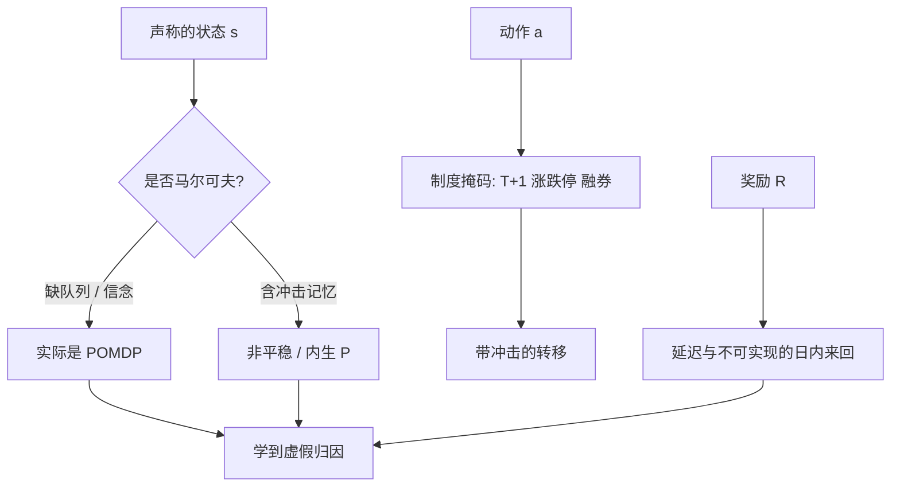

# 交易作为 MDP 的陷阱

马尔可夫决策过程假定下一状态的分布只依赖当前状态与动作；市场会记住你的存货、冲击与同场玩家的适应，这个假定经常不成立。

<footer>—— 据 Puterman 对 MDP 的定义，以及 Sutton and Barto, Reinforcement Learning 对马尔可夫性质的讨论整理</footer>

[上一课](/quant/no-future-function)把未来函数写成特征、标签或评估手续使用了决策时刻不可获得的信息；`shift(1)` 不是充分条件，Purged k-fold 与 embargo 按事件持续期切断重叠。缺口是：即使点-in-time 已经做对，把下单写成 MDP 仍可能是错的生成过程摘要。状态是否马尔可夫、是否平稳、奖励是否在动作当时可归因，以及 [T+1](/quant/cn-tplus1) 把「买」和「可卖」拆成两个日历日，都不被一次滞后修好。本课写这些陷阱，为[执行 RL](/quant/rl-execution) 提供问题定义。不重开 purge 的日历。

## 问题

点-in-time 切断的是信息泄漏，不保证环境是马尔可夫。标准 MDP 是五元组 $(\mathcal{S},\mathcal{A},P,R,\gamma)$。交易者希望 $s$ 里装行情与库存，$a$ 是订单，$R$ 是标记到市场的收益。立刻遇到三件事。部分可观测：你看见的是聚合盘口，不是全部编号与隐藏量，真实状态是 [L3 队列](/quant/l2-l3-data) 与所有人的意图。非平稳：其他代理人在适应你的策略，周末、到期、制度变更会改 $P$。内生冲击：你的 $a$ 改变价格，从而改变你自己将来面对的 $s$，且这个改变通常不进你写进 $s$ 的那几个字段。若把价格当成外生，强化学习学到的是在一个不会被自己搬动的市场上做方向；一上真实规模，$P$ 就变了。

奖励延迟更致命。日频 alpha 的盈亏在收盘才清楚，执行的滑点在订单生命周期结束才清楚，T+1 下今日买入的卖出权明天才存在。把每一步的标记收益当 $R_t$，是在把未实现的估值当已实现；把整段回合的终期财富当唯一奖励，信用分配又跨过成百上千个微观动作。问题不是「用不用 RL」，而是：若不把不可观测、非平稳、冲击与延迟写进模型，MDP 只是一个错误的生成过程摘要。

### 马尔可夫性在订单簿上几乎必然失败

即使只做最优执行、方向已定，剩余量与时间并不足以构成马尔可夫状态。同一剩余量，排在队头与排在队尾的填成概率完全不同，见[队列位置](/quant/cancel-queue-position)。对手方的取消强度依赖你刚吃过的那一档是否暴露了冰山。短期反向与知情交易让价格增量依赖更早的订单流，而不是只依赖当前中间价。把中间价、价差、库存塞进 $s$，等于假设这些统计量已经吸收了全部历史——Kyle 与 Glosten–Milgrom 的理论状态是信念与知情规模，它们不在公开行情里。于是你优化的是一个 POMDP 的错误压缩，策略对压缩误差过拟合。

折扣因子 $\gamma$ 在交易里没有自然对应。财务目标是路径上的财富或短视的执行成本，不是无限期折扣效用。把 $\gamma$ 调到 0.99「因为深度强化学习教程这么写」，是把控制问题的时间尺度藏进一个无单位的超参。

## 方法

若仍要用 MDP 语言，先把问题收窄到一个奖励可在短地平线上归因的任务：例如在 $T$ 分钟内执行完 $Q$ 股，奖励是实施缺口的负值。状态至少应包括：剩余量、剩余时间、可见盘口、自己的队列位置（有则用，无则承认不可观测）、今日已买但按规则不可卖的量。动作应是交易所真实允许的订单类型，而不是连续的「仓位增量」——A 股没有随意的市价扫单语义，涨跌停与有效申报范围会让许多 $a$ 无效。转移应用带冲击的模拟器，而不是历史价格加动作不影响路径；模拟器偏差见[下一篇](/quant/sim-to-real-trading)。

评估不能只用模拟器里的累积奖励。要在真实账户或至少在从未用于训练的行情上做冻结策略的前瞻：同样的状态编码器、同样的风控剪裁，只换数据。Moody–Saffell 优化夏普或下行偏差等直接目标，避免把逐步标记收益加成一个与风险无关的和；这比先学 Q 再希望 Q 碰巧对应夏普更诚实。若任务是组合层 alpha，强化学习往往不是第一选择：信号衰减与换手用[显式规则](/quant/factor-decay-turnover)更可审计。RL 更适合执行与做市这类动作频繁、奖励相对局部的问题。

### 约束必须写进动作集，而不是写进惩罚项碰运气

T+1、涨跌停、融券库存、资金前端检查，都是硬约束。把它们写成奖励里的大负数，智能体会在模拟器里学到「偶尔违规换更高奖励」，到了交易所则直接废单。正确做法是动作掩码：当前不可卖的持仓对卖出动作的 logit 置为 $-\infty$；涨停板上买入动作直接剔除；无券可融则禁止开空。Sutton 与 Barto 允许把约束环境编码进 $P$；工程上必须在动作层强制，因为真实 $P$ 会拒绝无效单，而不是给一个负奖励再成交。这与把杠杆写成平滑惩罚不是同一件事——杠杆可以连续，废单是离散的制度。

## 机制

当环境非马尔可夫，时序差分把本该归因于更早冲击的亏损，记到当前 $(s,a)$ 上。策略于是学会一些虚假相关：某类盘口形状之后总亏钱，其实是因为你昨天打穿了深度、今天价格在均值回复。非平稳下，最优策略是其他代理人策略的函数；你一部署，对手的取消与抢跑改变 $P$，训练时的最优在测试时变差。这是经济里的卢卡斯批判在微观结构上的版本：政策（你的策略）改变规律。

部分可观测时，记忆（RNN、帧堆叠、信念状态）是在近似 POMDP 的滤波。记忆也会记住训练期的特定事件，变成另一种过拟合。冲击内生时，小单上学到的耐心在大单上错误：Kyle 的 $\lambda$ 随你的规模变，环境不是同一个 MDP 的尺度缩放，而是另一个游戏。把规模当状态的一维不够，除非模拟器里的价格对你的量有正确的弹性——而那正是最不准的一块。

「离线强化学习 + 历史成交」并不自动回避冲击问题。历史成交是当时参与者的均衡，已经含了他们的冲击，不含你额外的量。在历史轨迹上当策略能多成交，是反事实，不是数据里的事实。

### 为什么 T+1 把单日 MDP 剪断

在允许 T+0 的市场上，买入动作立刻扩展可卖集合，状态里的库存是单一标量。A 股股票竞价交易下，当日买入在交收前不得卖出（实行回转交易的品种除外），见上交所《交易规则》第 3.1.4 条。于是库存至少要分两格：可卖旧仓与今日新买。奖励若含当日买卖价差的「做完一个来回」，在制度上不可达。把美股日频交易的 MDP 教材搬过来，智能体会学到违规的日内回转。状态、动作掩码与奖励必须按公开交易规则重建，而不是按教科书的存货模型。

## 边界与工程取舍

MDP 仍是有用的记账语言：它强迫你写出 $s,a,R$。它不是对市场的字面描述。许多「RL 交易」论文在无冲击、可卖空、无涨跌停的模拟器里打败买入持有，这只说明在错误的 $P$ 上优化成功。Dulac-Arnold 等人列出的现实强化学习挑战——样本效率、约束、部分可观测、非平稳——在交易里同时出现，而且比机器人更缺稳定的奖励。

不要用强化学习去发现 alpha：搜索空间太大，泄漏与多重检验更难审计。不要把连续仓位当成动作却在离散、有涨跌停的交易所里部署。不要在同一段行情上既训练又调奖励塑形。若执行问题可以用 Almgren–Chriss 一类凸目标近似，先写凸的；RL 留给凸模型明显失败的残差，例如队列位置与状态依赖的流动性，并且用[模拟器偏差](/quant/sim-to-real-trading)的清单验收。

把人类交易员的决策过程称为 MDP，只是隐喻。交易员使用的是未写明的信念与制度知识。强化学习智能体只能优化你写进 $R$ 与 $s$ 的东西；没写进去的合规与可交易性，不会在梯度里出现。

## 小结

- MDP 要求马尔可夫转移、可归因奖励与明确动作集；公开行情加库存通常不满足。
- 部分可观测、其他代理人适应、自身冲击，使 $P$ 依赖未写入 $s$ 的历史。
- 硬制度约束应做成动作掩码，而不是靠惩罚碰巧遵守。
- A 股 T+1 把可卖库存与当日新买拆开，单日来回的奖励在规则上不可实现。
- RL 更适合短地平线执行，不适合当 alpha 挖掘机。
- 出处：Puterman, *Markov Decision Processes*；Sutton and Barto, *Reinforcement Learning*；Moody and Saffell, *IEEE TNN*, 2001；Nevmyvaka, Feng and Kearns, ICML, 2006。
