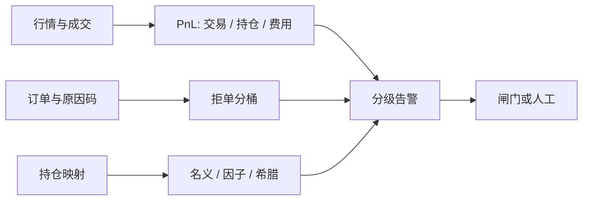

# 监控：PnL、敞口、拒单

纸面组合与实际成交之间的差额是实施缺口；若你不能按时钟把这笔差额拆成报价、延迟、拒单与部分成交，缺口就只是一个事后数字，不能指导下一笔单。

<footer>—— Perold, The Implementation Shortfall: Paper versus Reality, Journal of Portfolio Management, 1988</footer>

实盘监控要回答的不是「今天赚了吗」，而是：盈亏从哪一类风险来、敞口是否仍在授权里、以及意图有多少从未变成订单或从未变成成交。Perold（1988）把决策价与成交价之差写成实施缺口，使执行第一次有了会计对象。Harris 的市场微观结构把订单状态、展示与场所写成可观测事件。监控系统是把这两件事做成**按时戳对齐的时间序列**：标记 PnL、分桶敞口、交易所与风控的拒绝，外加心跳与数据延迟。它与[风控闸门](/quant/trading-kill-switch)互补——闸门是控制，监控是观测；没有观测的闸门只能在击穿后被发现，没有闸门的监控只是仪表。本篇写三类核心序列各自测什么、如何避免把会计 PnL 当成风险，以及拒单为何往往是最早的故障信号。

## 问题

交易进程同时产生三种容易被混在一张「仪表盘」里的量。**PnL** 是价值变化，依赖价格源、费用、应计与未实现估值；盘中用中间价估值与用可成交的买卖报价估值，数字可以差一个价差。**敞口** 是因子、名义、希腊字母或期限桶上的载荷，依赖风险模型与映射（期货乘数、期权 Delta、FX 头寸的货币）。**拒单** 是意图被风控、网关或交易所挡住的计数与原因码，依赖你是否把内部拒绝与交易所拒绝记成同一对象。把三者加总成一个红灯，会在「模型在亏钱」「映射错了导致名义翻倍」「行情中断导致全部预交易拒绝」之间无法选择动作。

延迟使问题更尖。成交回报晚于行情，盘中 PnL 会把旧仓位乘上新价格，造成虚假尖峰；风险模型若用昨日收盘暴露乘今日因子收益，盘中「因子 PnL」与交易 PnL 对不上是常态而不是 bug。监控必须声明每个数字的时钟与定义，而不是追求所有面板在每一秒相等。

### 会计 PnL 不是风险限额的输入

已实现 PnL 含有你昨天就决定的 Theta、价差收敛与费用；未实现 PnL 含有今日因子与特异性。用总 PnL 去触发[闸门](/quant/trading-kill-switch)，等于把存量仓位的估值噪声当成新的操作事故。更干净的分解是：交易 PnL（今日成交相对决策价，即 Perold 缺口的实现）、持仓 PnL（昨日仓位乘今日价格变化）、费用与借券、以及估值调整。持仓 PnL 再按风险模型拆到因子与残差，才能回答「亏在拥挤的动量上还是亏在一只名字的跳跃上」。Brinson 式配置归因与因子归因是下一层会计，盘中第一层只要分得开交易与持仓。

中间价 PnL 在报价稀疏时会跳。应用可执行价（买仓用 bid、卖仓用 ask）做一套保守 PnL，与中间价并行。两套持续分叉，说明价差或深度已经不支持当前名义，这是敞口问题，不是「策略失效」的哲学问题。

## 方法

**PnL 流水。** 每笔成交记录决策价（信号价或到达中间价）、委托价、成交价、数量、费用、流动性标志（maker/taker）。日终与经纪商、托管对账，盘中允许小的未匹配，但未匹配名义必须单独显示。实施缺口沿 Perold 拆成延迟（决策到委托）、市场（委托到成交）与错过（未完成部分相对决策价的机会成本）。错过腿若被内部闸门拒绝，应与被交易所拒绝分开，否则优化执行的人会去「修复」风控。

**敞口流水。** 按账户、策略、标的、因子、货币、到期日做树状汇总。希腊字母与债券久期必须带单位（每 1% vol、每 1 个现货点、每基点），见 [Delta / Gamma / Vega](/quant/greeks-hedge)。敞口的刷新频率可以低于行情：风险模型协方差本来就是慢变量；但**映射**（合约乘数、股票拆分、期权持仓的底层）必须与成交同频，否则乘数错误会以「因子暴露」的面目出现。与[基本面风险模型](/quant/fundamental-risk-model)或 PCA 的预测跟踪误差对照，盘中实现波动若持续高于预测，不是立刻改模型，而是先查是否有未映射的期权或外汇。

**拒单流水。** 原因码至少分：内部预交易、内部风控、会话与协议、交易所业务拒绝（价格、权限、自成交预防）、交易所系统。FIX 的 $35=\mathrm{8}$ 与业务拒绝不是同一个事件。拒单率应按品种与策略做指数加权，突变比绝对水平更有信息：做市策略在正常日拒绝率高可能只是报价被点，在无成交时拒绝率骤升可能是价格带或合约状态错了。

### 对齐时钟比提高采样率更重要

监控的联合对象是 $(t, \mathrm{PnL}, \mathrm{exposure}, \mathrm{rejects})$。若行情用交易所时间、成交用本地收包时间、风险用栏位日期，三个序列的「同一秒」没有定义。事件驱动账本应以交易所时间为主键，本地时间只用于延迟诊断，这与迟到数据对账是同一纪律。心跳：策略、风控、行情网关各自上报；缺心跳应按死亡开关处理，而不是等 PnL 开始跳。O'Hara（2015）强调高频环境下「什么算一笔交易、什么时候发生」本身是微观结构对象；监控若忽略时间戳定义，仪表盘上的尖峰不可复盘。

拒单是领先指标，PnL 是滞后指标。映射错误、合约到期、权限失效，往往先表现为某一类原因码堆积，几分钟后才出现异常 PnL。把告警全挂在 PnL 上，等于放弃最早的信号。

## 机制

Perold 缺口把执行从「滑点一个基点」变成可加的会计。监控若只报成交均价相对 VWAP，会把故意的时机选择（不想在毒性流里吃单）与无能混在一起；相对决策价的缺口才能连回策略。Berkowitz、Logue 与 Noser（1988）用 VWAP 衡量纽约所交易成本，对象是经纪商执行，不是信号衰减；两套基准可以并存，但面板上必须写明。

敞口的机制是线性近似。因子 PnL $\approx w^\top f$ 只在小移动与正确载荷下成立；跳跃、停牌、期权凸性会把残差做大。此时应切换到情景：重估整本账，而不是把残差当成「alpha」。监控要能一键从因子分解跳到重估价，避免风险经理在非线性产品上与线性仪表争吵。

拒单改变策略的有效到达率。内部拒绝高，实际下单强度下降，做市库存无法调节，这会在下一阶段变成敞口超限——故障从拒单迁徙到限额。交易所拒绝高，可能是价格已离开带、或自成交预防把对锁单全挡回；后者在多策略共享账户时常见，监控必须能按策略拆，而不能只按账户。

### 告警分级与拥挤日

每一个尖峰都发 pager，等于没有 pager。分级应绑定动作：行情心跳丢失 → 禁新开；内部拒绝率超阈值 → 停该策略；持仓 PnL 超授权 → 触发闸门而不是再发一封邮件；因子暴露偏离预测两个标准差 → 工作日审查，不必盘中自动平仓。2007 年 8 月与闪崩这类日子，所有面板同时变红，此时监控的价值是**排序**：先看拒单与心跳（系统是否还在控制下），再看敞口（还有没有对冲工具），最后看 PnL（损失是否已实现）。反过来从 PnL 开始，会在最吵的数字上消耗完注意力。

## 边界与工程取舍

不要把研究环境的 PnL（未扣费、用收盘价、假设全部成交）接到实盘面板。不要用单一「健康分」替代原因码。暗池与冰山使成交时钟与公开行情不对齐，缺口分解会把隐藏流动性记成延迟，见[订单类型](/quant/order-types)。跨境、多上市地要用统一货币与统一合约键，否则敞口树会把同一经济头寸算两次。

隐私与最小权限：监控需要仓位与盈亏，不需要客户身份或研究备忘；访问应按职能切开。这与另类数据研究里「聚合、授权、不碰个人可识别信息」是同一类约束，只是对象从持卡人换成了基金内部账。

日终对账不平不要用「先用监控数出报表」。官方 PnL 以经纪商与基金行政为准，监控是领先的操作视图。长期分叉说明映射或费用漏记，必须修流水，而不是调监控公式去贴平。

## 小结

- 监控的核心对象是带时钟定义的 PnL、敞口与拒单；三者混成一个灯会掩盖该按下闸门还是该修映射。
- Perold（1988）的实施缺口是交易 PnL 的会计骨架；VWAP 偏差是另一套经纪商基准，不能替代决策价缺口。
- 拒单原因码往往先于 PnL 暴露故障；内部闸门拒绝与交易所拒绝必须分开。
- 敞口依赖映射正确，线性因子分解在跳跃与期权凸性下不够，需要能切到重估。
- 出处：Perold, *Journal of Portfolio Management*, 1988；Berkowitz, Logue and Noser, *Journal of Finance*, 1988；Harris, *Trading and Exchanges*；O'Hara, *Journal of Economic Literature*, 2015；Kirilenko et al., *Journal of Finance*, 2017。
