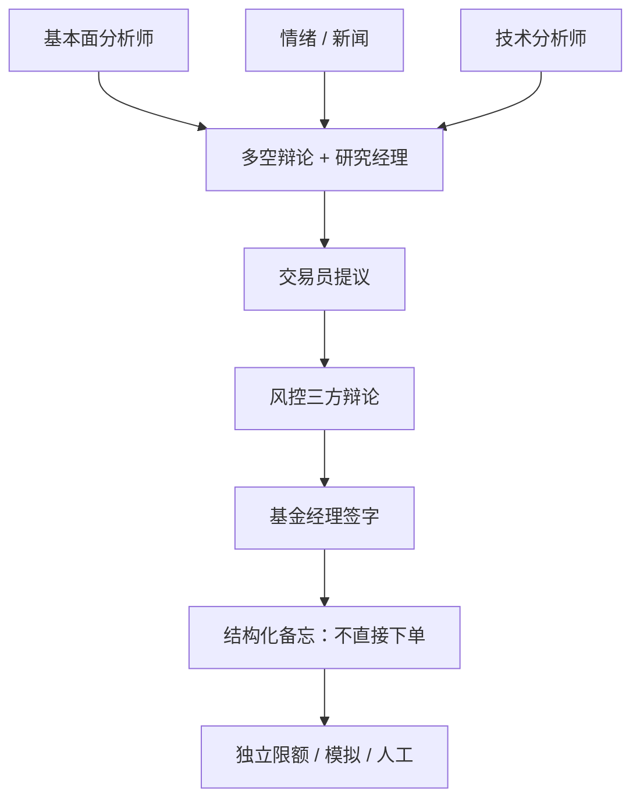

# TradingAgents 多智能体辩论

    
用专业化角色复制交易团队的协作：分析师并行取证，多空研究员对抗辩论，交易与风控再合成；通信则混合结构化输出与自然语言。

    <footer>—— Xiao, Sun, Luo and Wang, TradingAgents: Multi-Agents LLM Financial Trading Framework, arXiv:2412.20138</footer>

Xiao、Sun、Luo 与 Wang（UCLA / MIT / Tauric Research）提出 TradingAgents：把券商研究与交易室的分工写成 LLM 多智能体图。分析师组并行处理基本面、情绪、新闻与技术指标；研究组由多头与空头研究员多轮辩论，研究经理综合；交易员给出买卖与规模；风控组以激进、中性、保守三方再辩，基金经理最终批准。通信上，他们批评纯自然语言历史造成的「电话效应」（上下文腐蚀），主张结构化状态加辩论式自然语言。代码开源 `TauricResearch/TradingAgents`。本篇写**组织架构与辩论协议**如何改变信息综合，以及历史回测上的收益指标为何不能外推为实盘。不提供可运行的交易配置，不讨论利用延迟、盘口或未公开信息的做法。

## 问题

单智能体把新闻、报表、价格塞进一个提示，任务过载，也没有内部反对意见。早期多智能体金融系统多是各干各的检索，缺少交易室那种「先对抗、再裁决」的流程。另一问题是接口：只用对话历史当记忆，长链决策会丢失约束与数字，关系结构被检索打散。TradingAgents 要复现的是真实公司里已经有效的人类 SOP：分工、对抗、风控签字——用 LLM 扮演各席位。

拟人化的代价在 [TiMi](/quant/timi-trading-agent) 里被写成情绪偏误与热路径延迟。TradingAgents 把辩论留在决策路径上，解释性好，延迟与费用差。两种架构服务不同目标：一个接近研究备忘录生成器，一个接近编译到程序的执行器。问题不是谁更「能赚钱」，而是：对抗辩论是否降低确认偏误、结构化状态是否降低电话效应、以及这些增益是否经得起同一信息集上的消融。

### 辩论不是新的价格信息

多空双方读的是同一组分析师备忘。辩论改变的是**综合规则**：强迫列出反方论据，再由经理打分。它不创造新的基本面。若分析师工具返回的数据有前视或幻觉，辩论会把错误说得更圆。评测应能关掉辩论、关掉某一类分析师，看夏普变化来自哪一层。否则「多智能体优于单模型」只是更多计算与更多提示工程。

结构化输出约束字段（评级、理由、动作），不约束字段为真。`bind_structured` 可以让模型每轮都交出合法 JSON，同时里面的 EPS 是编的。数字必须回指工具返回值。

## 方法

**席位。** 基本面、情绪、新闻、技术四类分析师，各配备检索与计算工具（论文列举网页、社交媒体检索、指标计算等——实现以仓库为准）。多头研究员强化催化剂与上行；空头研究员强化风险、竞争与脆弱假设；研究经理用分档量表裁决并写出投资计划。交易员综合计划与历史风格做仓位提议。风控三席位再辩暴露与止损类约束，基金经理批准。这是组织图，不是订单路由图。

**通信。** 结构化状态在图上传递，避免只靠越来越长的聊天记录。自然语言保留给辩论，因为对抗需要引用对方上一轮论点。混合接口的假设是：控制与推理用结构，说服用语言。实现常用图执行器编排节点。每个节点应只读声明的状态切片，防止「基金经理看见未来节点的字段」。

**实验。** 论文在历史金融数据上相对若干基线比较累计收益、夏普、最大回撤，并称有改进。这类结果依赖：宇宙与时段、交易成本是否计入、是否允许未来新闻、工具是否返回点-in-time。未满足时，优越性只在叙事里。正确对照是：同一工具、同一日期对齐的单智能体，以及无 LLM 的规则基线。Lopez-Lira–Tang 式新闻多空是更干净的文本基线。

### 作为研究系统而非执行系统

合理用法是生成**带反对意见的投资备忘**：分析师笔记、多空论点、未决风险。备忘进入人类或独立模型的二次审查，特征仍由确定性管道计算。不合理用法是把基金经理节点的 `approve` 直接接到经纪商。决策路径上的多轮 LLM 使同一输入不可复现（温度、模型升级），与风控要的确定性冲突。若要自动化，应像 TiMi 那样把结论编译成冻结规则，再走模拟门禁。

电话效应是真实的工程问题：长对话里数字被改述、约束被遗忘。结构化状态能减缓它，只要每个字段有单一写入者。多节点都能改 `position_size` 时，结构只是把混乱类型化了。

## 机制

对抗辩论降低确认偏误的机制，来自显式的反对者角色：空头被优化去攻击多头的假设，经理必须在双方文本上做不可兼得的选择。这类似集成，但相关极高——同一基座、同一工具、同一日数据——多样性主要是提示，不是模型或数据多样性。因此增益可能来自「更长的思维链与自我批评」，单智能体加一份「请列出反方观点」也许能复制一大部分。消融必须做。

并行分析师的机制是工具分工：技术节点算指标，新闻节点检索标题。若工具质量低，并行只是并行幻觉。基本面节点若读取未滞后的财报，整条链前视。情绪节点若用事后 LLM 给历史帖打分，见[舆情](/quant/news-nlp-alpha) 的版本冻结要求。风控辩论的机制是把仓位提议暴露给保守先验；若三席位仍是同一模型，保守只是提示词里的形容词，不是独立的风险模型。真正的风险约束应是硬编码的限额、[闸门](/quant/trading-kill-switch) 与保证金，LLM 只能建议，不能放行超限。

相对角色扮演金融助手（FinGPT 应用层、BloombergGPT 内部工单），TradingAgents 把「助手」扩成「模拟公司」。解释性来自可读的辩论记录，适合合规审计的叙事层；统计性来自最终仓位序列，必须按标准回测协议审。

### 延迟、费用与不可复现

每决策日多节点、多轮，费用与延迟随席位线性甚至超线性增长（辩论轮次）。这不适合分钟级。日频研究备忘可以承受；盘中执行不能。模型供应商升级会使同一提示在下季给出不同辩论，历史回测不可复现。科学报告应冻结模型日期、温度、轮次上限与随机种子，并把这些列入版本哈希。

## 边界与工程取舍

不要把开源仓库的默认提示与在线新闻 API 接到真实账户。不要在回测中让新闻工具返回「当前网页」。不要用最大回撤改善代替成本后收益。不要让风控节点成为唯一风控——硬限额在代码里。社交与网页工具有版权与滥用风险，研究应使用授权数据与滞后快照。

可取的落地是：TradingAgents 产出结构化备忘与风险清单；组合构建仍用中性化、优化与人工签字；执行用独立算法。辩论记录归档，供事后归因：当时空头是否指出了后来实现的风险。这检验的是**过程质量**，比检验一个夏普更符合该架构的长处。

论文实验若未公开完整的订单级成交与费用，外部只能复制角色图，不能复制绩效。引用绩效句子时必须同时引用这一局限。

## 小结

- TradingAgents（Xiao et al., arXiv:2412.20138）用分析师并行、多空辩论、交易与风控再辩，模拟交易室 SOP；结构化状态用来对抗电话效应。
- 辩论改善的是综合与可解释性，不创造新信息；数字必须锚定工具输出。
- 热路径多轮 LLM 与确定性执行冲突；宜产出备忘，不宜直连经纪。
- 自报回测绩效在未复现成本、PIT 与试验次数前，只作架构示例。
- 出处：Yijia Xiao, Edward Sun, Di Luo, Wei Wang, *TradingAgents: Multi-Agents LLM Financial Trading Framework*，arXiv:2412.20138；代码 `TauricResearch/TradingAgents`。
