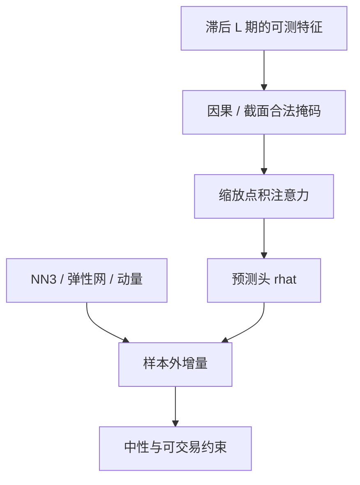

# Transformer 截面收益预测

注意力把任意两个位置的交互变成一次打分；用到收益预测时，位置是滞后的时间或同一日的其他股票，信息集与掩码决定这是条件期望还是泄漏。

<footer>—— 注意力内核见 Vaswani et al., Attention Is All You Need, NeurIPS 2017；截面预测的样本外协议见 Gu, Kelly and Xiu, Review of Financial Studies, 2020</footer>

前馈 [NN3](/quant/gkx-nn3) 把每个公司–月份当成独立的表格行。时间序列模型把同一公司的滞后收益与特征当成序列。Transformer 用缩放点积注意力在序列（或集合）上做内容寻址，避免循环网络的逐步传递，也避免把交互写死成固定滞后阶数。Jiang、Kelly 与 Xiu（2023）用卷积神经网络读价格图像，说明「让网络看路径形状」可以进入主流资产定价；注意力是同一意图的另一套原语。本篇写注意力在收益预测里可以看哪些位置、必须加哪些掩码，以及它相对 GKX 表格模型多出来的自由度如何被信噪比惩罚。内核的数值细节见 LLM 侧的 Scaled Dot-Product Attention 条目；这里只把它当成**带掩码的截面估计器**。

## 问题

表格模型假定 $t$ 日的预测只依赖 $x_{i,t}$。若可预测性来自路径——动量的形成期形状、波动的期限结构、收益在过去若干月的排列——则需要序列编码器。LSTM 把历史压进隐状态，长程依赖要穿过许多步；注意力让 $q_t$ 直接读任意滞后 $k$ 的键。问题是金融序列短、噪声大：月频个股路径只有几十到上百个点，注意力头很容易把某一次危机的特异形状记住。GKX 的教训是样本外 $R^2$ 以百分点计；Transformer 的参数量通常更大，默认假设应是过拟合，直到验证拒绝。

第二句话是「截面注意力」：让股票 $i$ 去读同一日其他股票 $j$ 的特征。这在经济上可以表示同行、客户或共同因子，在计量上极容易变成用同期收益平滑。没有把 $j$ 的标签与同期收益从键里拿掉，注意力就是泄漏的图模型。合法的截面注意必须与 [GNN](/quant/gnn-asset-pricing) 遵守同一信息集：只读 $\mathcal{F}_t$ 可知的特征，不读 $r_{j,t+1}$。

### 时间注意与截面注意是两个模型

时间注意：每个公司一条序列，位置是滞后月份，因果掩码禁止读未来。截面注意：每个日期一张集合，位置是股票，没有时间顺序，必须靠特征与边来限制谁能读谁。两者可以叠成「先时间编码、再截面混合」，参数与泄漏风险加倍。对照实验应分开报告，不要用一个大模型的单次样本外数字同时声称赢了 LSTM 和赢了 NN3。

把收盘价序列直接送进注意力而不做收益率或[分数差分](/quant/fracdiff)一类变换，模型会去拟合非平稳水平。GKX 用的是特征，不是原始价格路径；图像论文把 OHLC 画成图，仍是有界的形状，不是单位根水平。

## 方法

**序列。** 对每个 $(i,t)$，取滞后 $L$ 期的特征与收益（均已对 $t$ 可测），得到矩阵 $X_{i,t}\in\mathbb{R}^{L\times d}$。查询来自最近一期，键值来自 $1\ldots L$，因果掩码保证位置 $s$ 不读 $s'>s$。输出一个向量，再接到线性头预测 $r_{i,t+1}$。$L$ 由 IC 期限结构决定，见[标签重叠](/quant/label-horizon-overlap)：动量用十二个月，短反转用几天；把 $L$ 拉到十年通常只增加危机记忆。

**训练。** 时间切分、purge、早停与 GKX 相同。学习率与 dropout 对注意力更敏感：头数多时，单个头发散会污染平均。正则优先：权重衰减、头的 dropout、以及限制头数（金融里 2–4 头往往够用）。评价必须包含无注意的 NN3 / GBDT 与简单动量特征；Transformer 只报相对这些基准的增量。

**截面注意。** 若使用，键只能是滞后特征或时点图特征（客户、行业），并对同行数量做抽样或行业内注意，以免 $N^2$ 把全市场平均灌进每一个查询。显式行业哑变量或[行业中性](/quant/industry-neutral)往往已经吸收了大部分「读邻居」的增益。

$$
h_{i,t}=\mathrm{softmax}\left(\frac{Q_{i,t}K_{i,t}^\top}{\sqrt{d_k}}+M\right)V_{i,t}.
$$

$M$ 在非法位置为 $-\infty$。没有 $M$ 的「全连接股票 Transformer」默认视为泄漏，除非证明键不含任何未来函数。

### 与价格图像、文本注意的关系

Jiang–Kelly–Xiu 的图像模型把开高低收画成二维，用卷积读趋势形状，避免手工动量窗口。Transformer 读的是离散时间上的特征序列，表达力重叠，数据表示不同。文本上的注意力（新闻、公告）属于[舆情](/quant/news-nlp-alpha)：文档时间戳与交易时钟对齐之后，才能把 BERT 一类编码器接到收益头。三种「注意」——价格路径、公司特征序列、文本——应分族报告增量 $R^2$，不要堆进同一个多层注意再看 SHAP。

## 机制

注意力权重可视化不等于贡献：真正进入残差的是加权后的值。高权重但值接近零的滞后月贡献小。金融里权重还容易集中在波动最大的那几个月，模型学到的是危机指示而不是条件均值。应在测试年检查权重是否稳定落在经济上可解释的滞后（例如形成期 2–12 月），还是每年跳到不同的极值月。

相对树：GBDT 用分裂做交互，对尺度不敏感；注意力用点积，必须标准化，且交互是「谁在看谁」而不是「哪个分位」。相对 NN3：多了路径依赖，也多了过拟合维度。有效市场加低信噪的先验意味着：若手工动量已经把路径的一阶统计用完，注意力的合理结果是增量接近零。零增量是有效的负结果，应被发表在内部记录里，而不是靠加头直到样本内 $R^2$ 上升。

Avramov–Cheng–Metzker 的经济约束对 Transformer 更紧：路径模型换手往往更高，因为权重随最近收益跳动。验证目标应含换手惩罚，否则早停会选中一个不可交易的高 $R^2$。

### 中国市场的时钟

日频注意力若跨越隔夜与竞价，必须按可交易日历切片，涨停不可买的标签不能进损失，见 GKX 篇对 Leippold–Wang–Zhou 的讨论。T+1 使「用今日路径预测今日剩余时段」在股票上不可执行；标签应从下一可卖日算起。把美股分钟级注意结构搬到 A 股日频，是时钟错配。

## 边界与工程取舍

不要用未加因果掩码的编码器去「看全样本序列」。不要把 LLM 的上下文窗口叙事套到 94 个公司特征上——特征不是 token，长度短、共线强。不要用注意力权重当经济学发现而不做分样本。可做的是：短 $L$、少头、强制表格基准、换手进入验证。计算上的 FlashAttention 一类内核改变的是速度，不改变信息集。

出处：Vaswani et al., NeurIPS 2017；Gu, Kelly and Xiu, *RFS*, 2020；Jiang, Kelly and Xiu, *Journal of Finance*, 2023（价格图像）；Avramov, Cheng and Metzker, *Management Science*, 2023；Leippold, Wang and Zhou, *JFE*, 2022。注意力公式的缩放与饱和见 Vaswani 原文，不是收益可预测性的来源。

## 小结

- Transformer 用带掩码的注意力编码路径或合法邻居；预测协议仍是 GKX 的样本外 $R^2$ 与可交易约束。
- 时间注意与截面注意必须分开对照；截面注意读同期收益即泄漏。
- 增量应相对 NN3、树与手工动量报告；零增量是可接受的结果。
- 换手、涨跌停与 T+1 进入验证，否则路径模型只在纸面变强。
- 出处：Vaswani et al., 2017；Gu–Kelly–Xiu, *RFS*, 2020；Jiang–Kelly–Xiu, *JF*, 2023。
