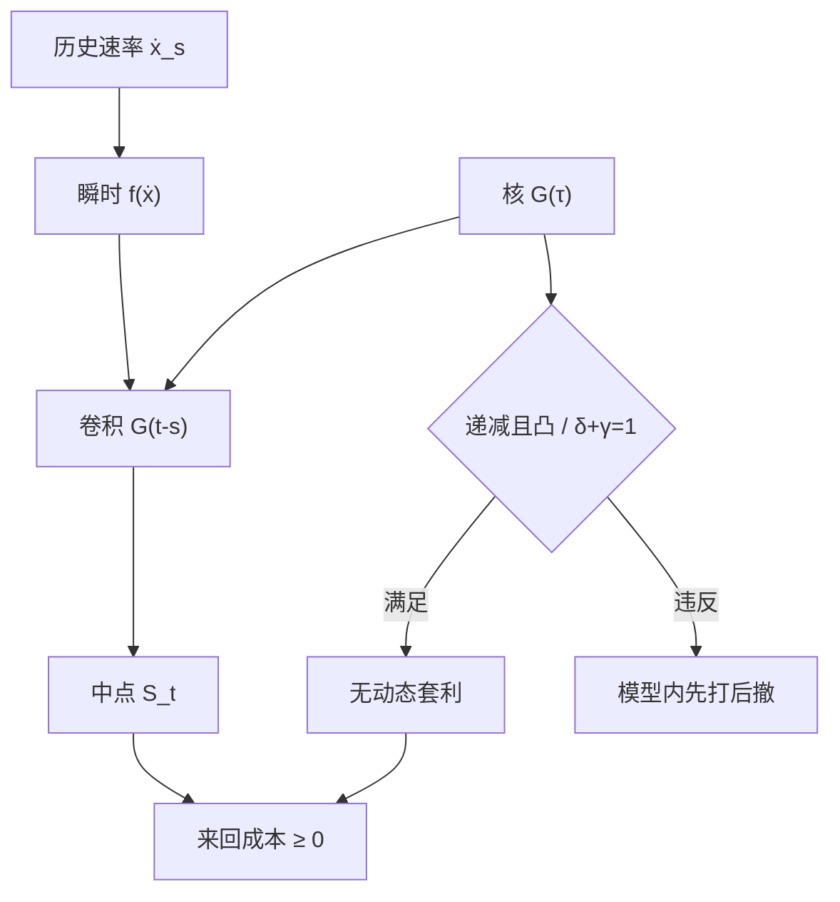

# 瞬时冲击传播核

    
价格是过往交易经一个随时间衰减的核对当前的加权；无动态套利要求这个核不能被用来先打后撤地锁利润。

    <footer>—— Gatheral, No-Dynamic-Arbitrage and Market Impact, Quantitative Finance, 2010</footer>

[Huberman–Stanzl](/quant/huberman-stanzl) 管的是永久位移的形状：对数量必须线性。Jim Gatheral（2010）管的是时间形状：过去一笔主动成交如何把冲击传播到现在。写成卷积，当前中点相对起点的位移是交易速率与瞬时冲击函数经核 $G$ 的叠加。核若衰减太慢、或与速率的非线性搭配不当，就存在先加速后反向的动态策略，在模型里期望获利。无动态套利（no-dynamic-arbitrage）把这类路径排除，从而约束 $G$ 的凸性与幂次。Bouchaud、Gefen、Potters、Wyart 以及 Lillo、Farmer 一系用经验传播量（propagator）估计 $G(\tau)$；Obizhaeva 与 Wang 给出限价簿消耗–恢复的结构核。本篇写核的定义、无套利形状、与平方根母单冲击的衔接，对象是执行模型的时间结构，不是预测下一笔 tick 的交易规则。

## 问题

离散地说，时刻 $s$ 的主动量 $\Delta x_s$ 使随后每个 $t\gt s$ 的价格多出一项 $f(\Delta x_s)\,G(t-s)$。连续写成

$$
S_t=S_0+\int_{-\infty}^{t} f(\dot x_s)\,G(t-s)\,\mathrm{d}s+\text{噪声}.
$$

$G(0)$ 捕捉即时偏离，$G(\infty)$ 捕捉永久；$G(\infty)=0$ 则冲击全是瞬时的。问题是：在交易者可以选任意 $\dot x$ 的前提下，哪些 $f$ 与 $G$ 使任意来回的期望执行成本非负。Huberman–Stanzl 已经要求若 $G(\infty)\gt 0$ 则 $f$ 在永久部分线性。Gatheral 补上 $G(\infty)=0$ 或混合情形下，核沿时间轴还要满足的条件。

经验上 $G(\tau)$ 常被拟成幂律 $\tau^{-\gamma}$，$\gamma\in(0,1)$，衰减比指数慢：十分钟后仍有可观残余，一日后才接近噪声。指数核 $e^{-\rho\tau}$ 在 Obizhaeva–Wang 与 Almgren 临时项里更常见，数学上完全单调、来回成本好控制，但拟合短时厚尾残余往往不够。选错核，[实施缺口](/quant/implementation-shortfall) 的期限结构会系统性偏离：以为三十分钟已「结束」，其实暂时项还在，永久 $\gamma$ 被高估。

### 动态套利是路径策略，不是静态拆单

静态操纵是买 $Q$ 再卖 $Q$ 各一次，利用 $I(x)$ 非线性。动态套利是在连续时间里加速、减速、反向，利用 $G$ 的非凸或与 $f$ 的幂次不匹配。例如核先凹后凸，或瞬时冲击对速率过凹而衰减过慢，则「快打一笔制造偏离、等核落到有利区域再反向」可以在模型里得到负成本。无动态套利要求对**所有**可积路径，期望来回成本 $\ge 0$，而不只对 TWAP 来回。这比 Huberman–Stanzl 的静态条件更细，也更依赖 $G$ 的二阶形状。

Gatheral 的「无动态套利」约束的是冲击模型作为所有人同时使用的定价核。它不断言真实市场没有可预测的短期反转。微观结构反转可以来自价差弹跳与存货，期望利润已被买卖价差吃掉。模型利润若在扣掉价差之前就已经为负成本，才是核的错误。

## 方法

一类充分条件是：$G$ 正、递减、凸（更强时完全单调，即交替符号的各阶导数），且瞬时 $f$ 对速率递增。指数核、若干 Gamma 混合、以及 $\gamma\in(0,1)$ 的幂律在合适的 $f$ 下属于这一族。幂律对 $f(v)\propto \mathrm{sign}(v)|v|^\delta$ 的经典搭配是

$$
\delta+\gamma=1,
$$

常被称作 Gatheral 约束。$\delta=\gamma=1/2$ 时，匀速母单的累积冲击接近数量的平方根，与 Almgren 等人（2005）及 Torre 的经验形式相容，见 [线性与平方根冲击](/quant/sqrt-impact)。$\delta+\gamma\neq 1$ 时，拉长或压短执行窗口 $T$ 会在模型里改变来回成本的符号，优化器会把 $T$ 推向边界——那是套利而非执行。

估计 $G$ 用标记好的主动成交对后续中点回归，并处理成交符号的自相关：Lillo–Farmer 的符号持续性会把「同一方向的许多小单」伪造成慢核。应先白化符号过程，或用工具变量把可预测的持续流从核里分开。窗口用成交量时钟或 ADV 时间，而不是固定日历五分钟。买卖分别估计，若差异来自样本漂移，合并前先减市场因子。

### 指数核、幂律核与簿恢复核

指数 $G(\tau)=e^{-\rho\tau}$ 对应一个状态变量：未衰减的暂时冲击以速率 $\rho$ 回归。最优执行变成有状态的控制，Obizhaeva–Wang 的簿深度恢复是其微观基础：消耗可见密度后，新限价以某强度补上。幂律没有有限维状态，必须截断或用若干指数去拟合，计算更重，但对「长记忆残余」更诚实。簿恢复核在开盘、拍卖附近会变：$\rho$ 不是常数。工程上用平静期估计的 $\rho$ 去给开盘后半小时定价，会低估瞬时项。

校准至少报告 $G$ 在 1 分钟、10 分钟、30 分钟、一日四个点，而不是只报一个半衰期。半衰期假定指数；幂律没有半衰期，只有「掉到一半的时间随起点变」。把幂律硬套成「半衰期 8 分钟」，再输入 AC，轨迹会对 $T$ 过度敏感。

## 机制

传播核的机制是流动性和信念的延迟调整。主动买吃掉卖方深度，做市商存货偏离，报价中点上移以吸引反向流；随后限价补簿、存货回防，中点部分回落——这一段是 $G$ 的衰减。若主动买还携带信息，信念更新不回落，对应 $G(\infty)\gt 0$ 的线性永久。Harris 所讲的深度与价格压力，首先是核的短端；Kyle 的 $\lambda$ 是长端。把短端拟合成长端，会把可恢复的存货效应写成不可逆 alpha 衰减。

无动态套利的机制仍然是会计：核若允许「制造偏离再收割偏离」，则偏离不是对外生信息的反应，而是对自身过去交易的可预测函数。真实市场里，他人会与你的路径相互作用，核在拥挤时上移、在毒性流里变肥，见 [订单流毒性](/quant/ofi-toxicity)。生产模型应允许 $G$ 依赖状态（波动、价差、拍卖时段），而不是声称找到了一条永恒的 $\tau^{-\gamma}$。状态依赖不自动破坏无套利，只要每一状态下的核仍使来回成本非负；任意切换状态去锁利润，则需要把状态过程写进约束。

### 母单平方根如何从核里长出来

匀速执行量 $Q$、时长 $T$、速率 $Q/T$。瞬时冲击 $|v|^\delta$ 经 $G(\tau)\propto\tau^{-\gamma}$ 积分后，累积价格位移对 $Q$、$T$ 的标度由 $\delta$ 与 $\gamma$ 决定。$\delta+\gamma=1$ 且 $\delta=1/2$ 时，位移对 $Q$ 接近根号、对 $T$ 的依赖变弱——这是「平方根冲击几乎与怎么拆无关」这一经验口诀的模型版。口诀只在该约束附近成立。若 $\gamma$ 更小（衰减更慢），拉长 $T$ 仍能少付瞬时；若 $\gamma$ 接近 1，核掉得快，再慢也省不下多少，只剩永久与价差。因此「多拆一定更便宜」不是定理，它依赖 $G$ 的尾部。

符号自相关本身不是核。核描述**一笔**交易对后续价格的因果传播；符号自相关描述交易者**何时还要继续同向**。把未白化的价格轨迹对成交量回归，会把「大单往往拆成持续同向」估进 $G$，高估记忆。母单标记与核估计必须分开。

## 边界与工程取舍

连续卷积假定可以任意细地改速率。最小价位、整手、涨跌停、拍卖不可撤单，使真实路径落在离散集合上，动态套利策略即便在连续模型里存在，也未必可执行。反过来，离散约束不能当借口去用非凸核：优化器在连续放松里仍会给出怪异的加减速。应在满足凸性的核上再加离散约束。

不要把 $G$ 的估计样本外当成 alpha：核描述自己交易的成本，不是别人交易后你该反向的信号。观测到「冲击会恢复」正是做市商利润的来源，恢复的期望已被价差覆盖。不要用单一股票、单一年度的 $\gamma$ 去给全宇宙定价；小盘与大盘、开盘与午盘的核不是同一个。A 股集合竞价把连续核切断，开盘后的第一段 $G$ 通常更肥，应用分段核或把拍卖单独建模，见 [涨跌停与集合竞价](/quant/cn-limit-auction)。

多资产交叉核（交易 A 对 B 的中点）使无套利条件变成矩阵核的正定类约束，估计噪声大。实践中先保证对角（自身）核满足 Gatheral 条件，交叉项用因子模型降维，避免在残差上拟合出可锁利润的非对角形状。

把 AC 临时项 $\eta v$ 理解成 $G$ 为 delta 函数（瞬时发生、立刻消失）是极限。真实 $G$ 有宽度，最优轨迹应随剩余未衰减冲击状态变，而不是只随剩余库存变。忽略状态会在刚打完一串子单后立刻再加速，等于在核尚未落下时叠加冲击。

## 小结

- 瞬时冲击传播核 $G(\tau)$ 把过往交易加权成当前价格位移；永久是 $G(\infty)$，瞬时是可衰减部分。
- Gatheral（2010）要求不存在期望成本为负的动态来回，从而约束 $G$ 的凸性以及与 $f(v)\propto|v|^\delta$ 搭配时的 $\delta+\gamma=1$。
- $\delta=\gamma=1/2$ 与母单平方根冲击相容；该标度不是对任意核都成立。
- 指数核有有限维状态、便于控制；幂律更拟合慢衰减残余，但没有单一半衰期。
- 估计必须处理成交符号自相关，否则会把母单持续性误写成核的记忆。
- 核是成本模型，不是反向交易信号；恢复的期望通常已被价差吸收。
- 出处：Gatheral, *No-Dynamic-Arbitrage and Market Impact*, Quantitative Finance, 2010；Bouchaud 等对 propagator 的经验工作；Obizhaeva and Wang, *Journal of Financial Markets*, 2013；Huberman and Stanzl, *Econometrica*, 2004。
