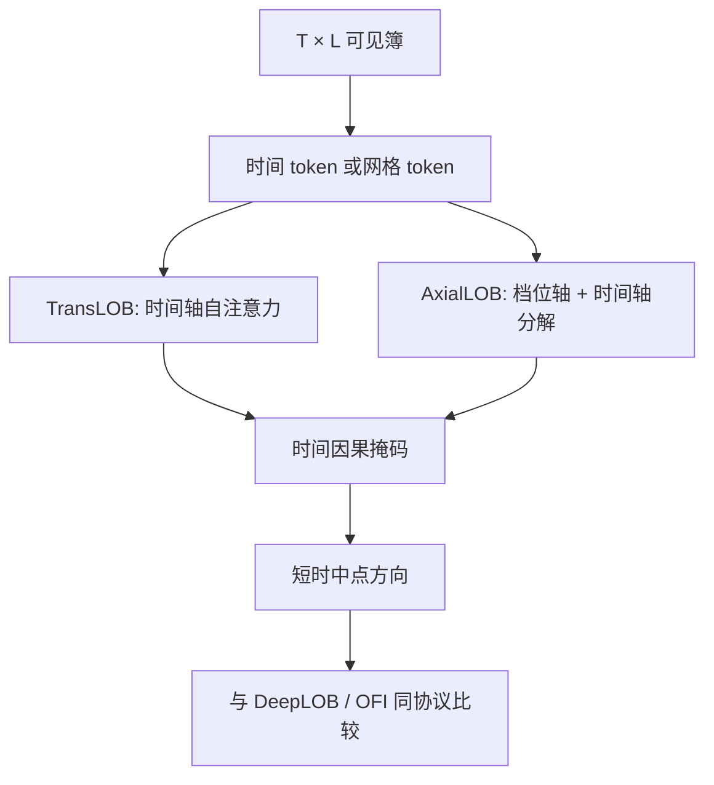

# TransLOB / AxialLOB

    
注意力让任意两个时间步或任意两档直接打分，而不必把依赖挤进循环的隐状态；沿轴分解的注意力则把「时间 × 档位」的二次代价拆成两条一次代价，以迁就限价簿这种二维网格。

    <footer>—— 对照 Vaswani 等人的缩放点积注意力；Wallbridge, Transformers for Limit Order Books, 2020；轴注意力的网格分解见 Ho et al., Axial Attention</footer>

[DeepLOB](/quant/deeplob-cnn-lstm) 用卷积看邻近档、用 LSTM 看短历史。卷积的感受野要叠很多层才能把远档连到近档；LSTM 对很长的事件窗存在记忆瓶颈。Transformer 把每个时间步（或每个档位）当成 token，用自注意力做全连接交互。Wallbridge 的 TransLOB 把这一内核接到限价簿序列上。轴注意力（axial attention）则针对簿的二维形状：一张 $T\times L$ 的价量表，沿时间轴与沿档位轴分别做注意力，而不在 $TL\times TL$ 的扁平序列上付满二次代价。本篇写 token 怎么定义、位置编码指什么、以及注意力**不**自动解决泄漏。评估协议与 DeepLOB 共用，见[泄漏陷阱](/quant/deep-lob-leakage)。

## 问题

事件时钟上，对短时中点有用的上下文可能不是「上一档邻近」，而是「八十个事件之前的一次深档撤单」与「当前最优档变薄」的组合。CNN+LSTM 能逼近，但路径是局部的。自注意力允许这一组合在一层内出现。代价是：无结构先验，参数更容易记住某个测试日风格的噪声路径；序列一长，注意力矩阵按长度二次增长，高频事件窗很难直接上原版 Transformer。

第二个问题是二维。限价簿不是纯时间序列：同一时刻的 $L$ 档是空间，连续 $T$ 个快照是时间。把 $T\times L$ 展平成长度为 $TL$ 的 token 串，位置编码必须同时表达「第几档」和「第几步」，混合容易乱。轴注意力的主张是：先沿档位让每一时刻的各档互相看，再沿时间让每一档的历史互相看（或反过来），用两次线性代价近似一次全局二次。

### token 与位置的含义必须写死

时间 token：每个事件或每个快照一个向量，分量是当时各档价量（已相对中点标准化）。档位 token：每个档一个向量，分量是该档在窗口内的量与价差序列。混合 token：每个 $(t,\ell)$ 格子一个向量。TransLOB 类工作通常走时间 token，把空间信息塞进向量内部，再用卷积或线性层先抽一截，类似 Conformer。AxialLOB 类走网格 token。位置编码：时间轴用事件序号或对数日历时间；档位轴用相对中点的整数档距，买卖两侧应区分符号。用绝对价格当位置会在价格水平漂移后失效。

因果掩码在语言里禁止看未来 token。LOB 序列分类若对窗口内所有时间步做双向注意力，等于允许 $t$ 看 $t+1$ 的簿——而 $t+1$ 的簿可能已经含有标签所基于的那次中点跳动。窗口内部也必须掩码或切齐，不是只有训练/测试切分才算泄漏。

## 方法

**TransLOB 路线。** 输入与 DeepLOB 相同的 $T\times 4L$ 窗口，先用一层卷积或线性投影得到 $T$ 个 $d$ 维 token，加时间位置，过若干层多头自注意力与前馈，池化或取最后时间步，输出三类中点运动。正则：dropout、权重衰减、按日切分、早停看经济指标。长度 $T$ 受显存限制，事件时钟上 $T=100$ 与 $T=1000$ 覆盖的日历时间差一个数量级，必须在报告里写清。

**轴注意力路线。** 保持 $T\times L\times C$ 的特征图。对每个固定 $t$，在 $L$ 个档位上做多头注意力；对每个固定 $\ell$，在 $T$ 个时间步上做多头注意力。Ho 等人的轴向分解把图像上的二维注意力变成两条一维；搬到 LOB 时，档位轴应使用相对档距编码，时间轴若需因果，只在时间轴上加下三角掩码，档位轴保持双向（同一快照内各档同时可见，这是合法的）。

### 与卷积归纳偏置的搭配

纯注意力在小样本高频上容易过拟合局部噪声。实务上常保留 DeepLOB 的前几层卷积，只在已抽出的空间特征上做时间注意力，或反过来。这不是架构上的不纯，而是承认：相邻档位的局部对比是强先验，不值得用注意力从零学。比较实验应固定标签、切分与成本，只换交互模块；否则「TransLOB 更准」可能只是另一组超参碰巧配上了泄漏标签。

多头可以分出「看量」与「看价差」的头，但可视化注意力权重不等于贡献，值向量可能近零。对命名通道做 [SHAP](/quant/shap-factor-attribution) 或消融，比画一张注意力热力图更接近审计。跨品种训练时，档位数 $L$ 必须统一；tick 不同的品种应对档距做相对中点的物理价格归一，而不是假设「第 5 档」在所有合约上是同一深度。

二次注意力在 $T$ 上千时不可行。轴分解、分块、线性注意力都是工程近似，会改变可表达的依赖。不要在方法里写「全局注意力」、在实现里用了只能看局部块的核，却不报告这一限制对远距离撤单记忆的影响。

## 机制

缩放点积注意力的数值性质与语言模型相同：维度一大就要除 $\sqrt{d}$，否则 softmax 饱和。LOB 上 token 范数随深度和波动变，若不做层归一与相对中点缩放，注意力会退化成只看最近几个高范数事件（通常是大单）。这会让模型表面上像 Transformer，实际上退回「看最近主动成交」，增量相对 OFI 为零。

轴分解假设网格上的依赖近似可分：档位交互与时间交互不必在同一次 softmax 里完成。若真正重要的模式是「某一时刻某一远档的量」与「另一时刻最优档」的耦合，两次一维注意力需要两层才能拼出，表达力弱于扁平全局注意力，但正则更强。这与 CNN 感受野的层数权衡同类。选择哪一种，应由预指定的验证日上的经济指标决定，而不是由架构新颖性决定。

### 注意力不是因果识别

某头稳定地看着对手方深档，只说明 $f$ 用了那一通道的协方差，不说明那一档「导致」中点变动。要谈机制，应对照 [Hawkes](/quant/hawkes-lob) 的事件核与 [OFI](/quant/ofi-cont) 的会计。注意力图适合做假设生成：例如是否依赖了本不应在 $t$ 可见的通道，从而触发泄漏审计。它不适合单独作为交易理由。

[跨市场迁移](/quant/cross-market-transfer-learning) 时，注意力权重更脆：tick 与事件密度一变，位置编码的「第 50 步」对应的毫秒数就变。相对时间编码（对数间隔）比绝对步号更容易迁，但仍需在目标市场重训。零样本加载 TransLOB 权重，默认应视为失败实验，除非证明事件时钟的物理时间分布接近。

## 边界与工程取舍

集合竞价、停牌、涨跌停使网格的空间轴断裂，注意力会把无意义的占位符档位当成真实深度。这些状态应掩码掉对应 token，或干脆不送入连续簿模型。自身订单若出现在窗口里，注意力会学到「自己的单」与随后中点的相关，开环测试会高估。训练应使用不含自己账户的公共簿，或把自家订单显式标记并从标签对齐中剔除。

不要用测试日调层数、头数、$T$ 和掩码类型。不要把语言模型的学习率与预热原封搬到 LOB：样本有效独立数是交易日，不是事件数。后续更大的「基础模型」式订单流生成见 [MarS](/quant/mars-generative-sim)，那是生成而不是判别；生成器同样会被泄漏的训练窗口污染。判别式 TransLOB 的正确终点是：在无泄漏协议下，相对 DeepLOB 与相对 OFI 线性基准的增量 IR 是否还在。

若去掉时间因果掩码之后准确率大幅上升，这不是「双向上下文更丰富」的发现，而是泄漏诊断已经亮灯。应把无掩码结果标成非法上界，而不是标成 SOTA。

## 小结

- TransLOB 用时间轴 Transformer 读限价簿窗口；AxialLOB 类方法沿档位轴与时间轴分解注意力，以匹配簿的二维网格并降低二次代价。
- 窗口内部的时间因果掩码与训练/测试切分同等重要：双向看未来快照会把标签所用的跳动提前读入。
- 卷积先验仍有用；架构比较必须固定标签与成本。注意力权重不是因果，也不是可迁移的市场指纹。
- 有效样本是交易日。无掩码准确率只能当泄漏上界。
- 出处：Wallbridge, *Transformers for Limit Order Books*, 2020；Ho et al., *Axial Attention*；Vaswani et al., *NeurIPS*, 2017；判别基准见 Zhang, Zohren and Roberts, *IEEE TSP*, 2019。
