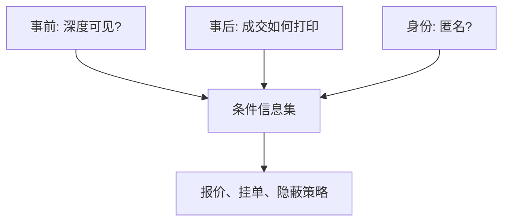

# 透明度与匿名

谁能看见未成交的意向、谁能看见对手的身份，会改变知情者的隐蔽方式和流动性提供者的报价。透明不是越多越好：揭示可以减少逆向选择，也可以吓跑那些本会提供深度的人。

<footer>—— Bloomfield and O'Hara, Market Transparency: Who Wins and Who Loses?, Review of Financial Studies, 1999</footer>

[策略噪声](/quant/strategic-noise-traders)让非知情者选择何时来。缺口是他们选择时依据的**信息集**：能否看见簿、看见身份、看见历史成交。Bloomfield 与 O'Hara（1999）用实验市场比较披露；Foucault、Moinas 与 Theissen（2007）问电子限价簿上匿名是否改变流动性。本课把透明度分成事前（报价与深度）与事后（成交报告），匿名是身份维度。不重画[订单类型](/quant/order-types)里冰山与暗池的接口，只补博弈含义。

## 问题

Kyle 的做市商只看见合计 $y$，看不见谁是知情者——那是完全匿名的总量。真实市场在两个方向放松：交易所展示深度（事前透明），或披露交易者类别（券商代码、做市商旗标）。更多事前透明让做市商更快识别知情流，$\lambda$ 式冲击可以变小，但知情者会改策略：拆得更碎、改走暗处、减少交易。非知情者可能受益于更好的价格，也可能因知情者撤退而失去掩护。问题是：均衡福利对透明的比较，不是「阳光是最好的消毒剂」这一句。

匿名与透明正交。可以看见深度但看不见谁挂的（匿名 LOB），也可以看见身份但深度延迟（报价驱动）。Foucault 等人的巴黎市场证据表明，匿名改变价差与知情者的订单选择，而不是简单加宽或收窄。

### 事前、事后、身份

Harris 的三分法足够用。事前：BBO 与各档量、是否含隐藏。事后：成交价量是否即时、是否延迟打印、是否标记场外。身份：中央限价簿通常匿名；楼层与部分期货显示经纪代码；批发商知道零售标签。每一项改变的是推断 $E[V\mid \cdot]$ 的条件信息集，因而改变 Kyle / Glosten-Milgrom 里的报价。

监管常把透明当投资者保护。微观结构要分开：对谁透明、延迟多少、是否可被最快的人单方面利用。后文速度竞赛会把「透明 + 连续时间」写成狙击。

## 方法

理论比较通常固定交易协议，只改信息披露。Madhavan 讨论事前透明如何改变做市商的学习与投资者的下单意愿。Bloomfield–O'Hara 在实验室里切换成交披露与报价披露，观察价差、发现速度、知情利润。经验上用交易所规则变更：从显示经纪代码改为匿名、从延迟打印改为即时、引入冰山。识别靠事件研究，控制同期 tick 与费用变化。

匿名的机制通道：流动性提供者若被知情者针对，会加宽或撤单；匿名降低「被针对」也降低「用身份建立信誉」。做市商信誉在重复博弈里可以收窄价差（Ho–Stoll 竞争的动态版），匿名把它削弱。

### 暗池是内生的不透明

当公开簿太透明以至于大单无法隐蔽，[暗池](/quant/dark-pool-midpoint)成为策略噪声与知情者的共同出口。这不是本课要重写路由，而是指出：透明度政策会把成交转移到另一信息集，总量发现不一定加快。

## 机制

知情者的隐蔽成本随透明上升：同样的 $x$ 更容易从簿的变化里读出来。于是他们降低 $x$、改用隐藏单，价格发现变慢，但每一笔公开成交的信息含量上升。非知情大单同样怕被读，透明可能把他们赶出明簿，明簿变薄，剩下的流更毒——看起来像「透明伤害流动性」。相反，若透明主要帮助做市商识别毒性、而大单仍必须在明处成交，价差可以下降。符号是经验问题，取决于谁有替代场所。

事件不确定（Easley–O'Hara）下，透明还改变「无交易」的解释：若深度可见且长时间不变，更像无事件；若深度可见但频繁撤单，沉默不再干净。

## 边界

实验室与单一交易所规则变更，外推到碎片化市场要谨慎：本地透明会被智能路由套利。完全事后透明加连续交易，会把慢的挂单暴露给快的狙击，这是 Budish 等人的起点，不是本课能用「多披露」解决的。身份披露在隐私与执法上另有约束，模型不管。

不要把「Level-2 可见」当成信息有效。可见的是意愿的下界，隐藏单与跨市场意向都不在里面。把 L2 当 $y$ 会系统性误估 $\lambda$。

## 小结

- 透明分事前、事后、身份；匿名是身份维度，与深度可见正交。
- 更多披露改变知情者隐蔽与做市商学习，流动性与发现速度可以反方向动。
- 策略性噪声与大单会用暗处逃避透明，政策必须考虑场所转移。
- 出处：Bloomfield and O'Hara, *Review of Financial Studies*, 1999；Foucault, Moinas and Theissen, *Review of Financial Studies*, 2007；概念见 Harris, *Trading and Exchanges*。
