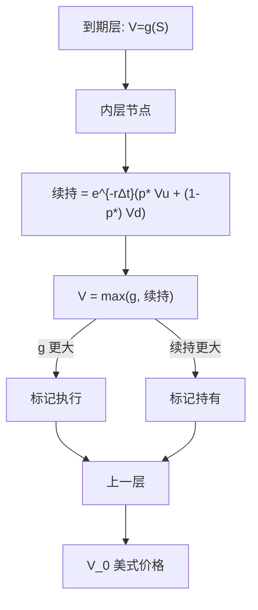

# 树图与美式提前行权

    
重组树上每个节点比较内在价值与风险中性贴现后继，倒推得到的是该离散市场上的最优停时价格；加密步长则逼近连续美式的自由边界。

    <footer>—— Cox, Ross and Rubinstein, Option Pricing: A Simplified Approach, Journal of Financial Economics, 1979</footer>

[二叉树](/quant/binomial-tree) 写 CRR 的 $u,d,p^*$ 与重组。[提前行权](/quant/american-exercise) 写 Merton 的经济条件与连续自由边界。本篇把二者接到同一套倒推：树作为完全市场的动态规划网格，美式 $\max$ 如何改变节点值、执行区域如何随 $n$ 收敛、以及和 [PDE 投影](/quant/option-pde)、[LSM](/quant/lsm-american) 的误差结构有何不同。不重推复制公式，也不把 Longstaff–Schwartz 的回归再写一遍。一维香草美式，树仍是最干净的引擎之一；高维才轮到模拟。

## 问题

连续美式是最优停时，解析解仅限特殊情形。离散时间、每期两态的 CRR 市场完全：每个节点的期权值由复制唯一决定。欧式只在到期支付；美式允许在到达的节点执行，持有人的最优策略是：若 $g$ 大于复制组合的续持价值，就拆掉复制、拿走 $g$。倒推

$$
V=\max\bigl(g(S),\; e^{-r\Delta t}\bigl(p^*V_u+(1-p^*)V_d\bigr)\bigr)
$$

正是该完全市场里的 Bellman。问题是：有限 $n$ 的 $V_0$ 相对连续极限有离散偏差；执行边界是树上的一层节点，不是光滑曲线；加密时价格常呈偶奇振荡。需要把「树能算美式」从「树已经给出连续美式的四位小数」分开。

百慕大只在子集日期做 $\max$，其余节点禁止第一项。许多可转债是百慕大；连续美式用加密行权日逼近。树的时间网格同时承担波动离散与行权机会离散，两笔偏差要一起看。

### 执行区域在树上长什么样

美式看跌：低 $S$ 节点执行，高 $S$ 续持，分界在每个时间层上是某个临界下标 $j^*(i)$。随剩余期限变长，临界 $S^*$ 通常下降（更愿意持有保险）。到期层 $S^*=K$。树上 $S^*$ 只能落在节点上，故边界呈锯齿；加密后锯齿变密，向平滑粘贴的 $S^*(t)$ 靠拢。无股利美式看涨：所有节点应选续持（$r>0$），$V$ 与欧式相同——这是回归测试。有离散股利时，执行集中在除权前一层，树必须把除权日对齐，否则溢价会被抹到错误的日期。

树上没有「平滑粘贴」作为独立条件：$\Delta$ 在执行与续持之间本来就不连续到连续极限才会出现粘贴。用有限 $n$ 的节点 $\Delta$ 去验证平滑粘贴，会看到跳跃，这不是实现错误。

## 方法

CRR 标定 $u=e^{\sigma\sqrt{\Delta t}}$，$d=1/u$，风险中性 $p^*$。从到期 $g(S)$ 向 $t=0$ 逐层：先算续持，再与 $g$ 取最大。存储上可只留一层加执行标志。三叉树同样倒推，只是后继三个权。局部波动让 $p^*$ 或 $u$ 随节点变，美式 $\max$ 不变，但负概率会破坏套利界，执行决策在错误的续持上做出。

收敛：欧式 CRR 对 Black–Scholes 常以 $1/n$ 为主项并偶奇振荡；美式多一个自由边界的逼近阶，通常仍像 $O(1/n)$，常数更大。Richardson 外推用两个 $n$ 消主项，但振荡时应对偶奇分别外推。与 PDE 对照：显式差分与三叉几乎同一权，美式投影同一件事；隐式/[CN](/quant/crank-nicolson) 把续持换成解线性系统再投影，边界更光滑，仍是同一互补问题的离散化。

### 障碍、离散观察与不重组

美式障碍：触及则敲出或变成返款，未触及则仍可比 $g$ 与续持。连续障碍被 $\Delta t$ 抽样，敲出偏少（美式看跌敲出可能偏贵），要把障碍移到节点或步内补布朗桥概率。亚式美式要把平均扩进状态，树不重组，节点随路径计数增长，很快失去树的 $O(n^2)$ 优势，应改 LSM。离散股利破坏 $ud=1$ 的重合，短窗口接受不重组或把股票拆成「不确定部分 + 确定股利」。

## 机制

树是离散完全市场：美式价格等于最优停时下复制组合的初始成本。加密后，复制的 $\Delta_n$ 趋向连续对冲，执行区域趋向自由边界，价格趋向 PDE 互补解。有限 $n$ 时，持有人只能在节点上决策，策略集比连续小，价格相对连续美式常略低（另有波动离散偏差可正可负，净效应不一定）。这与 LSM 的次优停时类似，但树在**该离散市场**上是全局最优，没有回归子空间偏差；LSM 在连续（或细时间）过程上用近似策略。比较树与 LSM 应声明：比的是同一百慕大日期，还是连续对离散。

三叉多一个自由度，执行边界的空间分辨率更高，不自动减少时间离散偏差。负 $p^*$ 时续持可以低于无套利下界，美式 $\max$ 会过早执行去「逃避」负权，价格失真看起来像提前行权溢价过大。先检查概率，再解释执行区域。

CRR 的 $p^*$ 必须落在 $(0,1)$。高利率、高股利、极短步长配很小 $\sigma$ 时会越界。此时美式倒推在算术上仍能跑，经济上树已可套利，执行决策无意义。应换 Jarrow–Rudd 或缩小 $\Delta t$。

### 与 PDE、LSM 的误差账

树：偏差来自 $\Delta t$、节点未对准 $S^*$、障碍抽样；无抽样方差。PDE–CN：空间与时间截断、投影或罚函数；曲面一次给出全部 $S_0$。LSM：策略与基函数偏差加 MC 方差；维数友好。一维美式看跌，加密 CRR 或 PDE 是基准，LSM 用来交叉检验下界，不应反过来用 LSM 给树「定价」。雇员期权与可转债若状态仍是一两个马尔可夫因子，优先树/PDE；因子再多才 LSM。

## 边界与工程取舍

随机波动要二维树或 PDE/[ADI](/quant/adi-pde)，一维 CRR 无法把 $v$ 放进执行决策。跳跃破坏邻接后继。连续时间的平滑粘贴、提前行权溢价积分方程（Kim 等）给出对照，但不是树的输出格式。报告树价应写 $n$、是否百慕大、股利日程、是否做了外推。不要用 $n=50$ 的锯齿边界当论文里的 $S^*(t)$ 图。

不要把 CRR 说成发明了美式期权理论；Merton 1973 与最优停时更早。CRR 的贡献是让离散复制与 $\max$ 倒推可算。McKean、van Moerbeke 的自由边界是连续对象；树上只有节点分类。

出处：Cox, Ross and Rubinstein, *JFE*, 1979。美式经济条件见 Merton, *Bell Journal*, 1973。三叉见 Boyle 与 Kamrad–Ritchken。高维对照 Longstaff and Schwartz, *RFS*, 2001。PDE 投影见 Brennan and Schwartz, 1978。

## 小结

- 重组树上美式 = 每个节点 $\max(g,\text{风险中性续持})$，即该完全市场的最优停时。
- 执行区域是节点分类，加密后逼近自由边界；无股利看涨应永不执行。
- 偏差来自时间步、边界锯齿与障碍抽样，不是 MC 方差；偶奇振荡时外推要小心。
- 一维香草用树或 PDE；路径依赖不重组时改 LSM。
- $p^*\in(0,1)$ 是前提；负概率下的执行区域不可解释。
- 出处：Cox, Ross and Rubinstein, 1979；对照 [二叉树](/quant/binomial-tree)、[提前行权](/quant/american-exercise) 与 [PDE](/quant/option-pde)。
