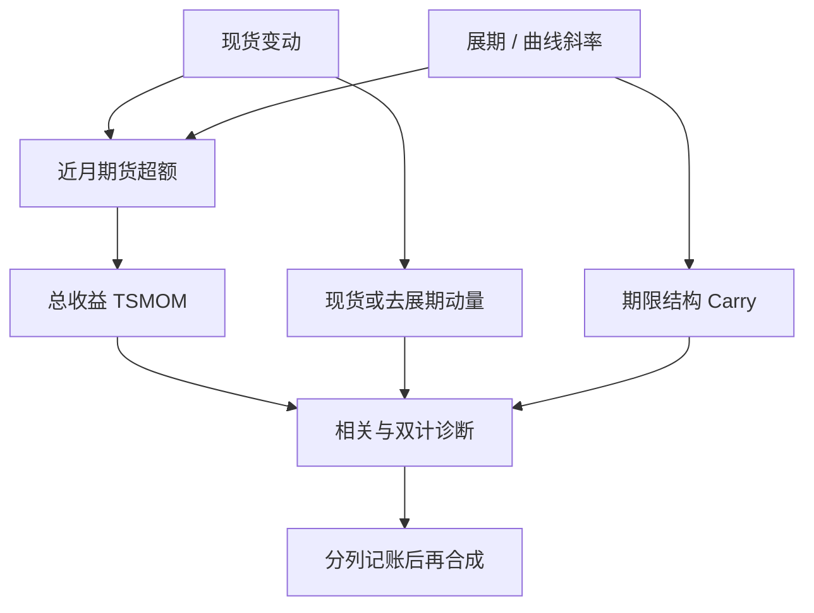

# 商品趋势 vs 展期

商品期货的超额可以拆成现货变动与把近月换成远月时的曲线损益；趋势跟踪吃的是总收益路径，展期策略吃的是曲线斜率。用同一条近月序列同时声称两种 alpha，会把仓储租金算进动量。

<footer>—— Erb & Harvey, The Strategic and Tactical Value of Commodity Futures, FAJ 2006；趋势定义对照 Moskowitz, Ooi & Pedersen, JFE 2012</footer>

[上一课](/quant/mfd-risk-parity)用风险份额合成「多头风险平价」与「趋势 CTA」，并点名归因要拆开静态溢价、趋势切换与展期，防止两条溢价被记成四条 alpha。缺口正是商品这条腿：**趋势与展期是不是同一笔钱**。本课并列总收益趋势、去展期动量与事前斜率。不重讲 $\pi$ 与保证金。后课外汇 Carry/动量默认已经读完：同向出现在低库存挤仓，对撞出现在曲线与现货分道。

## 问题

近月展期持有的超额近似

$$
R_{\mathrm{fut}}\approx R_{\mathrm{spot}}+R_{\mathrm{roll}}+\varepsilon_{\mathrm{collateral}}.
$$

TSMOM 的 $\mathrm{sign}(r_{t-12,t})$ 用的是左边的 $R_{\mathrm{fut}}$，于是过去一年的正展期也会把符号推成多头。曲线 Carry 用的是事前 $R_{\mathrm{roll}}$ 的代理（近远月斜率）。若过去一年贴水且现货也在涨，两笔规则同向加仓；若现货大涨但曲线已翻成升水，趋势仍可能多、Carry 已要空。问题是报告三列：总收益趋势、现货（或剔除展期）趋势、曲线 Carry，再看相关与危机行为。

第二个问题是投资者以为自己买了「实物商品的趋势」。指数与 CTA 都不持有仓单，趋势是期货价格路径，展期是曲线几何。现货大涨而远月升水加深时，期货趋势可能远弱于现货故事，这是 Erb–Harvey 对「投资原油」幻觉的商品版。

### 总收益动量里有多少是斜率

把形成期超额拆成现货累计与展期累计，看 $\mathrm{sign}$ 有多少次由展期单独决定。低库存、强贴水的品种上，展期可以在横盘现货里仍给出正的期货收益，TSMOM 会做多——这时趋势策略其实在做 Carry。反向：长期 contango 的品种即使现货缓涨，期货总收益可能为负，TSMOM 做空，等于顺手做空负展期。这两种都不丢人，但必须记账，否则无法回答容量（曲线拥挤与现货趋势拥挤不是同一深度）。

Boons 与 Prado 的基差动量是斜率的变化，不是水平。它更接近「紧张在加剧」，与十二个月总收益符号、与静态 backwardation 排序都不同。不要把三个名字都叫做商品动量。

## 方法

数据用单合约价格自己滚仓，不要用已经调整过跳空的主连去「再算一遍展期」。趋势信号 A：近月总收益符号（标准 CTA）。趋势信号 B：用现货或用剔除展期后的价格动量。Carry 信号 C：事前年化斜率，截面多空或时变多空。组合层做 A、B、C 以及 A 与 C 的合成，扣掉滚仓窗口冲击。诊断：A 与 C 的相关、B 与 C 的相关；若 $\mathrm{Corr}(A,C)$ 高而 $\mathrm{Corr}(B,C)$ 低，说明 A 的商品「趋势」大量来自曲线。

合约选择：趋势 CTA 为了深度常用近月，恰好是展期最敏感、指数滚仓最拥挤的区段。若产品声称趋势，却在选约上系统性避开负展期合约，它已经是混合策略，应把选约 alpha 单列，见[商品展期 alpha](/quant/commodity-roll-alpha)。

### 何时同向、何时对撞

同向：库存下降、现货上涨、曲线贴水——仓储理论与趋势一致，杠杆最危险，因为拥挤和挤仓也叠在这里。对撞：需求崩溃、现货下跌但短期仍贴水（或相反，现货反弹但升水未改）。对撞时，混合信号会犹豫或对冲掉，纯趋势与纯 Carry 分道。通胀冲击里工业品趋势与曲线可能一起强；金融化之后的持续升水里，趋势多头会持续付租，Carry 空头才是主收益。验收应包括商品超级周期与 2010 年代的升水年，而不是只报 2000–2008。

## 机制

仓储：低库存 → 便利收益高 → 正展期，现货往往已经高或预期回落，现货趋势与展期的协方差不稳定。套保压力：生产商空头使远期偏低，趋势多头与正 Carry 同向。金融需求：指数固定滚近月，前跑侵蚀机械展期，也对「永远近月趋势」的执行不利。行为：投资者追逐现货头条，忽略曲线，使升水品种的期货趋势弱于叙事。

MOP 的跨资产 TSMOM 在商品上成立，并不要求展期为零；它只要求总收益可预测。KMPV 的 Carry 在商品上成立，并不要求现货有动量。学术上两者可以都对。产品上若用同一近月总收益同时当趋势与 Carry，统计上的「两个显著」只是一次抽样。

### 杠杆假票息是展期腿特有的坑

展期看起来像票息，最容易被加杠杆；趋势看起来像方向，杠杆来自 vol target。混合产品若把历史正展期当成稳息再套趋势杠杆，会在曲线翻面时同时承受方向亏损与「票息」反号。2008 年后若干商品 ETN 的路径是被动版；主动 CTA 若在选约上隐性做多贴水、仓位上再 $1/\sigma$，是同一坑的主动版。风控应分别设：曲线因子限额与趋势名义限额。

正展期经常伴随现货已涨、库存已低。这时趋势与 Carry 同向加码，风险是现货回补与曲线转正同时发生。Gorton–Hayashi–Rouwenhorst 把库存拉进条件期望，就是给这个角点准备的刹车。

## 边界与工程取舍

不要用主连收盘直接算 TSMOM 再宣称已扣展期。不要把指数的 roll yield 宣传数字当成 CTA 的可交易期望。不要在滚仓周加大趋势权重。国内商品的交割月、仓库与夜盘规则改变斜率定义，公式不能从 CME 原样粘贴。与日历价差交易的边界：主动做斜率变化是另一本书；本篇只要求趋势产品不要偷曲线、曲线产品不要偷现货动量。

与[期限结构 Carry](/quant/ts-carry)、[展期收益](/quant/roll-yield)、[时间序列动量 CTA](/quant/cta-tsmom) 的分工：会计在展期篇，跨资产定义在 Carry 篇，产品规则在 CTA 篇，本篇专管商品上两条腿的识别。出处上，Erb–Harvey 管分解，MOP 管趋势可预测性，不要互相冠名。

出处：Erb and Harvey, *Financial Analysts Journal*, 2006（及后续对 roll yield 误读的澄清）；Gorton and Rouwenhorst, FAJ, 2006；Moskowitz, Ooi & Pedersen, JFE, 2012；Koijen et al., *Carry*, JFE, 2018。仓储见 Working, 1949；期限溢价解剖见 Szymanowska et al., JF, 2014。

## 小结

- 商品期货超额含现货腿与展期腿；TSMOM 用总收益，Carry 用曲线斜率，二者不是自动正交。
- 应并列总收益趋势、去展期动量与事前斜率，检查相关与谁在决定符号。
- 同向出现在低库存挤仓状态，杠杆最危险；对撞出现在曲线与现货分道时，混合信号会互相抵消。
- 选约若系统性避开 contango，趋势产品已含展期 alpha，必须分列。
- 出处：Erb–Harvey, 2006；Gorton–Rouwenhorst, 2006；Moskowitz et al., 2012；Koijen et al., 2018。
