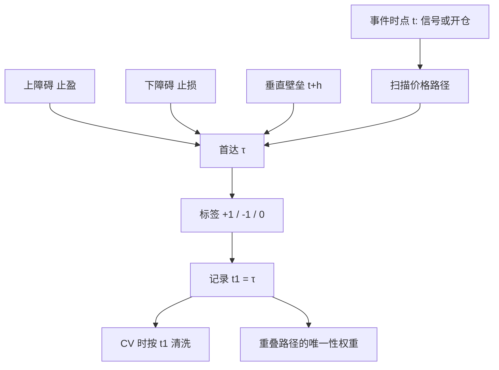

# Triple Barrier 标签

固定持有期把路径折叠成终点收益；交易决策却发生在止盈、止损或时间用尽三者之中最先触达的那一个障碍上。标签应当与这条路径一致。

<footer>—— López de Prado, Advances in Financial Machine Learning, Chapter 3, 2018</footer>

监督学习需要一张 $(X_t,y_t)$ 表。金融里最常见的 $y_t$ 是未来 $h$ 期收益，它不问中间有没有击穿你本来会止损的水平，也不问是否早已到达你本来会止盈的水平。López de Prado 在 *Advances in Financial Machine Learning* 第 3 章把标签改成路径依赖的三重障碍（triple-barrier）：上障碍（止盈）、下障碍（止损）、垂直障碍（最大持有期）。标签由**哪一道先被碰到**决定，通常取值 $\{+1,-1\}$，或再加 $0$ 表示时间壁垒先到且未触碰水平障碍。这不是为了让分类准确率更好看，而是为了让 $y$ 与可执行规则使用同一条路径。固定期限标签的重叠与标准误问题见[标签、预测期与重叠](/quant/label-horizon-overlap)；本篇只写三重障碍本身。

## 问题

设 $t$ 时刻决定开仓（或收到一个初级信号），价格为 $p_t$。固定期限标签 $y_{t,h}=\mathrm{sign}(p_{t+h}/p_t-1)$ 在 $h$ 日内价格先崩再回来时仍可能是正的——而真实账户已经按止损离场。反过来，价格迅速触及目标后继续上涨，固定期限会把后面一段并未持有的收益算进标签。两种错误都让模型去拟合**你不会持有的那段路径**。

三重障碍把持有写成首达时：

$$
\tau = \inf\{s\in(t,t+h]: p_s\ge p_t(1+\pi)\ \mathrm{or}\ p_s\le p_t(1-\pi')\ \mathrm{or}\ s=t+h\}.
$$

$\pi,\pi'$ 是止盈与止损宽度，$h$ 是垂直壁垒。标签 $y_t=\mathrm{sign}(p_\tau/p_t-1)$，或按先触碰的水平障碍取 $\pm 1$，垂直壁垒单独标 $0$。问题从「预测 $h$ 日后涨跌」变成「预测这笔以障碍规则执行的赌注结果」。宽度与 $h$ 是标签定义的一部分，不是事后可调的装饰。

### 障碍宽度必须预先写死

$\pi$ 若按全样本波动分位或按「怎样让准确率最高」来选，标签本身成为被搜索的对象，后续任何交叉验证都在泄漏。合法做法是：用 $t$ 之前的已实现波动或预先声明的绝对百分比设定 $\pi_t$，并在研究备忘录里冻结。不对称止损（$\pi'\ne\pi$）改变类别先验：更宽的止盈会制造更多 $-1$，模型可以靠预测多数类取胜。垂直壁垒 $h$ 必须与信号衰减和成本匹配；$h$ 过长，标签又接近固定期限，$h$ 过短，大多数样本撞上时间壁垒，信息被写成 $0$。

用未来最高最低价来「检查是否触碰」时，必须用当时可成交的路径，而不是后复权后的平滑 K 线。停牌、跳空、涨跌停会使障碍被跳过：应规定跳空开在障碍之外时视为触碰，否则回测假设了不存在的盘中成交。

## 方法

AFML 的实现顺序是：先得到事件时间（例如某个信号触发的时点 $t$），再沿每条事件的价格路径扫描三道障碍，得到首次触达时间 $t_{i,1}$（书中的 `t1`），再根据触达类型打标签。扫描必须在事件时间或足够密的 bar 上进行；日频高低价是对盘中路径的区间近似，会高估触达频率——因为高低价并不告诉你先碰到哪一侧。更干净的是用日内路径或至少用开高低收的保守规则（最坏先触止损）。

事件可以重叠：相邻 $t$ 的障碍扫描共享同一段价格。这正是标签相关的来源。López de Prado 用平均唯一性（average uniqueness）给重叠样本降权：一段价格若同时属于许多事件的标签路径，每个事件分到的样本权重变小，以免同一段趋势被重复学习。这不是删除重叠——删除会浪费信息——而是承认有效样本量小于事件个数。交叉验证时，训练样本凡是 $t_{i,1}$ 落入测试期的，都应被 [purge](/quant/purge-embargo) 掉。

### 方向由谁提供

三重障碍可以是无方向的：上下对称，标签只说「先碰到哪边」。也可以先由初级模型给出方向（只在看多时启用上障碍为止盈、下障碍为止损），再对这笔有方向的赌注打标签。后者是 [meta-labeling](/quant/meta-labeling) 的输入：初级模型决定 side，三重障碍决定这笔 side 的输赢。不要把无方向障碍的 $\pm 1$ 直接当成交易方向——那是在用未来的触达方向当特征。无方向标签只适合学习「波动是否足够让障碍在 $h$ 内被碰到」这类问题，不适合直接下单。

把垂直壁垒上的小收益也标成 $\pm 1$，会强迫模型为噪声涨跌负责。更常见的是：时间先到且未触水平障碍则标 $0$，并在损失里对 $0$ 降权或单独处理，以免多数类是「什么都没发生」。

## 机制

固定期限标签的数据生成过程是期末价格；三重障碍的数据生成过程是带吸收壁的价格。后者与止损、止盈、时间退出的生产规则同构，因此模型的损失函数更接近真实 PnL 的符号。它不能消除重叠，也不能消除非平稳：同一套 $\pi$ 在低波动期很少触达、在高波动期几乎立刻触达，标签的类别分布随体制变。这要求 $\pi_t$ 随波动缩放，否则模型学到的是波动体制，而不是方向。

机制上的第二个后果是：标签对路径的高频噪声敏感。微观结构噪声会把狭窄障碍打成假触达，见[微观结构噪声](/quant/microstructure-noise)。障碍应设在噪声幅度之上，或在信息驱动 bar 上扫描，而不是在每一笔 tick 上用几个基点的止损。第三个后果是：三重障碍把「多久能知道标签」变成随机变量 $\tau-t$。这正是 purge 要用 $t_{i,1}$ 而不是固定 $h$ 的原因——每条样本的泄漏窗口长度不同。

### 与分类指标的错位

准确率、AUC 不读取不对称的盈亏比。止盈 2%、止损 1% 时，即使 $-1$ 稍多，期望仍可为正。应用与 PnL 同构的元：平均每笔（含成本）、盈亏比、以及触达类型的混淆。把三重障碍当成 Kaggle 分类题，会选出在多数类（常是时间壁垒或止损）上保守、却没有经济价值的模型。成本必须写进标签或写进二次评估：触达上障碍但扣费后为负，标签应为失败。

## 边界与工程取舍

不要在全样本上网格搜索 $\pi,h$ 再报告分类成绩。不要用复权后的日频高低价假装盘中触达顺序已知。A 股涨跌停使障碍可能无法在当日成交价上碰到，却在涨跌停板上「越过」；标签应定义为下一可交易路径上的首达，否则假设了不存在的流动性。事件驱动引擎按路径模拟成交，见[事件驱动回测](/quant/event-driven-backtest)；向量化的三重障碍只是标签生成器，不是成交保证。

三重障碍也不解决多重检验。$\pi,h$、事件触发器、是否加入 $0$ 类，都是搜索维度，应进入 [DSR](/quant/deflated-sharpe) 的 $N$ 与 [CPCV](/quant/cpcv-lopez) 的候选定义。它只解决「标签与交易规则是否同构」这一层；同构之后，过拟合与泄漏仍在。

`t1` 是后续所有清洗、唯一性权重与组合交叉验证的索引。没有 $t_{i,1}$，purge 只能用固定 $h$ 的保守上界，会多删样本；有 $t_{i,1}$ 却用错时钟（用决策日而非触达日），清洗等于没做。

## 小结

- 三重障碍用止盈、止损与时间壁垒的首达来打标签，使 $y$ 与可执行退出规则同构，而不是折叠成固定 $h$ 的终点收益。
- 宽度与 $h$ 必须在 $t$ 之前确定；用全样本调障碍是对标签本身的数据挖掘。
- 事件重叠由唯一性权重处理，泄漏窗口由每条样本的 $t_{i,1}$ 决定，并交给 purge/embargo。
- 分类准确率不是 PnL；成本、跳空与涨跌停必须进入触达定义。
- 出处：López de Prado, *Advances in Financial Machine Learning*, Wiley, 2018，第 3 章；重叠标签的推断见 Hansen and Hodrick, *JPE*, 1980。
