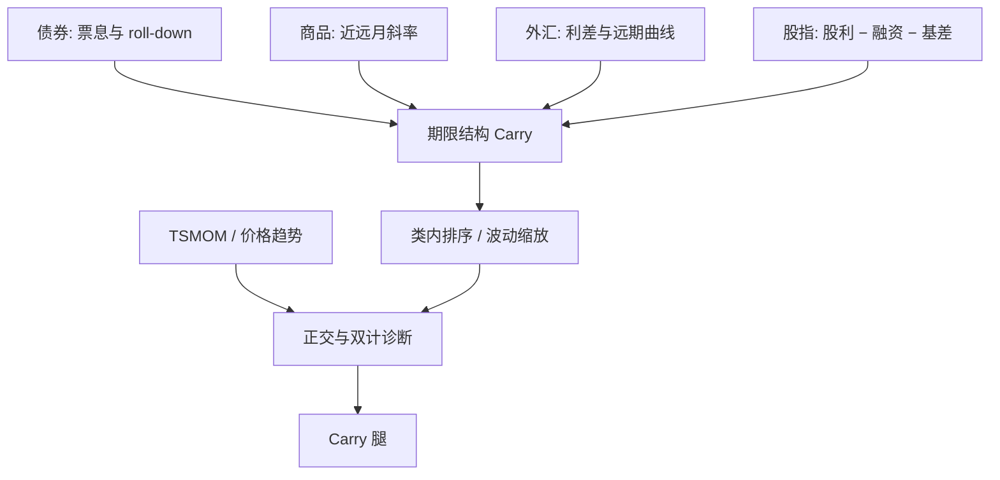

# 期限结构 Carry

Carry 是价格不变时持有该资产能得到的收益；在债券与商品上，这笔收益首先写在期限结构的斜率与滚下上，而不是写在现货涨跌的故事里。

<footer>—— Koijen, Moskowitz, Pedersen & Vrugt, Carry, Journal of Financial Economics, 2018</footer>

[上一课](/quant/cta-tsmom)把管理期货的可交易规则收成 TSMOM：对自身过去超额取符号，再按波动缩放、跨资产分散。缺口是总收益里还有一笔与价格方向无关的持有期收入：[跨资产 Carry](/quant/carry-everywhere) 给出统一会计，本课对准 **期限结构 Carry**——债券 roll-down、商品展期、外汇远期曲线。不重讲多尺度滤波器。后课突破/均线默认已经读完：趋势看已经走的方向，Carry 问曲线形态暂时不变时持有哪一段会「收租」；混成一个「商品多头」会双计。

## 问题

若期望假说成立，远期利率是未来即期的无偏预测，债券的 roll-down 期望被收益率上升抵消，Carry 均值为零。若持有成本成立且无便利收益，商品近远月价差只反映仓储与融资，多头展期不是溢价。实证上两条都不干净：期限溢价使中长端债券的 Carry 能预测超额；库存与套保压力使商品曲线的斜率能预测期货超额。问题是把「可观测的曲线几何」写成事前信号，并避免与动量、价值、风险平价抢同一笔收益。

第二个问题是持有哪一段。同一条曲线上，近月 Carry 与远月日历价差不是同一个组合：前者混着现货溢价，后者更接近纯期限溢价（Szymanowska 等人的分解）。CTA 若只用近月，期限结构 Carry 与趋势会严重缠绕，因为近月总收益含展期。

### 价格不变时，曲线贡献多少

债券：到期收益率不变时，票息加上价格沿曲线滚下（roll-down）。近似

$$
\mathrm{Carry}_{\mathrm{bond}}\approx y\cdot\Delta t + \frac{\partial P}{\partial \tau}\Delta\tau,
$$

后一项是期限减少导致的价格变化，陡峭的曲线给出更大的正 Carry。商品期货：合约价格不变时，换月锁定近月相对次近月的价差，符号随 backwardation / contango 而变，见[展期收益](/quant/roll-yield)。外汇：若即期不变，利率差是 Carry；若再看远期曲线的期限结构，不同到期的隐含升贴水可以做成曲线交易，而不只是 G10 现货利差。统一检验是：当期 Carry 对后续超额回归，系数为正。

Carry 高不代表资产便宜。高息货币可以很贵，贴水商品可以现货已经很高。价值看价格相对缓慢基本面，Carry 看持有期收入。KMPV 把二者分开，正是为了阻止用股利收益率同时当价值和 Carry。

## 方法

类内计算 Carry，波动缩放后截面多空或与 TSMOM 合成。债券：用拟合曲线计算 roll-down，控制久期，避免把「做多最长的债券」写成 Carry。商品：用可成交的近次近价差年化，避开即将交割与指数滚仓窗；库存分位作条件变量，而不是再用一遍斜率。外汇：利差或远期升水，新兴市场单独预算尾部。股指期货：分红减融资再减基差里的期限成分，国内还要处理贴水的制度原因，见[股指期货基差](/quant/cn-index-fut-basis)。

诊断必须包括崩溃月：外汇 Carry 的避险挤压、商品曲线突然翻面、债券期限溢价在通胀意外时的同步。去掉崩溃后若溢价消失，卖的是尾部；若仍在，才更像收入补偿。与趋势的相关应分资产类报告：商品上往往更高（总收益含展期），汇率上可以很低（高息货币正在贬值）。

### 不要把 roll 写进趋势再宣称正交

商品期货十二个月收益含大量展期。若 TSMOM 用总收益符号、Carry 用同一窗口的平均斜率，两条腿双计。做法是：趋势尽量用现货或剔除展期的价格动量，Carry 独占曲线；或在回归里把 Carry 当作控制。债券上期限溢价与 Carry 几乎同义，再叠加「债券价值」要用真实收益率水平。CTA 产品若只有近月趋势，归因里应强制拆出现货腿与展期腿，否则无法回答「这是趋势还是收租」。

## 机制

风险：高 Carry 状态在坏天气里提供负收益——避险货币升值、曲线陡峭化伴随增长恐慌或通胀意外、商品贴水在需求崩溃时翻成升水。投资者为持有这些状态要求补偿。仓储：低库存 → 便利收益高 → 正展期，这是 Working 通道，不完全是灾害风险。套保压力：生产商付保险费，使远期偏低。行为：把利差或贴水当成稳票息而低估翻转概率。三条在不同资产类权重不同，KMPV 的贡献是比较静态：可观测收入腿仍然预测收益。

金融化改变执行：商品指数在固定窗口滚仓，机械正 Carry 策略会与指数抢同一条曲线。期限结构 Carry 的容量取决于远月深度，不取决于现货故事有多漂亮。

### 条件化：斜率加库存，而不是无条件收租

正展期常出现在现货已涨、库存已低之时，继续加杠杆会同时暴露现货回补与曲线转正。Gorton–Hayashi–Rouwenhorst 把库存拉进条件期望，就是阻止把无条件平均 Carry 当成租金。债券上，Carry 在政策利率路径被重新定价时可以整段曲线一起亏；波动缩放能限制名义，限制不了期限溢价因子的单期实现。因此期限结构 Carry 的风控应盯曲线因子（水平、斜率、凸率）的跳跃，而不是只盯单券波动。

把风险平价的债券超配叫做「吃 Carry」是口误。风险平价超配的是低波动的久期；Carry 超配的是 roll-down 高的区段。两者在陡峭曲线上碰巧同向，在平坦曲线加低波动时分道。

## 边界与工程取舍

融资与保证金是收益的一部分，尤其是外汇与商品。远月流动性差，用看不见的远月斜率当信号会把噪声写成 alpha。税务与分红处理影响股指 Carry。不要把 contango 当成「一定做空该品种」而不看现货溢价是否为正。不要在已经持有全球债券风险平价的组合里，把债券 Carry 当成完全独立的第三利润源。实施上优先可成交合约与避开公开滚仓窗，见[商品展期 alpha](/quant/commodity-roll-alpha)。

出处：Koijen, Moskowitz, Pedersen & Vrugt, *Carry*, Journal of Financial Economics, 2018。商品分解见 Erb & Harvey, FAJ, 2006；期限溢价解剖见 Szymanowska et al., Journal of Finance, 2014。仓储理论见 Working, 1949。

## 小结

- 期限结构 Carry 是曲线在价格不变假设下的持有期收益：债券 roll-down、商品展期、外汇利差与远期曲线。
- 它预测超额，但不是价值，也不是趋势；商品总收益里的展期必须从 TSMOM 中拆开以免双计。
- 崩溃、曲线翻面与库存回补是左尾；无条件平均正 Carry 不是可领的租金。
- 容量由可成交的曲线区段决定，指数滚仓窗是执行约束。
- 出处：Koijen et al., JFE, 2018；Erb–Harvey, 2006；Szymanowska et al., 2014。
