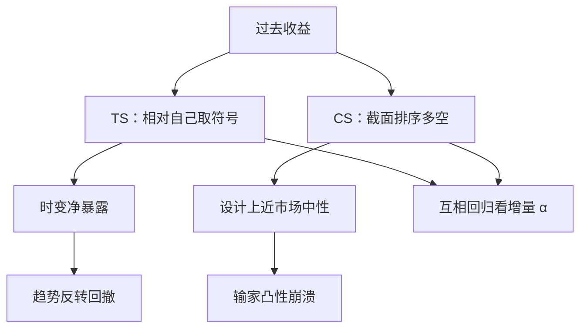

# 时序 vs 截面动量

一种动量问资产相对自己的过去是涨是跌；另一种问它相对别人是强是弱。两者共用「过去收益」四个字，组合、净暴露与危机行为都不同。

<footer>—— 对照 Jegadeesh &amp; Titman 的截面相对强度与 Moskowitz, Ooi &amp; Pedersen 的时间序列动量；比较见 Goyal &amp; Jegadeesh 等后续工作</footer>

本站已分开写过 [WML](/quant/momentum-wml) 与 [TSMOM](/quant/tsmom)。实践里两者经常被贴成同一个「趋势」标签，再把期货 CTA 的夏普写到个股 12−1 上，或把股票动量崩溃写成趋势跟踪的全部风险。本篇只做对照：构造代数上差在哪、净市场暴露从哪来、Goyal 与 Jegadeesh（2018）一类比较如何把截面动量写成「时序可预测性加一个截面修正」、以及什么时候应该用哪一个。Daniel–Moskowitz 的[崩溃](/quant/momentum-crash)主要针对截面股票 WML；期货时序的回撤是趋势反转，机制不要混写。

## 问题

过去收益预测未来收益，可以有两条操作化。时间序列（TS）：对每个资产 $i$，看 $\mathrm{sign}(r_{i,t-L,t})$ 或 $r_{i,t-L,t}$ 本身，正则多、负则空，仓位往往再按波动缩放。截面（CS）：在日期 $t$ 把 $\{r_{i,t-L,t}\}$ 排序，多最高一组、空最低一组，资金内部对冲。若所有资产过去都在涨，TS 可以全员做多；CS 仍然强制有空头。若一半涨一半跌且幅度对称，两者更接近。问题是：观察到的「动量利润」有多少来自资产自己的自相关，有多少来自相对排序？若几乎全部来自自相关，CS 只是 TS 的去均值版本；若相对排序有额外信息，CS 在股票这种必须做空相对输家的宇宙里不可替代。

资产类别决定哪一个更自然。期货、外汇、商品有对称的多空、有波动缩放的传统，TS 是 CTA 的语言。个股有借券、涨跌停、破产，CS 的空头腿贵且凸；个股 TS（每只股票按自己的符号做多做空）在实施上接近 CS 再叠加一个时变的净市场暴露，空头仍是那些绝对下跌的股票。把期货 TSMOM 的论文直接引成股票产品，是类别错误。

### 代数上 CS 近似是去均值的 TS

忽略加权与跳月，TS 仓位 $w_{i,t}^{\mathrm{TS}}\propto \mathrm{sign}(r_{i,t-L,t})$ 或 $\propto r_{i,t-L,t}$。CS 仓位 $w_{i,t}^{\mathrm{CS}}\propto r_{i,t-L,t}-\bar r_{t}$，或按分位做多空。后者相当于对时序信号减掉截面均值。因此

$$
w^{\mathrm{CS}}\approx w^{\mathrm{TS}}-c_t\mathbf{1},
$$

$c_t$ 与当期有多少资产发出多头信号有关。差额 $c_t\mathbf{1}$ 是一个**时变的市场（或资产类）仓位**。CS 利润 ≈ TS 利润 − 这块择时的利润。Goyal 与 Jegadeesh 强调：在股票上，这块择时并不特别赚钱，CS 的优势主要来自相对排序本身加上强制中性；在跨资产期货上，MOP 的结果显示绝对方向的可预测性很强，TS 的净暴露是特征不是 bug。比较必须在同一资产池、同一 $L$、同一加权上做，否则差的是样本不是定义。

波动缩放出现在标准 TSMOM 里，几乎不出现在标准股票 WML 里。比较夏普时若一边 vol target 一边不，差的是风险配平，不是时序对截面。复制对照应提供「TS 不缩放」与「CS 也按波动加权」两列。

## 方法

对照实验的最小集合：同一宇宙（例如同一组流动期货，或同一组可投资股票）、同一形成期（12 个月，股票跳月、期货可不跳）、同一持有期（1 个月）。产出四条净值：CS 等权、CS 价值加权、TS 符号、TS 符号加 vol target。报告：相关、双方的净暴露路径、牛熊市条件收益、换手、以及各自对对方回归的 α。若 TS 对 CS 有 α，说明绝对方向有增量；若 CS 对 TS 有 α，说明相对排序有增量。期货样本里前者更常见；美股个股样本里两者高度相关，增量常取决于是否允许净市场暴露。

形成期不必相同。CS 股票惯例是 12−1；TS 期货惯例是 12 个月不过滤最近一月。把跳月规则强加给期货或取消股票的跳月，都会把微观结构与短反转写进对照。应先按各自文献的标准定义做一条「忠实复制」，再做一条「对齐规则」的敏感性，两张表都给。

### 净暴露、危机凸性与崩溃

TS 的净暴露 = 发出多头信号的资产风险权重之和减空头。股指期货在 2008 年空、在 2009 年反弹时若趋势尚未转正仍可能空，于是 TS 在 V 型左侧赚钱、右侧亏钱——这是趋势跟踪的危机行为，不是 WML 那种「空着一堆困境股看涨期权」。CS 股票 WML 在 2008 年仍然多相对强、空相对弱，两边都在跌，净市场接近零，2009 年反弹时输家凸性导致崩溃。把两种回撤画在同一张「动量风险」幻灯片上，会让人以为有一种统一的对冲方法。没有：对 TS 要管理趋势反转与 vol target 滞后；对 CS 要管理输家凸性与拥挤。条件变量也不同：TS 看趋势是否过热、波动是否跳升；CS 看 Daniel–Moskowitz 的熊市×方差。

跨资产配置里两者可以同时存在：Asness 等的「价值与动量无处不在」主要是截面；MOP 是时序。相关有限，因为净暴露结构不同。组合层把期货 TS 与股票 CS 相加，股票腿上会重复一部分权益方向，需在总风险里对冲，而不是把夏普相加。

## 机制

自相关机制（反应不足、缓慢扩散）对 TS 与 CS 是共用的：过去涨的还会涨。CS 额外依赖**相对**误定价：输家被过度抛弃、赢家被不足反应，即使绝对收益都为负。套利资本、卖空约束、注意力在截面上分配，使相对排序在个股上特别强。TS 额外依赖**绝对**风险溢价的时变：资产类可以同时处于正的风险溢价状态（所有商品都在涨），符号函数把它变成集体多头。保值压力、宏观趋势、央行路径这类共同因子更支持 TS。

因此「哪一个更真」没有全球答案。在高度相关的个股宇宙里，共同因子主导，TS 几乎就是在择时市场，CS 把共同因子差掉后留下相对强度；Goyal–Jegadeesh 的批评针对的是把股票 TS 当成独立异象。在相关有限的期货宇宙里，每个合约自己的趋势是真实的可交易对象，CS 强制中性会丢掉资产类择时——而那正是 CTA 要的。读比较论文时先看宇宙。

### 股票上做 TS 的实施陷阱

对个股做 $\mathrm{sign}$（过去 12−1 月超额）会在牛市几乎全多、熊市几乎全空，净 β 时变极大，业绩会被市场方向支配。要研究「个股时序动量是否存在」，应先对每只股票的收益减去截面均值或减去市场，再取符号——那已经在向 CS 靠拢。不减均值的个股 TS 必须按市场中性化后再比较，否则就是又一个带杠杆的择时。空头腿的借券与涨跌停使符号函数的负侧不可对称执行，纸面 TS 高估。期货没有这个问题，这是 MOP 选期货的原因之一。

文献名称极易撞车。Moskowitz–Ooi–Pedersen 的 TSMOM、Jegadeesh–Titman 的 J/K、Carhart 的 PR1YR、French 的 WML/UMD、CTA 的均线束，都不是同一个序列。对照表的第一列应是定义，不是「动量」这个词。

## 边界与工程取舍

不要用股票 WML 的 t 值去验证 CTA 产品，不要用 CTA 的危机 alpha 去验证 12−1。不要在已经 vol target 的 TS 与未缩放的 CS 之间比较信息比。不要把 2009 年股票动量崩溃和 2020 年 3 月趋势反转写成同一个风险因子的两次实现——状态变量、持仓与凸性来源都不同。A 股的截面动量受涨跌停与短周期投机影响，时序上指数的趋势跟踪受股指期货制度影响，对照必须用当地规则分别做，不能进口一张美股对照表。

研究上有用的报告是三行：相关、TS 对 CS 的 α、CS 对 TS 的 α，再加一行净暴露。产品上有用的选择是：要不要资产类方向。要，用 TS 或允许净暴露的混合；不要，用 CS 并管理空头凸性。混合时明确权重来自哪一种信号，避免同一过去收益被用两次还当成分散化。

出处：Jegadeesh & Titman, *Journal of Finance*, 1993（CS）；Moskowitz, Ooi & Pedersen, *JFE*, 2012（TS）；Goyal & Jegadeesh, *Review of Financial Studies*, 2018（比较与含义）。崩溃见 Daniel & Moskowitz, 2016。价值与动量的跨资产截面见 Asness, Moskowitz & Pedersen。

## 小结

- TS 用资产自己的过去方向，允许时变净暴露；CS 用相对排序，设计上近中性。
- CS 仓位近似是 TS 减去一个截面均值；差额是资产类择时。
- 期货宇宙里绝对方向增量大；个股宇宙里两者高度相关，个股 TS 易退化成择时。
- 回撤机制不同：TS 是趋势反转，股票 CS 是输家凸性崩溃。
- 比较须对齐宇宙、形成期、跳月与是否波动缩放。
- 出处：JT 1993；MOP 2012；Goyal & Jegadeesh, 2018。
