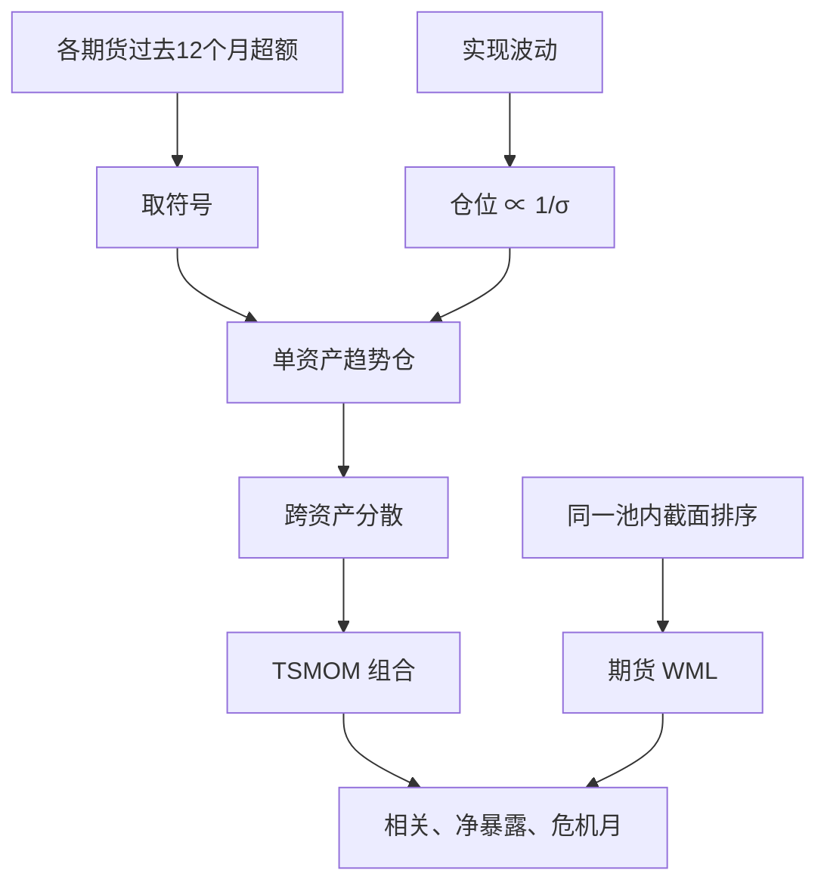

# 时间序列动量

若资产自己过去十二个月的超额收益为正，则做多；为负则做空；再按波动把仓位缩放到目标风险。这是时间序列趋势，不是截面上的赢家减输家。

<footer>—— Moskowitz, Ooi & Pedersen, Time Series Momentum, Journal of Financial Economics, 2012</footer>

[动量 WML](/quant/momentum-wml) 是每个日期把股票排序、多相对强者、空相对弱者，净市场接近零。Moskowitz、Ooi、Pedersen 的 **TSMOM** 问的是另一件事：这一份合约相对自己的过去，趋势是否还在。对象主要是股指、国债、商品、外汇等期货，信号是过去十二个月超额收益的符号，仓位按波动缩放后在资产间分散。把 WML 的夏普直接写在趋势跟踪产品上，或把 CTA 的年化波动写进个股 12−1，都是张冠李戴。

## 问题

有效市场的朴素版本不允许过去收益预测未来收益。截面动量已经拒绝了这一版本的一个切片。时间序列动量是更强的拒绝：连**绝对方向**都可预测。对单个期货，若 $\mathrm{sign}(r_{t-12,t})$ 能预测 $r_{t+1}$，则存在可交易的趋势；若许多资产上同时成立，且资产间相关有限，分散后的夏普可以远高于单一市场的均线策略。

截面 WML 在熊市里两边都跌，只是赢家跌得少；TSMOM 在熊市里可以对股指持空，因而常被拿来当危机凸性。两者都不是保险：趋势反转时 TSMOM 与 WML 都会亏，只是亏的状态不同。问题是测量：形成期多长、要不要跳月、仓位是否按波动缩放、以及它与截面动量、与[Carry](/quant/carry-everywhere) 是否同一条信息。

### 符号函数加波动缩放，不是均线金叉

原文的基准是：对资产 $i$，

$$
r_{t,t+1}^{\mathrm{TSMOM},i}\propto \mathrm{sign}(r_{t-12,t}^{e,i})\cdot\frac{\sigma_{\mathrm{tgt}}}{\hat\sigma_{i,t}}\,r_{t,t+1}^{e,i}.
$$

$\mathrm{sign}$ 只看方向，不看幅度：大涨与小涨同样满仓（在波动缩放之后）。$\hat\sigma$ 常用日收益的指数加权或过去两个月的实现波动，目标 $\sigma_{\mathrm{tgt}}$ 常取年化 40% 一类再在组合层面对冲。这与「价格站上 200 日均线」相关，但不是同一规则：均线有滞后长度与价格水平，TSMOM 用的是累计超额收益的符号。复制必须写明 lookback、是否包含最近一日、波动估计窗。

个股上也可以做时间序列动量，但空头借券、涨跌停与破产使它与期货 TSMOM 不可比。文献主结果在流动期货。不要用小盘股票的 TSMOM 夏普去验证 2012 年论文。

## 方法

资产池：数十个流动性期货，覆盖股指、债券、商品、外汇。每月（或每日）看过去 1、3、6、9、12 个月超额收益，主结果在 12 个月；持有约 1 个月。单资产仓位与波动成反比，使高波商品不会主导组合。组合是各资产 TSMOM 的等风险或等权平均。检验：对每个资产回归未来收益于过去收益符号；再报告分散组合相对被动多头、相对截面动量的 α。

形成期从 1 个月到 12 个月通常为正，更长则衰减，长期有反转痕迹。这与 Jegadeesh–Titman 的中间 horizon、De Bondt–Thaler 的长期反转在精神上一致，但对象是资产自身的绝对收益。是否跳过最近一个月：期货微观结构弱于个股，跳月不是必须；若把规则搬到个股，应跳月以免与[短期反转](/quant/short-term-reversal)打架。

### 与截面动量的相关不是 1

同一组期货里，也可以做截面动量：每个日期多过去强的合约、空过去弱的。TSMOM 可以在「所有资产都在涨」时全员做多，截面则强制多空资金中性。因此 TSMOM 带有时变的市场方向暴露：趋势向上时净多头。这既是危机里赚钱的来源（2010 年前多次），也是 2009、2020 一类 V 型反转里亏钱的来源。报告 TSMOM 应同时给净暴露路径，而不是只给夏普。

## 机制

行为：消息进入价格缓慢，初始反应不足，随后趋势追逐造成中期延续，长期过度再反转。保值压力：商品生产商持续空头套保，提供风险溢价给趋势一侧的流动性供给者——这解释商品强于股指的部分样本，解释不了股指与汇率上同样存在的 TSMOM。资金与仓位：CTA 作为一类投资者会放大已形成的趋势，也会在波动上升时按风险预算减仓，造成趋势中断。

风险：趋势状态本身是状态变量，做多「已涨」等于做多某种增长期权。这条在股指上像高 β，在债券上像久期择时。原文并不把 TSMOM 收成一个新的股票定价因子；它是跨资产的可预测性事实。与 Carry 的分工：Carry 是「若价格不变能赚多少」，TSMOM 是「价格最近往哪走」。两者相关有限，可叠加，见跨资产配置。

### 波动缩放改变的是权重，不是信号

不加缩放时，高波合约主导盈亏，夏普往往更差，左尾更肥。缩放后单资产期望更接近「信息比」，组合更像风险平价版趋势。缩放会在波动冲高时主动降杠杆，这既减回撤，也可能在趋势加速的危机初段少赚钱。把「CTA 的危机 alpha」全部算进 sign() 是错的，有一部分来自 vol targeting。复制应提供有无缩放两列。

TSMOM 的「危机盈利」依赖趋势持续。突然反转（政策转向、V 型反弹）是左尾，不是脚注。2010 年代部分商品与汇率的震荡市会把夏普打薄。样本起点若从商品超级周期开始，会被高估。

## 边界与工程取舍

期货换月、点差、交易所与场外差异属于成本，不是附录。目标波动定高了，杠杆与回撤按比例放大，信息并没有增加。股票指数的 TSMOM 与个股 WML 同时持有，会在股票腿上重复方向暴露，需在组合层面对冲。A 股股指期货有过交易限制，当地 TSMOM 的空头腿不是 2012 年论文的对象。

不要把 12 个月均线金叉叫做 TSMOM。不要把个股 12−1 WML 的 t 值抄到趋势产品简介。不要在已经 vol target 之后还用未缩放的被动多头当基准却声称「同样杠杆」。与[价值与动量无处不在](/quant/value-momentum-everywhere)对照时，记住 AMP 的动量主要是截面，MOP 的 TSMOM 是时间序列。

出处：Moskowitz, Ooi & Pedersen, *Time Series Momentum*, Journal of Financial Economics, 2012。截面动量见 Jegadeesh & Titman, 1993。CTA 实务中的均线组合是近亲，不是原文定义。动量崩溃见 Daniel & Moskowitz, 2016，主要针对截面。

## 小结

- TSMOM 用资产自身过去超额收益的符号做方向，并用波动缩放仓位。
- 主样本是跨类期货；与截面 WML 相关有限，净暴露随趋势变号。
- 机制可以是反应不足、套保压力与风险预算；危机凸性不是保证。
- 换月成本、目标波动与样本起点决定可实现夏普。
- 出处：Moskowitz, Ooi & Pedersen, Journal of Financial Economics, 2012。
