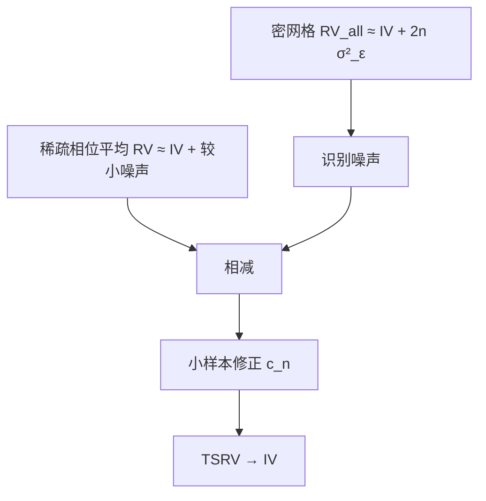

# 双尺度 TSRV

密网格的已实现方差几乎全是噪声，疏网格几乎是积分波动加一点噪声；两个方程两个未知数，稀疏平均再减掉噪声项，就是两尺度已实现波动。

<footer>—— Zhang, Mykland and Aït-Sahalia, A Tale of Two Time Scales: Determining Integrated Volatility with Noisy High-Frequency Data, Journal of the American Statistical Association, 2005</footer>

[预平均](/quant/pre-averaging) 用一个窗长滤波。[rv-noise](/quant/rv-noise) 已概述 TSRV；本课把 Zhang、Mykland 与 Aït-Sahalia 的代数写清。密采样 $\mathrm{RV}^{\mathrm{all}}\approx IV+2n\sigma_\varepsilon^2$，稀疏网格 $\mathrm{RV}^{\mathrm{sparse}}\approx IV+2\bar n\sigma_\varepsilon^2$。用前者识别噪声，后者瞄准 $IV$，相减（并平均多个错开的稀疏网格以降方差）。缺口是：**i.i.d. 噪声假设**与稀疏步长选择；相关噪声下要多尺度或换核。下一课把对象从方差换成协方差。

## 问题

一天 $n$ 笔（或 $n$ 个细格）。全部格子

$$
\mathrm{RV}^{\mathrm{all}}=\sum_{i=1}^{n}(\Delta Y_i)^2.
$$

i.i.d. 噪声、与 $X$ 独立时 $E[\mathrm{RV}^{\mathrm{all}}]\approx IV+2n\sigma_\varepsilon^2$。取步长 $K$，每 $K$ 格一个收益，得到较疏的 RV；再对 $K$ 个相位平均，得 $\overline{\mathrm{RV}}^{\mathrm{sparse}}$。TSRV 形如

$$
\widehat{IV}=c_n\Bigl(\overline{\mathrm{RV}}^{\mathrm{sparse}}-\frac{\bar n}{n}\mathrm{RV}^{\mathrm{all}}\Bigr)
$$

（小样本偏修正 $c_n$ 文献有给出）。问题是选 $K$（或等价稀疏频率）：太密则稀疏网格仍噪，太疏则 $IV$ 的估计方差大、季节被切粗。

对象是标量 $IV$，不是瞬时 $\sigma_t$。多尺度 MSRV（Zhang 2006）用更多 $K$ 提高效率，工程更重。

### 与五分钟、预平均的选择

五分钟是单一稀疏、不减噪声项，偏差换方差。TSRV 显式减 $2n\sigma_\varepsilon^2$，可以用更密的稀疏网格。预平均连续化了「局部平均」，TSRV 的稀疏平均是错开网格的平均。流动性极差、$n$ 小，TSRV 的密网格噪声识别不稳，五分钟更老实。

小样本修正不可省：未修正的差可以轻微为负，开方年化会失败。实现须截断到正或用文献的 $c_n$。

## 方法

**步骤。** 清洗；选细网格（成交或中点，声明）；算 $\mathrm{RV}^{\mathrm{all}}$；选 $K$（理论 $K\propto n^{2/3}$ 一类，或按签名图）；相位平均稀疏 RV；相减；偏修正。隔夜单独加，不进 TSRV 网格。

**噪声副产品。** $\widehat{\sigma}_\varepsilon^2\approx\mathrm{RV}^{\mathrm{all}}/(2n)$ 在 $IV$ 相对 $n\sigma_\varepsilon^2$ 可忽略时可用，更仔细的估计见后课 [噪声方差](/quant/noise-variance-estimate)。TSRV 一致性不要求你单独报 $\sigma_\varepsilon^2$，但签名图诊断需要。

**相关噪声。** 若 $\varepsilon$ 有 MA 结构，密网格 RV 不再是 $2n\sigma_\varepsilon^2$，相减减错。Aït-Sahalia、Mykland、Zhang 后续用多尺度或核处理相关噪声。诊断：一阶收益自相关若在密网格上不只是 Roll 的 $-1/2$ 附近，不要用经典 i.i.d. TSRV。

### 跳跃

TSRV 对二次变差（含跳）一致（在相应条件下），不是跳跃稳健 IV。要连续部分，用双幂次的两尺度版或先跳检验再对连续格做 TSRV。与 BN–S 同一对象声明。

## 机制

两个线性方程：$E[\mathrm{RV}_n]=IV+2n\sigma_\varepsilon^2$，$E[\mathrm{RV}_{n/K}]=IV+2(n/K)\sigma_\varepsilon^2$。消去噪声得 $IV$。相位平均降低稀疏 RV 的方差，因为每个相位用了错开的噪声实现。机制是**矩匹配**，不是滤波。预平均是滤波；核是频域/HAC；TSRV 是两频率的矩。

效率：经典 TSRV 未达最优收敛速率，MSRV 与核、预平均在 i.i.d. 噪声下可更快。生产上 TSRV 透明、好解释「我们减了噪声项」，适合审计轨迹。

中点 TSRV 与成交价 TSRV 对象不同：前者噪声小、不可交易；后者对应执行。对冲误差来自成交路径时，应用成交价并接受更大 $\sigma_\varepsilon$。

### 到协方差的交接

两资产各做 TSRV 得方差，协方差不能对未对齐的密网格直接套同一公式——异步把协方差压向零（Epps）。下一课已实现协方差 + 后课刷新时间。不要用 $\sqrt{\mathrm{TSRV}_i\mathrm{TSRV}_j}\hat\rho_{\mathrm{日}}$ 冒充高频协方差。

## 边界与工程取舍

$n$ 随日变，$K$ 应随 $n$ 变，固定 $K=5$ 分钟格数在半日市会错。开盘单独一段，避免季节进入噪声识别。计算轻，适合全市场扫描。

工程：中高流动性用 TSRV 或核；低流动性五分钟；相关噪声换核/预平均。报告 $K$、相位数、是否 $c_n$。不要对已聚合的一分钟线再套密网格 TSRV——密网格已经没了。下一课：多元二次协变差。

## 小结

- TSRV 用密网格估噪声、稀疏相位平均估 IV，相减得到噪声下的已实现波动。
- 经典公式针对近 i.i.d. 噪声；相关噪声须多尺度或换核。
- 小样本修正防止负方差；跳跃计入二次变差，不是连续 IV。
- 透明、计算便宜，效率未必最优；与预平均、核同一问题的不同代数。
- 出处：Zhang, Mykland and Aït-Sahalia, *JASA*, 2005；多尺度见 Zhang, 2006；噪声相关扩展见 Aït-Sahalia, Mykland and Zhang 后续论文。
