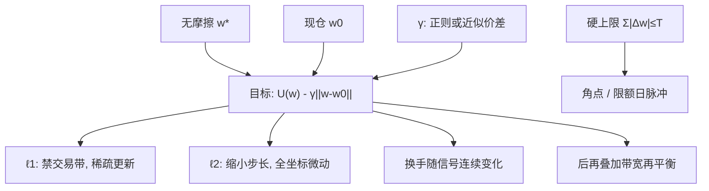

# 换手惩罚

    
在目标函数里给 $|w-w_0|$ 一个价格，优化器就会少动；这个价格可以等于真实价差，也可以只是把估计噪声引起的交易压下去的正则系数。

    <footer>—— 主动组合里的标准工程：对照 Grinold–Kahn 的实施，以及把 $\ell_1$ 差分当收缩</footer>

[交易成本感知优化](/quant/tcost-opt) 要求 $\mathrm{TC}$ 来自市场。[组合约束](/quant/portfolio-constraints) 可以把换手写成硬上限。[再平衡规则](/quant/rebalance-rules) 在优化之后用日历或带宽决定动不动。换手惩罚是夹在中间的一刀：目标里加 $\gamma\|w-w_0\|_p$，不声称 $\gamma$ 等于冲击，也不把可行集切出一个硬盒子。它的身份更接近 Ledoit–Wolf 对 $\Sigma$ 做的事——牺牲一点无摩擦最优，换稳定与可实施。本篇写 $\ell_1$ / $\ell_2$ 差分如何改变一阶条件、$\gamma$ 怎么定、与硬约束 / 真实成本 / 信号衰减的分工，以及为什么它经常比「把再平衡频率调低」更干净。

## 问题

无摩擦切点或特征组合 $w^\star\propto\Sigma^{-1}\alpha$ 对 $\alpha$ 的日度抖动线性响应。$\alpha$ 的很大一块是估计噪声，见 [收缩](/quant/cov-shrinkage)。噪声的自相关低，于是最优权重的换手被噪声支配，真实信号的换手反而看不清。硬性降低再平衡频率等于另选一个更慢的策略，所有名字同一把刀；换手惩罚按**效用增益是否超过 $\gamma$** 决定每个坐标动不动，快衰减、高 IC 的名字仍可以交易，噪声名字留在禁交易带里。

$\gamma$ 有两种解释，必须选一个当主叙事。校准解释：$\gamma$ 近似单边成本，惩罚就是线性 $\mathrm{TC}$ 的简化。正则解释：即使真实成本已知并已写入 $\mathrm{TC}$，仍加一项 $\gamma$，专门对付 $\mu$ 与 $\Sigma$ 的估计误差引起的超额交易。混用时，风险报告里的「成本假设」会与优化器里的有效 $c$ 对不上，归因会把正则当成 alpha 衰减。

### 换手不是风格，是差分的范数

组合换手 $\mathrm{TO}=\sum_i|w_i-w_{i,0}|$（双边再除 2 的约定要写清）是 $\ell_1$。优化器若最小化方差加 $\gamma\cdot\mathrm{TO}$，它直接打这个报表数字。用 $\ell_2^2$ 惩罚则打的是大调仓、对许多小调仓较宽容，换手表与目标不一致，但数值光滑、对冲击二次模型更亲。选范数等于选你要管的那张表：投委会看双边换手就用 $\ell_1$；执行按平方根冲击对大单收费就用二次，并考虑直接走 [tcost-opt](/quant/tcost-opt)。

年化换手 400% 的多空，即使单边 10bp，也会吃掉 40bp 毛收益量级（还取决于是否双边计数）。惩罚的第一用途往往是把 400% 拉到策略容量能活的区间，而不是精细匹配每一只股票的 ADV。

## 方法

标准二次规划：

$$
\max_w\ w^\top\alpha-\frac{\lambda}{2}w^\top\Sigma w-\gamma\|w-w_0\|_1
$$

（可再加真实 $\mathrm{TC}$）。$\ell_1$ 用 $w-w_0=u-v$、$u,v\ge 0$ 线性化。最优满足：对每个 $i$，若 $|\mathrm{marginal}_i|<\gamma$，则 $\Delta w_i=0$；否则沿该方向调到风险与 alpha 的平衡点，并使边际效用恰好等于 $\pm\gamma$。这就是禁交易带，带宽随 $\gamma$ 与局部曲率（$\Sigma$ 的对角与相关）变化，不是对所有资产统一的 $x\%$。

$\gamma$ 的定法。正则路径：扫一列 $\gamma$，在验证段看净收益、换手、转移系数、实现风险，选拐点而不是选样本内夏普最大。成本校准：令 $\gamma$ 等于有效价差中位数，再按流动性分档 $\gamma_i$。两种定法给出的数字可以差一个量级——分档 $\gamma_i$ 才不会让优化器在小盘上过度交易、在期货上永远不动。随时间变：波动高、拥挤高时上调 $\gamma$，等价于承认冲击内生；不要用全样本一个 $\gamma$ 穿过 2020 年 3 月。

与硬约束 $\sum|w_i-w_{i,0}|\le T$：硬上限在 $T$ 处有无穷影子价格，解常顶在边界，本期不完的交易挤到下期，造成「限额日」的脉冲换手。惩罚把同一偏好写进目标，换手随信号强度连续变化。需要硬上限的是合规（章程写死月换手），不是优化直觉。两者可以并存：惩罚管日常，$\sum|\Delta w|\le T$ 管极端。

### 与衰减、再平衡规则叠用

信号半衰期短，$\alpha$ 本身就要高频更新；$\gamma$ 过大会把快因子杀光，这不是正则成功，是策略被删。[因子衰减](/quant/factor-decay-turnover) 给出 $\gamma$ 的上限：有效成本不能高于该地平的预期收益。慢价值因子配大 $\gamma$、快反转配小 $\gamma$ 或分 alpha 两套优化再合成，比共用一个 $\gamma$ 更少错杀。再平衡规则在优化之后：即使 $w^\star(\gamma)$ 已含惩罚，仍可用带宽避免为 1bp 的残余差分去交易。顺序是：惩罚进入求解器 → 带宽过滤残余 → 执行。不要先月频再平衡再抱怨换手还高——频率刀已经切过一轮。

## 机制

$\ell_1$ 惩罚的机制与 Lasso 相同：小系数（这里是小 $\Delta w$）被精确推到零。组合权重因而相对 $w_0$ **稀疏地更新**——每期只有边际最强的一批名字交易，其余冻结。这降低换手，也降低因噪声 $\alpha$ 引起的双向抖动。代价是滞后：真信号若刚超过带宽又退回去，可能整段从未交易，IC 在持仓里实现不足。$\gamma$ 越大，实现组合越像上期，转移系数相对无约束 $w^\star$ 下降，与 Clarke–de Silva–Thorley 的约束故事一致，只是约束是软的。

$\ell_2$ 惩罚的机制是缩小步长但不产生精确零，所有坐标都动一点。报表换手可能仍高（许多小单），但单票冲击小。经纪商按票收费时 $\ell_2$ 更差，按平方冲击收费时更好。混合 $\gamma_1\|\Delta w\|_1+\gamma_2\|\Delta w\|_2^2$ 即弹性网：既有禁交易带，又抑制大单。这往往是实务默认。

惩罚相对的是 $w_0$，不是基准。若 $w_0$ 已经严重偏离基准，大 $\gamma$ 会把偏离锁死，行业与杠杆约束会与惩罚打架：想拉回基准却付不起换手。应定期用较小 $\gamma$ 或专门的「回归基准」预算做一次清理，否则软约束变成路径依赖的仓位遗产。

### 误差最大化的换手通道

Michaud 的误差最大化不只表现在极端权重，也表现在极端**交易**：噪声方向上的 $\alpha$ 变号，权重从大多头翻到大空头。换手惩罚切断这条通道，效果上等价于对 $\alpha$ 做一次「除非足够强否则维持上期隐含观点」的收缩。它不替代对 $\Sigma$ 的收缩，也不替代 [BL 观点](/quant/bl-views) 对 $\mu$ 的锚；它收缩的是**差分**。三层正则可以同时开：$\Sigma$ 收缩、$\mu$ 锚在均衡、$\Delta w$ 惩罚。关掉后两层只开惩罚，组合会在错误的 $w_0$ 附近做微雕。

## 边界与工程取舍

不要用全样本网格搜 $\gamma$ 使净夏普最大再做同一段的检验。不要把 $\gamma$ 解释成已校准的 TCA 还同时在回测里另扣一遍价差——双重计数。不要对不可交易名字（停牌、涨跌停）只靠大 $\gamma$：应硬钉 $\Delta w_i=0$。不要对 130/30 的杠杆腿与核心腿共用一个 $\gamma$，杠杆腿的换手成本与融资一起升。多策略加总后的公司层换手可以互相抵消，账户层惩罚会过度交易；能在总账优化的，不要在子组合各自加很大的 $\gamma$。

惩罚不处理日历拥挤：月底、指数再平衡日冲击升高，应在那些日上调 $\gamma$ 或禁止非必要交易，这是 [再平衡规则](/quant/rebalance-rules) 的日历项，不是 $\gamma$ 的稳态值能替代的。评价要报：换手、净夏普、相对无惩罚组合的转移系数、以及「若把 $\gamma$ 当成真实 $c$ 是否与 TCA 同阶」。三者一起看，才能分辨正则是否过头。

「我们加了换手惩罚所以对成本稳健」是不完整句子。稳健性取决于 $\gamma$ 是否在验证段选、是否分流动性、是否与真实 $\mathrm{TC}$ 双计。一个全样本最优 $\gamma$ 只是另一种过拟合。

## 小结

- 换手惩罚在目标中加 $\gamma\|w-w_0\|_p$，产生禁交易带（$\ell_1$）或更小步长（$\ell_2$），主用途常是正则噪声交易，其次才是近似成本。
- $\gamma$ 应在验证段沿路径选择或按流动性分档校准；全样本搜净夏普会过拟合。
- 硬换手上限制造角点，惩罚更平滑；合规需要硬上限时两者可并存。
- 与真实 $\mathrm{TC}$、衰减匹配、再平衡规则分层，避免双重计数和错杀快因子。
- 惩罚锁住 $w_0$ 的遗产暴露，需定期清理，否则与基准、行业约束冲突。
- 出处：实施与转移系数见 Grinold & Kahn, *Active Portfolio Management*；Clarke, de Silva & Thorley, *JPM*, 2002；$\ell_1$ 差分作为交易正则是凸组合优化的标准形式，成本闭式对照 Gârleanu & Pedersen, 2013。
