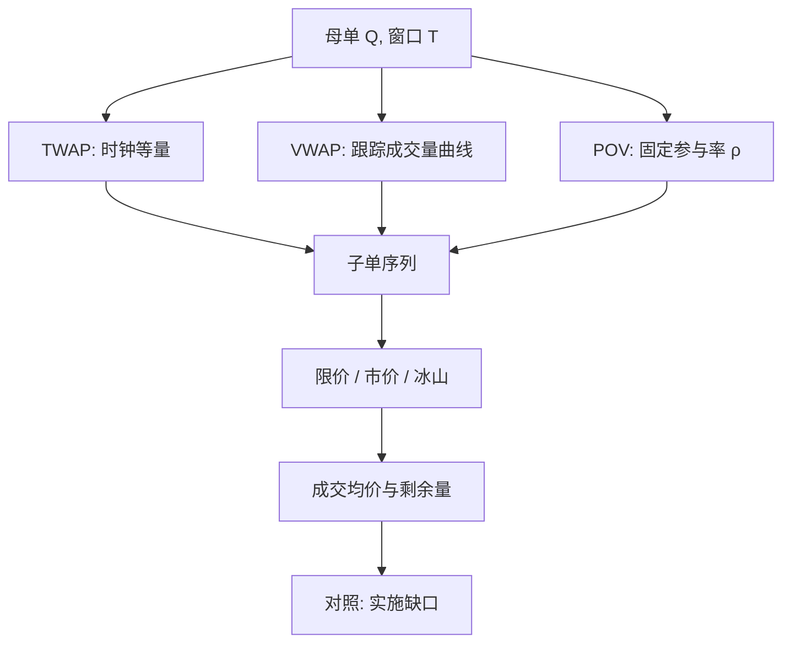

# TWAP / VWAP / POV

把大单拆成按日历时钟均匀、按成交量加权、或按市场成交的固定参与率去执行，是在冲击与时机风险之间选一条可操作的路径，而不是在寻找没有成本的成交。

<footer>—— 据 Almgren and Chriss, Optimal Execution of Portfolio Transactions, Journal of Risk, 2000/2001；Harris, Trading and Exchanges 对拆单与基准的论述整理</footer>

[上一课](/quant/temp-perm-impact)把瞬时冲击写成可随流动性恢复而衰减，永久冲击留在中点里；放慢交易主要省瞬时，永久项对给定总量往往省不掉。还缺一条可审计的释放规则。缺口是把母单切成子单、在窗口内规定速率 $v_t$：TWAP 按时钟均匀，VWAP 跟踪成交量曲线，POV 保持固定参与率。它们不是 Almgren–Chriss 的最优控制，而是把「何时、以多快」收成日程。本课写成执行状态机，并与 [实施缺口](/quant/implementation-shortfall) 对照。不重推传播核。

## 问题

母单数量 $Q$、方向与截止时刻 $T$ 给定。执行者要在 $[0,T]$ 上选择交易速率 $v_t$，使累计成交 $\int_0^T v_t\,\mathrm{d}t$ 尽量接近 $Q$，同时不把价格对自己永久推走。速率太快，吃完盘口、留下 [Kyle](/quant/kyle-model) 意义上的冲击；速率太慢，价格可能先走掉，未完成部分变成机会成本。问题的第一句话是：在不知道未来成交量与价格路径时，用什么公开可检验的规则来规定 $v_t$。

三条规则对应三种「市场中性」的朴素答案。TWAP 认为时间本身均匀，每段时钟应完成相同份额。VWAP 认为流动性随成交量分布，日程应跟踪历史或实时的成交量曲线。POV 认为自己相对于正在发生的市场成交应保持固定比例，市场加速则自己加速。三者都把「不要显得与知情交易者一样突击」当作约束，这与 Kyle 连续拍卖里知情者平滑交易的定性一致，但动机在执行端首先是冲击与合规，而不是隐藏私有价值。

### 基准、日程与评价不是同一件事

TWAP、VWAP 既是**日程**（怎么拆），也常被当成**基准**（事后均价跟谁比）。作为日程，TWAP 按时钟切片；作为基准，TWAP 是窗口内等时间抽样价格的平均。作为日程，VWAP 按预测成交量曲线放量；作为基准，VWAP 是窗口内所有成交的量加权均价。POV 主要是日程：参与率 $\rho$ 给定，成交量由市场决定，事后均价没有一条与之同名的市场指数。把「跑赢 VWAP」写成目标，会激励交易者在市场成交稀疏时少动、在密集时多动，甚至尾盘去对齐基准——这是基准本身的扭曲，Madhavan 明确讨论过。评价大单更干净的尺子往往是决策价上的实施缺口，而不是能否贴住一条内生于自己交易的均价。

自己的成交会计入市场 VWAP。参与率高时，「跑赢 VWAP」有一部分是自己跟自己比。Perold 的实施缺口用决策时的纸面组合当参照，不把事后市场均价当成已经实现的机会集。

## 方法

记时钟窗为等长区间 $0=t_0<\cdots<t_n=T$，TWAP 的第 $i$ 片子单目标量为 $Q/n$（或按剩余量再平衡）。每片内部仍要选市价、限价或冰山，见 [订单类型](/quant/order-types)；TWAP 只约束片与片之间的量，不约束片内的冲击路径。若某片因涨跌停或无对手方未完成，剩余量滚入后续片或在 $T$ 用市价清扫，后者会在窗口末端制造一次可见的流量脉冲。

VWAP 日程需要一条成交量曲线 $\{\hat u_i\}$，通常来自过去若干日同时段的平均份额，有时再按开盘、收盘拍卖单独建模。第 $i$ 片目标为 $Q\cdot\hat u_i/\sum\hat u$。实时 VWAP 则用已实现成交量更新剩余曲线。POV 更简单：观察到市场成交增量 $\Delta U$，自己提交约 $\rho\Delta U/(1-\rho)$（若自己计入市场成交）或 $\rho\Delta U$（若按「他方成交」定义）。$\rho$ 常设上下限，避免在异常放量时把自己变成该时段的全部流动性需求。

### 三种速率如何对冲击与时机风险加权

Almgren–Chriss 把执行看成在临时冲击、永久冲击与价格扩散之间的权衡：厌恶价格风险的交易者更接近 TWAP 一类尽快匀速；更关心冲击的交易者把量推向流动性厚的时段，形态接近 VWAP。POV 是状态依赖的：市场成交 $U_t$ 快，自己的 $v_t$ 也快，因而在信息事件堆叠的时段自动提高参与——这既可能降低相对 VWAP 的偏离，也可能在毒性流里加速自己的冲击。Bertsimas 与 Lo（1998）的动态规划给出另一条对照：最优速率随剩余量和剩余时间变化，启发式日程相当于把条件期望冲击函数固定成与时间或与成交量成比例的一条曲线。

$$
v^{\mathrm{TWAP}}_t \propto \frac{Q}{T},\qquad
v^{\mathrm{VWAP}}_t \propto Q\cdot \frac{u_t}{\int_0^T u_s\,\mathrm{d}s},\qquad
v^{\mathrm{POV}}_t \approx \frac{\rho}{1-\rho}\,u_t.
$$

当成交量曲线平坦时，VWAP 退化为 TWAP；当 $\rho$ 很小且 $u_t$ 接近历史曲线，POV 与 VWAP 日程难以区分。差别出现在成交量突变：TWAP 不理它，VWAP 只按预测曲线反应，POV 立刻跟住。

## 机制

拆单的机制含义是把一条可能引起非线性冲击的母单，近似成许多落在局部线性冲击区的子单。簿的深度在短时间内相对稳定，小单只付半价差与浅层滑点；大单会吃掉多档并触发后续撤单，见 [撤单与队列](/quant/cancel-queue-position)。均匀释放还降低了「这一笔就是知情者」的外观，与微观结构里非知情流作为掩护的角色一致。但均匀不是免费的：TWAP 在开盘、收盘这种成交密集、价差更宽的时段仍然等量交易，可能主动去吃本可避开的浅簿。

VWAP 把「市场当时愿意成交的量」当作流动性的代理。代理成立的条件是：历史曲线对今日仍有预测力，且自己的量相对于 $U_t$ 足够小，不改写曲线本身。参与率一旦可观，自己既是曲线的跟踪者，也是曲线的制造者。POV 把这一内生性写进规则：市场放量时你必须放量，于是在公告后的成交堆里，你与知情流、强迫流挤在同一时间。执行短了相对 VWAP 的追踪误差，却可能加大相对决策价的缺口。

### 限价切片如何改变名义日程

名义 TWAP/VWAP/POV 只规定目标量，真正的成交取决于限价是否排到、市价是否吃到。片内若挂在己方最优价，成交时点由队列消耗决定，实际速率会随机偏离日程；到点未完成再用市价补齐，等于把随机延误集中到片尾的一笔 taker。因此「跑的是 TWAP」在数据里往往呈现为：多数时间小额 maker，整点附近一串 taker。评价时应把日程与订单类型分开：同样的量曲线，全限价与全市价的实施缺口可以差出一个价差量级。Harris 强调指令是策略的接口；三种字母缩写没有指定接口，只指定流量的时间分配。

把 VWAP 日程当成「最优执行」会掩盖参数选择：历史天数、是否含拍卖、是否对异常日缩尾、参与率上限。这些带宽对均价的影响，常常大于 TWAP 与 VWAP 字母本身的差异。

## 边界与工程取舍

三种启发式都假定窗口 $[0,T]$ 内必须完成、且没有更优的动态信息。若信号在窗口内衰减，最优应提前；若冲击是平方根型且风险厌恶低，最优应更慢。它们也不处理多资产同步、卖空借券、涨跌停与拍卖规则。跨市场时，「市场成交量」要先定义场所集合，否则 POV 会在一个薄的子市场里把参与率打满。

基准扭曲是治理问题。以 VWAP 为 KPI 的交易台有动机在基准计算截止前对齐，而不是最小化实施缺口。Perold（1988）引入实施缺口，正是因为纸面组合与真实成交之间的差，不能用事后才知道的市场均价来定义。Jorion 在风险语境里提醒：交易本身改变价格，风险度量若忽略流动性，会把不可执行的纸面头寸当成可实现损益。执行日程是流动性的时间表，不是风险模型的替代。

POV 的 $\rho$ 不是「市场冲击为零的证明」。$\rho=5\%$ 在深度股票上可能接近噪声，在薄票或分钟级突发里仍是可见的占优流量。参与率要相对当时的簿深度与毒性来读，不能写成对所有标的通用的安全阈值。

## 小结

- TWAP、VWAP、POV 是大单在时间或成交量轴上的启发式日程，用来把冲击摊开，而不是最优控制的闭式解。
- TWAP 按时钟均匀；VWAP 按预测或实时成交量曲线；POV 让自身成交跟踪市场成交的固定比例。
- 日程与基准应分开：用 VWAP 当 KPI 会扭曲行为；决策价上的实施缺口更接近经济损失。
- 成交量突变时三者分道：TWAP 不理，VWAP 跟预测，POV 跟实现。
- 片内订单类型决定实际速率相对名义日程的随机偏离。
- 自己的量会进入市场 VWAP；高参与率下「跑赢均价」部分是循环定义。
- 出处：Almgren and Chriss, *Journal of Risk*, 2000/2001；Bertsimas and Lo, *Journal of Financial Markets*, 1998；Berkowitz, Logue and Noser, *Journal of Finance*, 1988；Madhavan 对 VWAP 策略的讨论；Perold, *Journal of Portfolio Management*, 1988；市场语言见 Harris, *Trading and Exchanges*。
