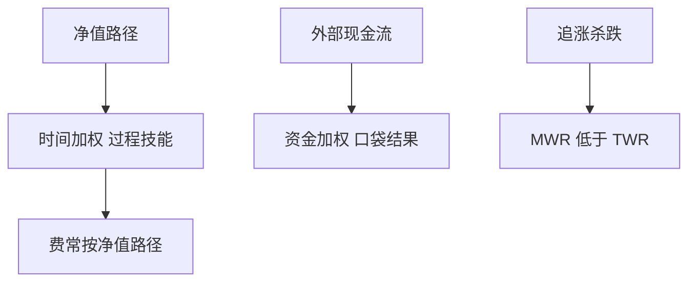

# 时间加权对资金加权

时间加权收益去掉外部现金流，度量的是组合过程；资金加权（内部收益率）把申购赎回的时点算进去，度量的是投资人实际口袋。

<footer>—— 实务标准见 GIPS；资金加权的经典实现是 Dietz 一类修正，以及 IRR / MWR</footer>

[上一课](/quant/active-share)在持仓上问主动有多真。本课的缺口是**收益会计**：同一条净值路径，时间加权（TWR）与资金加权（MWR/IRR）可以差出一截。TWR 把区间切成现金流之间的子段，每段收益率链式相乘，经理不能因「刚好在低点被申购」而受罚或受奖。MWR 是使折现现金流为零的收益率，投资人追涨杀跌时 MWR 低于 TWR——正是 [基金流追逐](/quant/fund-flows-chasing) 的会计对应。

## 问题

营销用 TWR 与基准比（契约对象是过程）。投委会用 MWR 问「我们这些钱到底赚了多少」。两者都对，对象不同。问题是混用：用 TWR 宣传技能，却用高峰 AUM 收管理费；投资人的 MWR 已经更差。GIPS 要求公司级用 TWR，对分离账户等也规定现金流处理。Modified Dietz 用期中加权近似 IRR，大额现金流时近似变差，应改真 IRR 或更细的子区间。

与费用：激励费按份额净值（接近 TWR 路径）计提，但大进大出改变谁付了费。均衡化条款存在，就是因为 TWR 公平与 MWR 现实打架。

### 杠杆与日内现金流

日内融资、期货保证金、同一日多笔申赎，使「日频 TWR」仍含近似。对冲基金与 SMA 必须写清估值时点。用月末净值加月中现金流的 Dietz，在主题狂热期会系统性偏。

私募的 J 曲线让早期 MWR 极差、后期才回正；那不是公开市场 TWR 的对象。本课只管有开放净值的组合。

## 方法

TWR：每个现金流时点估值，子段 $(V_e-V_b-CF)/V_b$，再几何连接。MWR：解 IRR 或 Modified Dietz。报告：两者并列，加上平均 AUM。对照：若 TWR 高、MWR 低，流在伤害投资人，经理的「技能」没有进口袋。基准也要同一套会计，否则 TE 课的 $R_p-R_b$ 没有定义。

## 机制

外部现金流的时点由投资人（或渠道）决定。过程技能反映在 TWR；择时申赎反映在 TWR−MWR 的差。凸性流使差为负：钱在高点进来、低点出去。这与再平衡溢价、波动拖累都是路径会计，对象不同。

## 边界

本课不写如何用估值时点操纵 TWR。加密与按块申赎的产品要另写规则。下一课从基金级收益再往下拆到交易。

## 小结

- TWR 度量过程，MWR 度量投资人口袋；契约对象要写清。
- 追逐流使 MWR 系统性低于 TWR。
- 基准、费用、TE 必须与同一套会计对齐。
- 出处：GIPS；Dietz 类方法；流与口袋结果对照 Sirri–Tufano / Berk–Green。
