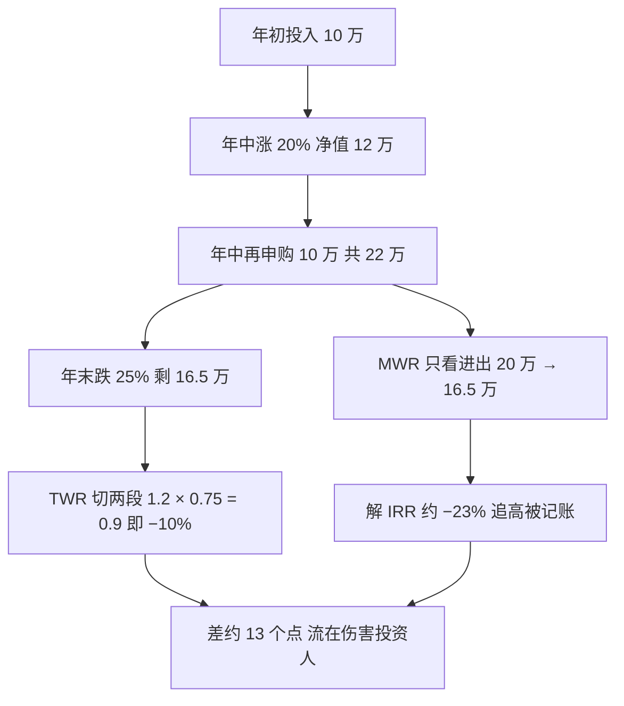
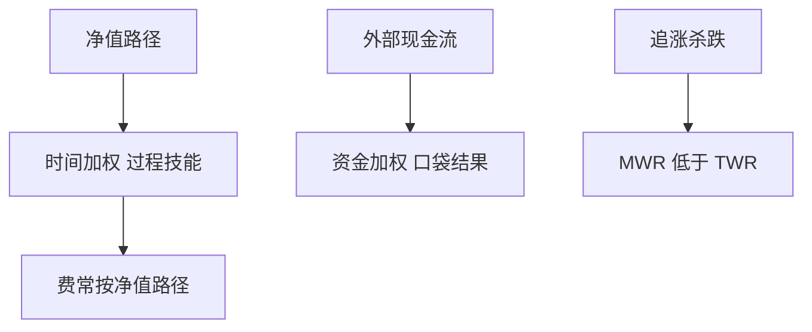

# 时间加权对资金加权

时间加权收益去掉外部现金流，度量的是组合过程；资金加权（内部收益率）把申购赎回的时点算进去，度量的是投资人实际口袋。

<footer>—— 实务标准见 GIPS；资金加权的经典实现是 Dietz 一类修正，以及 IRR / MWR</footer>

[上一课](/quant/active-share)在持仓上问主动有多真。本课的缺口是**收益会计**：同一条净值路径，时间加权（TWR）与资金加权（MWR/IRR）可以差出一截。TWR 把区间切成现金流之间的子段，每段收益率链式相乘，经理不能因「刚好在低点被申购」而受罚或受奖。MWR 是使折现现金流为零的收益率，投资人追涨杀跌时 MWR 低于 TWR——正是 [基金流追逐](/quant/fund-flows-chasing) 的会计对应。

## 问题

营销用 TWR 与基准比（契约对象是过程）。投委会用 MWR 问「我们这些钱到底赚了多少」。两者都对，对象不同。问题是混用：用 TWR 宣传技能，却用高峰 AUM 收管理费；投资人的 MWR 已经更差。GIPS 要求公司级用 TWR，对分离账户等也规定现金流处理。Modified Dietz 用期中加权近似 IRR，大额现金流时近似变差，应改真 IRR 或更细的子区间。

常见误区：看到 MWR 低于 TWR 就认定经理不行。实际上外部现金流的时点由投资人决定，MWR 低只说明「资金进来得不是时候」。经理不行应该看 TWR 跑输基准，两件事要分开问。

术语翻译：Modified Dietz 就是「给期中每笔现金流按在场天数加权」的近似 IRR——月内第 10 天进来的钱，权重只有剩余的 20/30。它是真 IRR 的一阶近似；现金流越大、越贴近期末，近似偏差越大，此时该改用真 IRR 或把区间切细。

与费用：激励费按份额净值（接近 TWR 路径）计提，但大进大出改变谁付了费。均衡化条款存在，就是因为 TWR 公平与 MWR 现实打架。

### 杠杆与日内现金流

日内融资、期货保证金、同一日多笔申赎，使「日频 TWR」仍含近似。对冲基金与 SMA 必须写清估值时点。用月末净值加月中现金流的 Dietz，在主题狂热期会系统性偏。

私募的 J 曲线让早期 MWR 极差、后期才回正；那不是公开市场 TWR 的对象。本课只管有开放净值的组合。

## 方法

TWR：每个现金流时点估值，子段 $(V_e-V_b-CF)/V_b$，再几何连接。MWR：解 IRR 或 Modified Dietz。报告：两者并列，加上平均 AUM。对照：若 TWR 高、MWR 低，流在伤害投资人，经理的「技能」没有进口袋。基准也要同一套会计，否则 TE 课的 $R_p-R_b$ 没有定义。

数字实例：子段公式就是「把外部钱从收益里剔除」。月初估值 100 万，月中申购 20 万，月末 132 万，表面涨幅像 32/100，实际子段收益 = (132−100−20)/100 = 12%——那 20 万是投资人自己的钱，不是经理赚的。

```mermaid
flowchart TD
  A["年初投入 10 万"] --> B["年中涨 20% 净值 12 万"]
  B --> C["年中再申购 10 万 共 22 万"]
  C --> D["年末跌 25% 剩 16.5 万"]
  D --> E["TWR 切两段 1.2 × 0.75 = 0.9 即 −10%"]
  C --> F["MWR 只看进出 20 万 → 16.5 万"]
  F --> G["解 IRR 约 −23% 追高被记账"]
  E --> H["差约 13 个点 流在伤害投资人"]
  G --> H
```

## 机制

外部现金流的时点由投资人（或渠道）决定。过程技能反映在 TWR；择时申赎反映在 TWR−MWR 的差。凸性流使差为负：钱在高点进来、低点出去。这与再平衡溢价、波动拖累都是路径会计，对象不同。

直觉类比：TWR 是「这台车的性能」，MWR 是「你坐这一趟的真实体验」。车没问题，但你专挑堵车时段上车，跑出来的油耗自然难看——差的部分是你选时点造成的，不是车的问题。

```mermaid
flowchart TD
  Path["净值路径"] --> TWR["时间加权 过程技能"]
  CF["外部现金流"] --> MWR["资金加权 口袋结果"]
  Chase["追涨杀跌"] --> Gap["MWR 低于 TWR"]
  TWR --> Fee["费常按净值路径"]
```

## 边界

本课不写如何用估值时点操纵 TWR。加密与按块申赎的产品要另写规则。下一课从基金级收益再往下拆到交易。

## 小结

- TWR 度量过程，MWR 度量投资人口袋；契约对象要写清。
- 追逐流使 MWR 系统性低于 TWR。
- 基准、费用、TE 必须与同一套会计对齐。
- 出处：GIPS；Dietz 类方法；流与口袋结果对照 Sirri–Tufano / Berk–Green。
