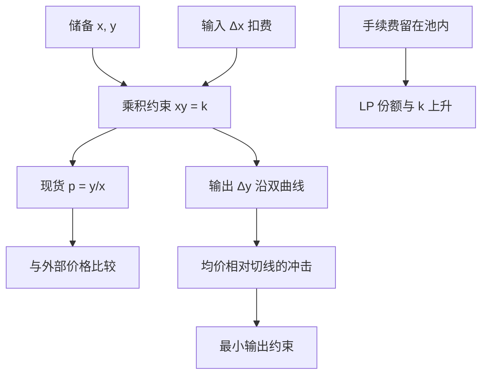

# Uniswap 恒定乘积 AMM

    
池中两种资产的数量乘积保持不变，价格由储备比内生给出；交易者沿双曲线滑动，流动性提供者用库存换取手续费，而不必报出买卖价差。

    <footer>—— Adams, Uniswap whitepaper, 2018；Adams, Zinsmeister and Robinson, Uniswap v2 Core, 2020</footer>

[上一课](/quant/liquidation-cascade)把强制减仓冲击触及下一层清算密度写成永续引擎的宏观反馈，保险基金耗尽后 ADL 会切盈利腿。缺口离开中心化撮合：传统交易所用限价簿把供给写成离散价档；Uniswap 把同一件事收成一条不需要做市商值守的曲线 $xy=k$。现货价格是储备比，冲击由曲率一次性给出。本课写恒定乘积做市商的公开经济机制：价格从哪里来、滑点如何被授权、无常损失如何记账。不重写清算密度 $\lambda(P)$。它不是交易手册。

## 问题

限价簿用挂单回答中间价、冲击与库存；恒定乘积用一条不变量同时回答三问。任何时刻的瞬时价格由 $(x,y)$ 决定，一笔规模为 $\Delta x$ 的买入把储备改成 $(x+\Delta x,\,y-\Delta y)$ 且乘积（在扣费前）不变，于是 $\Delta y$ 被曲线钉死。问题是这条曲线在经济上对应什么报价函数，以及手续费如何插入，使流动性提供者（LP）的库存策略可以被分析，而不是被当成「自动赚钱的金库」。

Angeris、Kao、Chiang、Noyes 与 Chitra 把 Uniswap 写成可分析的交易函数，指出恒定乘积是常弹性做市的一个特例：相对价格等于边际兑换率，且大单会沿曲线把自己的价格推离起点。量化上要能把「池的中点」和「这笔成交的平均价」分开，否则滑点、套利与 LP 损益会对不成同一组数字。

### 储备比是现货，成交均价是割线

无手续费时 $xy=k$，买入 $\Delta x$ 得到

$$
\Delta y = y-\frac{k}{x+\Delta x}=\frac{y\,\Delta x}{x+\Delta x}.
$$

瞬时价格 $p=y/x$（以 A 计价的 B，或按合约约定的方向）。成交均价是 $\Delta y/\Delta x=y/(x+\Delta x)$，严格劣于起点的 $p$。差额就是曲线冲击：单子越大、池越浅，割线离切线越远。这与限价簿「吃掉若干档」同构，只是档位被连续化了。v2 在输入上先扣手续费（原文为 $0.3\%$ 量级），有效不变量变成对「扣费后的输入」保持乘积，费用留在池内增加 $k$，属于 LP 的收入，不是销毁。

把 $xy=k$ 理解成「价格永远不变」是字面误读。$k$ 在一笔无费用交易里不变，价格 $y/x$ 必变。不变的是乘积，变的是比。手续费使 $k$ 缓慢上升，那是库存的补偿，不是价格锚。

## 方法

记账。设费率为 $\gamma$（v2 典型为 $0.003$），输入 $\Delta x$ 中 $(1-\gamma)\Delta x$ 进入乘积约束。输出

$$
\Delta y = y-\frac{xy}{x+(1-\gamma)\Delta x}=\frac{y(1-\gamma)\Delta x}{x+(1-\gamma)\Delta x}.
$$

交易者要比较的是：均价相对外部参考价（另一池、中心化场所的中点）是否仍可接受。公开接口用最小输出（`amountOutMin` 一类）把可容忍冲击写成链上约束：若曲线给出的 $\Delta y$ 低于该下限，交易回滚。这是滑点**授权**，不是预测。下限越松，交易者预先放弃的剩余越多，后面讨论的排序租金才有经济对象。

LP 的份额是池所有权的比例，不是固定数量的两种代币。加入流动性按当前比存入，赎回按当时储备比例取回。路径依赖因此出现：同样的两端价格，若中间经历过一轮大波动再回来，LP 持有的组合与「始终按储备比再平衡的投资组合」不同。Milionis、Moallemi、Roughgarden 与 Zhang 把这种差额叫做相对再平衡的损失（loss versus rebalancing, LVR）：在外部价格为半鞅、套利把池价钉在外部价的理想化里，LP 的损失可由瞬时方差与池深度解释，手续费是用来覆盖它的保费。无常损失是同一现象的路径版本：相对「拿着初始库存不提供流动性」，提供流动性在价格大幅偏离后往往落后；价格若回到起点，无常损失为零，但期间放弃的再平衡收益与已实现手续费仍要单独记账。

### 套利如何把池价拉向外部价格

若外部中点 $S$ 与池价 $p=y/x$ 的偏离超过往返费用与链上成本，公开的经济压力是：在便宜的一侧买入、在贵的一侧卖出，直到 $|S-p|$ 缩进成本带。对纯 CPMM，无费用时套利的目标是把 $p$ 推到 $S$，因为曲线上每一步都有明确的边际。有费用时存在一个无套利区间，池价可以停在 $S$ 附近的一个楔形里而不被触及——这与限价簿的价差内无成交是同一类惰性，不是故障。v2 的价格累积器把链上储备比按时间积分，给外部合约一个难以被单笔闪兑瞬间扭曲的时间加权价格；它服务的是「延迟的、可验证的池价历史」，不是预言机抗操纵的完备定理。Angeris 等人讨论了这类 TWAP 在短窗上仍可被推离的界限，工程上要把窗口、深度与引用场景写在一起。

## 机制

恒定乘积的微观基础是：做市商愿意在任意价格附近提供与当前库存成比例的深度。弹性为 $-1$ 的需求曲线给出 $xy=k$。相对恒定和 $x+y=k$（价格几乎只能是 1）或恒定均值，乘积允许价格在 $(0,\infty)$ 上连续移动，并在远离当前价时迅速变薄——这既是资本效率的代价，也是保护 LP 不被无穷库存掏空的几何。交易者支付的冲击是凸性：大单沿曲率行走，小单近似按 $p$ 成交。LP 收取的是费用，付出的是被套利者「再平衡」时锁定的逆向选择：外部价格先动、池价后动，先到的套利交易按旧曲线成交，等价于 LP 向新信息出售了过时库存。这与限价簿上被公开信息拾取的做市商是同一类 [毒性](/quant/toxic-flow)，只是「过时报价」被写进了整条曲线而不是某一档。

费用与深度的权衡是公开参数。费率高，无套利带变宽，池价更钝，但单位成交的 LP 收入高；费率低，跟踪外部价格更紧，成交更密，LVR 也可能更高。v2 把费率写死在配对实现里，把选择权交给「要不要在这个池里做 LP」，而不是交给每笔成交的动态价差。资本效率的上限也因此清楚：要在远离当前价的区域维持同样的美元深度，CPMM 必须在全区间配置库存，大部分资本躺在几乎不会被碰到的远翼。这正是下一篇集中流动性要改的对象。

### 组合、路径与「自动做市」不是无风险

CPMM 不创造无风险租金。它把做市的库存风险参数化成一条曲线，把价差参数化成费率，把撮合参数化成谁先把交易写进区块。收益来自成交费是否覆盖 LVR、无常损失与机会成本；在波动升高、外部价格连续跳跃的时段，费用往往不够。回测若只用「入池到出池的代币数量差」当收益，会漏掉：同样波动下不提供流动性的持有损益、手续费再投入导致的份额稀释、以及套利把池价对齐时 LP 实际卖在低位、买在高位的路径。公开机制足够用来做风险会计，不够用来承诺正期望。

闪电兑换在 v2 里是「先拿走资产、同一笔交易内还回并满足不变量」的原子性，不是额外的价格函数。经济上它把资本约束从「你要先持有库存」放松为「你要在同一原子交易里闭合」，套利与清算因此更接近理论中的零库存中介，但曲线与费用并未改变。

## 边界与工程取舍

恒定乘积假定两种资产都可分割、可互换、在同一合约里结算。稳定币对稳定币的价格几乎常在 1 附近，乘积曲线在 ATM 附近过弯，资本效率差，后续的恒定和 / 混合不变量（不在本篇）才是那一类配对的公开替代。多跳路径把若干 CPMM 串成有向图，输出是各段冲击的复合，不是单一 $k$。v2 的路由是链下或外围合约的搜索问题，核心配对只保证局部不变量。

预言机、TWAP 与储备比都不是「真实价格」。它们是这条曲线上的状态。当流动性薄、或同一资产在外部场所的价格已经移动而链上交易尚未发生，池价可以停在过时位置——这是延迟，不是 CPMM 公式算错。把池价当无摩擦现货去给衍生品定价，等于忽略冲击、费用与区块时间。Adams 的设计目标是无需许可的链上兑换，不是复制中心化限价簿的微观结构。v3 把同一乘积局部化到价格区间，不变量改写为虚拟储备，那是另一组公式。

最小输出、截止时间与路由拆分，都是交易者把曲线冲击写成硬约束的公开工具。放宽它们等于出售更多剩余，而不是「提高成功率」的技巧。讨论应停在约束的经济含义，而不是如何选择对手方或排序。

## 小结

- Uniswap CPMM 用 $xy=k$ 同时给出现货、冲击与 LP 库存规则，价格是储备比，成交均价是双曲线割线。
- 手续费作用于输入并留在池内抬高 $k$，是 LP 覆盖再平衡损失的保费，不是价格锚。
- 外部价格先动时，套利把池价拉回成本带；LP 承担过时曲线上的逆向选择，会计上对应无常损失与 LVR。
- 全区间配置使远翼占用大量资本，这是恒定乘积的几何代价，也是集中流动性的动机。
- 出处：Adams, Uniswap whitepaper, 2018；Adams, Zinsmeister and Robinson, *Uniswap v2 Core*, 2020；曲线分析见 Angeris et al.；LVR 见 Milionis, Moallemi, Roughgarden and Zhang。
